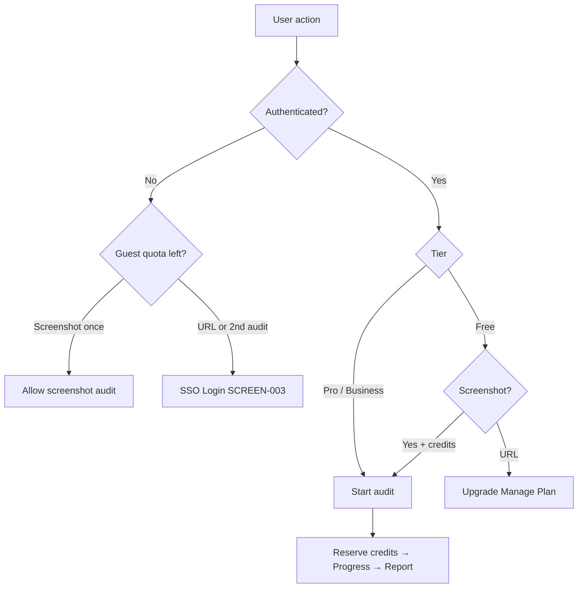
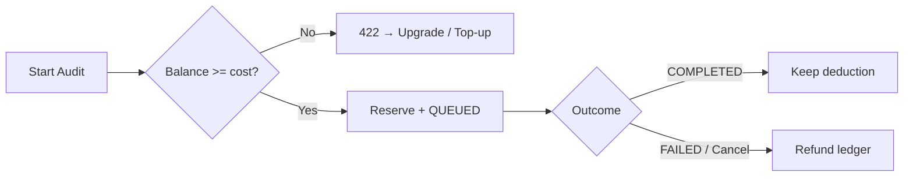

# Audient — Business Rules

**Status:** Draft (adopted product rules)  
**Last updated:** 2026-07-30  
**Owner:** Raghunath Kamlekar  
**Related:** PRICING.md, SCREEN_MAPPING.md, API_MAPPING.md, COMPONENT_BEHAVIOR.md, DATABASE.md, SCHEMA.md, prd.md, AI_WORKFLOW.md

Design / product rules only — **no backend code**.

**Source of truth:** uploaded UI screens + SCREEN_MAPPING. **Credits & gates:** PRICING.md / `src/config/plans.ts` override older Figma/PRD numbers.

**Do not invent** features not in screens or adopted docs. Items marked **FUTURE** or **M0x (missing UI)** are deferred, not shipped rules.

---

## How to read a rule

| Field | Meaning |
|-------|---------|
| **Rule ID** | Stable id (`BR-GUEST-001`, …) |
| **Description** | What the rule enforces |
| **Trigger** | Event that starts evaluation |
| **Conditions** | When the rule applies |
| **Expected Behaviour** | System outcome |
| **Exceptions** | Allowed deviations |
| **User Message** | Copy shown (if any) |
| **Impacted Screens** | SCREEN-* ids |
| **Impacted APIs** | Product endpoints |
| **Related Components** | INP / BTN / CARD / MDL ids |

---

## Plan × capability matrix (master)

| Capability | Guest | Free | Pro | Business |
|------------|:----:|:----:|:---:|:--------:|
| 1 screenshot audit | ✅ once | ✅ | ✅ | ✅ |
| More screenshots | ⛔ login | ✅ credits | ✅ | ✅ |
| URL / live audit | ⛔ login | ⛔ upgrade | ✅ | ✅ |
| Brief summary | ✅ | ✅ | ✅ | ✅ |
| Full report + PDF | ⛔ | ⛔ | ✅ | ✅ |
| Credit top-ups | ⛔ | ⛔ | ✅ | ✅ |
| History | ⛔ login | Limited | Full | Full |

**Credit costs (adopted)**

| Action | Free | Pro | Business |
|--------|------|-----|----------|
| Screenshot | 150 | 100 | 50 |
| URL | — | 400 | 100 |
| PDF | ⛔ | 0 credits | 0 credits |
| Failed audit | Refund | Refund | Refund |

---

# 1. Guest User Rules

---

### BR-GUEST-001 — One anonymous screenshot audit

| Field | Detail |
|-------|--------|
| **Rule ID** | BR-GUEST-001 |
| **Description** | Guests may run exactly **one** screenshot UX audit without logging in. |
| **Trigger** | GO / upload complete on Landing |
| **Conditions** | No auth session; server `guestAuditCount < 1`; input is screenshot (not URL) |
| **Expected Behaviour** | Create/reuse guest session; accept audit; open Progress → brief Report |
| **Exceptions** | None — second attempt always requires login |
| **User Message** | — |
| **Impacted Screens** | SCREEN-001 → M01 → M02 |
| **Impacted APIs** | Guest session · `POST /uploads/sign` · `POST /ai/audit` |
| **Related Components** | INP-002, BTN-001, BTN-002 |

---

### BR-GUEST-002 — Guest credit display

| Field | Detail |
|-------|--------|
| **Rule ID** | BR-GUEST-002 |
| **Description** | Guest header shows **150** credits or “1 free audit” — not a large invented balance. |
| **Trigger** | Landing hydrate |
| **Conditions** | Guest |
| **Expected Behaviour** | Display cost of one Free screenshot (150) or equivalent “1 free audit” copy |
| **Exceptions** | — |
| **User Message** | Credits badge ≈ `150` or “1 free audit” (reconcile Figma `100` — R1) |
| **Impacted Screens** | SCREEN-001 |
| **Impacted APIs** | Guest credit service |
| **Related Components** | BTN-014 (guest state) |

---

### BR-GUEST-003 — Guest URL audits blocked

| Field | Detail |
|-------|--------|
| **Rule ID** | BR-GUEST-003 |
| **Description** | Guests cannot start live URL audits. |
| **Trigger** | URL filled + GO |
| **Conditions** | Guest |
| **Expected Behaviour** | Open SSO Login (SCREEN-003); do not call Start Audit with URL |
| **Exceptions** | After login, Free still cannot URL-audit (BR-URL-002); Pro/Business can |
| **User Message** | Prompt to log in |
| **Impacted Screens** | 001 → 003 |
| **Impacted APIs** | None on create; analytics `guest_url_gated` |
| **Related Components** | INP-001, BTN-001, MDL-001 |

---

### BR-GUEST-004 — Second action requires login

| Field | Detail |
|-------|--------|
| **Rule ID** | BR-GUEST-004 |
| **Description** | After the one guest audit is used, further GO/upload requires SSO. |
| **Trigger** | GO or upload when guest quota exhausted |
| **Conditions** | `guestAuditCount >= 1` |
| **Expected Behaviour** | Open SCREEN-003; block Start Audit |
| **Exceptions** | — |
| **User Message** | Log in to continue |
| **Impacted Screens** | 001 → 003 |
| **Impacted APIs** | Server guest counter |
| **Related Components** | BTN-001, MDL-001 |

---

### BR-GUEST-005 — Guest menu gating

| Field | Detail |
|-------|--------|
| **Rule ID** | BR-GUEST-005 |
| **Description** | Guest profile menu: only **Login** is enabled. |
| **Trigger** | Avatar open |
| **Conditions** | Guest |
| **Expected Behaviour** | Profile, History, Manage Plan, Account Settings disabled but visible |
| **Exceptions** | — |
| **User Message** | Tooltip: “Log in to access” |
| **Impacted Screens** | SCREEN-002 |
| **Impacted APIs** | None |
| **Related Components** | Profile menu guest state |

---

### BR-GUEST-006 — Claim guest audit on login

| Field | Detail |
|-------|--------|
| **Rule ID** | BR-GUEST-006 |
| **Description** | On successful login, associate prior guest audit + files with the user. |
| **Trigger** | OAuth success after guest audit |
| **Conditions** | Guest `auditId` exists in session |
| **Expected Behaviour** | Audit appears in History; Free **300** monthly credits apply to *subsequent* audits |
| **Exceptions** | If no guest audit, skip claim |
| **User Message** | — |
| **Impacted Screens** | 003 → 004 / 012 |
| **Impacted APIs** | Auth login · upsert User · claim audit |
| **Related Components** | MDL-001 |

---

### BR-GUEST-007 — Guest abuse controls

| Field | Detail |
|-------|--------|
| **Rule ID** | BR-GUEST-007 |
| **Description** | Guest audits are server-authoritative and rate-limited. |
| **Trigger** | Guest Start Audit / upload |
| **Conditions** | Guest; abuse signals optional |
| **Expected Behaviour** | Cookie/device-bound guest session; rate limit; optional captcha; TTL cleanup of guest uploads |
| **Exceptions** | — |
| **User Message** | Rate limit: “You're going a bit fast — try again soon.” |
| **Impacted Screens** | 001 |
| **Impacted APIs** | Upload · Start Audit · `429` |
| **Related Components** | INP-002, BTN-001 |

---

# 2. Authentication Rules

---

### BR-AUTH-001 — SSO providers only

| Field | Detail |
|-------|--------|
| **Rule ID** | BR-AUTH-001 |
| **Description** | Login is Google, Apple, or Microsoft only. |
| **Trigger** | Open SSO modal / Login |
| **Conditions** | Always (v1 product) |
| **Expected Behaviour** | Show three OAuth buttons; no email/password, GitHub, or magic link |
| **Exceptions** | — |
| **User Message** | Provider failure Alert |
| **Impacted Screens** | SCREEN-003 |
| **Impacted APIs** | `POST /auth/google` · `/auth/apple` · `/auth/microsoft` |
| **Related Components** | MDL-001, BTN-003–005 |

---

### BR-AUTH-002 — First login seeds Free plan

| Field | Detail |
|-------|--------|
| **Rule ID** | BR-AUTH-002 |
| **Description** | First successful login creates User + FREE membership + **300** credits + Settings. |
| **Trigger** | First verified auth |
| **Conditions** | No existing app User for identity |
| **Expected Behaviour** | Atomic seed; subsequent logins reuse User |
| **Exceptions** | Returning user: no re-grant of 300 |
| **User Message** | — |
| **Impacted Screens** | 003 → 004 |
| **Impacted APIs** | Auth · `GET /me` |
| **Related Components** | MDL-001 |

---

### BR-AUTH-003 — Session required for protected routes

| Field | Detail |
|-------|--------|
| **Rule ID** | BR-AUTH-003 |
| **Description** | Authed app routes require a valid session. |
| **Trigger** | Navigate to protected route |
| **Conditions** | Missing/expired session |
| **Expected Behaviour** | Middleware redirects to SSO; preserve resume intent |
| **Exceptions** | Landing + SSO are public |
| **User Message** | — |
| **Impacted Screens** | 004–013, M01–M02 |
| **Impacted APIs** | All authenticated APIs → `401` |
| **Related Components** | App shell / middleware |

---

### BR-AUTH-004 — Sign out returns to Landing

| Field | Detail |
|-------|--------|
| **Rule ID** | BR-AUTH-004 |
| **Description** | Logout clears session and returns to guest Landing. |
| **Trigger** | Profile → Logout |
| **Conditions** | Authenticated |
| **Expected Behaviour** | `POST /auth/sign-out`; clear client state; SCREEN-001 |
| **Exceptions** | Soft-clear UI even if API fails |
| **User Message** | — |
| **Impacted Screens** | 004 → 001 |
| **Impacted APIs** | `POST /auth/sign-out` |
| **Related Components** | Profile menu |

---

### BR-AUTH-005 — Email is read-only

| Field | Detail |
|-------|--------|
| **Rule ID** | BR-AUTH-005 |
| **Description** | Email comes from the auth provider and cannot be changed via Settings. |
| **Trigger** | Save Personal settings |
| **Conditions** | SCREEN-010 |
| **Expected Behaviour** | Display email; reject email in `PATCH /me` |
| **Exceptions** | — |
| **User Message** | — (R6: remove duplicate Email field in UI) |
| **Impacted Screens** | SCREEN-010 |
| **Impacted APIs** | `GET /me`, `PATCH /me` |
| **Related Components** | INP-012, BTN-009 |

---

### BR-AUTH-006 — Email verification gates audits

| Field | Detail |
|-------|--------|
| **Rule ID** | BR-AUTH-006 |
| **Description** | Running audits requires a verified email. |
| **Trigger** | Start Audit |
| **Conditions** | `emailVerified === false` |
| **Expected Behaviour** | Reject create with `403 EMAIL_NOT_VERIFIED` |
| **Exceptions** | Guest path uses guest session rules, not this flag |
| **User Message** | Verify your email to run audits |
| **Impacted Screens** | 004, 009 |
| **Impacted APIs** | `POST /ai/audit` |
| **Related Components** | BTN-001 |

---

# 3. Credits Rules

---

### BR-CRED-001 — Server is source of truth

| Field | Detail |
|-------|--------|
| **Rule ID** | BR-CRED-001 |
| **Description** | Credit balance is authoritative on the server; never trust the client. |
| **Trigger** | Any credit display or Start Audit |
| **Conditions** | Always |
| **Expected Behaviour** | Read/write via Credits + ledger; UI refreshes from API |
| **Exceptions** | — |
| **User Message** | — |
| **Impacted Screens** | Header on 004, 008, 009 |
| **Impacted APIs** | `GET /user/credits` |
| **Related Components** | BTN-014 |

---

### BR-CRED-002 — Monthly grants by plan

| Field | Detail |
|-------|--------|
| **Rule ID** | BR-CRED-002 |
| **Description** | Monthly plan credits: Free **300**, Pro **1,000**, Business **10,000**. |
| **Trigger** | First login seed; monthly reset; plan activation |
| **Conditions** | Membership ACTIVE |
| **Expected Behaviour** | Set/reset plan allotment to `monthlyGrant` |
| **Exceptions** | Business is **metered 10k**, not unlimited (`isUnlimited: false` in plans.ts) |
| **User Message** | — |
| **Impacted Screens** | 004, 005, 008, 009 |
| **Impacted APIs** | Webhook · credits service · `GET /user/credits` |
| **Related Components** | Credits badge, plan cards |

---

### BR-CRED-003 — Per-audit costs

| Field | Detail |
|-------|--------|
| **Rule ID** | BR-CRED-003 |
| **Description** | Deduct tier-specific costs for screenshot vs URL (see cost table above). |
| **Trigger** | Start Audit accepted |
| **Conditions** | Sufficient balance (unless future unlimited overturns plans.ts) |
| **Expected Behaviour** | Reserve/deduct in transaction; write `AUDIT_DEDUCTION` ledger row |
| **Exceptions** | Reject before deduct on validation/SSRF/rate-limit |
| **User Message** | On shortfall: insufficient credits / upgrade |
| **Impacted Screens** | 001, 004, 009 |
| **Impacted APIs** | `POST /ai/audit` → `422 INSUFFICIENT_CREDITS` |
| **Related Components** | BTN-001 |

---

### BR-CRED-004 — Reserve at create

| Field | Detail |
|-------|--------|
| **Rule ID** | BR-CRED-004 |
| **Description** | Credits are reserved when the audit is queued, not when the report finishes. |
| **Trigger** | `POST /ai/audit` → 202 |
| **Conditions** | Passes validation + tier + balance |
| **Expected Behaviour** | Atomic check + deduct + create `QUEUED` audit |
| **Exceptions** | Idempotency-Key prevents double deduct on retry |
| **User Message** | — |
| **Impacted Screens** | → M01 |
| **Impacted APIs** | `POST /ai/audit` |
| **Related Components** | BTN-001 |

---

### BR-CRED-005 — Plan reset vs top-up rollover

| Field | Detail |
|-------|--------|
| **Rule ID** | BR-CRED-005 |
| **Description** | Plan credits reset monthly; **purchased top-up credits roll over**. |
| **Trigger** | Billing cycle reset |
| **Conditions** | Has plan and/or purchased balances |
| **Expected Behaviour** | Reset plan pool to grant; preserve purchased pool |
| **Exceptions** | Free has no top-ups |
| **User Message** | Optional toast on refresh |
| **Impacted Screens** | Header |
| **Impacted APIs** | Reset job · `GET /user/credits` |
| **Related Components** | BTN-014 |

---

### BR-CRED-006 — Free cannot buy top-ups

| Field | Detail |
|-------|--------|
| **Rule ID** | BR-CRED-006 |
| **Description** | Only Pro and Business may purchase credit packs. |
| **Trigger** | `POST /billing/topup` |
| **Conditions** | Tier is FREE (or Guest) |
| **Expected Behaviour** | `403 TIER_NOT_ALLOWED`; steer to Subscribe |
| **Exceptions** | — |
| **User Message** | Upgrade to buy credits |
| **Impacted Screens** | M05 (missing UI) · Manage Plan |
| **Impacted APIs** | `POST /billing/topup` |
| **Related Components** | Credits CTA |

---

### BR-CRED-007 — Top-up packs

| Field | Detail |
|-------|--------|
| **Rule ID** | BR-CRED-007 |
| **Description** | Packs: 500/$9 · 2,000/$29 · 5,000/$59. Credits grant only after Stripe webhook. |
| **Trigger** | User selects pack |
| **Conditions** | Pro/Business ACTIVE |
| **Expected Behaviour** | Checkout → webhook → ledger `TOPUP` → refresh balance |
| **Exceptions** | — |
| **User Message** | — |
| **Impacted Screens** | M05 |
| **Impacted APIs** | `POST /billing/topup` · webhook |
| **Related Components** | — |

---

# 4. Website Audit Rules

---

### BR-URL-001 — URL audits require paid tier

| Field | Detail |
|-------|--------|
| **Rule ID** | BR-URL-001 |
| **Description** | Live website audits are Pro and Business only. |
| **Trigger** | URL + GO |
| **Conditions** | Membership `PRO` or `ENTERPRISE` (Business) and ACTIVE |
| **Expected Behaviour** | `POST /ai/audit` with website; cost 400 (Pro) or 100 (Business) |
| **Exceptions** | `PAST_DUE` may block premium (BR-SUB-006) |
| **User Message** | — |
| **Impacted Screens** | SCREEN-009 → M01 → M02 |
| **Impacted APIs** | `POST /ai/audit` |
| **Related Components** | INP-001, BTN-001 |

---

### BR-URL-002 — Free URL → upgrade

| Field | Detail |
|-------|--------|
| **Rule ID** | BR-URL-002 |
| **Description** | Free users cannot run URL audits. |
| **Trigger** | URL + GO on Free Home |
| **Conditions** | Tier FREE |
| **Expected Behaviour** | Open upgrade / Manage Plan; server `403 TIER_NOT_ALLOWED` if forced |
| **Exceptions** | — |
| **User Message** | Upgrade to audit live URLs |
| **Impacted Screens** | 004 → 005 / M08 |
| **Impacted APIs** | Start Audit reject |
| **Related Components** | BTN-001, CARD-001 |

---

### BR-URL-003 — URL validation

| Field | Detail |
|-------|--------|
| **Rule ID** | BR-URL-003 |
| **Description** | Website must be a valid public `http://` or `https://` URL. |
| **Trigger** | Blur / GO |
| **Conditions** | URL path selected |
| **Expected Behaviour** | Client + server validate; reject bad input before charge |
| **Exceptions** | — |
| **User Message** | “Invalid URL” / “That doesn't look like a valid website link.” |
| **Impacted Screens** | 001, 004, 009 |
| **Impacted APIs** | `POST /ai/audit` → `400` |
| **Related Components** | INP-001, BTN-001 |

**Invalid examples (product):** `google`, `abc`, `www`, `ftp://…`, `wwz.goggle.com`

---

### BR-URL-004 — SSRF / blocked hosts

| Field | Detail |
|-------|--------|
| **Rule ID** | BR-URL-004 |
| **Description** | Private, localhost, link-local, and cloud metadata targets are blocked. |
| **Trigger** | URL audit create / crawl |
| **Conditions** | Resolved IP in denylist ranges |
| **Expected Behaviour** | Reject; no credit charge (or N/A refund) |
| **Exceptions** | — |
| **User Message** | “This address isn't allowed.” |
| **Impacted Screens** | 009, M03 |
| **Impacted APIs** | Start Audit / worker |
| **Related Components** | INP-001 |

---

### BR-URL-005 — URL audit SLA

| Field | Detail |
|-------|--------|
| **Rule ID** | BR-URL-005 |
| **Description** | URL audits should complete within ~**8 minutes** (PRD). |
| **Trigger** | URL job running |
| **Conditions** | URL audit |
| **Expected Behaviour** | Progress UI; timeout → FAILED + refund (BR-ERR-*) |
| **Exceptions** | Transient retries with backoff |
| **User Message** | ETA on Progress; timeout copy on failure |
| **Impacted Screens** | M01, M03 |
| **Impacted APIs** | Check Progress · worker |
| **Related Components** | Progress UI |

---

# 5. Screenshot Audit Rules

---

### BR-SHOT-001 — Screenshot available to all tiers

| Field | Detail |
|-------|--------|
| **Rule ID** | BR-SHOT-001 |
| **Description** | Screenshot audits are available to Guest (once), Free, Pro, and Business. |
| **Trigger** | Upload + GO |
| **Conditions** | Valid file(s); credits or guest quota |
| **Expected Behaviour** | Sign → PUT → Start Audit `{ screenshotKeys }` |
| **Exceptions** | Guest second attempt → BR-GUEST-004 |
| **User Message** | Upload success / failed chips |
| **Impacted Screens** | 001, 004, 009 |
| **Impacted APIs** | `/uploads/sign` · `POST /ai/audit` |
| **Related Components** | INP-002, BTN-002, BTN-001 |

---

### BR-SHOT-002 — File constraints

| Field | Detail |
|-------|--------|
| **Rule ID** | BR-SHOT-002 |
| **Description** | Accept PNG/JPEG/WebP; max size **10 MB**; max **5** files. |
| **Trigger** | File select / drop |
| **Conditions** | Screenshot upload |
| **Expected Behaviour** | Reject unsupported type/size before sign |
| **Exceptions** | — |
| **User Message** | “Use PNG/JPEG/WebP under the size limit.” / upload failed chip |
| **Impacted Screens** | 001, 004, 009 |
| **Impacted APIs** | `POST /uploads/sign` → `400` |
| **Related Components** | INP-002 |

---

### BR-SHOT-003 — Screenshot SLA

| Field | Detail |
|-------|--------|
| **Rule ID** | BR-SHOT-003 |
| **Description** | Screenshot audits should complete within ~**90 seconds**. |
| **Trigger** | Screenshot job |
| **Conditions** | `inputType = SCREENSHOT` |
| **Expected Behaviour** | Faster Progress; timeout → FAILED + refund |
| **Exceptions** | — |
| **User Message** | — |
| **Impacted Screens** | M01 |
| **Impacted APIs** | Check Progress · worker |
| **Related Components** | Progress UI |

---

### BR-SHOT-004 — GO requires valid input

| Field | Detail |
|-------|--------|
| **Rule ID** | BR-SHOT-004 |
| **Description** | GO stays disabled until a valid URL or uploaded image is present. |
| **Trigger** | Form state change |
| **Conditions** | Empty / invalid inputs |
| **Expected Behaviour** | BTN-001 disabled; Pro GO purple when enabled |
| **Exceptions** | — |
| **User Message** | — |
| **Impacted Screens** | 001, 004, 009 |
| **Impacted APIs** | None until submit |
| **Related Components** | BTN-001, INP-001, INP-002 |

---

# 6. Subscription Rules

---

### BR-SUB-001 — Plan catalog

| Field | Detail |
|-------|--------|
| **Rule ID** | BR-SUB-001 |
| **Description** | Free $0 · Pro **$29**/mo · Business **$99**/mo (UI); schema Business = `ENTERPRISE`. |
| **Trigger** | Manage Plan render / checkout |
| **Conditions** | Always |
| **Expected Behaviour** | Prices from `plans.ts` / PRICING (update Figma $99/$199 cards — R1) |
| **Exceptions** | — |
| **User Message** | Card prices on SCREEN-005 |
| **Impacted Screens** | SCREEN-005 |
| **Impacted APIs** | `GET /membership` · checkout |
| **Related Components** | CARD-001, MDL-002 |

---

### BR-SUB-002 — Monthly billing only (v1)

| Field | Detail |
|-------|--------|
| **Rule ID** | BR-SUB-002 |
| **Description** | v1 supports `billingInterval: MONTHLY` only. |
| **Trigger** | Checkout |
| **Conditions** | Subscribe Pro/Business |
| **Expected Behaviour** | Reject other intervals |
| **Exceptions** | Yearly = FUTURE |
| **User Message** | — |
| **Impacted Screens** | 005, 006 |
| **Impacted APIs** | `POST /billing/checkout` |
| **Related Components** | BTN-006 |

---

### BR-SUB-003 — Subscribe opens payment

| Field | Detail |
|-------|--------|
| **Rule ID** | BR-SUB-003 |
| **Description** | Subscribe on a non-current paid plan starts checkout / Payment modal. |
| **Trigger** | Click Subscribe |
| **Conditions** | Authed; target tier ≠ current; not Guest (Guest → SSO first) |
| **Expected Behaviour** | `POST /billing/checkout` → SCREEN-006 |
| **Exceptions** | Current plan shows Active Account (BR-SUB-004) |
| **User Message** | — |
| **Impacted Screens** | 005 → 006 |
| **Impacted APIs** | `POST /billing/checkout` |
| **Related Components** | BTN-006, MDL-003 |

---

### BR-SUB-004 — Active Account is non-purchase

| Field | Detail |
|-------|--------|
| **Rule ID** | BR-SUB-004 |
| **Description** | Current paid plan shows **Active Account** (outlined), not Subscribe. |
| **Trigger** | Manage Plan with ACTIVE Pro/Business |
| **Conditions** | `tier` matches card |
| **Expected Behaviour** | No new checkout for same tier (`409` if forced) |
| **Exceptions** | — |
| **User Message** | “Active Account” |
| **Impacted Screens** | SCREEN-005 (4.2) |
| **Impacted APIs** | `GET /membership` |
| **Related Components** | BTN-007, CARD-001 |

---

### BR-SUB-005 — Entitlements only after webhook

| Field | Detail |
|-------|--------|
| **Rule ID** | BR-SUB-005 |
| **Description** | Plan/credits activate only after verified Stripe webhook — not client “success” alone. |
| **Trigger** | Payment Success UI / Checkout return |
| **Conditions** | Stripe event verified |
| **Expected Behaviour** | Membership ACTIVE + credit grant; poll until confirmed |
| **Exceptions** | — |
| **User Message** | Optional “Activating your plan…” |
| **Impacted Screens** | 008 → 009 |
| **Impacted APIs** | Webhook · `GET /membership` · `GET /user/credits` |
| **Related Components** | MDL-005 |

---

### BR-SUB-006 — PAST_DUE limits premium

| Field | Detail |
|-------|--------|
| **Rule ID** | BR-SUB-006 |
| **Description** | Past-due membership limits URL/PDF premium until resolved. |
| **Trigger** | Start URL audit / PDF / premium action |
| **Conditions** | `membership.status = PAST_DUE` |
| **Expected Behaviour** | Block or prompt billing portal |
| **Exceptions** | Screenshot may still run per product if credits remain (server decides consistently) |
| **User Message** | Update billing to continue |
| **Impacted Screens** | 009, M02, M06 |
| **Impacted APIs** | Start Audit · PDF · portal |
| **Related Components** | Crown / billing CTA |

---

# 7. Billing Rules

---

### BR-BILL-001 — Stripe is payment provider

| Field | Detail |
|-------|--------|
| **Rule ID** | BR-BILL-001 |
| **Description** | Subscriptions and top-ups are processed by Stripe. |
| **Trigger** | Checkout / top-up |
| **Conditions** | Always |
| **Expected Behaviour** | Server creates Checkout/PaymentIntent; amounts from config |
| **Exceptions** | — |
| **User Message** | — |
| **Impacted Screens** | 005–008, M05 |
| **Impacted APIs** | `/billing/checkout`, `/billing/topup`, webhook |
| **Related Components** | MDL-003 |

---

### BR-BILL-002 — No raw card data on Audient (PCI)

| Field | Detail |
|-------|--------|
| **Rule ID** | BR-BILL-002 |
| **Description** | Never persist or POST PAN/CVV to Audient APIs (R4). |
| **Trigger** | Payment Modal / Payment Details save |
| **Conditions** | Card entry |
| **Expected Behaviour** | Stripe Elements / Checkout; send `paymentMethodId` only |
| **Exceptions** | — |
| **User Message** | “Invalid Credit number” = client UX only |
| **Impacted Screens** | 006, 011 |
| **Impacted APIs** | `/billing/payment-method` (tokenized) |
| **Related Components** | INP-004–008, BTN-008, BTN-010 |

---

### BR-BILL-003 — OTP UI maps to 3DS / SCA

| Field | Detail |
|-------|--------|
| **Rule ID** | BR-BILL-003 |
| **Description** | Figma OTP step is treated as payment SCA/3DS, not a custom email OTP store. |
| **Trigger** | Payment confirm requiring challenge |
| **Conditions** | Stripe requires authentication |
| **Expected Behaviour** | Complete 3DS; optional countdown UX (~120s) |
| **Exceptions** | — |
| **User Message** | OTP / challenge UI copy |
| **Impacted Screens** | SCREEN-006 |
| **Impacted APIs** | PaymentIntent confirm |
| **Related Components** | INP-009, BTN-008, MDL-003 |

---

### BR-BILL-004 — Payment failed grants nothing

| Field | Detail |
|-------|--------|
| **Rule ID** | BR-BILL-004 |
| **Description** | Failed payment does not change plan or credits. |
| **Trigger** | Decline / 3DS fail / webhook failed |
| **Conditions** | Payment not succeeded |
| **Expected Behaviour** | Show Failed modal; allow retry |
| **Exceptions** | — |
| **User Message** | `Payment for "Pro" subscription failed` (plan name dynamic) |
| **Impacted Screens** | SCREEN-007 |
| **Impacted APIs** | None for grant |
| **Related Components** | MDL-004 |

---

### BR-BILL-005 — Payment success → Pro Home

| Field | Detail |
|-------|--------|
| **Rule ID** | BR-BILL-005 |
| **Description** | After success + entitlement confirm, user continues to Pro Home. |
| **Trigger** | Success modal Continue / dismiss |
| **Conditions** | Membership ACTIVE (polled) |
| **Expected Behaviour** | Navigate SCREEN-009; refresh credits/crown |
| **Exceptions** | Wait state if webhook lag |
| **User Message** | `Payment for "Pro" subscription is Successful` |
| **Impacted Screens** | 008 → 009 |
| **Impacted APIs** | `GET /membership`, `GET /user/credits` |
| **Related Components** | MDL-005 |

---

### BR-BILL-006 — Webhook idempotency

| Field | Detail |
|-------|--------|
| **Rule ID** | BR-BILL-006 |
| **Description** | Stripe webhooks are verified and processed once per `event.id`. |
| **Trigger** | `POST /webhooks/stripe` |
| **Conditions** | Valid signature |
| **Expected Behaviour** | Idempotent apply; 200 ack; reject bad signature |
| **Exceptions** | — |
| **User Message** | — |
| **Impacted Screens** | Indirect 007/008 |
| **Impacted APIs** | Webhook |
| **Related Components** | None |

---

# 8. PDF Rules

---

### BR-PDF-001 — PDF gated to paid tiers

| Field | Detail |
|-------|--------|
| **Rule ID** | BR-PDF-001 |
| **Description** | PDF download is Pro/Business only; Free and Guest are gated. |
| **Trigger** | PDF button |
| **Conditions** | Tier Free/Guest or `hasPdf` false |
| **Expected Behaviour** | `403` or Upgrade CTA; paid gets signed URL |
| **Exceptions** | — |
| **User Message** | Upgrade to download PDF |
| **Impacted Screens** | M02, 012 |
| **Impacted APIs** | `GET /report/{auditId}/pdf` |
| **Related Components** | BTN-011 |

---

### BR-PDF-002 — PDF costs zero credits

| Field | Detail |
|-------|--------|
| **Rule ID** | BR-PDF-002 |
| **Description** | Allowed PDF downloads do not deduct credits. |
| **Trigger** | Successful PDF URL issue |
| **Conditions** | Paid + owns audit + PDF ready |
| **Expected Behaviour** | No ledger deduction |
| **Exceptions** | — |
| **User Message** | — |
| **Impacted Screens** | M02, 012 |
| **Impacted APIs** | PDF endpoint |
| **Related Components** | BTN-011 |

---

### BR-PDF-003 — Signed short-lived URLs

| Field | Detail |
|-------|--------|
| **Rule ID** | BR-PDF-003 |
| **Description** | PDFs are private; clients receive short-lived signed URLs (~300s). |
| **Trigger** | PDF API success |
| **Conditions** | Always |
| **Expected Behaviour** | No permanent public PDF links |
| **Exceptions** | Re-fetch if expired |
| **User Message** | — |
| **Impacted Screens** | M02, 012 |
| **Impacted APIs** | `GET /report/{auditId}/pdf` |
| **Related Components** | BTN-011 |

---

### BR-PDF-004 — PDF failure does not refund audit

| Field | Detail |
|-------|--------|
| **Rule ID** | BR-PDF-004 |
| **Description** | If the on-screen report exists but PDF generation fails, credits are **not** refunded. |
| **Trigger** | PDF worker failure |
| **Conditions** | Report `COMPLETED`; PDF failed |
| **Expected Behaviour** | Allow PDF retry only; report remains usable |
| **Exceptions** | — |
| **User Message** | “Your report is ready, PDF failed.” |
| **Impacted Screens** | M02, M03 |
| **Impacted APIs** | PDF retry |
| **Related Components** | BTN-011 |

---

# 9. Audit History Rules

---

### BR-HIST-001 — Own audits only

| Field | Detail |
|-------|--------|
| **Rule ID** | BR-HIST-001 |
| **Description** | History lists only the authenticated user’s audits. |
| **Trigger** | Open History |
| **Conditions** | Authed |
| **Expected Behaviour** | Scoped list; foreign ids → `404` |
| **Exceptions** | — |
| **User Message** | Empty: “No History to display” |
| **Impacted Screens** | 012, 013 |
| **Impacted APIs** | `GET /history` |
| **Related Components** | CARD-002 |

---

### BR-HIST-002 — Guest cannot open History

| Field | Detail |
|-------|--------|
| **Rule ID** | BR-HIST-002 |
| **Description** | Guest menu History is disabled. |
| **Trigger** | Guest menu |
| **Conditions** | Guest |
| **Expected Behaviour** | Inert item; login required |
| **Exceptions** | — |
| **User Message** | “Log in to access” |
| **Impacted Screens** | 002 |
| **Impacted APIs** | None |
| **Related Components** | Profile menu |

---

### BR-HIST-003 — History depth by tier

| Field | Detail |
|-------|--------|
| **Rule ID** | BR-HIST-003 |
| **Description** | Free has **limited** history; Pro/Business have **full** history. |
| **Trigger** | List History / open old report |
| **Conditions** | Tier |
| **Expected Behaviour** | Enforce retention/visibility per PRICING (server-side) |
| **Exceptions** | Claimed guest audit appears after login |
| **User Message** | — |
| **Impacted Screens** | 012 |
| **Impacted APIs** | `GET /history`, Get Report |
| **Related Components** | CARD-002 |

---

### BR-HIST-004 — Row actions

| Field | Detail |
|-------|--------|
| **Rule ID** | BR-HIST-004 |
| **Description** | Row opens Report; download icon fetches PDF when allowed. |
| **Trigger** | Click title / PDF control |
| **Conditions** | Ownership; PDF rules for download |
| **Expected Behaviour** | Navigate M02 or signed PDF |
| **Exceptions** | Free PDF → upgrade |
| **User Message** | — |
| **Impacted Screens** | 012 → M02 |
| **Impacted APIs** | Report · PDF |
| **Related Components** | CARD-002, BTN-011, BTN-017 |

---

# 10. Notification Rules

> UI **SCREEN-M04** is missing. Rules below match PRD + schema + API_MAPPING — do not invent new notification types.

---

### BR-NOTIF-001 — Allowed notification types

| Field | Detail |
|-------|--------|
| **Rule ID** | BR-NOTIF-001 |
| **Description** | In-app notifications use schema types only (e.g. `AUDIT_COMPLETE`, `AUDIT_FAILED`, `LOW_CREDITS`, `PAYMENT_SUCCEEDED`, `SUBSCRIPTION_EXPIRING`). |
| **Trigger** | Domain events |
| **Conditions** | Authed user |
| **Expected Behaviour** | Create Notification row; optional email if prefs allow |
| **Exceptions** | — |
| **User Message** | Title/body per type; empty: “No notifications” |
| **Impacted Screens** | M04 |
| **Impacted APIs** | `/notifications*` |
| **Related Components** | Notification menu (M04) |

---

### BR-NOTIF-002 — Audit complete notification

| Field | Detail |
|-------|--------|
| **Rule ID** | BR-NOTIF-002 |
| **Description** | Completing an audit (especially long URL jobs) notifies the user. |
| **Trigger** | Audit → COMPLETED |
| **Conditions** | User owns audit |
| **Expected Behaviour** | In-app (+ email if `emailNotifications`); deep-link to report |
| **Exceptions** | User may already be on Progress |
| **User Message** | “Your audit is ready” (or similar) |
| **Impacted Screens** | M04, M02 |
| **Impacted APIs** | Worker → notifications |
| **Related Components** | — |

---

### BR-NOTIF-003 — Notifications are private

| Field | Detail |
|-------|--------|
| **Rule ID** | BR-NOTIF-003 |
| **Description** | Users only see and mutate their own notifications. |
| **Trigger** | List / mark read |
| **Conditions** | Always |
| **Expected Behaviour** | Scoped queries; foreign id → `404` |
| **Exceptions** | — |
| **User Message** | — |
| **Impacted Screens** | M04 |
| **Impacted APIs** | NOTIF-* |
| **Related Components** | — |

---

# 11. Security Rules

---

### BR-SEC-001 — Ownership scoping

| Field | Detail |
|-------|--------|
| **Rule ID** | BR-SEC-001 |
| **Description** | Every user resource is scoped to the authenticated user; others return **404**. |
| **Trigger** | Any resource fetch/mutation |
| **Conditions** | Always |
| **Expected Behaviour** | No existence leak across users |
| **Exceptions** | Public Landing / SSO |
| **User Message** | — |
| **Impacted Screens** | All authed |
| **Impacted APIs** | All resource APIs |
| **Related Components** | — |

---

### BR-SEC-002 — Identity from token only

| Field | Detail |
|-------|--------|
| **Rule ID** | BR-SEC-002 |
| **Description** | Server derives user from verified session JWT — never from client-supplied `userId` authority. |
| **Trigger** | Authenticated request |
| **Conditions** | Always |
| **Expected Behaviour** | Ignore forged body `userId` for authorization |
| **Exceptions** | Response may include `userId` for display |
| **User Message** | — |
| **Impacted Screens** | — |
| **Impacted APIs** | All |
| **Related Components** | — |

---

### BR-SEC-003 — Rate limiting

| Field | Detail |
|-------|--------|
| **Rule ID** | BR-SEC-003 |
| **Description** | Auth, audits, uploads, payment, and aggressive polling are rate-limited. |
| **Trigger** | Excess requests |
| **Conditions** | Per user / IP thresholds |
| **Expected Behaviour** | `429 RATE_LIMITED` |
| **Exceptions** | — |
| **User Message** | “You're going a bit fast — try again soon.” |
| **Impacted Screens** | Global |
| **Impacted APIs** | Sensitive endpoints |
| **Related Components** | — |

---

### BR-SEC-004 — No AI training on customer data

| Field | Detail |
|-------|--------|
| **Rule ID** | BR-SEC-004 |
| **Description** | Customer sites, screenshots, and reports are not used to train foundation models. |
| **Trigger** | AI provider calls |
| **Conditions** | Always |
| **Expected Behaviour** | Provider settings / contracts forbid training |
| **Exceptions** | — |
| **User Message** | Privacy policy (legal screens) |
| **Impacted Screens** | Legal M12–M14 (missing) |
| **Impacted APIs** | AI worker |
| **Related Components** | — |

---

### BR-SEC-005 — Private uploads

| Field | Detail |
|-------|--------|
| **Rule ID** | BR-SEC-005 |
| **Description** | Screenshots and PDFs live in private storage with signed access. |
| **Trigger** | Upload / PDF download |
| **Conditions** | Always |
| **Expected Behaviour** | User-scoped keys; short-lived URLs; no public bucket |
| **Exceptions** | — |
| **User Message** | — |
| **Impacted Screens** | 001, 010, M02, 012 |
| **Impacted APIs** | `/uploads/sign`, PDF |
| **Related Components** | INP-002, INP-013, BTN-011 |

---

### BR-SEC-006 — Account deletion

| Field | Detail |
|-------|--------|
| **Rule ID** | BR-SEC-006 |
| **Description** | Users may request account/data deletion (GDPR). |
| **Trigger** | Delete account confirm |
| **Conditions** | May require canceling active subscription first |
| **Expected Behaviour** | Cascade app data; anonymize Payments; delete auth user |
| **Exceptions** | `409` if active sub must cancel via portal first |
| **User Message** | Confirm destructive copy |
| **Impacted Screens** | M15 (missing) |
| **Impacted APIs** | `DELETE /me` |
| **Related Components** | Confirm dialog |

---

# 12. AI Analysis Rules

---

### BR-AI-001 — Async processing

| Field | Detail |
|-------|--------|
| **Rule ID** | BR-AI-001 |
| **Description** | Intake is synchronous (validate + reserve + queue); analysis runs asynchronously. |
| **Trigger** | Start Audit 202 |
| **Conditions** | Always |
| **Expected Behaviour** | Status `queued` → `running` → `completed`/`failed`; UI polls every 2s |
| **Exceptions** | — |
| **User Message** | Progress % |
| **Impacted Screens** | M01 |
| **Impacted APIs** | `POST /ai/audit`, `GET /audit/{id}` |
| **Related Components** | Progress UI |

---

### BR-AI-002 — Evaluation dimensions

| Field | Detail |
|-------|--------|
| **Rule ID** | BR-AI-002 |
| **Description** | Analysis covers UX dimensions (nav, CTA, hierarchy, mobile, copy, trust, speed, accessibility, conversion) per PRD/workflow. |
| **Trigger** | Worker analysis |
| **Conditions** | Audit running |
| **Expected Behaviour** | Structured findings + summary; severity Critical / Major / Minor |
| **Exceptions** | Free receives brief summary only |
| **User Message** | — |
| **Impacted Screens** | M02 |
| **Impacted APIs** | Get Report · recommendations |
| **Related Components** | Report UI |

---

### BR-AI-003 — Free vs paid report depth

| Field | Detail |
|-------|--------|
| **Rule ID** | BR-AI-003 |
| **Description** | Guest/Free get brief on-screen summary; Pro/Business get full report + PDF path. |
| **Trigger** | Get Report |
| **Conditions** | Tier |
| **Expected Behaviour** | Gate detailed sections / PDF |
| **Exceptions** | — |
| **User Message** | Upgrade for full report / PDF |
| **Impacted Screens** | M02 |
| **Impacted APIs** | Get Report · PDF |
| **Related Components** | Report, BTN-011 |

---

### BR-AI-004 — Invalid model output handling

| Field | Detail |
|-------|--------|
| **Rule ID** | BR-AI-004 |
| **Description** | If AI JSON fails schema, attempt bounded repair; then FAIL and refund. |
| **Trigger** | LLM response validation fail |
| **Conditions** | Schema mismatch after retries |
| **Expected Behaviour** | Audit `failed`; refund credits; notify |
| **Exceptions** | Transient provider errors → backoff first |
| **User Message** | “Our AI is temporarily unavailable.” / unexpected error |
| **Impacted Screens** | M03 |
| **Impacted APIs** | Worker · credits refund |
| **Related Components** | — |

---

### BR-AI-005 — Cost / safety bounds

| Field | Detail |
|-------|--------|
| **Rule ID** | BR-AI-005 |
| **Description** | Crawl pages, image size, and queue concurrency are bounded. |
| **Trigger** | URL crawl / screenshot normalize |
| **Conditions** | Worker pipeline |
| **Expected Behaviour** | Cap pages/time; reject oversized; optional cache by hash |
| **Exceptions** | — |
| **User Message** | “This page is too large/complex to render.” when applicable |
| **Impacted Screens** | M01, M03 |
| **Impacted APIs** | Worker |
| **Related Components** | — |

---

### BR-AI-006 — Competitive analysis undecided

| Field | Detail |
|-------|--------|
| **Rule ID** | BR-AI-006 |
| **Description** | Competitive analysis mode (user-named vs auto) is **not** a confirmed v1 rule — do not invent UI. |
| **Trigger** | — |
| **Conditions** | FUTURE / open product decision |
| **Expected Behaviour** | Omit until designed |
| **Exceptions** | — |
| **User Message** | — |
| **Impacted Screens** | — |
| **Impacted APIs** | Optional `competitors` field unused in UI |
| **Related Components** | — |

---

# 13. Error & Refund Rules

### Refund decision table

| Outcome | Credits reserved? | Refund? |
|---------|-------------------|---------|
| Validation / Invalid URL / SSRF / rate limit (pre-accept) | No | N/A |
| Audit FAILED (refund-eligible codes) | Yes | **Yes** — full cost |
| User cancel on Progress | Yes | **Yes** |
| COMPLETED | Yes | No |
| PDF_FAILED (report exists) | Yes (audit) | **No** |
| User deletes history row | — | No refund |

---

### BR-ERR-001 — Auto-refund on failed audit

| Field | Detail |
|-------|--------|
| **Rule ID** | BR-ERR-001 |
| **Description** | Failed audits that consumed credits are fully refunded via ledger. |
| **Trigger** | Audit → `failed` (eligible) |
| **Conditions** | Prior deduction exists |
| **Expected Behaviour** | `REFUND` ledger; balance restored; notify |
| **Exceptions** | PDF-only failure (BR-PDF-004) |
| **User Message** | Include “credits refunded” on failure UI |
| **Impacted Screens** | M03 |
| **Impacted APIs** | Worker · credits |
| **Related Components** | — |

---

### BR-ERR-002 — Failure taxonomy (user-facing)

| Field | Detail |
|-------|--------|
| **Rule ID** | BR-ERR-002 |
| **Description** | Map failure codes to fixed user messages and retry/refund flags. |

| Code | User Message | Retry | Refund |
|------|--------------|-------|--------|
| `URL_INVALID` | That doesn't look like a valid website link. | Yes | N/A |
| `URL_UNREACHABLE` | We couldn't reach this site. | Yes | Yes |
| `SSRF_BLOCKED` | This address isn't allowed. | No | N/A |
| `SITE_BLOCKS_BOT` | The site blocked automated access. | Yes (try screenshot) | Yes |
| `AUTH_REQUIRED` | This page needs a login we can't pass. | No | Yes |
| `PAGE_TOO_HEAVY` | This page is too large/complex to render. | Yes | Yes |
| `SCREENSHOT_INVALID` | Use PNG/JPEG/WebP under the size limit. | Yes | N/A |
| `CRAWL_TIMEOUT` | The audit took too long and stopped. | Yes | Yes |
| `AI_UNAVAILABLE` | Our AI is temporarily unavailable. | Yes | Yes |
| `CREDIT_DEDUCT_FAILED` | We couldn't process your credits. | Yes | Ensure no double-charge |
| `PDF_FAILED` | Your report is ready, PDF failed. | PDF only | No |
| `RATE_LIMITED` | You're going a bit fast — try again soon. | Yes | N/A |
| `INTERNAL_ERROR` | An unexpected error occurred. | Yes | Yes |

| Field | Detail |
|-------|--------|
| **Trigger** | Failure surface |
| **Conditions** | Code set by worker/API |
| **Expected Behaviour** | Show M03 / inline chip with mapped copy |
| **Exceptions** | — |
| **Impacted Screens** | 009 chips, M03 |
| **Impacted APIs** | Status / Start Audit errors |
| **Related Components** | INP-001 error chip |

---

### BR-ERR-003 — Idempotent retries

| Field | Detail |
|-------|--------|
| **Rule ID** | BR-ERR-003 |
| **Description** | Client retries of Start Audit / checkout use `Idempotency-Key` to avoid double charge. |
| **Trigger** | Network retry / double-click |
| **Conditions** | Same key within window |
| **Expected Behaviour** | Return original accept result; no second deduct |
| **Exceptions** | — |
| **User Message** | — |
| **Impacted Screens** | 001, 004, 006, 009 |
| **Impacted APIs** | Start Audit · checkout · top-up |
| **Related Components** | BTN-001, BTN-006, BTN-008 |

---

# 14. Team & Enterprise Rules (future-ready)

> **Business** plan exists today as a **single-user** high-volume tier (`ENTERPRISE` in schema). Multi-seat **teams** are not in uploaded screens.

---

### BR-ENT-001 — Business tier mapping

| Field | Detail |
|-------|--------|
| **Rule ID** | BR-ENT-001 |
| **Description** | UI label **Business** maps to schema/Stripe tier `ENTERPRISE` at **$99 / 10,000 credits**. |
| **Trigger** | Catalog / checkout / membership |
| **Conditions** | Always |
| **Expected Behaviour** | Consistent mapping everywhere (R2) |
| **Exceptions** | Figma “Unlimited” copy is **not** adopted — metered 10k |
| **User Message** | Manage Plan Business card |
| **Impacted Screens** | 005 |
| **Impacted APIs** | Membership · checkout |
| **Related Components** | CARD-001 |

---

### BR-ENT-002 — Business feature parity (v1)

| Field | Detail |
|-------|--------|
| **Rule ID** | BR-ENT-002 |
| **Description** | Business gets URL audits, full report, PDF, top-ups, and lower per-audit costs — still one account. |
| **Trigger** | Entitlement checks |
| **Conditions** | Tier `ENTERPRISE` ACTIVE |
| **Expected Behaviour** | Same capability gates as Pro matrix + Business costs |
| **Exceptions** | No org/seats yet |
| **User Message** | — |
| **Impacted Screens** | 009, M02, 012 |
| **Impacted APIs** | Audit · PDF · top-up |
| **Related Components** | — |

---

### BR-ENT-003 — FUTURE — Teams / seats

| Field | Detail |
|-------|--------|
| **Rule ID** | BR-ENT-003 |
| **Description** | Multi-user orgs, invites, and seat limits are **out of scope** until designed. |
| **Trigger** | — |
| **Conditions** | FUTURE |
| **Expected Behaviour** | Do not implement org tables/APIs/UI now |
| **Exceptions** | — |
| **User Message** | — |
| **Impacted Screens** | None uploaded |
| **Impacted APIs** | None |
| **Related Components** | None |

---

### BR-ENT-004 — FUTURE — White-label / public API

| Field | Detail |
|-------|--------|
| **Rule ID** | BR-ENT-004 |
| **Description** | White-label reports and public developer API are roadmap only. |
| **Trigger** | — |
| **Conditions** | FUTURE |
| **Expected Behaviour** | Omit from v1 |
| **Exceptions** | — |
| **User Message** | — |
| **Impacted Screens** | — |
| **Impacted APIs** | — |
| **Related Components** | — |

---

# Explicit non-goals

- Email/password, magic link, GitHub OAuth  
- Yearly billing (v1)  
- Teams / invite members UI  
- Admin console APIs  
- Invented notification types beyond schema  
- Unlimited Business credits (adopted = 10,000 metered)  
- Training AI on customer content  
- Competitor picker UI until designed  

---

# Rule index

| Section | Rule IDs |
|---------|----------|
| 1 Guest | BR-GUEST-001 … 007 |
| 2 Authentication | BR-AUTH-001 … 006 |
| 3 Credits | BR-CRED-001 … 007 |
| 4 Website Audit | BR-URL-001 … 005 |
| 5 Screenshot Audit | BR-SHOT-001 … 004 |
| 6 Subscription | BR-SUB-001 … 006 |
| 7 Billing | BR-BILL-001 … 006 |
| 8 PDF | BR-PDF-001 … 004 |
| 9 History | BR-HIST-001 … 004 |
| 10 Notifications | BR-NOTIF-001 … 003 |
| 11 Security | BR-SEC-001 … 006 |
| 12 AI Analysis | BR-AI-001 … 006 |
| 13 Error & Refund | BR-ERR-001 … 003 (+ taxonomy) |
| 14 Team & Enterprise | BR-ENT-001 … 004 |
