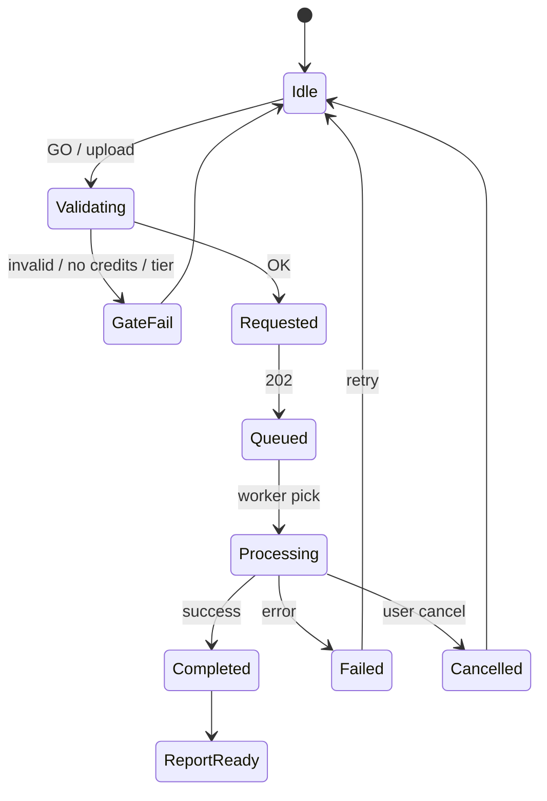
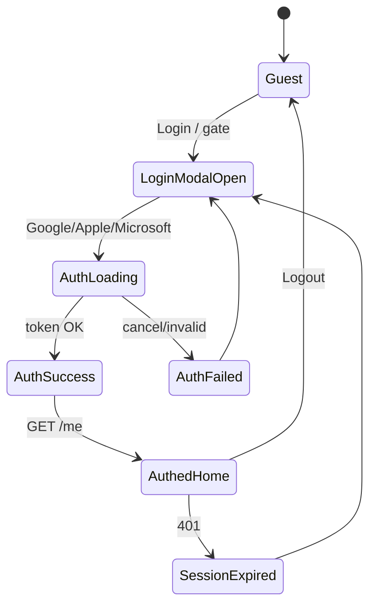
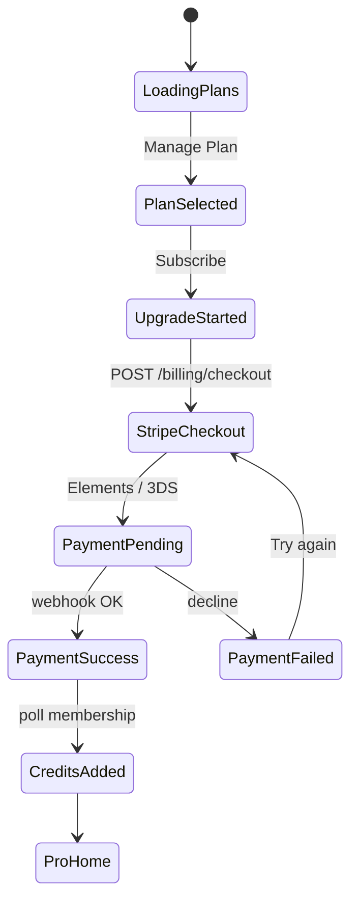
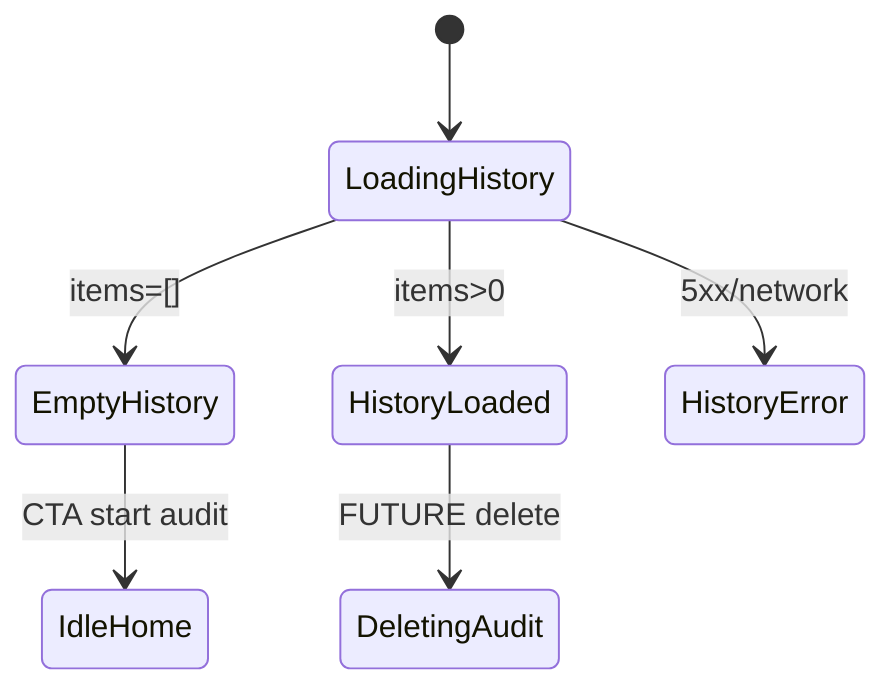
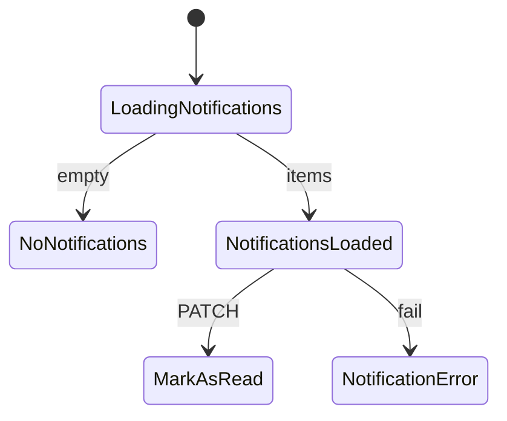
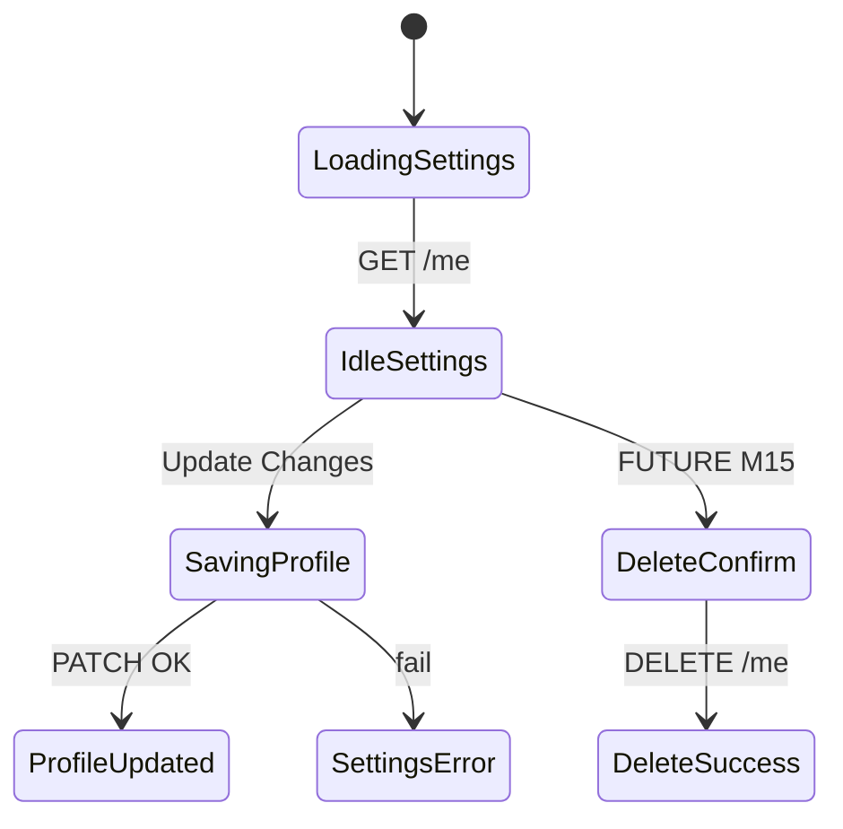

# Audient — State Management

**Status:** Draft (production-ready specification)  
**Last updated:** 2026-07-30  
**Owner:** Raghunath Kamlekar  
**Related:** SCREEN_MAPPING.md, BUSINESS_RULES.md, API_MAPPING.md, COMPONENT_BEHAVIOR.md, COMPONENT_MAPPING.md, PRICING.md, DATABASE.md, SCHEMA.md, DESIGN_TOKENS.md, CURSOR_RULES.md, TECHNICAL_ARCHITECTURE.md, prd.md

**Audience:** Frontend · Backend · QA · AI Engineers · Product  
**Format:** Markdown only — **no React/backend code**.

**Source of truth:** uploaded Figma screens (`Screen1`–`Screen11`) + SCREEN_MAPPING. Do **not** redesign screens. States exist to implement what is already specified.

**Tokens:** Primary `#1C018E` · Secondary `#8050E6` · Success `#16A34A` · Warning `#F59E0B` · Error `#DC2626` · Surface `#F8FDFF` · Font **Manrope** · Radii 4/8/16.

**A11y baseline (all states):** WCAG 2.1/2.2 AA · visible `:focus-visible` rings · keyboard operable · never color-only · `aria-live` for async outcomes · honor `prefers-reduced-motion` (disable non-essential motion).

**Out of product (do not implement as v1 states):** email/password · Password Changed · GitHub OAuth · History search/filter UI (not in uploads) · Team Members (FUTURE) · Notifications UI until SCREEN-M04 designed (API states still listed).

---

## 1. State Catalogue (index)

| Prefix | Domain | Count (approx.) |
|--------|--------|-----------------|
| `APP-STATE-*` | Global application | 013 |
| `AUTH-STATE-*` | Authentication | 010 |
| `LAND-STATE-*` | Landing / Home audit form | 014 |
| `AUDIT-STATE-*` | UX audit job lifecycle | 016 |
| `RPT-STATE-*` | Report / PDF | 008 |
| `HIST-STATE-*` | Audit history | 007 |
| `NOTIF-STATE-*` | Notifications (M04) | 006 |
| `BILL-STATE-*` | Subscription & billing | 012 |
| `SET-STATE-*` | Settings | 006 |
| `CMP-STATE-*` | Shared component interaction | 013 |
| `EMPTY-STATE-*` | Empty surfaces | 008 |
| `ERR-STATE-*` | Error outcomes | 013 |
| `OK-STATE-*` | Success outcomes | 006 |
| `LOAD-STATE-*` | Loading / skeleton | 006 |

### Audit status ↔ UI (SCHEMA)

| DB `Audit.status` | UI progress label | Typical `AUDIT-STATE-*` |
|-------------------|-------------------|-------------------------|
| `QUEUED` | Queued | AUDIT-STATE-002 |
| `PROCESSING` | Running (sub-stages) | AUDIT-STATE-003–011 |
| `COMPLETED` | Completed | AUDIT-STATE-012 |
| `FAILED` | Failed | AUDIT-STATE-013 |
| Cancelled (product) | Cancelled | AUDIT-STATE-014 |

### Membership status ↔ UI

| DB status | UI implication |
|-----------|----------------|
| `ACTIVE` / `TRIALING` | Full tier entitlements |
| `PAST_DUE` | Premium limited; billing prompt |
| `CANCELED` | Downgrade to Free entitlements at period end |

---

## 2. State Transition Diagrams

### 2.1 Audit (URL / Screenshot)

```text
Idle (LAND)
  → Validating input
  → Checking credits / tier / guest quota
  → Audit Requested (POST /ai/audit)
  → Queued
  → Started / Processing
      → Taking Screenshot (URL path)
      → Analyzing Layout / A11y / Typography / Contrast
      → Running AI
      → Generating Recommendations
      → Generating PDF (paid)
  → Completed → Report Ready
  OR Failed → Refund (if eligible) → Retry
  OR Cancelled → Refund → Home
```



### 2.2 Authentication



### 2.3 Billing



### 2.4 History



### 2.5 Notifications (M04)



### 2.6 Settings



---

## 3. Global Application States

### APP-STATE-001 — Application Loading

| Field | Detail |
|-------|--------|
| **State ID** | APP-STATE-001 |
| **State Name** | Application Loading |
| **Purpose** | Boot app before interactive UI |
| **Description** | Initial HTML/JS load; session restore in flight |
| **Trigger** | App bootstrap / hard refresh |
| **Current Screen** | Any (splash/shell) |
| **Components Affected** | App shell |
| **User Action** | Wait |
| **Backend Action** | Validate session cookie |
| **API Calls** | GET /me (optional) |
| **Database Updates** | None |
| **Analytics Event** | session_restored (optional) |
| **Visual Behaviour** | Brand splash or skeleton shell; no interactive audit form |
| **Animation** | Fade-in shell; respect reduced-motion |
| **Accessibility** | Announce “Loading Audient”; aria-busy on root |
| **Recovery Method** | Automatic → Ready or error |
| **Developer Notes** | Keep <2s perceived; never block forever |
| **QA Test Cases** | 1) Cold load shows skeleton 2) Completes to Ready 3) Offline → APP-STATE-003 |

### APP-STATE-002 — Application Ready

| Field | Detail |
|-------|--------|
| **State ID** | APP-STATE-002 |
| **State Name** | Application Ready |
| **Purpose** | App interactive |
| **Description** | Session resolved (guest or authed); routes usable |
| **Trigger** | Load complete |
| **Current Screen** | 001 or 004/009 |
| **Components Affected** | All chrome |
| **User Action** | Interact freely |
| **Backend Action** | Serve requests normally |
| **API Calls** | As needed |
| **Database Updates** | None |
| **Analytics Event** | landing_viewed / app_ready |
| **Visual Behaviour** | Full UI; GO per rules |
| **Animation** | None required |
| **Accessibility** | Focus on primary landmark / first field |
| **Recovery Method** | N/A |
| **Developer Notes** | Hydrate credits from server |
| **QA Test Cases** | 1) Guest lands 001 2) Authed Free→004 3) Pro→009 |

### APP-STATE-003 — Offline

| Field | Detail |
|-------|--------|
| **State ID** | APP-STATE-003 |
| **State Name** | Offline |
| **Purpose** | No network |
| **Description** | navigator offline or failed health |
| **Trigger** | Offline event / failed fetch |
| **Current Screen** | Any |
| **Components Affected** | Toasts, forms |
| **User Action** | Retry when online |
| **Backend Action** | Queue none for payments |
| **API Calls** | Fail with network error |
| **Database Updates** | None |
| **Analytics Event** | offline_detected |
| **Visual Behaviour** | Banner: offline; disable GO/pay |
| **Animation** | None |
| **Accessibility** | aria-live assertive offline |
| **Recovery Method** | Reconnect → Ready; retry last action |
| **Developer Notes** | Do not fake success |
| **QA Test Cases** | 1) Toggle offline 2) GO disabled/error 3) Recover on online |

### APP-STATE-004 — Poor Internet

| Field | Detail |
|-------|--------|
| **State ID** | APP-STATE-004 |
| **State Name** | Poor Internet |
| **Purpose** | Degraded connectivity |
| **Description** | High latency / intermittent |
| **Trigger** | Slow responses > threshold |
| **Current Screen** | Any |
| **Components Affected** | Progress, buttons |
| **User Action** | Wait or cancel |
| **Backend Action** | Timeouts apply |
| **API Calls** | May hit APP-STATE-011 |
| **Database Updates** | None |
| **Analytics Event** | slow_network (optional) |
| **Visual Behaviour** | Spinners longer; progress still polls 2s |
| **Animation** | Subtle pulse OK if motion allowed |
| **Accessibility** | Polite busy announcements |
| **Recovery Method** | Retry / cancel audit |
| **Developer Notes** | Use exponential backoff on poll |
| **QA Test Cases** | 1) Throttle network 2) Poll continues 3) Timeout path works |

### APP-STATE-005 — Maintenance Mode

| Field | Detail |
|-------|--------|
| **State ID** | APP-STATE-005 |
| **State Name** | Maintenance Mode |
| **Purpose** | Planned downtime |
| **Description** | Feature flag / health maintenance |
| **Trigger** | Ops enable flag |
| **Current Screen** | Blocking interstitial |
| **Components Affected** | Full page |
| **User Action** | Wait / read status |
| **Backend Action** | Reject mutating APIs |
| **API Calls** | GET /health → maintenance |
| **Database Updates** | None |
| **Analytics Event** | maintenance_shown |
| **Visual Behaviour** | Full-page message; no audit |
| **Animation** | None |
| **Accessibility** | H1 announced; focus trapped on page |
| **Recovery Method** | Wait until flag off |
| **Developer Notes** | Read-only optional; no charges |
| **QA Test Cases** | 1) Flag on → interstitial 2) Flag off → Ready |

### APP-STATE-006 — Session Expired

| Field | Detail |
|-------|--------|
| **State ID** | APP-STATE-006 |
| **State Name** | Session Expired |
| **Purpose** | Auth no longer valid |
| **Description** | Refresh/access token expired |
| **Trigger** | 401 on API / idle timeout |
| **Current Screen** | Authed → SSO |
| **Components Affected** | MDL-001 |
| **User Action** | Re-login |
| **Backend Action** | Clear session |
| **API Calls** | 401s; POST /auth/sign-out soft |
| **Database Updates** | Session cleared |
| **Analytics Event** | session_expired |
| **Visual Behaviour** | Modal or redirect to login; preserve intent |
| **Animation** | Modal open motion |
| **Accessibility** | Focus Login; announce session ended |
| **Recovery Method** | Re-auth → resume intent |
| **Developer Notes** | Store return path allow-list |
| **QA Test Cases** | 1) Expire cookie 2) Next API → SSO 3) Resume after login |

### APP-STATE-007 — Unauthorized

| Field | Detail |
|-------|--------|
| **State ID** | APP-STATE-007 |
| **State Name** | Unauthorized |
| **Purpose** | Not authenticated for resource |
| **Description** | Guest hits protected route |
| **Trigger** | Navigate / API 401 |
| **Current Screen** | Middleware redirect |
| **Components Affected** | MDL-001 |
| **User Action** | Login |
| **Backend Action** | Reject |
| **API Calls** | 401 UNAUTHENTICATED |
| **Database Updates** | None |
| **Analytics Event** | unauthorized_blocked |
| **Visual Behaviour** | SSO prompt |
| **Animation** | — |
| **Accessibility** | Announce need to log in |
| **Recovery Method** | Login success |
| **Developer Notes** | Same as BR-AUTH-003 |
| **QA Test Cases** | 1) Open /history as guest → SSO |

### APP-STATE-008 — Forbidden

| Field | Detail |
|-------|--------|
| **State ID** | APP-STATE-008 |
| **State Name** | Forbidden |
| **Purpose** | Authenticated but not allowed |
| **Description** | Tier/ownership/email gate |
| **Trigger** | 403 response |
| **Current Screen** | Current + upgrade modal |
| **Components Affected** | BTN-001, M08, PDF |
| **User Action** | Upgrade or dismiss |
| **Backend Action** | Enforce BR-* |
| **API Calls** | 403 TIER_NOT_ALLOWED / FORBIDDEN |
| **Database Updates** | None |
| **Analytics Event** | url_attempt_gated / pdf_gated |
| **Visual Behaviour** | Inline or modal upgrade |
| **Animation** | — |
| **Accessibility** | Error text not color-only |
| **Recovery Method** | Upgrade / change action |
| **Developer Notes** | Never reveal others’ resources |
| **QA Test Cases** | 1) Free URL GO → upgrade 2) Free PDF → 403 |

### APP-STATE-009 — 404

| Field | Detail |
|-------|--------|
| **State ID** | APP-STATE-009 |
| **State Name** | 404 |
| **Purpose** | Resource not found |
| **Description** | Missing route or foreign/missing id |
| **Trigger** | Bad URL / 404 API |
| **Current Screen** | 404 page or inline |
| **Components Affected** | Shell |
| **User Action** | Go home / history |
| **Backend Action** | Return 404 (no leak) |
| **API Calls** | 404 NOT_FOUND |
| **Database Updates** | None |
| **Analytics Event** | not_found |
| **Visual Behaviour** | Friendly 404 |
| **Animation** | — |
| **Accessibility** | Announce not found |
| **Recovery Method** | Navigate home |
| **Developer Notes** | Ownership → 404 not 403 |
| **QA Test Cases** | 1) Fake audit id 2) Unknown path |

### APP-STATE-010 — 500 Internal Server Error

| Field | Detail |
|-------|--------|
| **State ID** | APP-STATE-010 |
| **State Name** | 500 Internal Server Error |
| **Purpose** | Unhandled server failure |
| **Description** | 5xx from API/worker surface |
| **Trigger** | Server fault |
| **Current Screen** | Error UI / toast |
| **Components Affected** | Toast, M03 |
| **User Action** | Retry later |
| **Backend Action** | Log + alert |
| **API Calls** | 500 INTERNAL_ERROR |
| **Database Updates** | Maybe partial; compensate |
| **Analytics Event** | server_error |
| **Visual Behaviour** | Generic error; no stack traces |
| **Animation** | — |
| **Accessibility** | Assertive live region |
| **Recovery Method** | Retry / support |
| **Developer Notes** | Map to ERR-STATE Unknown |
| **QA Test Cases** | 1) Force 500 2) User sees safe copy |

### APP-STATE-011 — API Timeout

| Field | Detail |
|-------|--------|
| **State ID** | APP-STATE-011 |
| **State Name** | API Timeout |
| **Purpose** | Request exceeded client timeout |
| **Description** | Fetch aborted |
| **Trigger** | Slow endpoint |
| **Current Screen** | Current |
| **Components Affected** | Busy controls |
| **User Action** | Retry |
| **Backend Action** | Idempotent handlers |
| **API Calls** | Timed out client-side |
| **Database Updates** | No assume write |
| **Analytics Event** | api_timeout |
| **Visual Behaviour** | Timeout message |
| **Animation** | — |
| **Accessibility** | Announce timeout |
| **Recovery Method** | Retry with Idempotency-Key |
| **Developer Notes** | Especially checkout & start audit |
| **QA Test Cases** | 1) Delay API 2) Timeout UI 3) Safe retry |

### APP-STATE-012 — 429 Rate Limited

| Field | Detail |
|-------|--------|
| **State ID** | APP-STATE-012 |
| **State Name** | 429 Rate Limited |
| **Purpose** | Too many requests |
| **Description** | Rate limiter trip |
| **Trigger** | Burst actions |
| **Current Screen** | Current |
| **Components Affected** | Toast |
| **User Action** | Wait / backoff |
| **Backend Action** | 429 |
| **API Calls** | 429 RATE_LIMITED |
| **Database Updates** | None |
| **Analytics Event** | rate_limited |
| **Visual Behaviour** | BR-ERR message |
| **Animation** | — |
| **Accessibility** | Announce rate limit |
| **Recovery Method** | Wait Retry-After |
| **Developer Notes** | Guest + auth limits |
| **QA Test Cases** | 1) Spam GO 2) See 429 copy |

### APP-STATE-013 — Webhook Delay

| Field | Detail |
|-------|--------|
| **State ID** | APP-STATE-013 |
| **State Name** | Webhook Delay |
| **Purpose** | Payment UI success before entitlement |
| **Description** | Stripe webhook lag |
| **Trigger** | Payment Success shown; membership not ACTIVE yet |
| **Current Screen** | 008 |
| **Components Affected** | MDL-005 |
| **User Action** | Wait / Continue later |
| **Backend Action** | Poll membership |
| **API Calls** | GET /membership, GET /user/credits |
| **Database Updates** | Pending until webhook |
| **Analytics Event** | payment_succeeded, plan_activated (later) |
| **Visual Behaviour** | “Activating your plan…” |
| **Animation** | Subtle spinner |
| **Accessibility** | Polite live updates |
| **Recovery Method** | Poll ≤2 min then support |
| **Developer Notes** | Never grant credits client-side |
| **QA Test Cases** | 1) Delay webhook 2) Poll then activate |

---

## 4. Authentication States

### AUTH-STATE-001 — Guest

| Field | Detail |
|-------|--------|
| **State ID** | AUTH-STATE-001 |
| **State Name** | Guest |
| **Purpose** | Unauthenticated browsing |
| **Description** | No session; guest rules apply |
| **Trigger** | Land on 001 / after logout |
| **Current Screen** | SCREEN-001 |
| **Components Affected** | BTN-013 guest, BTN-014 guest |
| **User Action** | Browse; 1 screenshot |
| **Backend Action** | Guest session cookie |
| **API Calls** | Optional GET /me → 401 |
| **Database Updates** | Guest session only |
| **Analytics Event** | landing_viewed |
| **Visual Behaviour** | Landing chrome; menu Login only |
| **Animation** | — |
| **Accessibility** | Identify as guest to SR optionally |
| **Recovery Method** | Login for more |
| **Developer Notes** | BR-GUEST-* |
| **QA Test Cases** | 1) Incognito lands guest 2) Menu disables History |

### AUTH-STATE-002 — Login Modal Open

| Field | Detail |
|-------|--------|
| **State ID** | AUTH-STATE-002 |
| **State Name** | Login Modal Open |
| **Purpose** | SSO dialog visible |
| **Description** | MDL-001 open over page |
| **Trigger** | Login / gate |
| **Current Screen** | 003 over 001/004 |
| **Components Affected** | MDL-001, BTN-003–005 |
| **User Action** | Choose provider or dismiss |
| **Backend Action** | None yet |
| **API Calls** | None |
| **Database Updates** | None |
| **Analytics Event** | login_modal_opened |
| **Visual Behaviour** | Dim overlay; focus trap |
| **Animation** | Open/close motion unless reduced |
| **Accessibility** | Esc closes; focus first OAuth |
| **Recovery Method** | Esc / backdrop |
| **Developer Notes** | Block dismiss while AuthLoading |
| **QA Test Cases** | 1) Open 2) Esc closes 3) Focus trap |

### AUTH-STATE-003 — Google Login

| Field | Detail |
|-------|--------|
| **State ID** | AUTH-STATE-003 |
| **State Name** | Google Login |
| **Purpose** | Google OAuth in flight |
| **Description** | User chose Google |
| **Trigger** | Click BTN-003 |
| **Current Screen** | 003 |
| **Components Affected** | BTN-003 busy |
| **User Action** | Wait / complete consent |
| **Backend Action** | Verify googleToken |
| **API Calls** | POST /auth/google |
| **Database Updates** | Upsert User if new |
| **Analytics Event** | oauth_started{google} |
| **Visual Behaviour** | Google button loading |
| **Animation** | — |
| **Accessibility** | aria-busy on button |
| **Recovery Method** | Cancel → Failed |
| **Developer Notes** | Never store raw token |
| **QA Test Cases** | 1) Success path 2) Cancel consent |

### AUTH-STATE-004 — Apple Login

| Field | Detail |
|-------|--------|
| **State ID** | AUTH-STATE-004 |
| **State Name** | Apple Login |
| **Purpose** | Apple OAuth in flight |
| **Description** | User chose Apple |
| **Trigger** | Click BTN-004 |
| **Current Screen** | 003 |
| **Components Affected** | BTN-004 |
| **User Action** | Wait |
| **Backend Action** | Verify appleToken |
| **API Calls** | POST /auth/apple |
| **Database Updates** | Upsert User |
| **Analytics Event** | oauth_started{apple} |
| **Visual Behaviour** | Apple button loading |
| **Animation** | — |
| **Accessibility** | aria-busy |
| **Recovery Method** | Cancel → Failed |
| **Developer Notes** | Handle private relay |
| **QA Test Cases** | 1) Apple success 2) Sparse name OK |

### AUTH-STATE-005 — Microsoft Login

| Field | Detail |
|-------|--------|
| **State ID** | AUTH-STATE-005 |
| **State Name** | Microsoft Login |
| **Purpose** | Microsoft OAuth in flight |
| **Description** | User chose Microsoft |
| **Trigger** | Click BTN-005 |
| **Current Screen** | 003 |
| **Components Affected** | BTN-005 |
| **User Action** | Wait |
| **Backend Action** | Verify microsoftToken |
| **API Calls** | POST /auth/microsoft |
| **Database Updates** | Upsert User |
| **Analytics Event** | oauth_started{microsoft} |
| **Visual Behaviour** | Microsoft button loading |
| **Animation** | — |
| **Accessibility** | aria-busy |
| **Recovery Method** | Cancel → Failed |
| **Developer Notes** | azure provider id |
| **QA Test Cases** | 1) Microsoft success |

### AUTH-STATE-006 — Authentication Loading

| Field | Detail |
|-------|--------|
| **State ID** | AUTH-STATE-006 |
| **State Name** | Authentication Loading |
| **Purpose** | Generic auth busy |
| **Description** | Any provider redirect/verify |
| **Trigger** | OAuth start |
| **Current Screen** | 003 |
| **Components Affected** | All OAuth disabled |
| **User Action** | Wait |
| **Backend Action** | Token verify + session |
| **API Calls** | Auth POST |
| **Database Updates** | Seed FREE+300 if new |
| **Analytics Event** | — |
| **Visual Behaviour** | Modal non-dismissible |
| **Animation** | — |
| **Accessibility** | Announce signing in |
| **Recovery Method** | Timeout → Failed |
| **Developer Notes** | Disable other providers |
| **QA Test Cases** | 1) Cannot dismiss mid-flight |

### AUTH-STATE-007 — Authentication Success

| Field | Detail |
|-------|--------|
| **State ID** | AUTH-STATE-007 |
| **State Name** | Authentication Success |
| **Purpose** | Session established |
| **Description** | Valid token + cookies |
| **Trigger** | Auth 200 |
| **Current Screen** | → 004/009 or resume |
| **Components Affected** | Close MDL-001 |
| **User Action** | Land Home |
| **Backend Action** | Set cookies; claim guest audit |
| **API Calls** | GET /me |
| **Database Updates** | User/Membership/Credits |
| **Analytics Event** | login_success |
| **Visual Behaviour** | Modal closes; header hydrates |
| **Animation** | — |
| **Accessibility** | Announce signed in |
| **Recovery Method** | N/A |
| **Developer Notes** | BR-GUEST-006 claim |
| **QA Test Cases** | 1) New user 300 credits 2) Claim guest audit |

### AUTH-STATE-008 — Authentication Failed

| Field | Detail |
|-------|--------|
| **State ID** | AUTH-STATE-008 |
| **State Name** | Authentication Failed |
| **Purpose** | Login did not complete |
| **Description** | Invalid/cancelled/network |
| **Trigger** | Auth error |
| **Current Screen** | 003 stays |
| **Components Affected** | Alert in modal |
| **User Action** | Retry / dismiss |
| **Backend Action** | Log failure |
| **API Calls** | Error response |
| **Database Updates** | None |
| **Analytics Event** | login_failed |
| **Visual Behaviour** | Inline error |
| **Animation** | — |
| **Accessibility** | Assertive error |
| **Recovery Method** | Retry provider |
| **Developer Notes** | Generic copy no enumeration |
| **QA Test Cases** | 1) Bad token 2) Cancel 3) Network |

### AUTH-STATE-009 — Logout

| Field | Detail |
|-------|--------|
| **State ID** | AUTH-STATE-009 |
| **State Name** | Logout |
| **Purpose** | User signed out |
| **Description** | Explicit logout |
| **Trigger** | Profile Logout |
| **Current Screen** | 004 → 001 |
| **Components Affected** | Profile menu |
| **User Action** | Confirm implicit |
| **Backend Action** | Clear session |
| **API Calls** | POST /auth/sign-out |
| **Database Updates** | None |
| **Analytics Event** | logout |
| **Visual Behaviour** | Return Landing guest |
| **Animation** | — |
| **Accessibility** | Announce signed out |
| **Recovery Method** | N/A |
| **Developer Notes** | Clear client stores |
| **QA Test Cases** | 1) Logout → 001 2) Back button no private data |

### AUTH-STATE-010 — Session Expired (Auth)

| Field | Detail |
|-------|--------|
| **State ID** | AUTH-STATE-010 |
| **State Name** | Session Expired (Auth) |
| **Purpose** | Same as APP-006 scoped to auth UX |
| **Description** | Token dead mid-session |
| **Trigger** | 401 |
| **Current Screen** | Authed → 003 |
| **Components Affected** | MDL-001 |
| **User Action** | Re-login |
| **Backend Action** | Invalidate |
| **API Calls** | 401 |
| **Database Updates** | None |
| **Analytics Event** | session_expired |
| **Visual Behaviour** | Force re-auth |
| **Animation** | — |
| **Accessibility** | Focus login |
| **Recovery Method** | Re-auth |
| **Developer Notes** | Preserve intent |
| **QA Test Cases** | 1) Idle expire |

---

## 5. Landing / Home Form States

Applies to SCREEN-001 / 004 / 009 audit form (INP-001, INP-002, BTN-001).

### LAND-STATE-001 — Idle

| Field | Detail |
|-------|--------|
| **State ID** | LAND-STATE-001 |
| **State Name** | Idle |
| **Purpose** | Default empty form |
| **Description** | No URL, no file |
| **Trigger** | Enter Landing/Home |
| **Current Screen** | 001/004/009 |
| **Components Affected** | INP-001/002, BTN-001 disabled |
| **User Action** | Type or upload |
| **Backend Action** | None |
| **API Calls** | None |
| **Database Updates** | None |
| **Analytics Event** | landing_viewed |
| **Visual Behaviour** | Empty inputs; gray GO |
| **Animation** | — |
| **Accessibility** | Labels visible |
| **Recovery Method** | N/A |
| **Developer Notes** | BR-SHOT-004 |
| **QA Test Cases** | 1) GO disabled empty |

### LAND-STATE-002 — Typing URL

| Field | Detail |
|-------|--------|
| **State ID** | LAND-STATE-002 |
| **State Name** | Typing URL |
| **Purpose** | User editing URL |
| **Description** | Caret in URL field |
| **Trigger** | Focus + type |
| **Current Screen** | 001/004/009 |
| **Components Affected** | INP-001 |
| **User Action** | Type |
| **Backend Action** | None |
| **API Calls** | None |
| **Database Updates** | None |
| **Analytics Event** | website_url_entered (blur) |
| **Visual Behaviour** | Border focus Primary |
| **Animation** | — |
| **Accessibility** | Focus ring |
| **Recovery Method** | Clear / edit |
| **Developer Notes** | Normalize trim on blur |
| **QA Test Cases** | 1) Focus ring visible |

### LAND-STATE-003 — Valid URL

| Field | Detail |
|-------|--------|
| **State ID** | LAND-STATE-003 |
| **State Name** | Valid URL |
| **Purpose** | URL passes client validation |
| **Description** | http(s) public shape |
| **Trigger** | Blur/validate OK |
| **Current Screen** | 009 primarily |
| **Components Affected** | INP-001 success-ish, BTN-001 may enable |
| **User Action** | Press GO if credits/tier OK |
| **Backend Action** | Server re-validates on GO |
| **API Calls** | Later Start Audit |
| **Database Updates** | None |
| **Analytics Event** | — |
| **Visual Behaviour** | Valid affordance; Pro GO purple |
| **Animation** | — |
| **Accessibility** | — |
| **Recovery Method** | — |
| **Developer Notes** | Free/Guest still gate URL on GO |
| **QA Test Cases** | 1) https://nike.com enables GO on Pro |

### LAND-STATE-004 — Invalid URL

| Field | Detail |
|-------|--------|
| **State ID** | LAND-STATE-004 |
| **State Name** | Invalid URL |
| **Purpose** | Client/server reject URL |
| **Description** | Bad scheme/host |
| **Trigger** | Validate fail |
| **Current Screen** | 009 chip |
| **Components Affected** | INP-001 error, BTN-012 |
| **User Action** | Fix URL |
| **Backend Action** | 400 if submitted |
| **API Calls** | POST may 400 |
| **Database Updates** | None |
| **Analytics Event** | invalid_url |
| **Visual Behaviour** | Red border + Invalid URL chip |
| **Animation** | — |
| **Accessibility** | aria-invalid + describedby |
| **Recovery Method** | Edit URL |
| **Developer Notes** | Examples in BR-URL-003 |
| **QA Test Cases** | 1) ftp:// 2) google bare |

### LAND-STATE-005 — Empty Input

| Field | Detail |
|-------|--------|
| **State ID** | LAND-STATE-005 |
| **State Name** | Empty Input |
| **Purpose** | Cleared fields |
| **Description** | No value |
| **Trigger** | Clear / dismiss chips |
| **Current Screen** | 001/004/009 |
| **Components Affected** | INP-001/002 |
| **User Action** | Re-enter |
| **Backend Action** | None |
| **API Calls** | None |
| **Database Updates** | None |
| **Analytics Event** | — |
| **Visual Behaviour** | Placeholders |
| **Animation** | — |
| **Accessibility** | — |
| **Recovery Method** | — |
| **Developer Notes** | GO disabled |
| **QA Test Cases** | 1) Clear returns Idle |

### LAND-STATE-006 — URL Validation

| Field | Detail |
|-------|--------|
| **State ID** | LAND-STATE-006 |
| **State Name** | URL Validation |
| **Purpose** | Validating in progress |
| **Description** | Async/server check |
| **Trigger** | GO pressed |
| **Current Screen** | 001/004/009 |
| **Components Affected** | BTN-001 busy |
| **User Action** | Wait |
| **Backend Action** | SSRF + format |
| **API Calls** | Start Audit pre-check |
| **Database Updates** | None |
| **Analytics Event** | go_clicked |
| **Visual Behaviour** | Button Analyzing… |
| **Animation** | — |
| **Accessibility** | aria-busy |
| **Recovery Method** | Cancel rare |
| **Developer Notes** | Also APP timeout paths |
| **QA Test Cases** | 1) Spinner on GO |

### LAND-STATE-007 — Screenshot Upload

| Field | Detail |
|-------|--------|
| **State ID** | LAND-STATE-007 |
| **State Name** | Screenshot Upload |
| **Purpose** | File picking/uploading |
| **Description** | INP-002 active |
| **Trigger** | Choose files |
| **Current Screen** | 001/004/009 |
| **Components Affected** | INP-002, BTN-002 |
| **User Action** | Select/drop |
| **Backend Action** | Sign + PUT |
| **API Calls** | POST /uploads/sign → PUT |
| **Database Updates** | Pending object |
| **Analytics Event** | screenshot_uploaded pending |
| **Visual Behaviour** | Tile busy |
| **Animation** | — |
| **Accessibility** | aria-busy upload |
| **Recovery Method** | Cancel upload |
| **Developer Notes** | Max 5; 10MB; png/jpeg/webp |
| **QA Test Cases** | 1) Reject pdf 2) Accept png |

### LAND-STATE-008 — Screenshot Uploaded

| Field | Detail |
|-------|--------|
| **State ID** | LAND-STATE-008 |
| **State Name** | Screenshot Uploaded |
| **Purpose** | Upload succeeded |
| **Description** | Chip success |
| **Trigger** | PUT 200 |
| **Current Screen** | 001/004/009 |
| **Components Affected** | Chip, BTN-001 enable |
| **User Action** | GO or dismiss chip |
| **Backend Action** | Key ready |
| **API Calls** | — |
| **Database Updates** | Object in storage |
| **Analytics Event** | screenshot_uploaded |
| **Visual Behaviour** | Green uploaded chip |
| **Animation** | — |
| **Accessibility** | Polite announce |
| **Recovery Method** | Dismiss chip BTN-012 |
| **Developer Notes** | Then Start Audit with keys |
| **QA Test Cases** | 1) Chip shows 2) GO enables |

### LAND-STATE-009 — Screenshot Upload Failed

| Field | Detail |
|-------|--------|
| **State ID** | LAND-STATE-009 |
| **State Name** | Screenshot Upload Failed |
| **Purpose** | Upload failed |
| **Description** | Network/type/size |
| **Trigger** | PUT/sign fail |
| **Current Screen** | 001/004/009 |
| **Components Affected** | Red chip |
| **User Action** | Retry |
| **Backend Action** | None durable |
| **API Calls** | 400/network |
| **Database Updates** | Cleanup orphan |
| **Analytics Event** | upload_failed |
| **Visual Behaviour** | Red failed chip |
| **Animation** | — |
| **Accessibility** | Assertive |
| **Recovery Method** | Retry upload |
| **Developer Notes** | BR-SHOT-002 |
| **QA Test Cases** | 1) Oversized fails |

### LAND-STATE-010 — Credits Available

| Field | Detail |
|-------|--------|
| **State ID** | LAND-STATE-010 |
| **State Name** | Credits Available |
| **Purpose** | Enough credits for next action |
| **Description** | balance ≥ cost |
| **Trigger** | GET /user/credits |
| **Current Screen** | 004/009 |
| **Components Affected** | BTN-014 |
| **User Action** | Start audit |
| **Backend Action** | Reserve on create |
| **API Calls** | GET /user/credits |
| **Database Updates** | Read Credits |
| **Analytics Event** | — |
| **Visual Behaviour** | Badge shows balance |
| **Animation** | — |
| **Accessibility** | — |
| **Recovery Method** | — |
| **Developer Notes** | Guest shows 150 / 1 free |
| **QA Test Cases** | 1) Badge matches server |

### LAND-STATE-011 — Credits Exhausted

| Field | Detail |
|-------|--------|
| **State ID** | LAND-STATE-011 |
| **State Name** | Credits Exhausted |
| **Purpose** | Insufficient credits |
| **Description** | balance < cost |
| **Trigger** | GO or hydrate |
| **Current Screen** | 004/009 |
| **Components Affected** | BTN-014, M08/M05 |
| **User Action** | Upgrade / top-up |
| **Backend Action** | 422 on create |
| **API Calls** | POST /ai/audit 422 |
| **Database Updates** | None |
| **Analytics Event** | insufficient_credits |
| **Visual Behaviour** | Prompt upgrade |
| **Animation** | — |
| **Accessibility** | Announce |
| **Recovery Method** | Upgrade/top-up |
| **Developer Notes** | Free no top-up |
| **QA Test Cases** | 1) 0 credits blocks |

### LAND-STATE-012 — GO Button Disabled

| Field | Detail |
|-------|--------|
| **State ID** | LAND-STATE-012 |
| **State Name** | GO Button Disabled |
| **Purpose** | Cannot submit |
| **Description** | Empty/invalid/busy/gated UI |
| **Trigger** | Form invalid |
| **Current Screen** | 001/004/009 |
| **Components Affected** | BTN-001 |
| **User Action** | Fix input |
| **Backend Action** | None |
| **API Calls** | None |
| **Database Updates** | None |
| **Analytics Event** | — |
| **Visual Behaviour** | Gray/disabled tint (guest/Free URL) |
| **Animation** | — |
| **Accessibility** | aria-disabled |
| **Recovery Method** | Enable when valid |
| **Developer Notes** | Pro enabled purple when valid |
| **QA Test Cases** | 1) Guest empty disabled |

### LAND-STATE-013 — GO Button Enabled

| Field | Detail |
|-------|--------|
| **State ID** | LAND-STATE-013 |
| **State Name** | GO Button Enabled |
| **Purpose** | Can submit |
| **Description** | Valid input + allowed |
| **Trigger** | Valid form |
| **Current Screen** | 009 (URL) / all (shot) |
| **Components Affected** | BTN-001 |
| **User Action** | Click GO |
| **Backend Action** | Create audit |
| **API Calls** | POST /ai/audit |
| **Database Updates** | Reserve credits |
| **Analytics Event** | go_clicked |
| **Visual Behaviour** | Solid purple/gradient |
| **Animation** | Press feedback |
| **Accessibility** | Keyboard Enter from URL |
| **Recovery Method** | → Audit states |
| **Developer Notes** | Respect reduced-motion on gradient |
| **QA Test Cases** | 1) Enter submits |

### LAND-STATE-014 — Credits Checking

| Field | Detail |
|-------|--------|
| **State ID** | LAND-STATE-014 |
| **State Name** | Credits Checking |
| **Purpose** | Verifying balance before queue |
| **Description** | Pre-flight |
| **Trigger** | GO |
| **Current Screen** | 001/004/009 |
| **Components Affected** | BTN-001 |
| **User Action** | Wait |
| **Backend Action** | Balance check |
| **API Calls** | Internal / credits |
| **Database Updates** | Row lock upcoming |
| **Analytics Event** | — |
| **Visual Behaviour** | Busy |
| **Animation** | — |
| **Accessibility** | aria-busy |
| **Recovery Method** | Fail → exhausted |
| **Developer Notes** | Part of Start Audit txn |
| **QA Test Cases** | 1) Race two tabs one wins |

---

## 6. Audit Job States

Screen: **SCREEN-M01** (Progress). Poll `GET /audit/{id}` every **2s** until 100% or failed.

### AUDIT-STATE-001 — Audit Requested

| Field | Detail |
|-------|--------|
| **State ID** | AUDIT-STATE-001 |
| **State Name** | Audit Requested |
| **Purpose** | Client submitted create |
| **Description** | POST in flight |
| **Trigger** | GO success path |
| **Current Screen** | 001/004/009→M01 |
| **Components Affected** | BTN-001 |
| **User Action** | Wait |
| **Backend Action** | Validate+reserve |
| **API Calls** | POST /ai/audit |
| **Database Updates** | Pending txn |
| **Analytics Event** | audit_started (on 202) |
| **Visual Behaviour** | Navigating Progress |
| **Animation** | — |
| **Accessibility** | Busy |
| **Recovery Method** | Error stays Home |
| **Developer Notes** | Idempotency-Key |
| **QA Test Cases** | 1) Double-click one audit |

### AUDIT-STATE-002 — Audit Queued

| Field | Detail |
|-------|--------|
| **State ID** | AUDIT-STATE-002 |
| **State Name** | Audit Queued |
| **Purpose** | Accepted; waiting worker |
| **Description** | status queued / QUEUED |
| **Trigger** | 202 response |
| **Current Screen** | M01 |
| **Components Affected** | Progress 0–10% |
| **User Action** | Wait/cancel |
| **Backend Action** | Enqueue BullMQ |
| **API Calls** | — |
| **Database Updates** | Audit QUEUED; credits reserved |
| **Analytics Event** | audit_started |
| **Visual Behaviour** | Queued label |
| **Animation** | — |
| **Accessibility** | Polite progress |
| **Recovery Method** | Cancel→014 |
| **Developer Notes** | — |
| **QA Test Cases** | 1) status queued |

### AUDIT-STATE-003 — Audit Started

| Field | Detail |
|-------|--------|
| **State ID** | AUDIT-STATE-003 |
| **State Name** | Audit Started |
| **Purpose** | Worker picked job |
| **Description** | PROCESSING start |
| **Trigger** | Worker start |
| **Current Screen** | M01 |
| **Components Affected** | Progress |
| **User Action** | Wait |
| **Backend Action** | Mark PROCESSING |
| **API Calls** | status poll |
| **Database Updates** | status PROCESSING |
| **Analytics Event** | — |
| **Visual Behaviour** | Started stage |
| **Animation** | Stage transitions |
| **Accessibility** | Announce stage changes |
| **Recovery Method** | — |
| **Developer Notes** | Map progress % |
| **QA Test Cases** | 1) moves from queued |

### AUDIT-STATE-004 — Taking Screenshot

| Field | Detail |
|-------|--------|
| **State ID** | AUDIT-STATE-004 |
| **State Name** | Taking Screenshot |
| **Purpose** | Capture site screenshots |
| **Description** | URL pipeline |
| **Trigger** | Worker stage |
| **Current Screen** | M01 |
| **Components Affected** | Progress stage |
| **User Action** | Wait |
| **Backend Action** | Playwright shots |
| **API Calls** | poll |
| **Database Updates** | artifacts |
| **Analytics Event** | — |
| **Visual Behaviour** | Stage copy |
| **Animation** | — |
| **Accessibility** | — |
| **Recovery Method** | Fail→013 |
| **Developer Notes** | URL only |
| **QA Test Cases** | 1) URL shows stage |

### AUDIT-STATE-005 — Analyzing Layout

| Field | Detail |
|-------|--------|
| **State ID** | AUDIT-STATE-005 |
| **State Name** | Analyzing Layout |
| **Purpose** | Layout heuristics |
| **Description** | Stage |
| **Trigger** | Worker |
| **Current Screen** | M01 |
| **Components Affected** | Progress |
| **User Action** | Wait |
| **Backend Action** | Analyze |
| **API Calls** | poll |
| **Database Updates** | partial |
| **Analytics Event** | — |
| **Visual Behaviour** | Stage |
| **Animation** | — |
| **Accessibility** | — |
| **Recovery Method** | — |
| **Developer Notes** | Sub-stages may batch |
| **QA Test Cases** | 1) Progress increases |

### AUDIT-STATE-006 — Analyzing Accessibility

| Field | Detail |
|-------|--------|
| **State ID** | AUDIT-STATE-006 |
| **State Name** | Analyzing Accessibility |
| **Purpose** | a11y scan |
| **Description** | axe/Lighthouse stage |
| **Trigger** | Worker |
| **Current Screen** | M01 |
| **Components Affected** | Progress |
| **User Action** | Wait |
| **Backend Action** | Scan |
| **API Calls** | poll |
| **Database Updates** | partial |
| **Analytics Event** | — |
| **Visual Behaviour** | Stage |
| **Animation** | — |
| **Accessibility** | — |
| **Recovery Method** | — |
| **Developer Notes** | — |
| **QA Test Cases** | 1) Stage visible |

### AUDIT-STATE-007 — Analyzing Typography

| Field | Detail |
|-------|--------|
| **State ID** | AUDIT-STATE-007 |
| **State Name** | Analyzing Typography |
| **Purpose** | Type/hierarchy review |
| **Description** | Stage |
| **Trigger** | Worker |
| **Current Screen** | M01 |
| **Components Affected** | Progress |
| **User Action** | Wait |
| **Backend Action** | Analyze |
| **API Calls** | poll |
| **Database Updates** | partial |
| **Analytics Event** | — |
| **Visual Behaviour** | Stage |
| **Animation** | — |
| **Accessibility** | — |
| **Recovery Method** | — |
| **Developer Notes** | AI+rules |
| **QA Test Cases** | 1) OK |

### AUDIT-STATE-008 — Analyzing Color Contrast

| Field | Detail |
|-------|--------|
| **State ID** | AUDIT-STATE-008 |
| **State Name** | Analyzing Color Contrast |
| **Purpose** | Contrast checks |
| **Description** | Stage |
| **Trigger** | Worker |
| **Current Screen** | M01 |
| **Components Affected** | Progress |
| **User Action** | Wait |
| **Backend Action** | Analyze |
| **API Calls** | poll |
| **Database Updates** | partial |
| **Analytics Event** | — |
| **Visual Behaviour** | Stage |
| **Animation** | — |
| **Accessibility** | — |
| **Recovery Method** | — |
| **Developer Notes** | — |
| **QA Test Cases** | 1) OK |

### AUDIT-STATE-009 — Running AI

| Field | Detail |
|-------|--------|
| **State ID** | AUDIT-STATE-009 |
| **State Name** | Running AI |
| **Purpose** | LLM multimodal analysis |
| **Description** | Stage |
| **Trigger** | Worker |
| **Current Screen** | M01 |
| **Components Affected** | Progress high |
| **User Action** | Wait |
| **Backend Action** | LLM call |
| **API Calls** | poll |
| **Database Updates** | partial JSON |
| **Analytics Event** | — |
| **Visual Behaviour** | Stage |
| **Animation** | — |
| **Accessibility** | — |
| **Recovery Method** | AI fail→013 refund |
| **Developer Notes** | BR-AI-004 |
| **QA Test Cases** | 1) Provider down → fail+refund |

### AUDIT-STATE-010 — Generating Recommendations

| Field | Detail |
|-------|--------|
| **State ID** | AUDIT-STATE-010 |
| **State Name** | Generating Recommendations |
| **Purpose** | Normalize findings |
| **Description** | Stage |
| **Trigger** | Worker |
| **Current Screen** | M01 |
| **Components Affected** | Progress |
| **User Action** | Wait |
| **Backend Action** | Write recommendations |
| **API Calls** | poll |
| **Database Updates** | Recommendation rows |
| **Analytics Event** | — |
| **Visual Behaviour** | Stage |
| **Animation** | — |
| **Accessibility** | — |
| **Recovery Method** | — |
| **Developer Notes** | — |
| **QA Test Cases** | 1) OK |

### AUDIT-STATE-011 — Generating PDF

| Field | Detail |
|-------|--------|
| **State ID** | AUDIT-STATE-011 |
| **State Name** | Generating PDF |
| **Purpose** | Build PDF (paid) |
| **Description** | After report JSON |
| **Trigger** | Worker |
| **Current Screen** | M01/M02 |
| **Components Affected** | Progress/PDF btn |
| **User Action** | Wait |
| **Backend Action** | PDF render |
| **API Calls** | poll hasPdf |
| **Database Updates** | Report.pdf |
| **Analytics Event** | — |
| **Visual Behaviour** | PDF stage |
| **Animation** | — |
| **Accessibility** | — |
| **Recovery Method** | PDF fail≠audit refund |
| **Developer Notes** | BR-PDF-004 |
| **QA Test Cases** | 1) Free skips PDF stage |

### AUDIT-STATE-012 — Audit Completed

| Field | Detail |
|-------|--------|
| **State ID** | AUDIT-STATE-012 |
| **State Name** | Audit Completed |
| **Purpose** | Job success |
| **Description** | progress 100 / COMPLETED |
| **Trigger** | Worker done |
| **Current Screen** | M01→M02 |
| **Components Affected** | Progress full |
| **User Action** | Open report |
| **Backend Action** | Notify |
| **API Calls** | GET report |
| **Database Updates** | COMPLETED; Notification |
| **Analytics Event** | audit_completed |
| **Visual Behaviour** | 100% then navigate |
| **Animation** | Celebrate subtle if motion OK |
| **Accessibility** | Announce complete |
| **Recovery Method** | N/A |
| **Developer Notes** | Stop poll |
| **QA Test Cases** | 1) Auto open report |

### AUDIT-STATE-013 — Audit Failed

| Field | Detail |
|-------|--------|
| **State ID** | AUDIT-STATE-013 |
| **State Name** | Audit Failed |
| **Purpose** | Terminal failure |
| **Description** | FAILED + code |
| **Trigger** | Worker/API error |
| **Current Screen** | M03 |
| **Components Affected** | Failure UI |
| **User Action** | Retry/home |
| **Backend Action** | Refund if eligible |
| **API Calls** | status failed |
| **Database Updates** | FAILED; REFUND ledger |
| **Analytics Event** | audit_failed |
| **Visual Behaviour** | Error + refund note |
| **Animation** | — |
| **Accessibility** | Assertive |
| **Recovery Method** | Retry Start Audit |
| **Developer Notes** | BR-ERR taxonomy |
| **QA Test Cases** | 1) Each failure code message |

### AUDIT-STATE-014 — Audit Cancelled

| Field | Detail |
|-------|--------|
| **State ID** | AUDIT-STATE-014 |
| **State Name** | Audit Cancelled |
| **Purpose** | User stopped job |
| **Description** | Cancel on M01 |
| **Trigger** | Confirm cancel |
| **Current Screen** | M01→Home |
| **Components Affected** | Progress |
| **User Action** | Confirm |
| **Backend Action** | Abort+refund |
| **API Calls** | cancel API if any |
| **Database Updates** | CANCELLED/FAILED; refund |
| **Analytics Event** | audit_cancelled |
| **Visual Behaviour** | Return Home |
| **Animation** | — |
| **Accessibility** | Announce cancelled |
| **Recovery Method** | N/A |
| **Developer Notes** | Confirm dialog |
| **QA Test Cases** | 1) Cancel restores credits |

### AUDIT-STATE-015 — Audit Retried

| Field | Detail |
|-------|--------|
| **State ID** | AUDIT-STATE-015 |
| **State Name** | Audit Retried |
| **Purpose** | New attempt after fail |
| **Description** | User retry |
| **Trigger** | Retry CTA |
| **Current Screen** | M03→M01 |
| **Components Affected** | — |
| **User Action** | Retry |
| **Backend Action** | New audit or resume |
| **API Calls** | POST /ai/audit |
| **Database Updates** | New row / new reserve |
| **Analytics Event** | audit_started |
| **Visual Behaviour** | New progress |
| **Animation** | — |
| **Accessibility** | — |
| **Recovery Method** | — |
| **Developer Notes** | New Idempotency-Key |
| **QA Test Cases** | 1) Credits re-checked |

### AUDIT-STATE-016 — Audit Processing (generic)

| Field | Detail |
|-------|--------|
| **State ID** | AUDIT-STATE-016 |
| **State Name** | Audit Processing (generic) |
| **Purpose** | Any PROCESSING umbrella |
| **Description** | status running |
| **Trigger** | Poll |
| **Current Screen** | M01 |
| **Components Affected** | Progress bar |
| **User Action** | Wait |
| **Backend Action** | Continue |
| **API Calls** | GET /audit/{id} every 2s |
| **Database Updates** | progress field |
| **Analytics Event** | audit_progress_polled optional |
| **Visual Behaviour** | Bar 0–99 |
| **Animation** | Smooth bar; reduced-motion jump |
| **Accessibility** | aria-valuenow |
| **Recovery Method** | — |
| **Developer Notes** | Do not invent stages beyond worker |
| **QA Test Cases** | 1) Poll 2s 2) Stop at 100 |

---

## 7. Report & PDF States

Screen: **SCREEN-M02** (+ History PDF).

### RPT-STATE-001 — Loading Report

| Field | Detail |
|-------|--------|
| **State ID** | RPT-STATE-001 |
| **State Name** | Loading Report |
| **Purpose** | Fetching report JSON |
| **Description** | GET in flight |
| **Trigger** | Enter M02 / history open |
| **Current Screen** | M02 |
| **Components Affected** | Report skeleton |
| **User Action** | Wait |
| **Backend Action** | Load report |
| **API Calls** | GET /audit/{id}/report |
| **Database Updates** | Read |
| **Analytics Event** | report_viewed (on ready) |
| **Visual Behaviour** | Skeleton cards |
| **Animation** | — |
| **Accessibility** | aria-busy main |
| **Recovery Method** | Error/empty |
| **Developer Notes** | Tier gates detail |
| **QA Test Cases** | 1) Skeleton then content |

### RPT-STATE-002 — Report Ready

| Field | Detail |
|-------|--------|
| **State ID** | RPT-STATE-002 |
| **State Name** | Report Ready |
| **Purpose** | Report displayed |
| **Description** | 200 report |
| **Trigger** | Load OK |
| **Current Screen** | M02 |
| **Components Affected** | Report sections |
| **User Action** | Read / PDF |
| **Backend Action** | — |
| **API Calls** | recommendations optional |
| **Database Updates** | — |
| **Analytics Event** | report_viewed |
| **Visual Behaviour** | Scores/findings visible |
| **Animation** | — |
| **Accessibility** | Landmarks/headings |
| **Recovery Method** | — |
| **Developer Notes** | Free=brief; Pro=full |
| **QA Test Cases** | 1) Free gated sections |

### RPT-STATE-003 — No Report Found

| Field | Detail |
|-------|--------|
| **State ID** | RPT-STATE-003 |
| **State Name** | No Report Found |
| **Purpose** | Missing/incomplete |
| **Description** | 404/not ready |
| **Trigger** | Bad id / early |
| **Current Screen** | M02/404 |
| **Components Affected** | Empty/error |
| **User Action** | Back history |
| **Backend Action** | 404 |
| **API Calls** | GET report 404 |
| **Database Updates** | None |
| **Analytics Event** | — |
| **Visual Behaviour** | Not found |
| **Animation** | — |
| **Accessibility** | Announce |
| **Recovery Method** | History |
| **Developer Notes** | Ownership 404 |
| **QA Test Cases** | 1) Random UUID |

### RPT-STATE-004 — Report Deleted

| Field | Detail |
|-------|--------|
| **State ID** | RPT-STATE-004 |
| **State Name** | Report Deleted |
| **Purpose** | Audit removed |
| **Description** | Deleted record |
| **Trigger** | After delete FUTURE |
| **Current Screen** | 012/M02 |
| **Components Affected** | — |
| **User Action** | — |
| **Backend Action** | Cascade delete |
| **API Calls** | DELETE audit |
| **Database Updates** | Cascade |
| **Analytics Event** | — |
| **Visual Behaviour** | Gone from history |
| **Animation** | — |
| **Accessibility** | — |
| **Recovery Method** | — |
| **Developer Notes** | No credit refund on delete |
| **QA Test Cases** | FUTURE if no UI |

### RPT-STATE-005 — PDF Generating

| Field | Detail |
|-------|--------|
| **State ID** | RPT-STATE-005 |
| **State Name** | PDF Generating |
| **Purpose** | PDF not ready yet |
| **Description** | hasPdf false |
| **Trigger** | Paid complete |
| **Current Screen** | M02 |
| **Components Affected** | BTN-011 disabled |
| **User Action** | Wait |
| **Backend Action** | Worker PDF |
| **API Calls** | poll audit/report |
| **Database Updates** | pdf pending |
| **Analytics Event** | — |
| **Visual Behaviour** | Disabled download |
| **Animation** | — |
| **Accessibility** | — |
| **Recovery Method** | Wait/retry |
| **Developer Notes** | — |
| **QA Test Cases** | 1) Button enables later |

### RPT-STATE-006 — PDF Ready

| Field | Detail |
|-------|--------|
| **State ID** | RPT-STATE-006 |
| **State Name** | PDF Ready |
| **Purpose** | PDF available |
| **Description** | hasPdf true |
| **Trigger** | PDF done |
| **Current Screen** | M02/012 |
| **Components Affected** | BTN-011 enabled |
| **User Action** | Download |
| **Backend Action** | Signed URL |
| **API Calls** | GET /report/{id}/pdf |
| **Database Updates** | — |
| **Analytics Event** | — |
| **Visual Behaviour** | Download affordance |
| **Animation** | — |
| **Accessibility** | aria-label Download PDF |
| **Recovery Method** | — |
| **Developer Notes** | Pro/Business only |
| **QA Test Cases** | 1) Free never ready |

### RPT-STATE-007 — PDF Downloading

| Field | Detail |
|-------|--------|
| **State ID** | RPT-STATE-007 |
| **State Name** | PDF Downloading |
| **Purpose** | Fetch signed URL |
| **Description** | GET pdf in flight |
| **Trigger** | Click BTN-011 |
| **Current Screen** | 012/M02 |
| **Components Affected** | BTN-011 busy |
| **User Action** | Wait |
| **Backend Action** | Sign URL |
| **API Calls** | GET /report/{id}/pdf |
| **Database Updates** | None |
| **Analytics Event** | pdf_downloaded |
| **Visual Behaviour** | Spinner on icon |
| **Animation** | — |
| **Accessibility** | aria-busy |
| **Recovery Method** | Retry |
| **Developer Notes** | Open downloadUrl |
| **QA Test Cases** | 1) Triggers download |

### RPT-STATE-008 — PDF Download Failed

| Field | Detail |
|-------|--------|
| **State ID** | RPT-STATE-008 |
| **State Name** | PDF Download Failed |
| **Purpose** | Could not get PDF |
| **Description** | 403/404/network |
| **Trigger** | Fail GET |
| **Current Screen** | 012/M02 |
| **Components Affected** | Toast |
| **User Action** | Retry/upgrade |
| **Backend Action** | — |
| **API Calls** | 403/404 |
| **Database Updates** | None |
| **Analytics Event** | pdf_download_failed |
| **Visual Behaviour** | Error toast |
| **Animation** | — |
| **Accessibility** | Assertive |
| **Recovery Method** | Retry / upgrade |
| **Developer Notes** | BR-PDF-001 |
| **QA Test Cases** | 1) Free→upgrade |

---

## 8. History States

Screens: **SCREEN-012 / 013**. No search/filter in uploads (FUTURE only).

### HIST-STATE-001 — Loading History

| Field | Detail |
|-------|--------|
| **State ID** | HIST-STATE-001 |
| **State Name** | Loading History |
| **Purpose** | Fetching list |
| **Description** | GET /history |
| **Trigger** | Open History |
| **Current Screen** | 012/013 |
| **Components Affected** | CARD-002 skeletons |
| **User Action** | Wait |
| **Backend Action** | List audits |
| **API Calls** | GET /history |
| **Database Updates** | Read |
| **Analytics Event** | history_viewed |
| **Visual Behaviour** | Skeleton cards |
| **Animation** | — |
| **Accessibility** | aria-busy |
| **Recovery Method** | Error state |
| **Developer Notes** | — |
| **QA Test Cases** | 1) Skeletons |

### HIST-STATE-002 — Empty History

| Field | Detail |
|-------|--------|
| **State ID** | HIST-STATE-002 |
| **State Name** | Empty History |
| **Purpose** | No audits |
| **Description** | items=[] |
| **Trigger** | Load empty |
| **Current Screen** | 013 |
| **Components Affected** | Empty illustration |
| **User Action** | CTA Home |
| **Backend Action** | — |
| **API Calls** | GET /history [] |
| **Database Updates** | None |
| **Analytics Event** | empty_history_cta_clicked |
| **Visual Behaviour** | “No History to display” |
| **Animation** | — |
| **Accessibility** | Announce empty |
| **Recovery Method** | Start audit |
| **Developer Notes** | BR-HIST |
| **QA Test Cases** | 1) New user empty |

### HIST-STATE-003 — History Loaded

| Field | Detail |
|-------|--------|
| **State ID** | HIST-STATE-003 |
| **State Name** | History Loaded |
| **Purpose** | List rendered |
| **Description** | items>0 |
| **Trigger** | Load OK |
| **Current Screen** | 012 |
| **Components Affected** | CARD-002 |
| **User Action** | Open/PDF |
| **Backend Action** | — |
| **API Calls** | GET /history |
| **Database Updates** | None |
| **Analytics Event** | history_row_opened |
| **Visual Behaviour** | Grouped by year |
| **Animation** | — |
| **Accessibility** | List semantics |
| **Recovery Method** | — |
| **Developer Notes** | Limited Free retention |
| **QA Test Cases** | 1) Open row → report |

### HIST-STATE-004 — Searching

| Field | Detail |
|-------|--------|
| **State ID** | HIST-STATE-004 |
| **State Name** | Searching |
| **Purpose** | N/A v1 |
| **Description** | Not in uploads |
| **Trigger** | — |
| **Current Screen** | — |
| **Components Affected** | — |
| **User Action** | — |
| **Backend Action** | — |
| **API Calls** | — |
| **Database Updates** | — |
| **Analytics Event** | — |
| **Visual Behaviour** | — |
| **Animation** | — |
| **Accessibility** | — |
| **Recovery Method** | — |
| **Developer Notes** | **FUTURE** — do not build |
| **QA Test Cases** | Mark N/A in QA |

### HIST-STATE-005 — Filtering

| Field | Detail |
|-------|--------|
| **State ID** | HIST-STATE-005 |
| **State Name** | Filtering |
| **Purpose** | N/A v1 |
| **Description** | Not in uploads |
| **Trigger** | — |
| **Current Screen** | — |
| **Components Affected** | — |
| **User Action** | — |
| **Backend Action** | — |
| **API Calls** | — |
| **Database Updates** | — |
| **Analytics Event** | — |
| **Visual Behaviour** | — |
| **Animation** | — |
| **Accessibility** | — |
| **Recovery Method** | — |
| **Developer Notes** | **FUTURE** |
| **QA Test Cases** | Mark N/A |

### HIST-STATE-006 — Deleting Audit

| Field | Detail |
|-------|--------|
| **State ID** | HIST-STATE-006 |
| **State Name** | Deleting Audit |
| **Purpose** | Removing audit |
| **Description** | FUTURE UI |
| **Trigger** | Delete confirm |
| **Current Screen** | 012 |
| **Components Affected** | CARD busy |
| **User Action** | Confirm |
| **Backend Action** | Cascade |
| **API Calls** | DELETE /audits/{id} |
| **Database Updates** | Cascade; no refund |
| **Analytics Event** | — |
| **Visual Behaviour** | Row removes |
| **Animation** | — |
| **Accessibility** | Confirm dialog |
| **Recovery Method** | Undo N/A |
| **Developer Notes** | No refund BR |
| **QA Test Cases** | FUTURE |

### HIST-STATE-007 — History Error

| Field | Detail |
|-------|--------|
| **State ID** | HIST-STATE-007 |
| **State Name** | History Error |
| **Purpose** | List failed |
| **Description** | Network/5xx |
| **Trigger** | GET fail |
| **Current Screen** | 012 |
| **Components Affected** | Error + retry |
| **User Action** | Retry |
| **Backend Action** | — |
| **API Calls** | GET /history |
| **Database Updates** | None |
| **Analytics Event** | — |
| **Visual Behaviour** | Error panel |
| **Animation** | — |
| **Accessibility** | Assertive |
| **Recovery Method** | Retry |
| **Developer Notes** | — |
| **QA Test Cases** | 1) Offline open history |

---

## 9. Notification States

**SCREEN-M04 missing** — document for API readiness; no UI redesign.

### NOTIF-STATE-001 — Loading Notifications

| Field | Detail |
|-------|--------|
| **State ID** | NOTIF-STATE-001 |
| **State Name** | Loading Notifications |
| **Purpose** | Fetch list |
| **Description** | Open bell/M04 |
| **Trigger** | Open |
| **Current Screen** | M04 |
| **Components Affected** | Skeleton |
| **User Action** | Wait |
| **Backend Action** | List |
| **API Calls** | GET /notifications |
| **Database Updates** | Read |
| **Analytics Event** | notifications_opened |
| **Visual Behaviour** | Skeleton |
| **Animation** | — |
| **Accessibility** | aria-busy |
| **Recovery Method** | Error |
| **Developer Notes** | — |
| **QA Test Cases** | 1) Loading |

### NOTIF-STATE-002 — No Notifications

| Field | Detail |
|-------|--------|
| **State ID** | NOTIF-STATE-002 |
| **State Name** | No Notifications |
| **Purpose** | Empty inbox |
| **Description** | [] |
| **Trigger** | Load empty |
| **Current Screen** | M04 |
| **Components Affected** | Empty |
| **User Action** | Dismiss |
| **Backend Action** | — |
| **API Calls** | GET [] |
| **Database Updates** | None |
| **Analytics Event** | — |
| **Visual Behaviour** | “No notifications” |
| **Animation** | — |
| **Accessibility** | Announce |
| **Recovery Method** | — |
| **Developer Notes** | — |
| **QA Test Cases** | 1) Empty copy |

### NOTIF-STATE-003 — Notifications Loaded

| Field | Detail |
|-------|--------|
| **State ID** | NOTIF-STATE-003 |
| **State Name** | Notifications Loaded |
| **Purpose** | List shown |
| **Description** | items |
| **Trigger** | Load OK |
| **Current Screen** | M04 |
| **Components Affected** | Rows |
| **User Action** | Open/mark |
| **Backend Action** | — |
| **API Calls** | GET |
| **Database Updates** | None |
| **Analytics Event** | notification_opened |
| **Visual Behaviour** | Unread badges |
| **Animation** | — |
| **Accessibility** | Listbox/menu |
| **Recovery Method** | — |
| **Developer Notes** | Types per schema only |
| **QA Test Cases** | 1) Unread count |

### NOTIF-STATE-004 — Mark As Read

| Field | Detail |
|-------|--------|
| **State ID** | NOTIF-STATE-004 |
| **State Name** | Mark As Read |
| **Purpose** | Updating read |
| **Description** | PATCH |
| **Trigger** | Click row |
| **Current Screen** | M04 |
| **Components Affected** | Row |
| **User Action** | Click |
| **Backend Action** | Update read |
| **API Calls** | PATCH /notifications/{id} |
| **Database Updates** | read=true |
| **Analytics Event** | notification_read |
| **Visual Behaviour** | Unread clears |
| **Animation** | — |
| **Accessibility** | — |
| **Recovery Method** | Retry |
| **Developer Notes** | Optimistic OK |
| **QA Test Cases** | 1) PATCH |

### NOTIF-STATE-005 — Delete Notification

| Field | Detail |
|-------|--------|
| **State ID** | NOTIF-STATE-005 |
| **State Name** | Delete Notification |
| **Purpose** | N/A unless API adds delete |
| **Description** | Not specified as delete endpoint in mapping |
| **Trigger** | — |
| **Current Screen** | — |
| **Components Affected** | — |
| **User Action** | — |
| **Backend Action** | — |
| **API Calls** | read-all exists; per-item delete optional |
| **Database Updates** | — |
| **Analytics Event** | — |
| **Visual Behaviour** | — |
| **Animation** | — |
| **Accessibility** | — |
| **Recovery Method** | — |
| **Developer Notes** | Prefer mark-read; no invent delete API |
| **QA Test Cases** | N/A unless added |

### NOTIF-STATE-006 — Notification Error

| Field | Detail |
|-------|--------|
| **State ID** | NOTIF-STATE-006 |
| **State Name** | Notification Error |
| **Purpose** | Load/update fail |
| **Description** | Error |
| **Trigger** | Fail |
| **Current Screen** | M04 |
| **Components Affected** | Error |
| **User Action** | Retry |
| **Backend Action** | — |
| **API Calls** | 5xx |
| **Database Updates** | None |
| **Analytics Event** | — |
| **Visual Behaviour** | Error |
| **Animation** | — |
| **Accessibility** | Assertive |
| **Recovery Method** | Retry |
| **Developer Notes** | — |
| **QA Test Cases** | 1) Fail path |

---

## 10. Billing States

### BILL-STATE-001 — Loading Plans

| Field | Detail |
|-------|--------|
| **State ID** | BILL-STATE-001 |
| **State Name** | Loading Plans |
| **Purpose** | Membership+catalog load |
| **Description** | Open Manage Plan |
| **Trigger** | Open 005 |
| **Current Screen** | 005 |
| **Components Affected** | CARD-001 skeletons |
| **User Action** | Wait |
| **Backend Action** | GET membership |
| **API Calls** | GET /membership |
| **Database Updates** | Read |
| **Analytics Event** | manage_plan_viewed |
| **Visual Behaviour** | Skeleton cards |
| **Animation** | — |
| **Accessibility** | aria-busy |
| **Recovery Method** | Error toast |
| **Developer Notes** | Prices $29/$99 |
| **QA Test Cases** | 1) Prices correct |

### BILL-STATE-002 — Plan Selected

| Field | Detail |
|-------|--------|
| **State ID** | BILL-STATE-002 |
| **State Name** | Plan Selected |
| **Purpose** | User targets a tier |
| **Description** | Hover/focus Subscribe |
| **Trigger** | Interact cards |
| **Current Screen** | 005 |
| **Components Affected** | CARD-001 |
| **User Action** | Subscribe |
| **Backend Action** | — |
| **API Calls** | — |
| **Database Updates** | None |
| **Analytics Event** | subscribe_clicked prep |
| **Visual Behaviour** | Highlight card |
| **Animation** | — |
| **Accessibility** | Focus CTA |
| **Recovery Method** | — |
| **Developer Notes** | Active Account on current |
| **QA Test Cases** | 1) Current shows Active |

### BILL-STATE-003 — Upgrade Started

| Field | Detail |
|-------|--------|
| **State ID** | BILL-STATE-003 |
| **State Name** | Upgrade Started |
| **Purpose** | Checkout creating |
| **Description** | Subscribe click |
| **Trigger** | BTN-006 |
| **Current Screen** | 005→006 |
| **Components Affected** | BTN-006 busy |
| **User Action** | Wait |
| **Backend Action** | Create session |
| **API Calls** | POST /billing/checkout |
| **Database Updates** | Payment pending row optional |
| **Analytics Event** | checkout_started |
| **Visual Behaviour** | Spinner |
| **Animation** | — |
| **Accessibility** | aria-busy |
| **Recovery Method** | Failed→retry |
| **Developer Notes** | Guest→SSO first |
| **QA Test Cases** | 1) Guest subscribe → login |

### BILL-STATE-004 — Stripe Checkout

| Field | Detail |
|-------|--------|
| **State ID** | BILL-STATE-004 |
| **State Name** | Stripe Checkout |
| **Purpose** | Provider UI / Elements |
| **Description** | Checkout URL or Elements |
| **Trigger** | Checkout 200 |
| **Current Screen** | 006 |
| **Components Affected** | MDL-003, INP-004–009 |
| **User Action** | Enter card / 3DS |
| **Backend Action** | Stripe |
| **API Calls** | Stripe.js |
| **Database Updates** | None yet |
| **Analytics Event** | — |
| **Visual Behaviour** | Payment modal |
| **Animation** | — |
| **Accessibility** | Labels; focus first field |
| **Recovery Method** | Dismiss dirty confirm |
| **Developer Notes** | PCI Elements only |
| **QA Test Cases** | 1) No PAN to Audient API |

### BILL-STATE-005 — Payment Pending

| Field | Detail |
|-------|--------|
| **State ID** | BILL-STATE-005 |
| **State Name** | Payment Pending |
| **Purpose** | Awaiting confirmation |
| **Description** | 3DS/OTP pending |
| **Trigger** | Confirm pay |
| **Current Screen** | 006 |
| **Components Affected** | OTP countdown |
| **User Action** | Complete challenge |
| **Backend Action** | Confirm PI |
| **API Calls** | Stripe confirm |
| **Database Updates** | None |
| **Analytics Event** | payment_otp_* |
| **Visual Behaviour** | Countdown badge |
| **Animation** | — |
| **Accessibility** | Live countdown polite |
| **Recovery Method** | Expire→resend/retry |
| **Developer Notes** | OTP=3DS BR-BILL-003 |
| **QA Test Cases** | 1) Countdown |

### BILL-STATE-006 — Payment Success

| Field | Detail |
|-------|--------|
| **State ID** | BILL-STATE-006 |
| **State Name** | Payment Success |
| **Purpose** | Paid; activating |
| **Description** | Success event |
| **Trigger** | PI succeeded |
| **Current Screen** | 008 |
| **Components Affected** | MDL-005 |
| **User Action** | Continue |
| **Backend Action** | Webhook grant |
| **API Calls** | Webhook; poll membership |
| **Database Updates** | Membership ACTIVE; credits |
| **Analytics Event** | payment_succeeded, plan_activated |
| **Visual Behaviour** | Green success |
| **Animation** | — |
| **Accessibility** | Announce success |
| **Recovery Method** | →009 |
| **Developer Notes** | APP-STATE-013 if lag |
| **QA Test Cases** | 1) Continues to Pro Home |

### BILL-STATE-007 — Payment Failed

| Field | Detail |
|-------|--------|
| **State ID** | BILL-STATE-007 |
| **State Name** | Payment Failed |
| **Purpose** | Charge failed |
| **Description** | Decline/3DS fail |
| **Trigger** | Fail |
| **Current Screen** | 007 |
| **Components Affected** | MDL-004 |
| **User Action** | Try again |
| **Backend Action** | No grant |
| **API Calls** | — |
| **Database Updates** | None |
| **Analytics Event** | payment_failed |
| **Visual Behaviour** | Red failure |
| **Animation** | — |
| **Accessibility** | Assertive |
| **Recovery Method** | Retry 006 |
| **Developer Notes** | BR-BILL-004 |
| **QA Test Cases** | 1) No credit change |

### BILL-STATE-008 — Credits Added

| Field | Detail |
|-------|--------|
| **State ID** | BILL-STATE-008 |
| **State Name** | Credits Added |
| **Purpose** | Balance increased |
| **Description** | Webhook top-up/plan |
| **Trigger** | After success |
| **Current Screen** | 009 header |
| **Components Affected** | BTN-014 |
| **User Action** | — |
| **Backend Action** | Grant ledger |
| **API Calls** | GET /user/credits |
| **Database Updates** | Credits+ledger |
| **Analytics Event** | credits_purchased / plan_activated |
| **Visual Behaviour** | Badge updates |
| **Animation** | — |
| **Accessibility** | Announce credits |
| **Recovery Method** | — |
| **Developer Notes** | — |
| **QA Test Cases** | 1) Badge refreshes |

### BILL-STATE-009 — Credits Refunded

| Field | Detail |
|-------|--------|
| **State ID** | BILL-STATE-009 |
| **State Name** | Credits Refunded |
| **Purpose** | Balance restored |
| **Description** | Failed/cancelled audit |
| **Trigger** | Audit fail |
| **Current Screen** | M03/header |
| **Components Affected** | BTN-014 |
| **User Action** | — |
| **Backend Action** | REFUND ledger |
| **API Calls** | — |
| **Database Updates** | CreditTransaction REFUND |
| **Analytics Event** | — |
| **Visual Behaviour** | Badge up; refund copy |
| **Animation** | — |
| **Accessibility** | Announce refund |
| **Recovery Method** | — |
| **Developer Notes** | BR-ERR-001 |
| **QA Test Cases** | 1) Fail refunds full cost |

### BILL-STATE-010 — Invoice Generated

| Field | Detail |
|-------|--------|
| **State ID** | BILL-STATE-010 |
| **State Name** | Invoice Generated |
| **Purpose** | Payment recorded |
| **Description** | Stripe invoice/payment |
| **Trigger** | Webhook |
| **Current Screen** | M06 FUTURE |
| **Components Affected** | Payments list |
| **User Action** | View portal |
| **Backend Action** | Store Payment |
| **API Calls** | GET /payments |
| **Database Updates** | Payment row |
| **Analytics Event** | — |
| **Visual Behaviour** | Invoice in list/portal |
| **Animation** | — |
| **Accessibility** | — |
| **Recovery Method** | Portal |
| **Developer Notes** | M06 missing UI |
| **QA Test Cases** | FUTURE UI |

### BILL-STATE-011 — Subscription Cancelled

| Field | Detail |
|-------|--------|
| **State ID** | BILL-STATE-011 |
| **State Name** | Subscription Cancelled |
| **Purpose** | Cancel at period end |
| **Description** | Portal cancel |
| **Trigger** | User portal |
| **Current Screen** | M06 |
| **Components Affected** | Membership |
| **User Action** | — |
| **Backend Action** | Stripe cancel |
| **API Calls** | Webhook |
| **Database Updates** | cancelAtPeriodEnd |
| **Analytics Event** | — |
| **Visual Behaviour** | Status messaging |
| **Animation** | — |
| **Accessibility** | — |
| **Recovery Method** | — |
| **Developer Notes** | Use Billing Portal |
| **QA Test Cases** | 1) Webhook updates |

### BILL-STATE-012 — Subscription Renewed

| Field | Detail |
|-------|--------|
| **State ID** | BILL-STATE-012 |
| **State Name** | Subscription Renewed |
| **Purpose** | Period renewed |
| **Description** | invoice.paid |
| **Trigger** | Webhook |
| **Current Screen** | Header |
| **Components Affected** | BTN-014 |
| **User Action** | — |
| **Backend Action** | Reset plan credits |
| **API Calls** | Webhook |
| **Database Updates** | Credits reset plan pool |
| **Analytics Event** | subscription_renewed |
| **Visual Behaviour** | Badge refresh |
| **Animation** | — |
| **Accessibility** | — |
| **Recovery Method** | — |
| **Developer Notes** | Top-ups rollover |
| **QA Test Cases** | 1) Month reset |

---

## 11. Settings States

Screens: **010 Personal**, **011 Payment Details**. **No password** in product.

### SET-STATE-001 — Loading Settings

| Field | Detail |
|-------|--------|
| **State ID** | SET-STATE-001 |
| **State Name** | Loading Settings |
| **Purpose** | Load profile |
| **Description** | Open Settings |
| **Trigger** | GET /me |
| **Current Screen** | 010/011 |
| **Components Affected** | Form skeleton |
| **User Action** | Wait |
| **Backend Action** | Load user |
| **API Calls** | GET /me |
| **Database Updates** | Read |
| **Analytics Event** | settings_opened |
| **Visual Behaviour** | Skeleton fields |
| **Animation** | — |
| **Accessibility** | aria-busy |
| **Recovery Method** | Error |
| **Developer Notes** | Email read-only |
| **QA Test Cases** | 1) Loads name/email |

### SET-STATE-002 — Saving Profile

| Field | Detail |
|-------|--------|
| **State ID** | SET-STATE-002 |
| **State Name** | Saving Profile |
| **Purpose** | PATCH in flight |
| **Description** | Update Changes |
| **Trigger** | BTN-009 |
| **Current Screen** | 010 |
| **Components Affected** | BTN-009 busy |
| **User Action** | Wait |
| **Backend Action** | Update user |
| **API Calls** | PATCH /me |
| **Database Updates** | User updated |
| **Analytics Event** | — |
| **Visual Behaviour** | Spinner |
| **Animation** | — |
| **Accessibility** | aria-busy |
| **Recovery Method** | Error keep dirty |
| **Developer Notes** | Whitelist fields |
| **QA Test Cases** | 1) Save name |

### SET-STATE-003 — Profile Updated

| Field | Detail |
|-------|--------|
| **State ID** | SET-STATE-003 |
| **State Name** | Profile Updated |
| **Purpose** | Save succeeded |
| **Description** | 200 |
| **Trigger** | PATCH OK |
| **Current Screen** | 010 |
| **Components Affected** | Toast/success |
| **User Action** | Continue |
| **Backend Action** | — |
| **API Calls** | — |
| **Database Updates** | updatedAt |
| **Analytics Event** | profile_updated |
| **Visual Behaviour** | Success feedback |
| **Animation** | — |
| **Accessibility** | Polite announce |
| **Recovery Method** | — |
| **Developer Notes** | Avatar via upload+PATCH |
| **QA Test Cases** | 1) Avatar updates |

### SET-STATE-004 — Password Changed

| Field | Detail |
|-------|--------|
| **State ID** | SET-STATE-004 |
| **State Name** | Password Changed |
| **Purpose** | N/A |
| **Description** | SSO-only — no password |
| **Trigger** | — |
| **Current Screen** | — |
| **Components Affected** | — |
| **User Action** | — |
| **Backend Action** | — |
| **API Calls** | — |
| **Database Updates** | — |
| **Analytics Event** | — |
| **Visual Behaviour** | — |
| **Animation** | — |
| **Accessibility** | — |
| **Recovery Method** | — |
| **Developer Notes** | **Out of scope** BR-AUTH-001 |
| **QA Test Cases** | QA: assert no password UI |

### SET-STATE-005 — Delete Account Confirmation

| Field | Detail |
|-------|--------|
| **State ID** | SET-STATE-005 |
| **State Name** | Delete Account Confirmation |
| **Purpose** | Confirm erasure |
| **Description** | Open delete FUTURE |
| **Trigger** | M15 |
| **Current Screen** | M15 |
| **Components Affected** | Dialog |
| **User Action** | Confirm/cancel |
| **Backend Action** | — |
| **API Calls** | — |
| **Database Updates** | None yet |
| **Analytics Event** | — |
| **Visual Behaviour** | Destructive dialog |
| **Animation** | — |
| **Accessibility** | Focus confirm |
| **Recovery Method** | Cancel |
| **Developer Notes** | May need cancel sub first |
| **QA Test Cases** | FUTURE UI |

### SET-STATE-006 — Delete Account Success

| Field | Detail |
|-------|--------|
| **State ID** | SET-STATE-006 |
| **State Name** | Delete Account Success |
| **Purpose** | Account deleted |
| **Description** | DELETE OK |
| **Trigger** | Confirm |
| **Current Screen** | →001 |
| **Components Affected** | — |
| **User Action** | Done |
| **Backend Action** | Cascade delete |
| **API Calls** | DELETE /me |
| **Database Updates** | User deleted; payments anonymized |
| **Analytics Event** | account_deleted |
| **Visual Behaviour** | Signed out Landing |
| **Animation** | — |
| **Accessibility** | Announce |
| **Recovery Method** | N/A |
| **Developer Notes** | BR-SEC-006 |
| **QA Test Cases** | FUTURE E2E |

---

## 12. Component Interaction States

Shared interaction vocabulary for INP/BTN/CARD/MDL (see COMPONENT_BEHAVIOR). Apply tokens; never hardcode colors.

| State ID | Name | Typical visual | A11y | Notes |
|----------|------|----------------|------|-------|
| CMP-STATE-001 | Default | Resting border/surface | Tab stop if interactive | |
| CMP-STATE-002 | Hover | Border → Primary/Secondary; Shadow MD on cards | Not hover-only affordance | Disable fancy hover if reduced-motion |
| CMP-STATE-003 | Focus | 2px focus-visible ring | Never remove outline | |
| CMP-STATE-004 | Pressed | Slightly darker / scale | — | Buttons |
| CMP-STATE-005 | Disabled | Grey; not clickable | `aria-disabled` or disabled | GO gray on guest URL |
| CMP-STATE-006 | Loading | Spinner; `aria-busy` | Announce busy | BTN-001 Analyzing… |
| CMP-STATE-007 | Skeleton | Shimmer placeholders | `aria-busy` region | History/plan cards |
| CMP-STATE-008 | Success | Green border/chip Success token | Polite live | Upload chip |
| CMP-STATE-009 | Warning | Warning token | Polite | Low credits |
| CMP-STATE-010 | Error | Error token; text | `aria-invalid` | Invalid URL/card |
| CMP-STATE-011 | Selected | Selected plan/card | `aria-selected` | Plan cards |
| CMP-STATE-012 | Expanded | Menu/modal open | Focus trap if modal | Profile menu, MDL-* |
| CMP-STATE-013 | Collapsed | Menu closed | Restore focus | |

### Modal stack behaviour

| Top modal | Esc closes | Focus |
|-----------|------------|-------|
| MDL-003 Payment over MDL-002 | Payment first | Trap in Payment |
| MDL-004/005 | Modal | Alertdialog preferred |
| MDL-001 | Modal | First OAuth button |

---

## 13. Empty States

| State ID | Surface | Copy / UI | Screen | CTA | Notes |
|----------|---------|-----------|--------|-----|-------|
| EMPTY-STATE-001 | Audit History | “No History to display” | 013 | Start audit → Home | Uploaded |
| EMPTY-STATE-002 | Notifications | “No notifications” | M04 | — | UI missing |
| EMPTY-STATE-003 | Reports | No report / not ready | M02/404 | Back | |
| EMPTY-STATE-004 | Search | N/A | — | — | No search UI in uploads |
| EMPTY-STATE-005 | Credits | 0 balance messaging | Header | Upgrade / top-up | Free cannot top-up |
| EMPTY-STATE-006 | Billing | No payments yet | M06 | Subscribe | UI missing |
| EMPTY-STATE-007 | Team Members | FUTURE | — | — | **Do not build** |
| EMPTY-STATE-008 | Settings | Unlikely empty; skeleton instead | 010 | — | Prefill from /me |

---

## 14. Error States

| State ID | Name | User message (canonical) | Refund | Screens | Related |
|----------|------|--------------------------|--------|---------|---------|
| ERR-STATE-001 | Invalid Website URL | That doesn't look like a valid website link. / Invalid URL | N/A | 009, M03 | BR-URL-003 |
| ERR-STATE-002 | Website Not Reachable | We couldn't reach this site. | Yes | M03 | |
| ERR-STATE-003 | Website Requires Login | This page needs a login we can't pass. | Yes | M03 | |
| ERR-STATE-004 | Website Timeout | The audit took too long and stopped. | Yes | M03 | |
| ERR-STATE-005 | No Internet | Offline / check connection | N/A | Global | APP-003 |
| ERR-STATE-006 | No Credits | Not enough credits / upgrade | N/A | 004/009 | 422 |
| ERR-STATE-007 | Payment Failed | Payment for "{plan}" subscription failed | N/A | 007 | MDL-004 |
| ERR-STATE-008 | Authentication Failed | Sign-in failed. Please try again. | N/A | 003 | |
| ERR-STATE-009 | Audit Failed | Per taxonomy code | Yes if eligible | M03 | |
| ERR-STATE-010 | AI Service Error | Our AI is temporarily unavailable. | Yes | M03 | |
| ERR-STATE-011 | Database Error | An unexpected error occurred. | Yes if charged | M03 | INTERNAL |
| ERR-STATE-012 | PDF Generation Failed | Your report is ready, PDF failed. | No | M02/M03 | BR-PDF-004 |
| ERR-STATE-013 | Unknown Error | An unexpected error occurred. | Case-by-case | Global | |

**A11y for errors:** assertive or polite live region; associate with fields via `aria-describedby`; focus first error on submit.

**Recovery:** Fix input · Retry with Idempotency-Key · Upgrade · Re-login · Support.

---

## 15. Success States

| State ID | Name | Visual | Analytics | Screen |
|----------|------|--------|-----------|--------|
| OK-STATE-001 | Audit Completed | 100% → Report | `audit_completed` | M01→M02 |
| OK-STATE-002 | PDF Downloaded | Browser download | `pdf_downloaded` | 012/M02 |
| OK-STATE-003 | Credits Purchased | Badge ↑ | `credits_purchased` | M05/009 |
| OK-STATE-004 | Plan Upgraded | Success modal → Pro Home | `payment_succeeded`, `plan_activated` | 008→009 |
| OK-STATE-005 | Profile Updated | Toast/inline success | `profile_updated` | 010 |
| OK-STATE-006 | Password Changed | **N/A** | — | — |

---

## 16. Loading States (skeletons)

| State ID | Where | Duration guidance | Animation | Placeholder | A11y |
|----------|-------|-------------------|-----------|-------------|------|
| LOAD-STATE-001 | App shell | <2s cold | Fade; none if reduced-motion | Logo/skeleton | aria-busy |
| LOAD-STATE-002 | Plan cards | Until GET /membership | Shimmer optional | 3 card shapes | |
| LOAD-STATE-003 | History list | Until GET /history | Shimmer | Card rows Large radius 16 | |
| LOAD-STATE-004 | Report | Until GET report | Shimmer | Score + list blocks | |
| LOAD-STATE-005 | Buttons | Request lifetime | Spinner on control | — | aria-busy |
| LOAD-STATE-006 | Progress poll | Until 100% | Determinate bar | % text | aria-valuenow |

---

## 17. API / Backend correlating states

| Client state | HTTP / job | DB |
|--------------|------------|-----|
| Audit Requested | POST /ai/audit pending | — |
| Audit Queued | 202 `{status:queued}` | Audit QUEUED |
| Processing stages | GET /audit/{id} `running` | PROCESSING |
| Completed | progress 100 | COMPLETED + Report |
| Failed | status failed | FAILED + optional REFUND |
| Payment Success UI | Stripe success | Membership may still lag |
| Webhook Delay | poll /membership | ACTIVE after event |
| Rate Limited | 429 | — |
| Unauthorized | 401 | — |
| Forbidden | 403 | — |

---

## 18. Analytics Mapping (state → events)

| State / outcome | Event(s) |
|-----------------|----------|
| Landing ready | `landing_viewed` |
| Login modal | `login_modal_opened` / `dismissed` |
| OAuth | `oauth_started`, `login_success`, `login_failed` |
| Upload | `screenshot_uploaded`, `upload_failed` |
| GO | `go_clicked`, `guest_url_gated`, `url_attempt_gated` |
| Audit | `audit_started`, `audit_completed`, `audit_failed`, `audit_cancelled` |
| Report | `report_viewed` |
| PDF | `pdf_downloaded`, `pdf_download_failed`, `history_pdf_clicked` |
| Billing | `subscribe_clicked`, `checkout_started`, `payment_succeeded`, `payment_failed`, `plan_activated` |
| Credits | `credits_purchased`, `insufficient_credits` |
| History | `history_viewed`, `history_row_opened` |
| Notifications | `notifications_opened`, `notification_opened` |
| Settings | `settings_opened`, `profile_updated` |
| Logout | `logout` |
| Global | `session_expired`, `rate_limited`, `offline_detected` |

---

## 19. Accessibility (cross-cutting)

| Topic | Rule |
|-------|------|
| Screen reader | Announce route changes, errors (assertive), progress (polite), success (polite) |
| ARIA live | Status chips, payment OTP countdown (throttled), progress % |
| Keyboard | All BTN/INP/MDL operable; Esc closes top modal; Enter on URL submits GO |
| Focus | Trap in dialogs; restore to trigger; focus first error on invalid submit |
| Reduced motion | No stage parade / gradient shimmer; instant progress jumps OK |
| WCAG | Contrast AA; text+icon for status; labels not placeholder-only |

---

## 20. QA Checklist (global)

| # | Scenario | Expected |
|---|----------|----------|
| 1 | Cold load | APP-001 → APP-002; no stuck spinner |
| 2 | Guest 1 screenshot | Allowed once; second → SSO |
| 3 | Guest URL GO | SSO; no audit create |
| 4 | Free URL GO | Upgrade; 403 if forced |
| 5 | Pro URL GO | Queued → stages → report ≤8 min target |
| 6 | Invalid GO | Credits reserved; progress 2s poll; report |
| 7 | Invalid credits mid-audit | 422; no double charge with Idempotency-Key |
| 8 | Audit fail | Refund + message from taxonomy |
| 9 | PDF Free | Blocked; Pro downloads signed URL |
| 10 | PDF fail after report | No credit refund |
| 11 | Subscribe success | Webhook → ACTIVE; lag shows activating |
| 12 | Payment fail | No plan change; retry works |
| 13 | Session expire | 401 → SSO; resume intent |
| 14 | Offline | Banner; no silent success |
| 15 | 429 | Canonical copy |
| 16 | History empty/full | 013 / 012 |
| 17 | Settings save | Email not writable; name/avatar OK |
| 18 | No password UI | Assert absent |
| 19 | Reduced motion | No essential info lost |
| 20 | Keyboard-only SSO+GO | Full path |

### Edge cases

- Two tabs Start Audit → one Idempotency / row-lock wins  
- Webhook before/after Success modal  
- Guest claim after login  
- PAST_DUE blocks premium  
- Apple hidden email  

---

## 21. Developer Notes

1. Keep UI state machines in hooks/services; components stay presentational (CURSOR_RULES §9).  
2. Mirror DB enums (`QUEUED`/`PROCESSING`/…) to UI labels (`queued`/`running`/…).  
3. Product API aliases: `/ai/audit`, `/audit/{id}`, `/history`, `/user/credits` — see API_MAPPING.  
4. Progress sub-stages (layout/a11y/…) are **UX labels**; worker may emit coarse `progress` 0–100 if fine stages unavailable — do not block M01 on perfect stage parity.  
5. Do not implement HIST search/filter, Team empty, or Password states.  
6. Payments: Stripe Elements; map OTP UI to 3DS (BUSINESS_RULES).  
7. Entitlements only after webhook (APP-STATE-013).  
8. Test analytics with allow-listed event names only.  

---

## 22. Related documents

| Doc | Use |
|-----|-----|
| BUSINESS_RULES.md | When a state is allowed |
| API_MAPPING.md | Calls per state |
| SCREEN_MAPPING.md | Screen IDs |
| COMPONENT_BEHAVIOR.md | Component-level states |
| SCHEMA.md / DATABASE.md | Persisted statuses |
| PRICING.md | Credit numbers |

---

**End of STATE_MANAGEMENT.md**
