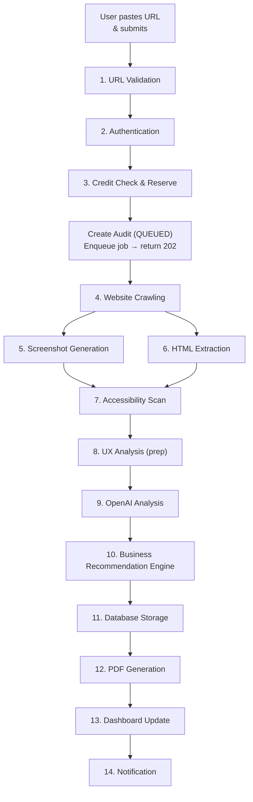

# Audient — AI Audit Workflow

**Status:** Draft
**Last updated:** 2026-07-27
**Owner:** Raghunath Kamlekar
**Related:** PRD, Technical Architecture Document, API.md, **AUDIT_API.md**, DATABASE.md, SCHEMA.md

This document describes the complete end-to-end workflow that runs when a user pastes a **website URL** and requests an audit, from validation through to the generated PDF report and user notification. It is technical documentation only — no code.

> **API entry:** `POST /ai/audit` (AUDIT_API.md) / `POST /audits` (API.md §2.1) → `{ auditId, status: "queued" }` → Progress Screen.

---

## Overview

The workflow spans two execution contexts:

1. **Synchronous (API request):** fast checks and setup — authentication, URL validation, credit reservation, and job creation. Returns immediately with a `QUEUED` audit.
2. **Asynchronous (background worker):** the heavy pipeline — crawling, screenshots, extraction, scanning, AI analysis, storage, PDF generation, and notification.

This split exists because a full URL audit can take up to ~8 minutes (PRD §8.1), far longer than a web request should block.

---

## Phase 1 — Synchronous Intake (API)

### Step 1 — URL Validation
**Purpose:** Ensure the submitted URL is well-formed, reachable in principle, and safe to fetch.

- **Format checks:** the value is a syntactically valid URL using an allowed scheme (`http`/`https` only).
- **Normalization:** trim whitespace, add scheme if missing, normalize casing of the host.
- **SSRF protection (critical):** reject URLs that resolve to private, internal, or reserved IP ranges (RFC1918, `localhost`, link-local, and the cloud metadata address `169.254.169.254`). DNS is resolved and the resolved IP re-checked to prevent DNS-rebinding.
- **Reachability sanity (optional):** a lightweight pre-check that the host exists.

**Outcome:** a clean, safe, canonical URL — or a `400 VALIDATION_ERROR` (malformed) / rejection (unsafe target).

### Step 2 — Authentication
**Purpose:** Confirm the requester is a valid, verified user and identify their account.

- The request carries a **Supabase Auth JWT**; the server verifies its signature and expiry.
- The user's identity (`sub`) is resolved to the application `User` record.
- **Email verification** is enforced — unverified users cannot run audits (anti-abuse), returning `403 EMAIL_NOT_VERIFIED`.
- The user's **tier** is loaded (Free/Pro/Enterprise).

**Outcome:** an authenticated, verified user with a known tier — or `401 UNAUTHENTICATED`.

### Step 3 — Credit Check & Reservation
**Purpose:** Ensure the user is entitled to a URL audit and has enough credits, then reserve them.

- **Tier gate:** URL audits require a **paid tier**. Free users are screenshot-only → `403 TIER_NOT_ALLOWED`.
- **Cost lookup:** the credit cost of a URL audit is read from plan configuration.
- **Balance check & reserve (transactional):** within a database transaction, the user's credit row is locked, the balance is checked, and the cost is **deducted up front**; a `AUDIT_DEDUCTION` ledger entry is written. Enterprise (`isUnlimited`) skips the balance check but still records usage.
- If the balance is insufficient → `422 INSUFFICIENT_CREDITS`.

**Outcome:** credits reserved and an **Audit** record created with status `QUEUED`; the audit job is **enqueued**; the API returns **`202 Accepted`** with the audit ID. The user's UI shows a processing state.

---

## Phase 2 — Asynchronous Pipeline (Background Worker)

A worker picks up the queued job and runs the following steps. Each step is time-bounded to honor the ≤8-minute budget; any hard failure marks the audit `FAILED` and triggers a **credit refund**.

### Step 4 — Website Crawling
**Purpose:** Map the site's user flow across its key pages (not just the landing page).

- A **headless browser (Playwright)** loads the target URL, executing JavaScript so modern/SPA sites render fully.
- The crawler discovers and follows **primary navigation links** to a **bounded set of key pages** (e.g., home + main linked pages), capped for cost and time.
- For each page it records the URL, page role (home, product, contact, etc. where inferable), and link structure.
- Robust handling for slow loads, redirects, and pages that block bots; unreachable targets fail gracefully.

**Outcome:** a set of rendered pages representing the core user flow, ready for capture and extraction.

### Step 5 — Screenshot Generation
**Purpose:** Capture what a real visitor actually sees, on multiple devices.

- For each crawled page, capture **full-page screenshots** at **desktop and mobile viewports**.
- Screenshots are the primary visual evidence for the multimodal AI and for annotated report visuals.
- Images are **normalized/resized** to model-friendly dimensions (controls AI token cost) and **uploaded to object storage**; only their keys/URLs move through the rest of the pipeline.

**Outcome:** desktop + mobile screenshots per key page, stored and referenced.

### Step 6 — HTML Extraction
**Purpose:** Capture the structural and textual content behind the visuals.

- Extract the rendered **DOM structure** and key elements: headings, buttons/CTAs, forms, links, navigation, and copy/text content.
- Extract metadata (title, meta description) and semantic structure (landmark regions, heading hierarchy).
- This structured content gives the AI **grounded, factual context** beyond pixels (e.g., actual CTA text, form fields), reducing hallucination.

**Outcome:** a structured representation of each page's content and elements.

### Step 7 — Accessibility Scan
**Purpose:** Obtain objective, standards-based accessibility measurements.

- Run an automated accessibility engine (**axe-core**) against each rendered page to detect **WCAG** violations (contrast, missing alt text, form labels, ARIA issues, keyboard/focus problems).
- Run **performance/page-speed** measurement (**Lighthouse / PageSpeed Insights**) for speed-related UX signals.
- These produce **measured facts**, so accessibility and speed findings are grounded in objective data rather than AI inference.

**Outcome:** a structured list of accessibility violations and performance metrics per page.

### Step 8 — UX Analysis (Evidence Assembly)
**Purpose:** Assemble all collected evidence into a single, structured bundle for the AI.

- Combine, per page: **screenshots** (desktop/mobile) + **HTML/structure** + **accessibility violations** + **performance metrics**.
- Attach **business context** (site type if inferable) and the **UX rubric** — Audient's nine evaluation dimensions (navigation, CTAs, visual hierarchy, mobile, copy, trust signals, page speed, accessibility, conversion flow) with severity definitions.
- Optionally capture lightweight **competitor** evidence (home page screenshots) when competitive analysis was requested.

**Outcome:** a complete, structured **evidence bundle** ready for AI analysis.

### Step 9 — OpenAI Analysis (Multimodal LLM)
**Purpose:** Have the AI "see" and reason over the evidence to produce structured findings.

- The evidence bundle (images + structured data) is sent to a **multimodal LLM** through a **provider-agnostic abstraction** (so the model can be swapped as price/quality change).
- A **versioned system prompt** encodes the UX rubric, severity definitions, and a **required JSON output schema**; the model is run in **structured-output mode**.
- The model returns, per finding: `category`, `severity`, `title`, `description`, `recommendation`, `businessImpact`, and an `evidence` reference (which screenshot/region), plus an overall **summary**.
- **Validation & repair:** the JSON is validated against the schema; invalid output triggers a bounded **repair retry**. Persistent failure marks the audit `FAILED` (credits refunded).

**Outcome:** validated, structured UX findings grounded in the captured evidence.

### Step 10 — Business Recommendation Engine
**Purpose:** Turn raw findings into a prioritized, business-oriented deliverable and compute scores.

- **Deterministic scoring (in code, not the LLM):** compute the **overall UX score (0–100)** and category sub-scores (**accessibility, conversion, mobile**, etc.) by applying weighted penalties per finding based on **severity** and category importance. Deterministic scoring guarantees the same findings always yield the same scores.
- **Prioritization:** assign/normalize a **priority** (High/Medium/Low) to each recommendation, factoring severity and likely impact, and surface **critical issues** prominently.
- **Business framing:** ensure each finding carries a plain-language **business impact** (conversion/revenue/trust), aligned to the PRD's "reframe UX as a growth lever" goal.
- **Competitive analysis:** if requested, assemble the structured comparison against competitor evidence.

**Outcome:** a scored, prioritized, business-framed set of recommendations plus the report's summary and competitive analysis.

### Step 11 — Database Storage
**Purpose:** Persist all results durably and consistently.

- Update the **Audit** record: status → `COMPLETED`, write `overallScore` and category sub-scores, `summary`, and `completedAt`.
- Insert **Recommendation** rows (one per finding) with category, severity, priority, description, recommendation, business impact, and screenshot reference.
- Create the **Report** record with the AI summary, category scores, competitive analysis, and the full structured payload (`reportJson`) used to render both the web report and PDF.
- Register stored **file assets** (screenshots/annotations) references.
- Screenshots and other binaries remain in **object storage**; only references are stored in the database.

**Outcome:** a complete, queryable audit result in the database.

### Step 12 — PDF Generation
**Purpose:** Produce the downloadable detailed report (paid tiers).

- The report's HTML template is populated from the stored `reportJson` (single source of truth → the PDF matches the on-screen report exactly).
- The HTML is rendered to **PDF via Playwright** (desktop + mobile annotated screenshots, scores, prioritized recommendations, business impact, competitive analysis).
- The generated PDF is uploaded to **object storage**; its location is saved on the **Report** record.
- PDF is generated for **Pro/Enterprise**; Free users receive only the on-screen summary.

**Outcome:** a stored PDF, downloadable via a short-lived signed URL.

### Step 13 — Dashboard Update
**Purpose:** Make results available in the user's app.

- The audit now appears as `COMPLETED` in the user's **history** with its score.
- The **results page** renders the scores, prioritized recommendations, and annotated screenshots, with a **PDF download** action (paid tiers).
- Status is reflected to the client via **status polling** and/or **Supabase Realtime** push (replacing polling for a live "processing → completed" transition).

**Outcome:** the user can view and interact with the completed audit.

### Step 14 — Notification
**Purpose:** Proactively tell the user the audit is ready.

- A **Notification** record (`AUDIT_COMPLETE`) is created, with metadata deep-linking to the finished report.
- If the user's **email notifications** preference is enabled, an email is also sent (respecting timezone/preferences from Settings).
- The in-app notification center shows the unread alert.

**Outcome:** the user is informed and can jump straight to their report.

---

## Failure Handling (applies throughout Phase 2)
- Any hard failure (unreachable site, crawl blocked, timeout, invalid AI output after repair) sets the audit to **`FAILED`** with an error reason.
- **Credits are automatically refunded** (a `REFUND` ledger entry) so users are never charged for audits that produced no value (PRD §8.5).
- A `AUDIT_FAILED` notification informs the user.
- Transient errors (temporary network/provider issues) use **retries with backoff** before a hard failure.

## Cost, Performance & Reliability Controls
- **Time budget:** each stage is time-bounded to keep total runtime within ~8 minutes (PRD §8.1).
- **Bounded crawl depth** and **image normalization** control AI/crawl cost.
- **Queue concurrency limits** cap simultaneous crawls/LLM calls (protecting spend and upstream providers).
- **Caching:** identical inputs (hash-based) can reuse recent analysis to avoid duplicate AI cost.
- **Observability:** per-stage timing, token usage, and model/provider are recorded for cost monitoring and prompt-quality iteration.

---

## Summary Table

| # | Step | Context | Key Technology | Output |
|---|------|---------|----------------|--------|
| 1 | URL Validation | API | URL/SSRF checks | Safe canonical URL |
| 2 | Authentication | API | Supabase Auth (JWT) | Verified user + tier |
| 3 | Credit Check & Reserve | API | Postgres transaction | Reserved credits, QUEUED audit |
| 4 | Website Crawling | Worker | Playwright | Rendered key pages |
| 5 | Screenshot Generation | Worker | Playwright | Desktop/mobile screenshots |
| 6 | HTML Extraction | Worker | DOM parsing | Structured content |
| 7 | Accessibility Scan | Worker | axe-core + Lighthouse | WCAG + performance data |
| 8 | UX Analysis (assembly) | Worker | Rubric + bundling | Evidence bundle |
| 9 | OpenAI Analysis | Worker | Multimodal LLM | Structured findings (JSON) |
| 10 | Business Recommendation Engine | Worker | Deterministic scoring | Scored, prioritized recommendations |
| 11 | Database Storage | Worker | PostgreSQL | Persisted audit/report/recommendations |
| 12 | PDF Generation | Worker | Playwright HTML→PDF | Stored PDF |
| 13 | Dashboard Update | App | Realtime/polling | Visible results |
| 14 | Notification | Worker/App | In-app + email | User informed |

---
