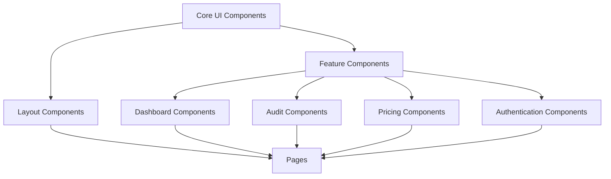

# Audient — React Component Architecture

**Status:** Draft
**Last updated:** 2026-07-27
**Owner:** Raghunath Kamlekar
**Related:** PRD, Technical Architecture Document (§10 UI Component Architecture), Figma Design System

This document defines Audient's React component architecture, derived from the Figma design system. Components are grouped into layers, from generic building blocks to feature-specific compositions. It is documentation only — no React code. "Props" are described conceptually (name — meaning), not as code.

---

## Architecture Principles

- **Layered composition:** Core UI → Layout → Feature/Domain → Page. Small pieces compose into larger ones.
- **Presentational vs. container:** presentational components take props and render; container components use hooks to fetch data and pass it down.
- **Design tokens:** all color, spacing, typography, and radius values come from the Figma design system's tokens (via Tailwind theme) — components never hardcode values.
- **Server vs. client components (Next.js):** default to Server Components for static/display UI; mark Client Components only where interactivity/state is required.
- **Accessibility by default:** built on accessible primitives (e.g., Radix/shadcn), preserving focus management, ARIA, and keyboard support.

### Component Layer Map

---

## 1. Core UI Components
Generic, reusable design-system primitives. No business logic. Reused everywhere.

### Button
- **Purpose:** Trigger actions (submit, upgrade, download, navigate).
- **Props:** `variant` (primary/secondary/ghost/destructive), `size` (sm/md/lg), `isLoading`, `disabled`, `iconLeft/iconRight`, `onClick`, `type`, `fullWidth`.
- **States:** default, hover, active, focus, disabled, loading.
- **Reusability:** Very high — used across every screen and other components (dialogs, forms, cards).
- **Accessibility:** Native `<button>` semantics; visible focus ring; `aria-busy` when loading; `aria-disabled` when disabled; loading spinner has an accessible label.

### Input / TextField
- **Purpose:** Single-line text entry (URL input, name, search).
- **Props:** `value`, `onChange`, `placeholder`, `label`, `type`, `error`, `helperText`, `disabled`, `iconLeft`, `required`.
- **States:** empty, focused, filled, error, disabled.
- **Reusability:** High — forms, auth, audit URL entry, settings.
- **Accessibility:** Associated `<label>` via `htmlFor`; error text linked with `aria-describedby`; `aria-invalid` on error; sufficient contrast.

### Select / Dropdown
- **Purpose:** Choose one option from a list (theme, PDF format, timezone).
- **Props:** `options`, `value`, `onChange`, `label`, `placeholder`, `disabled`, `error`.
- **States:** closed, open, selected, focused, disabled.
- **Reusability:** High — settings, filters.
- **Accessibility:** Keyboard navigable (arrow keys, Enter, Esc); `role="listbox"`/`option`; focus trapped while open; selected state announced.

### Card
- **Purpose:** Container that groups related content with consistent padding/elevation.
- **Props:** `header`, `footer`, `children`, `padding`, `interactive` (clickable), `onClick`.
- **States:** static, hover/elevated (if interactive).
- **Reusability:** Very high — the primary layout unit for the card-driven dashboard.
- **Accessibility:** If interactive, exposes button/link semantics and keyboard activation; otherwise a neutral region.

### Badge / Tag
- **Purpose:** Compact status/label indicator (tier, audit status).
- **Props:** `variant` (color/semantic), `children`, `icon`.
- **States:** static.
- **Reusability:** High — statuses, tiers, categories.
- **Accessibility:** Color is never the only signal — includes text/icon; adequate contrast.

### Modal / Dialog
- **Purpose:** Focused overlay for confirmations, upgrade prompts, forms.
- **Props:** `isOpen`, `onClose`, `title`, `children`, `footer`, `size`.
- **States:** closed, opening, open, closing.
- **Reusability:** High — upgrade dialog, confirmations, delete flows.
- **Accessibility:** `role="dialog"` + `aria-modal`; focus trapped within; focus returns to trigger on close; Esc closes; background inert.

### Toast / Notification Snackbar
- **Purpose:** Transient feedback (success, error, info).
- **Props:** `type`, `message`, `duration`, `action`.
- **States:** entering, visible, exiting.
- **Reusability:** High — global feedback for actions.
- **Accessibility:** `role="status"`/`aria-live="polite"` (or `assertive` for errors) so screen readers announce it.

### Skeleton / Loader
- **Purpose:** Indicate loading state for async content (audit results, lists).
- **Props:** `variant` (text/rect/circle), `count`, `width/height`.
- **States:** animating.
- **Reusability:** High — every async view.
- **Accessibility:** `aria-hidden` on decorative shapes; a live region announces "Loading…".

### Tooltip
- **Purpose:** Contextual hints (explain a score, a metric).
- **Props:** `content`, `side`, `children` (trigger).
- **States:** hidden, visible.
- **Reusability:** Medium-high.
- **Accessibility:** Keyboard- and hover-triggerable; `aria-describedby` links trigger to tooltip; not the sole source of critical info.

### Tabs
- **Purpose:** Switch between related views (e.g., report sections).
- **Props:** `tabs`, `activeTab`, `onChange`.
- **States:** active, inactive, focused.
- **Reusability:** Medium — report, settings.
- **Accessibility:** `role="tablist"/"tab"/"tabpanel"`; arrow-key navigation; active tab announced.

---

## 2. Layout Components
Structure the page shell and navigation. Compose Core UI components.

### AppShell / PageShell
- **Purpose:** Standard authenticated page wrapper (navbar + sidebar + content area).
- **Props:** `title`, `actions`, `children`, `sidebar`.
- **States:** sidebar expanded/collapsed (responsive).
- **Reusability:** High — wraps all dashboard pages.
- **Accessibility:** Landmark regions (`header`, `nav`, `main`); skip-to-content link; responsive without loss of function.

### Navbar / TopBar
- **Purpose:** Top navigation — logo, credit meter, notifications, user menu.
- **Props:** `user`, `credits`, `onOpenNotifications`.
- **States:** default, scrolled, mobile (condensed).
- **Reusability:** High — persistent across the app.
- **Accessibility:** `nav` landmark; keyboard-operable menus; current page indicated.

### Sidebar / NavigationMenu
- **Purpose:** Primary section navigation (Dashboard, Audits, History, Billing, Settings).
- **Props:** `items`, `activePath`, `collapsed`.
- **States:** expanded, collapsed, active-item.
- **Reusability:** High.
- **Accessibility:** `nav` landmark; `aria-current="page"` on the active link; keyboard navigable; collapsible via accessible control.

### Footer
- **Purpose:** Marketing/legal links, secondary navigation.
- **Props:** `links`.
- **States:** static.
- **Reusability:** Medium — mainly on marketing pages.
- **Accessibility:** `contentinfo` landmark; descriptive link text.

### Container / Grid
- **Purpose:** Responsive width constraints and grid layout for content.
- **Props:** `maxWidth`, `columns`, `gap`, `children`.
- **States:** responsive breakpoints.
- **Reusability:** Very high.
- **Accessibility:** Layout-only; preserves logical DOM/reading order.

---

## 3. Feature Components
Cross-cutting, reusable components tied to Audient concepts but shared across features.

### EmptyState
- **Purpose:** Friendly placeholder when there's no data (no audits yet).
- **Props:** `icon`, `title`, `description`, `action`.
- **States:** static.
- **Reusability:** High — history, notifications, any list.
- **Accessibility:** Meaningful heading; action is a proper button/link.

### CreditMeter
- **Purpose:** Display remaining credits (or "Unlimited") and reset date.
- **Props:** `balance`, `isUnlimited`, `nextResetAt`, `onTopUp`.
- **States:** normal, low-balance (warning), unlimited.
- **Reusability:** High — navbar, billing, audit screens.
- **Accessibility:** Not color-only for "low" state (icon/text); value readable by screen readers; `aria-live` on updates.

### SeverityBadge
- **Purpose:** Show issue severity (Critical/Major/Minor) consistently.
- **Props:** `severity`.
- **States:** static (variant by severity).
- **Reusability:** Very high — results, history, PDF template, recommendations.
- **Accessibility:** Text label plus color (red/amber/neutral); adequate contrast.

### ScoreCard / ScoreGauge
- **Purpose:** Prominently display a UX score (overall or category) 0–100.
- **Props:** `score`, `label`, `size`, `trend` (optional vs. previous).
- **States:** loading, loaded; color band by score range.
- **Reusability:** High — results page, history, dashboard, PDF.
- **Accessibility:** Numeric value in text (not only a gauge visual); `aria-label` describing score and label; color bands paired with the number.

### ConfirmDialog
- **Purpose:** Reusable confirmation for destructive/irreversible actions.
- **Props:** `title`, `message`, `confirmLabel`, `onConfirm`, `onCancel`, `isDestructive`.
- **States:** open/closed, confirming (loading).
- **Reusability:** High — delete audit, cancel subscription, delete account.
- **Accessibility:** Dialog semantics; default focus on the safest action; clear labeling of consequences.

### PdfDownloadButton
- **Purpose:** Request and trigger a report PDF download (paid tiers).
- **Props:** `auditId`, `disabled` (Free tier), `onUpgradeRequired`.
- **States:** idle, generating/fetching URL, ready, error, gated (Free).
- **Reusability:** Medium — results page, history.
- **Accessibility:** Button semantics; loading announced; gated state explains why it's disabled.

---

## 4. Dashboard Components
Compose Feature + Core components into the authenticated home/overview experience.

### DashboardOverview
- **Purpose:** At-a-glance summary — credits, recent audits, quick actions.
- **Props:** `user`, `credits`, `recentAudits`.
- **States:** loading, loaded, empty (new user).
- **Reusability:** Low (page-specific) but built from reusable parts.
- **Accessibility:** Logical heading structure; each summary widget independently understandable.

### StatCard
- **Purpose:** Show a single metric (audits run, average score, credits used).
- **Props:** `label`, `value`, `icon`, `trend`.
- **States:** loading, loaded.
- **Reusability:** High — dashboard, analytics.
- **Accessibility:** Label and value both in text; trend not conveyed by color alone.

### RecentAuditsList
- **Purpose:** Compact list of the user's latest audits with status and score.
- **Props:** `audits`, `onSelect`.
- **States:** loading, loaded, empty.
- **Reusability:** Medium — dashboard and history reuse the row component.
- **Accessibility:** List semantics; each row keyboard-activatable; status via badge (text+color).

### QuickAuditWidget
- **Purpose:** Start a new audit directly from the dashboard (URL or upload).
- **Props:** `tier`, `onSubmit`.
- **States:** idle, validating, submitting, tier-gated.
- **Reusability:** Medium — reuses AuditInput.
- **Accessibility:** Proper form labeling; gated messaging for Free/URL.

---

## 5. Audit Components
The core product flow — submission, progress, and results.

### AuditInput / AuditForm
- **Purpose:** Capture audit input — a URL (paid) or screenshot upload (all tiers).
- **Props:** `inputType`, `tier`, `onSubmit`, `competitors` (optional), `isSubmitting`.
- **States:** idle, validating (URL/SSRF/format), uploading (screenshot), submitting, error, tier-gated (URL for Free).
- **Reusability:** Medium — new-audit page and quick widget.
- **Accessibility:** Labeled fields; inline validation errors linked via `aria-describedby`; upload has keyboard-accessible file control and drag-drop alternative.

### FileUploader / ScreenshotUpload
- **Purpose:** Upload screenshots via drag-and-drop or file picker (to signed URL).
- **Props:** `accept`, `maxSize`, `maxFiles`, `onUploaded`, `files`.
- **States:** idle, dragging, uploading (progress), success, error (type/size).
- **Reusability:** Medium.
- **Accessibility:** Keyboard-operable picker (not drag-only); progress announced; clear error messaging.

### AuditProgress / ProcessingState
- **Purpose:** Show live progress while an audit runs (queued → processing → done).
- **Props:** `status`, `progress`, `estimatedSecondsRemaining`.
- **States:** queued, processing, completed, failed.
- **Reusability:** Medium — results page, history row.
- **Accessibility:** `aria-live` region announces status changes; progress via `role="progressbar"` with values; failure clearly communicated.

### AuditResults
- **Purpose:** Render a completed audit — scores + prioritized recommendations + screenshots.
- **Props:** `audit`, `recommendations`, `report`, `tier`.
- **States:** loading, loaded, partially-gated (Free summary vs. full).
- **Reusability:** Low (composite) but built from reusable parts.
- **Accessibility:** Clear heading hierarchy (overview → issues); each recommendation independently readable.

### RecommendationCard / IssueCard
- **Purpose:** Present a single UX finding — title, severity, description, fix, business impact, evidence.
- **Props:** `recommendation` (category, severity, priority, title, description, recommendation, businessImpact, screenshotRef).
- **States:** collapsed/expanded (detail), static.
- **Reusability:** Very high — results list, PDF template.
- **Accessibility:** Expandable via accessible disclosure (`aria-expanded`); severity via SeverityBadge; annotated image has descriptive alt text.

### AnnotatedScreenshot
- **Purpose:** Show a screenshot with highlighted regions marking issues.
- **Props:** `imageUrl`, `annotations`, `alt`.
- **States:** loading, loaded, error.
- **Reusability:** Medium — results, PDF.
- **Accessibility:** Meaningful `alt`; annotations described in text (not visual-only); adequate contrast for markers.

### CompetitiveAnalysisPanel
- **Purpose:** Compare the user's UX against competitors.
- **Props:** `analysis` (competitors, strengths, gaps, positioning).
- **States:** loading, loaded, not-requested.
- **Reusability:** Low.
- **Accessibility:** Comparison presented as structured, readable content (not image-only); tables have proper headers.

### AuditHistoryTable
- **Purpose:** Full, filterable/paginated list of past audits.
- **Props:** `audits`, `filters`, `onFilterChange`, `onSelect`, `pagination`.
- **States:** loading, loaded, empty, filtered.
- **Reusability:** Medium.
- **Accessibility:** Proper table semantics (headers, scope); sortable columns keyboard-operable and state-announced.

---

## 6. Pricing Components
Plans, upgrades, and billing presentation.

### PricingTable / PlanComparison
- **Purpose:** Present Free/Pro/Enterprise plans and features for comparison.
- **Props:** `plans`, `currentTier`, `billingInterval`, `onSelectPlan`.
- **States:** default, highlighted (recommended), current-plan, loading.
- **Reusability:** Medium — marketing page and in-app upgrade.
- **Accessibility:** Comparison as an accessible table/structured layout; current plan indicated in text; each plan's CTA clearly labeled.

### PlanCard
- **Purpose:** Single plan's price, features, and CTA.
- **Props:** `plan` (name, price, credits, features), `isCurrent`, `isRecommended`, `onSelect`.
- **States:** default, recommended, current, disabled.
- **Reusability:** High — composes the pricing table.
- **Accessibility:** Heading per plan; feature list as a real list; price readable by screen readers.

### BillingIntervalToggle
- **Purpose:** Switch between monthly and yearly pricing.
- **Props:** `value` (monthly/yearly), `onChange`, `yearlyDiscountLabel`.
- **States:** monthly, yearly.
- **Reusability:** Medium.
- **Accessibility:** Grouped toggle with labels; state announced; not color-only.

### UpgradeDialog / UpgradePrompt
- **Purpose:** Contextual prompt to upgrade at a gated action (URL audit, PDF, out of credits).
- **Props:** `reason`, `recommendedTier`, `onUpgrade`, `onDismiss`.
- **States:** open/closed, redirecting to checkout.
- **Reusability:** High — triggered from many gated points.
- **Accessibility:** Dialog semantics; explains *why* upgrade is needed; keyboard operable.

### CheckoutButton
- **Purpose:** Initiate Stripe Checkout for a selected plan/top-up.
- **Props:** `tier`, `billingInterval`, `isLoading`, `onClick`.
- **States:** idle, redirecting, error.
- **Reusability:** Medium.
- **Accessibility:** Button semantics; loading/redirect state announced.

### BillingSummary
- **Purpose:** Show current plan, renewal date, and manage-subscription entry.
- **Props:** `membership`, `onManage`.
- **States:** active, past-due, canceled.
- **Reusability:** Low — billing page.
- **Accessibility:** Status conveyed in text; clear labeling of renewal and actions.

---

## 7. Authentication Components
Sign-in, sign-up, and account access (built on Supabase Auth).

### AuthCard / AuthLayout
- **Purpose:** Centered container/branding wrapper for auth screens.
- **Props:** `title`, `subtitle`, `children`, `footer`.
- **States:** static.
- **Reusability:** High — sign-in, sign-up, reset.
- **Accessibility:** Single main heading; logical focus order; responsive.

### SignInForm
- **Purpose:** Email/password (and magic link) sign-in.
- **Props:** `onSubmit`, `isSubmitting`, `error`.
- **States:** idle, validating, submitting, error.
- **Reusability:** Low (specific) but reuses Core inputs/buttons.
- **Accessibility:** Labeled fields; errors linked via `aria-describedby`; submit reflects loading; password field toggle is accessible.

### SignUpForm
- **Purpose:** Create an account (email/password), triggering email verification.
- **Props:** `onSubmit`, `isSubmitting`, `error`.
- **States:** idle, validating, submitting, success (verify-email), error.
- **Reusability:** Low.
- **Accessibility:** Clear field labeling and requirements; verification instructions announced; inline validation.

### OAuthButtons / SocialLogin
- **Purpose:** Sign in with Google, Microsoft, or GitHub.
- **Props:** `providers`, `onProviderSelect`, `isLoading`.
- **States:** idle, redirecting (per provider), error.
- **Reusability:** High — sign-in and sign-up.
- **Accessibility:** Each provider button has an accessible name (e.g., "Continue with Google"); icons have text; keyboard operable.

### PasswordField
- **Purpose:** Password entry with show/hide toggle and strength hint.
- **Props:** `value`, `onChange`, `showStrength`, `error`.
- **States:** hidden, visible, valid, error.
- **Reusability:** Medium — sign-in, sign-up, reset.
- **Accessibility:** Toggle button labeled ("Show password") with `aria-pressed`; strength communicated in text, not color-only.

### EmailVerificationNotice
- **Purpose:** Prompt users to verify email before running audits.
- **Props:** `email`, `onResend`, `resendCooldown`.
- **States:** idle, resending, resent, cooldown.
- **Reusability:** Low.
- **Accessibility:** Clear instructions; resend state announced via live region.

### AuthGuard / ProtectedRoute
- **Purpose:** Gate authenticated routes; redirect unauthenticated users.
- **Props:** `children`, `fallback`, `requireVerified`.
- **States:** checking, authorized, unauthorized.
- **Reusability:** High — wraps all protected pages.
- **Accessibility:** Non-visual (logic); shows an accessible loading state while checking.

---

## Cross-Cutting Component Guidelines

- **Design tokens over hardcoding:** every component consumes Figma-derived tokens (color, spacing, type, radius) so rebrands are centralized.
- **Variant-driven, not duplicated:** one component with variants (e.g., Button, Badge, ScoreCard) rather than many near-duplicates.
- **Single source of truth for shared widgets:** SeverityBadge, ScoreCard, and RecommendationCard are reused across results, history, and the PDF template so the web and PDF stay visually identical.
- **State conventions:** every async component supports loading / empty / error / loaded states consistently (Skeleton, EmptyState, error UI).
- **Accessibility baseline:** semantic HTML, keyboard operability, visible focus, ARIA where needed, color never the sole signal, and WCAG-compliant contrast — fitting for a product that audits UX and accessibility.
- **Responsive by default:** all components work desktop-first but remain fully usable on mobile (PRD §6.5).

---

## Component-to-Category Summary

| Category | Representative Components |
|----------|--------------------------|
| Core UI | Button, Input, Select, Card, Badge, Modal, Toast, Skeleton, Tooltip, Tabs |
| Layout | AppShell, Navbar, Sidebar, Footer, Container/Grid |
| Feature | EmptyState, CreditMeter, SeverityBadge, ScoreCard, ConfirmDialog, PdfDownloadButton |
| Dashboard | DashboardOverview, StatCard, RecentAuditsList, QuickAuditWidget |
| Audit | AuditInput, FileUploader, AuditProgress, AuditResults, RecommendationCard, AnnotatedScreenshot, CompetitiveAnalysisPanel, AuditHistoryTable |
| Pricing | PricingTable, PlanCard, BillingIntervalToggle, UpgradeDialog, CheckoutButton, BillingSummary |
| Authentication | AuthCard, SignInForm, SignUpForm, OAuthButtons, PasswordField, EmailVerificationNotice, AuthGuard |

---
