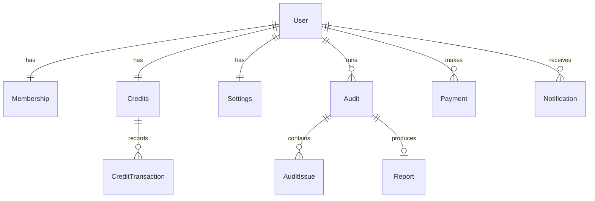

# Audient — Database Documentation

**Status:** Draft
**Last updated:** 2026-07-27
**Owner:** Raghunath Kamlekar
**Related:** Product Requirements Document (PRD), Technical Architecture Document

---

## 1. Database Overview

Audient's database is the system of record for everything that isn't a large binary artifact: user identity, membership and billing state, credit balances and usage history, audits and their findings, generated report metadata, notifications, and user preferences.

The data model is organized around a central **User**, with supporting entities that fall into four functional groups:

- **Identity & Access** — who the user is, their plan, and their preferences.
- **Usage & Metering** — credits and an auditable ledger of every credit movement.
- **Core Product** — audits, the individual UX issues they surface, and the reports they produce.
- **Billing & Engagement** — payments and notifications.

### 1.1 Design Goals
- **Integrity first:** billing, credits, and access control must be exact — no lost or double-counted credits, no cross-user data leakage.
- **Auditability:** every credit change and payment is traceable through an append-only history, not just a mutable balance.
- **Separation of concerns:** the database stores structured, relational data only; large binary files (screenshots, PDFs) live in object storage and are referenced here by key/URL.
- **Privacy by design:** each user's data is isolated, and account deletion cascades cleanly to satisfy data-deletion requirements.
- **Scalability:** the schema supports growth in audit volume through clear indexing and a normalized structure.

### 1.2 What Lives Elsewhere (Not in the Database)
- **Screenshots and generated PDF reports** — stored in object storage; the database keeps only their references.
- **Authentication credentials** (passwords, OAuth tokens) — managed by the authentication provider (Supabase Auth); the database stores only the linked identity reference.
- **Payment card data** — handled entirely by Stripe; the database stores only Stripe reference identifiers.

---

## 2. Database Technology Recommendation

### 2.1 Recommendation: PostgreSQL (managed via Supabase)
Audient should use **PostgreSQL** as its primary database, provisioned through **Supabase** (a managed Postgres platform that also provides authentication and storage).

### 2.2 Why a Relational Database
Audient's data is **highly relational and integrity-sensitive**:
- Users own memberships, credits, audits, payments, and settings — clear, structured relationships.
- Credit deduction and refunds require **transactional guarantees** (a screenshot audit must never partially deduct credits).
- Billing and access control benefit from **strong consistency** over eventual consistency.

A relational database with ACID transactions is the natural fit; a document/NoSQL store would push this relational integrity and transactional logic into the application layer, increasing risk.

### 2.3 Why PostgreSQL Specifically
- **ACID transactions** for safe, concurrent credit and billing operations.
- **Rich data types** — including native JSON support for semi-structured fields (e.g., competitive analysis results) without abandoning relational structure.
- **Row-Level Security (RLS)** — database-enforced per-user data isolation as a defense-in-depth layer.
- **Mature indexing** — supports the query patterns Audient needs (history views, status lookups, filtering by severity).
- **Open standard** — no vendor lock-in at the database engine level.

### 2.4 Why Supabase as the Host
- **Managed operations** — backups, scaling, and maintenance handled for a small team.
- **Integrated platform** — authentication and object storage in the same ecosystem, reducing moving parts and keeping identity close to application data.
- **Point-in-time recovery** and automated backups included.

### 2.5 Alternatives Considered
- **Neon** — an excellent managed Postgres alternative (serverless, branching); a strong option if the team prefers to decouple the database from auth/storage.
- **MongoDB / NoSQL** — not recommended; Audient's transactional, relational needs (credits, billing) are a poor fit for a document store.

---

## 3. List of Required Tables

The database is composed of the following core tables, grouped by function.

### 3.1 Identity & Access

**Users**
Central identity record. Stores profile basics (name, email), the linked authentication-provider reference, the user's role (standard user vs. administrator), and timestamps. Every other user-owned record references this table.

**Memberships**
The user's plan and subscription state. Holds the current tier (Free, Pro, Enterprise), subscription status (active, past-due, canceled, trialing), billing-provider references, and the current billing period end date. Separated from Users so billing state can evolve independently of identity.

**Settings**
Per-user preferences: notification preferences, product-update opt-in, locale, and timezone.

### 3.2 Usage & Metering

**Credits**
The user's credit account. Stores the current available balance, the monthly grant amount for their tier, and the date credits were last reset. One credit account per user.

**Credit Transactions (Ledger)**
An append-only history of every credit movement — monthly grants, per-audit deductions, refunds for failed audits, and purchased top-ups. Each entry records the type, the amount (positive or negative), the resulting balance, an optional link to the related audit, and a timestamp. This ledger makes credit usage fully auditable and disputes resolvable.

### 3.3 Core Product

**Audits**
The central work item. Each record represents one audit request and stores its input type (screenshot or URL), the source (URL or references to uploaded screenshots), lifecycle status (queued, processing, completed, failed), the overall UX score, the credit cost, a brief summary (shown to Free users), any error message, and timing details.

**Audit Issues**
The individual UX findings for an audit. Each issue records its category (one of the evaluated UX dimensions such as navigation, CTA, accessibility, etc.), severity (critical, major, minor), a title and description, a recommended fix, its business impact, and a reference to the annotated screenshot evidence. An audit has many issues.

**Reports**
Metadata for the detailed report produced by a completed audit (Pro/Enterprise). Stores the reference to the generated PDF in object storage, structured competitive-analysis data, and generation timestamp. One report per audit.

### 3.4 Billing & Engagement

**Payments**
A record of every financial transaction — subscription charges, credit top-up purchases, and refunds. Stores the type, status, amount, currency, any credits granted (for top-ups), and billing-provider reference identifiers. Serves as the financial audit trail.

**Notifications**
In-app and email notifications for the user — audit completed, audit failed, low credits, payment events, and system messages. Stores the type, title, message, read/unread state, optional metadata (e.g., the related audit), and timestamp.

### 3.5 Table Summary

| Table | Group | Purpose |
|-------|-------|---------|
| Users | Identity & Access | Central identity and profile |
| Memberships | Identity & Access | Plan tier & subscription state |
| Settings | Identity & Access | User preferences |
| Credits | Usage & Metering | Current credit balance & grant |
| Credit Transactions | Usage & Metering | Append-only ledger of credit movements |
| Audits | Core Product | Audit requests & results |
| Audit Issues | Core Product | Individual UX findings per audit |
| Reports | Core Product | Detailed report metadata & PDF reference |
| Payments | Billing & Engagement | Financial transaction history |
| Notifications | Billing & Engagement | User notifications |

---

## 4. Table Relationships

### 4.1 Relationship Summary
- A **User** has exactly **one Membership**, **one Credits account**, and **one Settings** record (one-to-one).
- A **User** has **many Audits**, **many Payments**, and **many Notifications** (one-to-many).
- A **Credits** account has **many Credit Transactions** (one-to-many).
- An **Audit** has **many Audit Issues** (one-to-many).
- An **Audit** produces **at most one Report** (one-to-one, optional).

### 4.2 Relationship Diagram

### 4.3 Referential Integrity
- Every user-owned record references the **Users** table via a foreign key.
- **Cascade deletion** is applied from the User downward: deleting a user removes their membership, credits (and ledger), audits (and issues and reports), payments, notifications, and settings. This supports the data-deletion (right-to-be-forgotten) requirement.
- Foreign keys enforce that no orphaned records exist (e.g., an audit issue always belongs to a valid audit).

### 4.4 Ownership & Isolation
- All data is anchored to a single owning user, forming a natural tenant boundary.
- The application always scopes queries to the authenticated user, and database-level Row-Level Security provides a second layer ensuring users can only access their own rows.

---

## 5. Security Considerations

### 5.1 Data Isolation (Multi-Tenancy)
- Every user-owned table is keyed to an owning user, and all access is scoped to the authenticated user.
- **Row-Level Security (RLS)** policies enforce, at the database level, that a user can only read or modify their own rows — defense-in-depth beyond application checks.

### 5.2 Sensitive Data Handling
- **No passwords or OAuth secrets** are stored in the database — authentication is delegated to Supabase Auth; only a linked identity reference is kept.
- **No payment card data** is stored — only Stripe reference identifiers. Card handling stays entirely within Stripe (PCI scope minimized).
- **No large binary content** is stored in the database — screenshots and PDFs live in private object storage, referenced by key.

### 5.3 Encryption
- **In transit:** all database connections use TLS.
- **At rest:** the managed database encrypts stored data at rest.

### 5.4 Access Control & Least Privilege
- Application services connect with **least-privilege credentials** scoped to what they need.
- **Service-role / administrative credentials** are server-side only and never exposed to client applications.
- Separate database credentials and instances per environment (development, staging, production).

### 5.5 Integrity & Auditability
- **Transactional operations** guarantee credit deductions, refunds, and billing updates are atomic and consistent under concurrency.
- The **credit ledger** and **payments** tables provide append-only, traceable histories for financial and usage auditing.
- Foreign-key constraints and controlled value sets (enumerated types for tiers, statuses, severities, categories) prevent invalid or inconsistent data.

### 5.6 Privacy & Compliance
- **Cascade deletion** enables complete removal of a user's data on request (GDPR right-to-erasure).
- **Data minimization:** only data necessary to deliver audits and billing is stored; audited-site content is referenced and subject to a retention policy rather than retained indefinitely.

---

## 6. Indexing Strategy

Indexes are applied to the columns most frequently used for lookups, filtering, and joins, balancing read performance against write overhead.

### 6.1 Primary & Unique Keys
- Every table has a **primary key** (unique identifier).
- **Unique constraints** on natural keys where appropriate — e.g., user email, one-to-one links (a user's single membership, credits, and settings records), and billing-provider reference identifiers.

### 6.2 Foreign-Key Indexes
- All **foreign-key columns are indexed** (e.g., the owning-user reference on audits, payments, notifications; the audit reference on issues and reports; the credit-account reference on ledger entries). This keeps joins and cascade operations efficient.

### 6.3 Query-Pattern Indexes
Targeted indexes support Audient's most common access patterns:
- **Audit history:** index on the audit's owning-user reference (and creation time) to list a user's audits quickly, newest first.
- **Worker & status queries:** index on audit status to efficiently find queued/processing audits.
- **Issue filtering:** index on the audit reference and on severity to render and filter findings.
- **Unread notifications:** composite index on the owning-user reference and read state to compute unread counts and lists.
- **Credit ledger:** index on the credit-account reference to retrieve a user's transaction history.

### 6.4 Principles
- **Index hot paths, not everything** — each index speeds reads but adds write cost and storage; only high-value query paths are indexed.
- **Composite indexes** are ordered to match common filter combinations (e.g., user + read state).
- **Review over time** — indexing is revisited as real query patterns emerge in production, guided by query performance monitoring.

---

## 7. Backup Strategy

### 7.1 Automated Backups
- The managed database (Supabase) performs **automated daily backups** of the entire database.
- Backups are stored securely by the platform, independent of the primary database instance.

### 7.2 Point-in-Time Recovery (PITR)
- **Point-in-time recovery** allows restoring the database to a specific moment (not just the last daily snapshot), minimizing potential data loss from accidental deletion or corruption.
- This is especially important for **financial and credit data**, where even small losses are unacceptable.

### 7.3 Environment Separation
- **Production, staging, and development** use separate database instances so backups and restores never cross environments.
- Restores are practiced against non-production environments to validate the backup process.

### 7.4 Retention & Recovery Objectives
- **Retention:** daily backups retained per a defined policy (e.g., rolling 7–30 days), with PITR covering the recent window.
- **Recovery Point Objective (RPO):** minimized via PITR (target: minutes of potential data loss).
- **Recovery Time Objective (RTO):** restore procedures documented so the database can be recovered promptly during an incident.

### 7.5 Object Storage (Complementary)
- Screenshots and PDF reports in object storage are covered by the storage provider's **durability guarantees** and **retention/lifecycle policies**, complementing the database backups so that references and their referenced files remain consistent.

### 7.6 Operational Practices
- **Monitor backup success** and alert on failures.
- **Test restores periodically** to ensure backups are valid and recoverable.
- **Document the recovery runbook** so any team member can execute a restore under pressure.

---

## 8. Architectural Review — Missing Tables for Production Readiness

The current 10-table model is well-structured and covers the core product. The following tables are recommended to make Audient **production-ready**, prioritized by importance. Each is justified to avoid adding unnecessary complexity — tables that would duplicate an external system (e.g., the Redis job queue, external product analytics) are intentionally **excluded** (see §8.7).

### 8.1 Processed Webhook Events (Critical)
- **Why it is needed:** Stripe delivers webhooks **at least once** — the same event can arrive multiple times. Without a record of processed events, a duplicate delivery could double-grant credits or double-record a payment. This table provides **idempotency**, a hard requirement for correct billing.
- **What it stores:** the Stripe event ID (unique), event type, processing status, a received timestamp, and optionally the raw payload for debugging.
- **How it relates:** standalone (not user-owned). Referenced by the webhook handler before it touches **Payments**, **Memberships**, or **Credits** — if the event ID already exists, the handler skips it.

### 8.2 Activity / Audit Log (Critical for security & compliance)
- **Why it is needed:** distinct from the *credit* ledger, a production SaaS needs a **security/activity trail** of sensitive actions — logins, account deletions, plan changes, admin actions, data exports. Required for security investigations, compliance (GDPR/SOC2 readiness), and support.
- **What it stores:** the acting user (nullable for system actions), action type, target entity (type + id), IP address / user agent, optional metadata, and a timestamp. Append-only.
- **How it relates:** references **Users** (the actor), but loosely references other entities by type + id rather than hard foreign keys, so it can log actions across any table without coupling.

### 8.3 Plans / Plan Catalog (High value)
- **Why it is needed:** plan definitions (price, monthly credit grant, feature flags, Stripe Price ID) are currently implied to be hardcoded. Storing them as **data** lets pricing, credit amounts, and feature gates change without a code deploy, and keeps **Memberships** referencing a single source of truth.
- **What it stores:** plan key (FREE/PRO/ENTERPRISE), display name, price, currency, monthly credit grant, `isUnlimited` flag, feature flags (JSON), Stripe Price ID, and active/inactive status.
- **How it relates:** **Memberships.tier** maps to a Plans row; **Credits.monthlyGrant** is derived from the plan. One Plan → many Memberships.

### 8.4 File Assets (High value for file lifecycle & privacy)
- **Why it is needed:** screenshots and PDFs are currently referenced ad hoc (arrays on Audits, a URL on Reports). A dedicated assets table makes **file lifecycle management** explicit — retention/expiry, orphan cleanup, and complete deletion on GDPR requests (knowing exactly which object-storage keys to remove).
- **What it stores:** the owning user, object-storage key/URL, file type (screenshot/annotation/PDF), MIME type, size, the related entity (audit/report), and created/expiry timestamps.
- **How it relates:** references **Users**, and links to **Audits** / **Reports**. Replaces scattered URL columns with a queryable, purgeable inventory of every stored file.

### 8.5 Report Feedback (Valuable — ties to PRD metrics)
- **Why it is needed:** the PRD lists **report satisfaction** and **% of users who acted on a recommendation** as key metrics. There is currently nowhere to capture this. This table closes the loop on audit quality and product-market fit.
- **What it stores:** the user, the related report (or recommendation), a rating (e.g., thumbs up/down or 1–5), an optional comment, an optional "did you act on this?" flag, and a timestamp.
- **How it relates:** references **Users** and **Reports** (optionally **Recommendations**). One report → many feedback entries over time.

### 8.6 Conditional / Future Tables (add only when the need arrives)
These are **not** needed for MVP but are the natural next additions — noted so the schema can evolve cleanly rather than being retrofitted.

- **Organizations & Organization Members** — *When multi-seat agencies/Enterprise arrive.* Today the model is single-user; agencies serving multiple clients with multiple team members will need an **Organization** entity owning membership/credits/audits, plus an **OrganizationMembers** join table (user ↔ org with a role). This is a meaningful shift, so it should be introduced deliberately when multi-seat is actually built — not prematurely.
- **API Keys** — *When API access ships* (a PRD future-monetization item). Stores hashed keys, scopes, and last-used timestamps, referencing **Users**/**Organizations**.

### 8.7 Deliberately Excluded (to avoid unnecessary complexity)
- **Job/queue tables** — handled by Redis/BullMQ; the **Audits.status** field already tracks audit lifecycle. A DB job table would duplicate the queue.
- **Product analytics / event stream** — better served by a dedicated analytics tool (e.g., PostHog) than by bloating the transactional database.
- **Session / token tables** — owned by Supabase Auth, not the application database.
- **Rate-limit counters** — belong in Redis (fast, ephemeral), not Postgres.

### 8.8 Updated Table Count
| Priority | Tables to Add |
|----------|---------------|
| Critical | Processed Webhook Events, Activity Log |
| High value | Plans, File Assets |
| Valuable | Report Feedback |
| Conditional / future | Organizations, Organization Members, API Keys |

Adding the **Critical** and **High value** tables brings the model to a production-ready baseline while keeping it lean; the conditional tables should follow the product (multi-seat, public API) rather than lead it.

---

## 9. Database Improvement Recommendations

A review of the complete database with targeted improvements across five areas. These refine the existing design rather than replace it.

### 9.1 Performance
- **Composite indexes matched to real queries:** beyond single-column indexes, add composite indexes for the most common filtered/sorted views — e.g., audits by `(userId, createdAt DESC)` for history, recommendations by `(reportId, severity)` for report rendering, and notifications by `(userId, read, createdAt)` for the unread feed.
- **Partial indexes for hot subsets:** index only the rows that matter — e.g., a partial index on audits where `status IN ('QUEUED','PROCESSING')` keeps worker lookups fast without indexing millions of completed audits.
- **Keep large JSON out of hot rows:** the `reportJson` payload can be large; ensure list/summary queries (audit history, report lists) select only scalar columns so Postgres doesn't load big JSON/TOAST data unnecessarily.
- **Connection pooling:** serverless (Vercel) opens many short-lived connections; route through **Supabase's pooler (PgBouncer, transaction mode)** to prevent connection exhaustion under load.
- **Denormalized counters where justified:** the `Credits.balance` and `Audit.overallScore` already avoid recomputation from child rows — continue this pattern for expensive aggregates (e.g., a cached unread-notification count) only where read frequency justifies it.
- **Pagination by keyset:** for history and ledger lists, use cursor/keyset pagination (on indexed `createdAt`/`id`) rather than large `OFFSET` scans.

### 9.2 Scalability
- **Time-based partitioning for high-growth tables:** the highest-volume tables — **Audits**, **Recommendations**, **Credit Transactions**, **Activity Log**, and **Notifications** — will dominate growth. Plan to **partition by time** (e.g., monthly) as volume grows, so queries and retention/pruning stay efficient.
- **Archival & retention tiers:** move old audits/reports and their large JSON to a cheaper archive (or cold storage) after a retention window; keep the transactional tables lean. This aligns with the PRD's data-minimization stance.
- **Object storage does the heavy lifting:** continue storing all binaries (screenshots, PDFs) in object storage — the database stays small and fast regardless of report volume.
- **Read replicas for reporting/analytics:** as internal dashboards grow, run heavy read/aggregate queries against a **read replica** so they don't compete with user-facing transactional load.
- **UUID key strategy:** UUIDs are good for non-enumerability but random ones can fragment indexes at very large scale; consider **time-ordered identifiers (e.g., UUIDv7)** for high-insert tables to improve index locality.
- **Stateless, horizontally scalable access:** the schema has no server-side session state, so app/workers scale horizontally without database redesign.

### 9.3 Security
- **Enforce Row-Level Security on every user-owned table:** RLS is mentioned as defense-in-depth — make it **mandatory and explicit** for every table containing `userId`, so a bug in the app layer can't leak cross-user data. This is especially important on Supabase, where the client can reach the database directly.
- **Separate the service role from user access:** background workers/webhooks use the Supabase **service role** (bypasses RLS) — restrict its use to trusted server code only, never the client bundle.
- **Column-level protection for sensitive fields:** treat Stripe identifiers and any PII with care — restrict which roles can read them, and avoid exposing them through client-facing views.
- **Immutable audit trails:** the **Credit Transactions**, **Payments**, and **Activity Log** tables should be **append-only** (no updates/deletes) at the policy level, preserving tamper-evident financial and security history.
- **Validation at the database boundary:** use `NOT NULL`, `CHECK` constraints (e.g., non-negative credit balance, score between 0–100), enums, and foreign keys so invalid data can't be persisted even if the app has a bug.
- **PII deletion vs. financial retention:** GDPR deletion must reconcile with the need to retain financial records — plan to **anonymize** a deleted user's payments (strip PII, keep amounts) rather than hard-delete, satisfying both requirements.

### 9.4 Future Growth
- **Design for multi-tenancy now, adopt later:** anticipate the **Organizations** model (agencies/Enterprise multi-seat) by keeping ownership logic centralized, so introducing an `organizationId` later is an additive migration rather than a rewrite.
- **Soft-delete where history matters:** a `deletedAt` (soft-delete) pattern on key entities preserves history and enables recovery/undo, while hard-delete remains available for GDPR erasure.
- **Schema versioning & migrations:** manage all changes through versioned migrations (Supabase migrations) with an **expand/contract** approach for zero-downtime deploys.
- **Extensible enums vs. lookup tables:** enums (tiers, categories, severities) are clean but require a migration to change; for vocabularies expected to grow (e.g., audit categories as the rubric evolves), consider a **lookup table** for flexibility.
- **Internationalization-ready:** currency is already stored per payment and locale per user — keep money as minor-unit integers with explicit currency to support multi-currency growth.
- **Feature flags & config as data:** the recommended **Plans** table (and future config tables) let the product evolve pricing/features without deploys.

### 9.5 Supabase Compatibility
- **Bridge `auth.users` to the app `Users` table via trigger:** use a Supabase **auth hook / database trigger** on new-auth-user creation to atomically seed the app `Users`, `Memberships` (Free), `Credits` (initial grant), and `Settings` rows — guaranteeing every authenticated user has complete application records.
- **Use `auth.uid()` in RLS policies:** write RLS policies against Supabase's `auth.uid()` so isolation is enforced consistently whether access comes via the API or the Supabase client.
- **Leverage Supabase Storage with signed URLs:** keep screenshots/PDFs in Supabase Storage private buckets; the **File Assets** table (recommended in §8.4) maps cleanly to storage object keys, with access via signed URLs.
- **Realtime for live audit status (optional):** Supabase **Realtime** can push audit status changes to the client, replacing polling for the "processing → completed" UX — a natural fit since the data already lives in Postgres.
- **Connect through the pooler for serverless:** use Supabase's pooled connection string for Vercel functions and workers to avoid exhausting Postgres connections.
- **Respect Supabase's schema conventions:** keep application tables in the `public` schema, avoid modifying the `auth` schema directly, and reference the Supabase user id as the identity link (never store credentials).
- **Migrations via Supabase-compatible tooling:** manage schema with Supabase migrations and test against a dedicated Supabase branch/staging project before production.

### 9.6 Summary of Highest-Impact Improvements
| Area | Highest-impact change |
|------|-----------------------|
| Performance | Composite + partial indexes matched to real query patterns; use the connection pooler |
| Scalability | Time-partition and archive the high-growth tables (Audits, Recommendations, ledger, logs) |
| Security | Make RLS mandatory on every user-owned table; keep financial/audit trails append-only |
| Future Growth | Centralize ownership to enable a later Organizations (multi-seat) model additively |
| Supabase | Seed app records via an auth trigger; enforce RLS with `auth.uid()`; pool connections |

---

## 10. CTO Review — Database vs. PRD

A review of the database against the PRD to catch gaps *before* build. These are **suggestions with rationale**, not rewrites. Items already raised in §8–§9 are referenced, not repeated.

### 10.1 Missing Relationships
- **Credit rollover is not modeled (PRD §9.3).** The PRD commits to "**plan credits reset monthly; purchased top-up credits roll over**." The **Credits** table has a single `balance`, which cannot distinguish plan credits (reset) from purchased credits (rollover). *Suggestion:* split into two tracked balances — e.g., `planCredits` (reset each cycle) and `purchasedCredits` (persist across resets) — and deduct from plan credits first. Without this, the monthly reset either wipes paid-for credits or fails to reset correctly.
- **Billing interval is missing for yearly plans (PRD §9.5, §10.4).** **Memberships**/**Plans** have no `billingInterval` (monthly vs. yearly). Yearly plans are an explicit roadmap item; add the field now (even if only `MONTHLY` is used at launch) so the enum/flow doesn't need retrofitting.
- **Competitor inputs aren't first-class (PRD §5.5).** Competitive analysis is stored only as JSON on **Reports**, but the PRD's chosen approach is *user-named competitors* — an **input** to the audit. *Suggestion:* store the submitted competitor URLs on the **Audit** (a small child table or array) so the input is captured, reproducible, and re-runnable, separate from the JSON result.
- **Report feedback has no home (PRD §2.4).** "Report satisfaction" and "% who acted on a recommendation" are named KPIs with nowhere to land — see the **Report Feedback** table in §8.5.

### 10.2 Duplicate Data
- **Recommendations are stored up to four times.** Findings appear as (a) **Recommendation** rows, (b) `Reports.recommendations` JSON, (c) `Reports.criticalIssues` JSON, and (d) inside `Reports.reportJson`. This is the biggest redundancy risk — copies can diverge. *Suggestion:* make **Recommendation rows the single source of truth**; treat `reportJson` purely as an immutable render snapshot; and **drop** the separate `recommendations`/`criticalIssues` JSON columns (derive "critical issues" by querying `severity = CRITICAL`).
- **Scores are stored in three places.** `overallScore` lives on both **Audits** and **Reports**, and category scores live on **Audits**, in `Reports.categoryScores`, *and* are derivable from **Recommendations**. *Suggestion:* pick one source of truth — keep live scores on **Audits** for fast history/list views, and treat the copies on **Reports** explicitly as a *frozen snapshot* (document this intent so no code tries to "sync" them).

### 10.3 Normalization Issues
- **Repeating group on Audits.** `Audit.screenshotUrls` as an array is a repeating group (breaks 1NF) and makes per-file lifecycle/retention hard. *Suggestion:* move to the **File Assets** table (§8.4), one row per file. This also cleanly supports the PRD's multi-screenshot uploads and data-deletion needs.
- **Growable vocab locked in enums.** The audit **category** vocabulary (PRD §5.1) may expand as the rubric evolves; an enum requires a migration each time. *Suggestion:* consider a small **lookup table** for categories (per §9.4) if you expect them to change.
- **Score integrity.** Ensure scores are constrained to 0–100 and severities/priorities to their allowed sets at the DB boundary (per §9.3) so the PRD's scoring model can't be violated by a bug.

### 10.4 Scalability (PRD §8.4: thousands of users, hundreds of concurrent audits)
- Largely addressed in §9.2. The PRD-specific reinforcement: **Audits** and **Recommendations** are the volume drivers (every audit spawns many recommendations) — prioritize their **indexing and time-partitioning** first, and keep the large `reportJson` off list/history queries.
- **Credit deduction under concurrency** (PRD credit model) must use transactional row-locking (already in Technical Architecture §8.4) — call this out as a hard requirement, since it's the most contention-prone write path.

### 10.5 Security (PRD §8.2–§8.3)
- Well covered overall (§5, §9.3). Two PRD-specific additions:
  - **Audited-site content retention (PRD §8.2 data deletion, data minimization):** define an explicit **TTL/retention policy** for screenshots and captured site content (via **File Assets**), not just deletion-on-request — the PRD leans on data minimization.
  - **Financial retention vs. erasure:** GDPR deletion must not destroy required financial records — **anonymize Payments** rather than hard-delete (per §9.3).

### 10.6 Future Features (PRD §9.5, §10.4)
- **White-label / branded reports (agency):** no home for branding today. *Suggestion:* plan a small **branding** concept (logo, colors, company name) on the future **Organization** (or user) so agency PDFs can be branded — a Phase-2 addition, but design ownership centrally now so it slots in.
- **Agency multi-client (PRD §4.2, §10.4):** agencies audit on behalf of many clients and will want audits **grouped by client**. Today audits belong only to a user. *Suggestion:* anticipate an optional **client/project grouping** for audits (arriving with the Organizations model in §8.6) so agency history isn't one flat list.
- **API access (PRD §9.5):** covered by **API Keys** in §8.6.
- **Yearly plans:** see the `billingInterval` gap in §10.1.

### 10.7 Priority of Fixes
| Priority | Fix | PRD driver |
|----------|-----|-----------|
| Do before build | Split plan vs. purchased credits (rollover) | §9.3 |
| Do before build | Designate single source of truth for recommendations & scores | §5.3–§5.4 |
| Do before build | Add `billingInterval` to Plans/Memberships | §9.5 |
| Soon | Move screenshots to File Assets (1NF + retention) | §5.2, §8.2 |
| Soon | Add Report Feedback (KPIs) | §2.4 |
| Phase 2 | Organizations, client grouping, branding, API keys | §4.2, §9.5, §10.4 |

**Bottom line:** the model is fundamentally sound. The must-fix items are the **credit rollover split** and **eliminating recommendation/score duplication** — both are correctness issues tied directly to committed PRD behavior. The rest can follow the roadmap.

---
