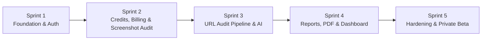

# Audient — Development Roadmap

**Status:** Draft
**Last updated:** 2026-07-27
**Owner:** Raghunath Kamlekar
**Related:** PRD (§10 Roadmap), TECHNICAL_ARCHITECTURE.md, DATABASE.md, API.md, AI_WORKFLOW.md

A milestone-based, sprint-driven roadmap taking Audient from foundation to public launch. Sprints are **2 weeks** each; the plan aligns with the PRD targets (MVP ~Month 1, private beta Month 1–2, public launch ~Month 3). Estimated completions assume a small focused team and are relative to a **Week 0** start.

---

## Roadmap at a Glance

| Sprint | Theme | Est. Completion | PRD Milestone |
|--------|-------|-----------------|---------------|
| 1 | Foundation & Authentication | End of Week 2 | MVP build |
| 2 | Credits, Billing & Screenshot Audit | End of Week 4 | MVP (Free flow) |
| 3 | URL Audit Pipeline & AI Analysis | End of Week 6 | MVP (Pro flow) |
| 4 | Reports, PDF & Dashboard | End of Week 8 | MVP complete |
| 5 | Hardening, Security & Private Beta | End of Week 10 | Private beta → launch prep |

---

## Sprint 1 — Foundation & Authentication
**Duration:** Weeks 1–2 · **Estimated Completion:** End of Week 2

### Objectives
- Establish the project foundation, tooling, and core infrastructure.
- Ship working authentication and the app shell so users can sign up and log in.

### Tasks
- Initialize the Next.js + TypeScript project with the folder structure (FOLDER_STRUCTURE.md).
- Configure Tailwind + shadcn/ui and wire in the Figma **design tokens**.
- Set up the Supabase project (dev/staging/prod) and database connection.
- Implement the initial database schema (Users, Membership, Credits, Settings) with migrations and **RLS policies**.
- Integrate **Supabase Auth** — Google, Apple, Microsoft OAuth (per Figma / SCREEN_MAPPING; SSO-only for v1).
- Adopt plan catalog from **`docs/PRICING.md`** / `src/config/plans.ts` (Free 300 / Pro $29·1,000 / Business $99·10,000; **1 guest screenshot audit**).
- Build the auth-user → app-user provisioning (seed Membership FREE, Credits, Settings on sign-up).
- Build core layout components (AppShell, Navbar, Sidebar) and auth screens.
- Set up CI/CD (GitHub Actions) and Vercel deployment; add `.env.example`.

### Deliverables
- Deployed app skeleton with working sign-up/login (all providers) and email verification.
- Base schema live with RLS; new users auto-provisioned with Free tier + credits.
- Design-system foundation (tokens, primitives) and app shell.

### Dependencies
- Figma design system/tokens available.
- Supabase and Vercel accounts provisioned.

---

## Sprint 2 — Credits, Billing & Screenshot Audit (Free Flow)
**Duration:** Weeks 3–4 · **Estimated Completion:** End of Week 4

### Objectives
- Deliver the Free-tier end-to-end value: upload a screenshot → get a brief summary.
- Stand up the credit system and Stripe billing foundation.

### Tasks
- Implement the **credit system**: balance, monthly grant, transactional deduction/refund, ledger.
- Build **file upload** via signed URLs to object storage (screenshot input).
- Implement the **screenshot audit** path: submit → AI analysis → brief summary (async job + worker skeleton).
- Set up the **background job queue** (BullMQ + Redis) and worker host.
- Integrate **Stripe**: products/prices, Checkout for Free→Pro upgrade, Billing Portal, and webhook receiver with idempotency.
- Build credit UI (CreditMeter) and basic new-audit + result-summary screens.
- Implement API endpoints: `/uploads/sign`, `/audits` (screenshot), `/credits`, `/billing/*`.

### Deliverables
- Working Free flow: upload screenshot → brief on-screen summary, with credits deducted.
- Functional Stripe upgrade path (Free → Pro) driven by verified webhooks.
- Credit ledger and enforcement operational.

### Dependencies
- Sprint 1 (auth, schema, app shell).
- Stripe account + AI provider API key.
- Job queue infrastructure (Redis) provisioned.

---

## Sprint 3 — URL Audit Pipeline & AI Analysis (Pro Flow)
**Duration:** Weeks 5–6 · **Estimated Completion:** End of Week 6

### Objectives
- Deliver the paid **URL audit**: full crawl + AI analysis producing structured findings and scores.
- Complete the core AI workflow (AI_WORKFLOW.md).

### Tasks
- Implement **URL validation + SSRF protection**.
- Build the **crawling + screenshot** pipeline (Playwright: desktop/mobile, multi-page).
- Add **HTML extraction** and **accessibility/performance scan** (axe-core + Lighthouse).
- Implement the **AI analysis** step (provider-agnostic client, structured JSON output, validation/repair).
- Build the **Business Recommendation Engine**: deterministic scoring (overall + category sub-scores) and prioritization.
- Persist results: Audits, Recommendations, Reports; register file assets.
- Enforce **tier gating** (URL audits Pro/Enterprise) and credit costs per input type.
- Implement API: `/audits` (URL), `/audits/{id}/status`, `/audits/{id}/recommendations`.
- Add prompt-injection safeguards and per-stage timeouts/refund-on-failure.

### Deliverables
- End-to-end URL audit producing scored, structured recommendations stored in the DB.
- Async processing with status polling and failure handling (credit refunds).
- AI pipeline meeting the ≤8-minute budget on typical sites.

### Dependencies
- Sprint 2 (credits, queue, workers, AI key).
- Worker host capable of running Playwright/Chromium.

---

## Sprint 4 — Reports, PDF & Dashboard
**Duration:** Weeks 7–8 · **Estimated Completion:** End of Week 8

### Objectives
- Turn audit results into the polished, presentable deliverable: results UI + downloadable PDF.
- Complete the dashboard, history, and notifications.

### Tasks
- Build the **audit results page**: ScoreCards, prioritized RecommendationCards, AnnotatedScreenshots (COMPONENT_ARCHITECTURE.md).
- Implement **PDF generation** (Playwright HTML→PDF from `reportJson`) + signed-URL download (Pro/Enterprise).
- Build **audit history** (list, filters, re-download) and the **dashboard overview**.
- Implement **notifications** (in-app + email): audit complete/failed, low credits, payment.
- Build **settings** and **billing** management screens.
- Add **competitive analysis** rendering in reports.
- Ensure full **mobile-first responsiveness** across all screens.
- Implement API: report/PDF endpoints, notifications, settings, payments history.

### Deliverables
- Complete results experience with downloadable PDF matching the on-screen report.
- Working dashboard, history, notifications, settings, and billing management.
- MVP feature-complete end to end (Free summary + Pro URL audit + PDF + billing).

### Dependencies
- Sprint 3 (audit results and stored data to render).
- Finalized report design/template from Figma.

---

## Sprint 5 — Hardening, Security & Private Beta
**Duration:** Weeks 9–10 · **Estimated Completion:** End of Week 10

### Objectives
- Harden security, performance, and reliability; validate quality with real users.
- Launch to a private beta group and prepare for public launch.

### Tasks
- Full **security pass** (SECURITY.md): RLS audit, rate limiting, input validation, SSRF, webhook idempotency, secrets review.
- Add the production-readiness tables (Processed Webhook Events, Activity Log) and retention policies.
- **Testing:** unit (services/utils), integration (API), and e2e (key flows); fix critical bugs.
- **Observability:** Sentry, uptime monitoring, logging, and cost/token dashboards.
- **Performance tuning:** indexes, caching, queue concurrency; verify 90s/8min budgets and 99.9% uptime readiness.
- **AI quality validation:** review audit accuracy with real sites; refine prompts/rubric.
- Onboard a **private beta** group; collect and triage feedback.
- Prepare marketing/landing site, SEO content, and onboarding polish for public launch.

### Deliverables
- Security-hardened, tested, observable production system.
- Private beta live with feedback loop; validated audit quality.
- Launch-ready product and marketing foundation (→ public launch ~Month 3 per PRD).

### Dependencies
- Sprint 4 (feature-complete MVP).
- Beta user group recruited; monitoring/analytics tools provisioned.

---

## Post-Roadmap (Phase 2 — Reference)
Aligned with PRD §10.4, after public launch:
- Yearly plans, credit top-up packs, referral incentives.
- Agency features: Organizations/multi-seat, client grouping, white-label/branded reports.
- API access (API keys), auto-detected competitive analysis, deeper analytics.

---

## Assumptions & Notes
- **Sprint length:** 2 weeks; 5 sprints ≈ 10 weeks to private beta, with public launch shortly after (~Month 3).
- **Parallelization:** frontend and pipeline work can overlap within sprints with a small team; the sequence reflects dependency order, not strict serialization.
- **Scope control:** anything not required for the MVP flows (Free summary + Pro URL audit + PDF + billing) is deferred to Phase 2 to protect the timeline.
- **Estimates** are targets; validate and adjust after Sprint 1 based on actual velocity.
