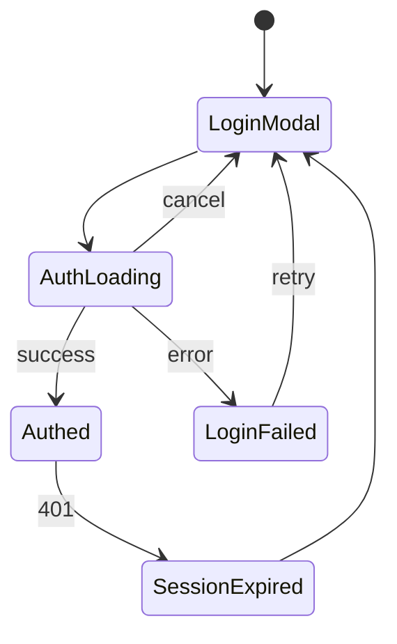
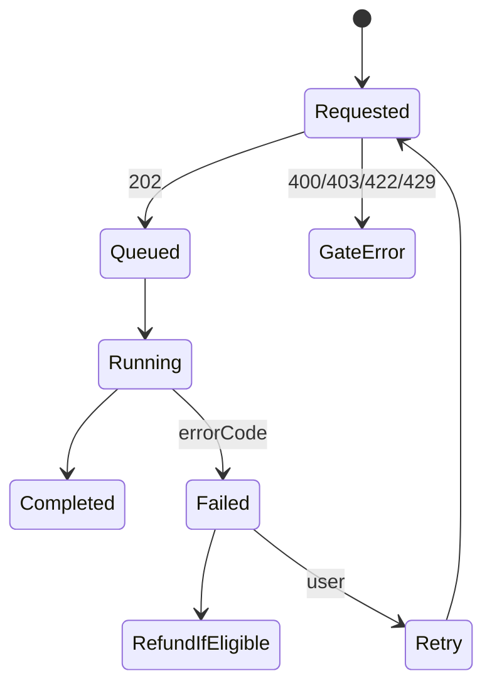
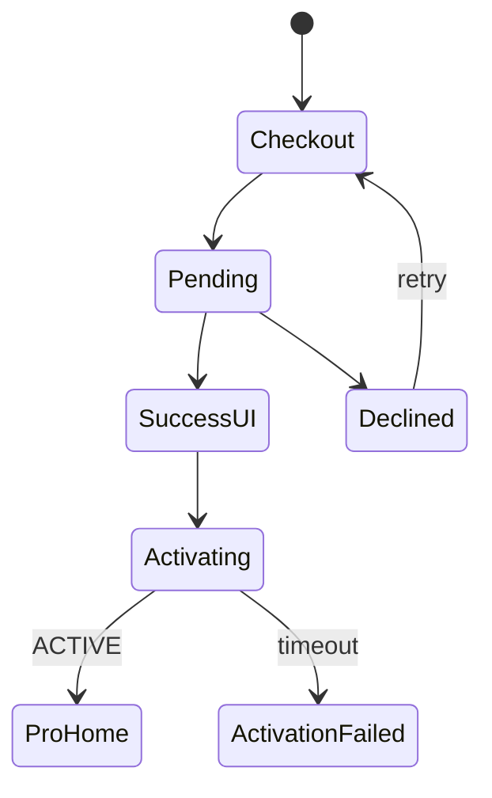
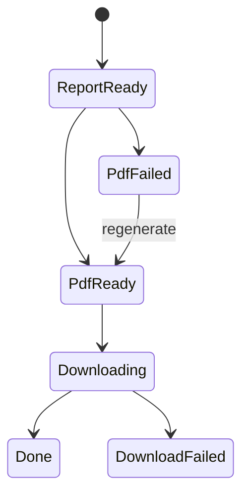

# Audient — Error Handling

**Status:** Draft (production-ready specification)  
**Last updated:** 2026-07-30  
**Owner:** Raghunath Kamlekar  
**Related:** BUSINESS_RULES.md, VALIDATION_RULES.md, STATE_MANAGEMENT.md, API_MAPPING.md, SCREEN_MAPPING.md, COMPONENT_BEHAVIOR.md, SCHEMA.md, DATABASE.md, PRICING.md, SECURITY.md, DESIGN_TOKENS.md, CURSOR_RULES.md, prd.md

**Audience:** Frontend · Backend · QA · Product · DevOps  
**Format:** Markdown only — **no application code**.

**Source of truth:** uploaded screens + SCREEN_MAPPING / BUSINESS_RULES failure taxonomy & refunds.  
**Do not invent** features. **OUT OF SCOPE:** password errors, Enterprise team invite/role errors, custom email OTP APIs, History search errors.

> `DESIGN_SYSTEM.md` is not in-repo — use DESIGN_TOKENS (Error `#DC2626`). Canonical `STATE_MANAGEMENT.md` is at repo root.

---

## Conventions

| Topic | Rule |
|-------|------|
| User copy | Friendly; no stacks; icon + text (not color alone) |
| Credits | Ledger authoritative; refund only per §17 / BR-ERR |
| Ownership | Cross-user → **404** |
| PCI | Never log PAN/CVV |
| A11y | Assertive for blocking errors; polite toasts; focus CTA / first field |
| WCAG | **2.1 AA** acceptance (CURSOR_RULES) |

### Severity: Critical · High · Medium · Low  
### Priority: P0 · P1 · P2  
### Surfaces: Inline · Toast · Banner · Modal · Full page (M03)

---

## 1. Error Catalogue

| Prefix | Domain |
|--------|--------|
| ERR-AUTH-* | Authentication |
| ERR-URL-* | Website validation / crawl |
| ERR-AUDIT-* | Audit / AI / worker |
| ERR-CRED-* | Credits |
| ERR-PDF-* | PDF |
| ERR-BILL-* | Billing |
| ERR-DB-* | Database |
| ERR-API-* | HTTP |
| ERR-NET-* | Network |
| ERR-FILE-* | Uploads |
| ERR-NOTIF-* | Notifications |
| ERR-SET-* | Settings |
| ERR-OOS-* | Out of scope |

---

## 2. Authentication Errors

### ERR-AUTH-001 — Google Login Failed

| Field | Detail |
|-------|--------|
| **Error ID** | ERR-AUTH-001 |
| **Error Name** | Google Login Failed |
| **Severity** | High |
| **Priority** | P0 |
| **Category** | Authentication |
| **Description** | Google SSO did not establish a session |
| **Possible Causes** | Invalid/expired googleToken; Google outage; bad OAuth config; network |
| **Trigger** | POST /auth/google or GIS error |
| **Current Screen** | SCREEN-003 |
| **Component** | BTN-003, MDL-001 |
| **API Endpoint** | POST /auth/google |
| **HTTP Status Code** | 401/500 |
| **Database Impact** | None |
| **Business Rule Reference** | BR-AUTH-001 |
| **State Reference** | AUTH-STATE-008 |
| **Validation Reference** | VAL-AUTH-001 |
| **User Facing Message** | Sign-in failed. Please try again. |
| **Developer Message** | Verify Google JWT iss/aud/exp/signature; check client IDs |
| **Support Message** | Confirm Google Cloud OAuth client and Supabase/Google provider config |
| **Illustration/Icon Recommendation** | Error icon |
| **Toast / Banner / Modal / Inline** | Inline Alert in modal |
| **Primary CTA** | Try Google again |
| **Secondary CTA** | Close / other provider |
| **Retry Allowed (Yes/No)** | Yes |
| **Retry Limit** | 3 / 15 min |
| **Automatic Retry** | No |
| **Retry Delay** | User-initiated |
| **Credit Refund Required** | No |
| **Notification Required** | No |
| **Audit Status** | N/A |
| **Logging Level** | Warn |
| **Analytics Event** | login_failed{provider:google} |
| **Accessibility Behaviour** | Announce User Facing Message; icon+text; focus Primary CTA; Esc per modal rules (assertive) |
| **QA Test Cases** | TC-ERR-AUTH-001 bad token; TC-ERR-AUTH-002 provider 5xx |
| **Developer Notes** | Never log full ID token; rate-limit /auth/* |

### ERR-AUTH-002 — Apple Login Failed

| Field | Detail |
|-------|--------|
| **Error ID** | ERR-AUTH-002 |
| **Error Name** | Apple Login Failed |
| **Severity** | High |
| **Priority** | P0 |
| **Category** | Authentication |
| **Description** | Apple Sign In failed |
| **Possible Causes** | Invalid appleToken; cancel; Apple outage; sparse name/relay |
| **Trigger** | POST /auth/apple fails |
| **Current Screen** | SCREEN-003 |
| **Component** | BTN-004, MDL-001 |
| **API Endpoint** | POST /auth/apple |
| **HTTP Status Code** | 401/500 |
| **Database Impact** | None |
| **Business Rule Reference** | BR-AUTH-001 |
| **State Reference** | AUTH-STATE-008 |
| **Validation Reference** | VAL-AUTH-002 |
| **User Facing Message** | Sign-in failed. Please try again. |
| **Developer Message** | Verify Apple identity token; tolerate private relay email |
| **Support Message** | Check Apple Services ID / key |
| **Illustration/Icon Recommendation** | Error icon |
| **Toast / Banner / Modal / Inline** | Inline Alert |
| **Primary CTA** | Try Apple again |
| **Secondary CTA** | Other provider |
| **Retry Allowed (Yes/No)** | Yes |
| **Retry Limit** | 3 / 15 min |
| **Automatic Retry** | No |
| **Retry Delay** | User-initiated |
| **Credit Refund Required** | No |
| **Notification Required** | No |
| **Audit Status** | N/A |
| **Logging Level** | Warn |
| **Analytics Event** | login_failed{provider:apple} |
| **Accessibility Behaviour** | Announce User Facing Message; icon+text; focus Primary CTA; Esc per modal rules (assertive) |
| **QA Test Cases** | TC-ERR-AUTH-003 |
| **Developer Notes** | Name may be empty |

### ERR-AUTH-003 — Microsoft Login Failed

| Field | Detail |
|-------|--------|
| **Error ID** | ERR-AUTH-003 |
| **Error Name** | Microsoft Login Failed |
| **Severity** | High |
| **Priority** | P0 |
| **Category** | Authentication |
| **Description** | Microsoft/Azure SSO failed |
| **Possible Causes** | Invalid token; tenant mismatch; Azure outage |
| **Trigger** | POST /auth/microsoft fails |
| **Current Screen** | SCREEN-003 |
| **Component** | BTN-005, MDL-001 |
| **API Endpoint** | POST /auth/microsoft |
| **HTTP Status Code** | 401/500 |
| **Database Impact** | None |
| **Business Rule Reference** | BR-AUTH-001 |
| **State Reference** | AUTH-STATE-008 |
| **Validation Reference** | VAL-AUTH-003 |
| **User Facing Message** | Sign-in failed. Please try again. |
| **Developer Message** | Validate aud/issuer/tenant |
| **Support Message** | Check Azure app registration |
| **Illustration/Icon Recommendation** | Error icon |
| **Toast / Banner / Modal / Inline** | Inline Alert |
| **Primary CTA** | Try Microsoft again |
| **Secondary CTA** | Other provider |
| **Retry Allowed (Yes/No)** | Yes |
| **Retry Limit** | 3 / 15 min |
| **Automatic Retry** | No |
| **Retry Delay** | User-initiated |
| **Credit Refund Required** | No |
| **Notification Required** | No |
| **Audit Status** | N/A |
| **Logging Level** | Warn |
| **Analytics Event** | login_failed{provider:microsoft} |
| **Accessibility Behaviour** | Announce User Facing Message; icon+text; focus Primary CTA; Esc per modal rules (assertive) |
| **QA Test Cases** | TC-ERR-AUTH-004 |
| **Developer Notes** | SDK provider id may be azure |

### ERR-AUTH-004 — Cancelled Login

| Field | Detail |
|-------|--------|
| **Error ID** | ERR-AUTH-004 |
| **Error Name** | Cancelled Login |
| **Severity** | Low |
| **Priority** | P2 |
| **Category** | Authentication |
| **Description** | User dismissed OAuth consent |
| **Possible Causes** | Closed popup/consent |
| **Trigger** | OAuth cancel |
| **Current Screen** | SCREEN-003 |
| **Component** | MDL-001 |
| **API Endpoint** | — |
| **HTTP Status Code** | — |
| **Database Impact** | None |
| **Business Rule Reference** | BR-AUTH-001 |
| **State Reference** | AUTH-STATE-008 |
| **Validation Reference** | — |
| **User Facing Message** | — (soft; optional none) |
| **Developer Message** | Non-error cancel path |
| **Support Message** | N/A |
| **Illustration/Icon Recommendation** | — |
| **Toast / Banner / Modal / Inline** | None |
| **Primary CTA** | Login again |
| **Secondary CTA** | Continue as guest |
| **Retry Allowed (Yes/No)** | Yes |
| **Retry Limit** | Unlimited |
| **Automatic Retry** | No |
| **Retry Delay** | — |
| **Credit Refund Required** | No |
| **Notification Required** | No |
| **Audit Status** | N/A |
| **Logging Level** | Info |
| **Analytics Event** | login_failed{reason:cancelled} |
| **Accessibility Behaviour** | Do not assertive-spam |
| **QA Test Cases** | TC-ERR-AUTH-005 |
| **Developer Notes** | Soft dismiss |

### ERR-AUTH-005 — Expired Token

| Field | Detail |
|-------|--------|
| **Error ID** | ERR-AUTH-005 |
| **Error Name** | Expired Token |
| **Severity** | High |
| **Priority** | P0 |
| **Category** | Authentication |
| **Description** | Access JWT expired; refresh failed |
| **Possible Causes** | Idle timeout; revoked refresh; clock skew |
| **Trigger** | API 401 |
| **Current Screen** | Any authed |
| **Component** | App shell |
| **API Endpoint** | Any |
| **HTTP Status Code** | 401 |
| **Database Impact** | Session cleared |
| **Business Rule Reference** | BR-AUTH-003 |
| **State Reference** | APP-STATE-006 |
| **Validation Reference** | VAL-AUTH-006 |
| **User Facing Message** | Your session expired. Please sign in again. |
| **Developer Message** | Silent refresh once then force SSO |
| **Support Message** | Check cookie flags if widespread |
| **Illustration/Icon Recommendation** | Lock |
| **Toast / Banner / Modal / Inline** | Modal → MDL-001 |
| **Primary CTA** | Sign in |
| **Secondary CTA** | — |
| **Retry Allowed (Yes/No)** | Yes (re-login) |
| **Retry Limit** | — |
| **Automatic Retry** | Silent refresh once |
| **Retry Delay** | Immediate |
| **Credit Refund Required** | No |
| **Notification Required** | No |
| **Audit Status** | N/A (jobs continue server-side) |
| **Logging Level** | Warn |
| **Analytics Event** | session_expired |
| **Accessibility Behaviour** | Focus Login; announce; preserve allow-listed intent |
| **QA Test Cases** | TC-ERR-AUTH-006 |
| **Developer Notes** | Unify with Session Expired handler |

### ERR-AUTH-006 — Session Expired

| Field | Detail |
|-------|--------|
| **Error ID** | ERR-AUTH-006 |
| **Error Name** | Session Expired |
| **Severity** | High |
| **Priority** | P0 |
| **Category** | Authentication |
| **Description** | Canonical session-dead UX (same family as Expired/Invalid Session) |
| **Possible Causes** | 401; idle; refresh fail |
| **Trigger** | 401 / idle |
| **Current Screen** | Authed → 003 |
| **Component** | MDL-001 |
| **API Endpoint** | — |
| **HTTP Status Code** | 401 |
| **Database Impact** | Clear cookies |
| **Business Rule Reference** | BR-AUTH-003 |
| **State Reference** | APP-STATE-006 |
| **Validation Reference** | VAL-AUTH-006 |
| **User Facing Message** | Your session expired. Please sign in again. |
| **Developer Message** | Single client interceptor — avoid double modals with AUTH-010 |
| **Support Message** | — |
| **Illustration/Icon Recommendation** | Lock |
| **Toast / Banner / Modal / Inline** | Modal |
| **Primary CTA** | Sign in |
| **Secondary CTA** | Dismiss to Landing |
| **Retry Allowed (Yes/No)** | Yes |
| **Retry Limit** | — |
| **Automatic Retry** | Silent refresh once |
| **Retry Delay** | — |
| **Credit Refund Required** | No |
| **Notification Required** | No |
| **Audit Status** | N/A |
| **Logging Level** | Warn |
| **Analytics Event** | session_expired |
| **Accessibility Behaviour** | Focus trap SSO |
| **QA Test Cases** | TC-ERR-AUTH-007 |
| **Developer Notes** | Alias UX for ERR-AUTH-005/007 |

### ERR-AUTH-007 — Invalid Session

| Field | Detail |
|-------|--------|
| **Error ID** | ERR-AUTH-007 |
| **Error Name** | Invalid Session |
| **Severity** | High |
| **Priority** | P0 |
| **Category** | Authentication |
| **Description** | Token signature/session invalid |
| **Possible Causes** | Tamper; wrong secret; deleted user |
| **Trigger** | JWT verify fail |
| **Current Screen** | Any |
| **Component** | Shell |
| **API Endpoint** | Any |
| **HTTP Status Code** | 401 |
| **Database Impact** | None |
| **Business Rule Reference** | BR-AUTH-003 |
| **State Reference** | APP-STATE-007 |
| **Validation Reference** | VAL-AUTH-006 |
| **User Facing Message** | Please sign in to continue. |
| **Developer Message** | Do not reveal verify reason to client |
| **Support Message** | Auth config if widespread |
| **Illustration/Icon Recommendation** | Lock |
| **Toast / Banner / Modal / Inline** | Modal |
| **Primary CTA** | Sign in |
| **Secondary CTA** | — |
| **Retry Allowed (Yes/No)** | Yes |
| **Retry Limit** | — |
| **Automatic Retry** | No |
| **Retry Delay** | — |
| **Credit Refund Required** | No |
| **Notification Required** | No |
| **Audit Status** | N/A |
| **Logging Level** | Warn |
| **Analytics Event** | unauthorized_blocked |
| **Accessibility Behaviour** | Announce User Facing Message; icon+text; focus Primary CTA; Esc per modal rules |
| **QA Test Cases** | TC-ERR-AUTH-008 |
| **Developer Notes** | — |

### ERR-AUTH-008 — Unauthorized

| Field | Detail |
|-------|--------|
| **Error ID** | ERR-AUTH-008 |
| **Error Name** | Unauthorized |
| **Severity** | High |
| **Priority** | P0 |
| **Category** | Authentication |
| **Description** | No credentials for protected resource |
| **Possible Causes** | Guest hits /history; missing Bearer |
| **Trigger** | 401 |
| **Current Screen** | Middleware |
| **Component** | MDL-001 |
| **API Endpoint** | Protected APIs |
| **HTTP Status Code** | 401 |
| **Database Impact** | None |
| **Business Rule Reference** | BR-AUTH-003 |
| **State Reference** | APP-STATE-007 |
| **Validation Reference** | — |
| **User Facing Message** | Please sign in to continue. |
| **Developer Message** | Missing Authorization |
| **Support Message** | — |
| **Illustration/Icon Recommendation** | Lock |
| **Toast / Banner / Modal / Inline** | Modal / redirect |
| **Primary CTA** | Sign in |
| **Secondary CTA** | Back |
| **Retry Allowed (Yes/No)** | Yes |
| **Retry Limit** | — |
| **Automatic Retry** | No |
| **Retry Delay** | — |
| **Credit Refund Required** | No |
| **Notification Required** | No |
| **Audit Status** | N/A |
| **Logging Level** | Info |
| **Analytics Event** | unauthorized_blocked |
| **Accessibility Behaviour** | Open SSO |
| **QA Test Cases** | TC-ERR-AUTH-009 guest /history |
| **Developer Notes** | — |

### ERR-AUTH-009 — Forbidden

| Field | Detail |
|-------|--------|
| **Error ID** | ERR-AUTH-009 |
| **Error Name** | Forbidden |
| **Severity** | High |
| **Priority** | P0 |
| **Category** | Authorization |
| **Description** | Authenticated but not allowed (tier/email/PDF) |
| **Possible Causes** | Free URL; Free PDF; emailVerified false; PAST_DUE premium |
| **Trigger** | 403 |
| **Current Screen** | 004/009/M02 |
| **Component** | BTN-001, BTN-011 |
| **API Endpoint** | POST /ai/audit; PDF |
| **HTTP Status Code** | 403 |
| **Database Impact** | None |
| **Business Rule Reference** | BR-URL-002, BR-PDF-001, BR-AUTH-006, BR-SUB-006 |
| **State Reference** | APP-STATE-008 |
| **Validation Reference** | VAL-URL-007, VAL-AUTH-005, VAL-PDF-005 |
| **User Facing Message** | Upgrade to audit live URLs. / Upgrade to download PDF. / Verify your email to run audits. / Update billing to continue. |
| **Developer Message** | Map error.code to specific copy |
| **Support Message** | Explain plan limits |
| **Illustration/Icon Recommendation** | Crown/lock |
| **Toast / Banner / Modal / Inline** | Modal M08 or inline |
| **Primary CTA** | Upgrade / Verify / Update billing |
| **Secondary CTA** | Dismiss |
| **Retry Allowed (Yes/No)** | No until condition changes |
| **Retry Limit** | — |
| **Automatic Retry** | No |
| **Retry Delay** | — |
| **Credit Refund Required** | No |
| **Notification Required** | No |
| **Audit Status** | N/A |
| **Logging Level** | Info |
| **Analytics Event** | url_attempt_gated / pdf_gated |
| **Accessibility Behaviour** | Announce specific reason |
| **QA Test Cases** | TC-ERR-AUTH-010 Free URL; TC-ERR-AUTH-011 Free PDF |
| **Developer Notes** | Cross-user ownership uses 404 not 403 |

### ERR-AUTH-010 — Account Suspended

| Field | Detail |
|-------|--------|
| **Error ID** | ERR-AUTH-010 |
| **Error Name** | Account Suspended |
| **Severity** | Critical |
| **Priority** | P1 |
| **Category** | Authentication |
| **Description** | User.status = SUSPENDED |
| **Possible Causes** | Abuse; admin action |
| **Trigger** | Login or API |
| **Current Screen** | Any |
| **Component** | Banner |
| **API Endpoint** | GET /me / APIs |
| **HTTP Status Code** | 403 |
| **Database Impact** | User.status SUSPENDED |
| **Business Rule Reference** | SCHEMA Users.status |
| **State Reference** | — |
| **Validation Reference** | — |
| **User Facing Message** | Your account is suspended. Contact support. |
| **Developer Message** | Block mutating APIs |
| **Support Message** | Verify suspension reason |
| **Illustration/Icon Recommendation** | Warning |
| **Toast / Banner / Modal / Inline** | Full page or banner |
| **Primary CTA** | Contact support |
| **Secondary CTA** | Sign out |
| **Retry Allowed (Yes/No)** | No |
| **Retry Limit** | — |
| **Automatic Retry** | No |
| **Retry Delay** | — |
| **Credit Refund Required** | No |
| **Notification Required** | Optional email |
| **Audit Status** | N/A |
| **Logging Level** | Error |
| **Analytics Event** | login_failed{reason:suspended} |
| **Accessibility Behaviour** | Assertive |
| **QA Test Cases** | TC-ERR-AUTH-012 |
| **Developer Notes** | No uploaded Suspended screen — system banner |

---

## 3. Website Validation Errors

### ERR-URL-001 — Invalid URL

| Field | Detail |
|-------|--------|
| **Error ID** | ERR-URL-001 |
| **Error Name** | Invalid URL |
| **Severity** | Medium |
| **Priority** | P0 |
| **Category** | Website Validation |
| **Description** | URL fails format/protocol |
| **Possible Causes** | Bare domain; bad scheme; >2048 |
| **Trigger** | Blur/GO |
| **Current Screen** | 001/004/009 |
| **Component** | INP-001 |
| **API Endpoint** | POST /ai/audit |
| **HTTP Status Code** | 400 |
| **Database Impact** | None |
| **Business Rule Reference** | BR-URL-003 |
| **State Reference** | LAND-STATE-004 |
| **Validation Reference** | VAL-URL-001/002/003 |
| **User Facing Message** | Invalid URL / That doesn't look like a valid website link. |
| **Developer Message** | VALIDATION_ERROR |
| **Support Message** | Help form https URL |
| **Illustration/Icon Recommendation** | Error |
| **Toast / Banner / Modal / Inline** | Inline chip |
| **Primary CTA** | Fix URL |
| **Secondary CTA** | Dismiss chip |
| **Retry Allowed (Yes/No)** | Yes |
| **Retry Limit** | 3 |
| **Automatic Retry** | Worker backoff if applicable |
| **Retry Delay** | Exponential / user |
| **Credit Refund Required** | No (N/A pre-charge) |
| **Notification Required** | No |
| **Audit Status** | N/A |
| **Logging Level** | Warn |
| **Analytics Event** | invalid_url |
| **Accessibility Behaviour** | Announce message; icon+text; focus Primary CTA |
| **QA Test Cases** | TC-ERR-URL-001 |
| **Developer Notes** | Resolve http vs https copy with Product |

### ERR-URL-002 — Website Not Found / Unreachable

| Field | Detail |
|-------|--------|
| **Error ID** | ERR-URL-002 |
| **Error Name** | Website Not Found / Unreachable |
| **Severity** | High |
| **Priority** | P1 |
| **Category** | Website Validation |
| **Description** | Host not reachable |
| **Possible Causes** | DNS/conn refused |
| **Trigger** | Worker |
| **Current Screen** | M03 |
| **Component** | M03 |
| **API Endpoint** | Worker/status |
| **HTTP Status Code** | — (FAILED) |
| **Database Impact** | FAILED; refund if charged |
| **Business Rule Reference** | BR-ERR-002 URL_UNREACHABLE |
| **State Reference** | AUDIT-STATE-013 |
| **Validation Reference** | VAL-AUDIT-001 |
| **User Facing Message** | We couldn't reach this site. |
| **Developer Message** | errorCode=URL_UNREACHABLE |
| **Support Message** | Suggest screenshot |
| **Illustration/Icon Recommendation** | Error |
| **Toast / Banner / Modal / Inline** | M03 full |
| **Primary CTA** | Retry audit |
| **Secondary CTA** | Upload screenshot |
| **Retry Allowed (Yes/No)** | Yes |
| **Retry Limit** | 3 |
| **Automatic Retry** | Worker backoff if applicable |
| **Retry Delay** | Exponential / user |
| **Credit Refund Required** | Yes |
| **Notification Required** | Yes |
| **Audit Status** | FAILED |
| **Logging Level** | Error |
| **Analytics Event** | audit_failed{reason:unreachable} |
| **Accessibility Behaviour** | Announce message; icon+text; focus Primary CTA |
| **QA Test Cases** | TC-ERR-URL-002 |
| **Developer Notes** | — |

### ERR-URL-003 — Website Offline

| Field | Detail |
|-------|--------|
| **Error ID** | ERR-URL-003 |
| **Error Name** | Website Offline |
| **Severity** | High |
| **Priority** | P1 |
| **Category** | Website Validation |
| **Description** | Origin down |
| **Possible Causes** | 5xx/timeout |
| **Trigger** | Worker |
| **Current Screen** | M03 |
| **Component** | M03 |
| **API Endpoint** | Worker |
| **HTTP Status Code** | — |
| **Database Impact** | FAILED+refund |
| **Business Rule Reference** | BR-ERR-002 |
| **State Reference** | AUDIT-STATE-013 |
| **Validation Reference** | VAL-AUDIT-001 |
| **User Facing Message** | We couldn't reach this site. |
| **Developer Message** | Classify offline in logs |
| **Support Message** | — |
| **Illustration/Icon Recommendation** | Error |
| **Toast / Banner / Modal / Inline** | M03 |
| **Primary CTA** | Retry |
| **Secondary CTA** | Home |
| **Retry Allowed (Yes/No)** | Yes |
| **Retry Limit** | 3 |
| **Automatic Retry** | Worker backoff if applicable |
| **Retry Delay** | Exponential / user |
| **Credit Refund Required** | Yes |
| **Notification Required** | Yes |
| **Audit Status** | FAILED |
| **Logging Level** | Error |
| **Analytics Event** | audit_failed{reason:offline} |
| **Accessibility Behaviour** | Announce message; icon+text; focus Primary CTA |
| **QA Test Cases** | TC-ERR-URL-003 |
| **Developer Notes** | — |

### ERR-URL-004 — DNS Failure

| Field | Detail |
|-------|--------|
| **Error ID** | ERR-URL-004 |
| **Error Name** | DNS Failure |
| **Severity** | High |
| **Priority** | P1 |
| **Category** | Website Validation |
| **Description** | DNS resolution failed |
| **Possible Causes** | NXDOMAIN |
| **Trigger** | Worker |
| **Current Screen** | M03 |
| **Component** | M03 |
| **API Endpoint** | Worker |
| **HTTP Status Code** | — |
| **Database Impact** | FAILED+refund if reserved |
| **Business Rule Reference** | BR-ERR-002 |
| **State Reference** | AUDIT-STATE-013 |
| **Validation Reference** | VAL-URL-009 |
| **User Facing Message** | We couldn't reach this site. |
| **Developer Message** | Log DNS code |
| **Support Message** | — |
| **Illustration/Icon Recommendation** | Error |
| **Toast / Banner / Modal / Inline** | M03 |
| **Primary CTA** | Retry |
| **Secondary CTA** | Edit URL |
| **Retry Allowed (Yes/No)** | Yes |
| **Retry Limit** | 3 |
| **Automatic Retry** | Worker backoff if applicable |
| **Retry Delay** | Exponential / user |
| **Credit Refund Required** | Yes if reserved |
| **Notification Required** | Yes |
| **Audit Status** | FAILED |
| **Logging Level** | Error |
| **Analytics Event** | audit_failed{reason:dns} |
| **Accessibility Behaviour** | Announce message; icon+text; focus Primary CTA |
| **QA Test Cases** | TC-ERR-URL-004 |
| **Developer Notes** | — |

### ERR-URL-005 — SSL Certificate Error

| Field | Detail |
|-------|--------|
| **Error ID** | ERR-URL-005 |
| **Error Name** | SSL Certificate Error |
| **Severity** | Medium |
| **Priority** | P1 |
| **Category** | Website Validation |
| **Description** | TLS handshake failed |
| **Possible Causes** | Expired/self-signed cert |
| **Trigger** | Worker HTTPS |
| **Current Screen** | M03 |
| **Component** | M03 |
| **API Endpoint** | Worker |
| **HTTP Status Code** | — |
| **Database Impact** | FAILED+refund |
| **Business Rule Reference** | BR-ERR-002 |
| **State Reference** | AUDIT-STATE-013 |
| **Validation Reference** | — |
| **User Facing Message** | We couldn't securely connect to this site. |
| **Developer Message** | errorCode=SSL_ERROR |
| **Support Message** | Site owner fix cert |
| **Illustration/Icon Recommendation** | Error |
| **Toast / Banner / Modal / Inline** | M03 |
| **Primary CTA** | Retry later |
| **Secondary CTA** | Screenshot upload |
| **Retry Allowed (Yes/No)** | Yes |
| **Retry Limit** | 3 |
| **Automatic Retry** | Worker backoff if applicable |
| **Retry Delay** | Exponential / user |
| **Credit Refund Required** | Yes |
| **Notification Required** | Yes |
| **Audit Status** | FAILED |
| **Logging Level** | Warn |
| **Analytics Event** | audit_failed{reason:ssl} |
| **Accessibility Behaviour** | Announce message; icon+text; focus Primary CTA |
| **QA Test Cases** | TC-ERR-URL-005 |
| **Developer Notes** | — |

### ERR-URL-006 — HTTP Redirect Loop

| Field | Detail |
|-------|--------|
| **Error ID** | ERR-URL-006 |
| **Error Name** | HTTP Redirect Loop |
| **Severity** | Medium |
| **Priority** | P1 |
| **Category** | Website Validation |
| **Description** | Too many redirects |
| **Possible Causes** | Misconfigured redirects |
| **Trigger** | Worker |
| **Current Screen** | M03 |
| **Component** | M03 |
| **API Endpoint** | Worker |
| **HTTP Status Code** | — |
| **Database Impact** | FAILED+refund |
| **Business Rule Reference** | VAL-URL-006 |
| **State Reference** | AUDIT-STATE-013 |
| **Validation Reference** | VAL-URL-006 |
| **User Facing Message** | We couldn't reach this site. |
| **Developer Message** | Max hops exceeded |
| **Support Message** | — |
| **Illustration/Icon Recommendation** | Error |
| **Toast / Banner / Modal / Inline** | M03 |
| **Primary CTA** | Retry |
| **Secondary CTA** | — |
| **Retry Allowed (Yes/No)** | Yes |
| **Retry Limit** | 3 |
| **Automatic Retry** | Worker backoff if applicable |
| **Retry Delay** | Exponential / user |
| **Credit Refund Required** | Yes |
| **Notification Required** | Yes |
| **Audit Status** | FAILED |
| **Logging Level** | Warn |
| **Analytics Event** | audit_failed{reason:redirect_loop} |
| **Accessibility Behaviour** | Announce message; icon+text; focus Primary CTA |
| **QA Test Cases** | TC-ERR-URL-006 |
| **Developer Notes** | — |

### ERR-URL-007 — Website Requires Login

| Field | Detail |
|-------|--------|
| **Error ID** | ERR-URL-007 |
| **Error Name** | Website Requires Login |
| **Severity** | Medium |
| **Priority** | P1 |
| **Category** | Website Validation |
| **Description** | Auth wall |
| **Possible Causes** | 401/403 app login |
| **Trigger** | Worker |
| **Current Screen** | M03 |
| **Component** | M03 |
| **API Endpoint** | Worker |
| **HTTP Status Code** | — |
| **Database Impact** | FAILED+refund |
| **Business Rule Reference** | BR-ERR-002 AUTH_REQUIRED |
| **State Reference** | AUDIT-STATE-013 |
| **Validation Reference** | VAL-AUDIT-002 |
| **User Facing Message** | This page needs a login we can't pass. |
| **Developer Message** | AUTH_REQUIRED |
| **Support Message** | Suggest public URL/screenshots |
| **Illustration/Icon Recommendation** | Error |
| **Toast / Banner / Modal / Inline** | M03 |
| **Primary CTA** | Upload screenshot |
| **Secondary CTA** | Home |
| **Retry Allowed (Yes/No)** | No |
| **Retry Limit** | — |
| **Automatic Retry** | Worker backoff if applicable |
| **Retry Delay** | Exponential / user |
| **Credit Refund Required** | Yes |
| **Notification Required** | Yes |
| **Audit Status** | FAILED |
| **Logging Level** | Warn |
| **Analytics Event** | audit_failed{reason:auth_required} |
| **Accessibility Behaviour** | Announce message; icon+text; focus Primary CTA |
| **QA Test Cases** | TC-ERR-URL-007 |
| **Developer Notes** | — |

### ERR-URL-008 — Website Blocks Crawlers

| Field | Detail |
|-------|--------|
| **Error ID** | ERR-URL-008 |
| **Error Name** | Website Blocks Crawlers |
| **Severity** | Medium |
| **Priority** | P1 |
| **Category** | Website Validation |
| **Description** | Bot/WAF block |
| **Possible Causes** | 403 bot |
| **Trigger** | Worker |
| **Current Screen** | M03 |
| **Component** | M03 |
| **API Endpoint** | Worker |
| **HTTP Status Code** | — |
| **Database Impact** | FAILED+refund |
| **Business Rule Reference** | BR-ERR-002 SITE_BLOCKS_BOT |
| **State Reference** | AUDIT-STATE-013 |
| **Validation Reference** | VAL-AUDIT-004 |
| **User Facing Message** | The site blocked automated access. |
| **Developer Message** | SITE_BLOCKS_BOT |
| **Support Message** | Screenshot path |
| **Illustration/Icon Recommendation** | Error |
| **Toast / Banner / Modal / Inline** | M03 |
| **Primary CTA** | Upload screenshot |
| **Secondary CTA** | Retry |
| **Retry Allowed (Yes/No)** | Yes |
| **Retry Limit** | 3 |
| **Automatic Retry** | Worker backoff if applicable |
| **Retry Delay** | Exponential / user |
| **Credit Refund Required** | Yes |
| **Notification Required** | Yes |
| **Audit Status** | FAILED |
| **Logging Level** | Warn |
| **Analytics Event** | audit_failed{reason:bot_block} |
| **Accessibility Behaviour** | Announce message; icon+text; focus Primary CTA |
| **QA Test Cases** | TC-ERR-URL-008 |
| **Developer Notes** | — |

### ERR-URL-009 — Internal Network URL / SSRF

| Field | Detail |
|-------|--------|
| **Error ID** | ERR-URL-009 |
| **Error Name** | Internal Network URL / SSRF |
| **Severity** | Critical |
| **Priority** | P0 |
| **Category** | Website Validation |
| **Description** | Blocked private/metadata host |
| **Possible Causes** | localhost; RFC1918; IMDS |
| **Trigger** | GO / re-check |
| **Current Screen** | 009/M03 |
| **Component** | INP-001 |
| **API Endpoint** | POST /ai/audit |
| **HTTP Status Code** | 400/403 |
| **Database Impact** | None (no charge) |
| **Business Rule Reference** | BR-URL-004 |
| **State Reference** | LAND/AUDIT |
| **Validation Reference** | VAL-URL-004 |
| **User Facing Message** | This address isn't allowed. |
| **Developer Message** | SSRF_BLOCKED; never fetch |
| **Support Message** | Confirm SSRF controls |
| **Illustration/Icon Recommendation** | Error |
| **Toast / Banner / Modal / Inline** | Inline or M03 |
| **Primary CTA** | Change URL |
| **Secondary CTA** | — |
| **Retry Allowed (Yes/No)** | No |
| **Retry Limit** | — |
| **Automatic Retry** | Worker backoff if applicable |
| **Retry Delay** | Exponential / user |
| **Credit Refund Required** | No (N/A) |
| **Notification Required** | No |
| **Audit Status** | N/A |
| **Logging Level** | Error |
| **Analytics Event** | audit_validation_failed{reason:ssrf} |
| **Accessibility Behaviour** | Announce message; icon+text; focus Primary CTA |
| **QA Test Cases** | TC-ERR-URL-009 |
| **Developer Notes** | Re-check after redirects |

### ERR-URL-010 — Unsupported Protocol

| Field | Detail |
|-------|--------|
| **Error ID** | ERR-URL-010 |
| **Error Name** | Unsupported Protocol |
| **Severity** | Medium |
| **Priority** | P0 |
| **Category** | Website Validation |
| **Description** | Non http(s) scheme |
| **Possible Causes** | ftp; file; javascript; about |
| **Trigger** | Validate |
| **Current Screen** | 001/004/009 |
| **Component** | INP-001 |
| **API Endpoint** | — |
| **HTTP Status Code** | 400 |
| **Database Impact** | None |
| **Business Rule Reference** | BR-URL-003 |
| **State Reference** | LAND-STATE-004 |
| **Validation Reference** | VAL-URL-002 |
| **User Facing Message** | Invalid URL |
| **Developer Message** | Reject scheme early |
| **Support Message** | — |
| **Illustration/Icon Recommendation** | Error |
| **Toast / Banner / Modal / Inline** | Inline |
| **Primary CTA** | Fix URL |
| **Secondary CTA** | — |
| **Retry Allowed (Yes/No)** | Yes |
| **Retry Limit** | 3 |
| **Automatic Retry** | Worker backoff if applicable |
| **Retry Delay** | Exponential / user |
| **Credit Refund Required** | No |
| **Notification Required** | No |
| **Audit Status** | N/A |
| **Logging Level** | Warn |
| **Analytics Event** | invalid_url |
| **Accessibility Behaviour** | Announce message; icon+text; focus Primary CTA |
| **QA Test Cases** | TC-ERR-URL-010 |
| **Developer Notes** | — |

### ERR-URL-011 — Website Too Large

| Field | Detail |
|-------|--------|
| **Error ID** | ERR-URL-011 |
| **Error Name** | Website Too Large |
| **Severity** | Medium |
| **Priority** | P1 |
| **Category** | Website Validation |
| **Description** | Exceeds crawl bounds |
| **Possible Causes** | Huge DOM |
| **Trigger** | Worker |
| **Current Screen** | M03 |
| **Component** | M03 |
| **API Endpoint** | Worker |
| **HTTP Status Code** | — |
| **Database Impact** | FAILED+refund |
| **Business Rule Reference** | BR-AI-005 |
| **State Reference** | AUDIT-STATE-013 |
| **Validation Reference** | VAL-AUDIT-005 |
| **User Facing Message** | This page is too large/complex to render. |
| **Developer Message** | PAGE_TOO_HEAVY |
| **Support Message** | Screenshot |
| **Illustration/Icon Recommendation** | Error |
| **Toast / Banner / Modal / Inline** | M03 |
| **Primary CTA** | Retry |
| **Secondary CTA** | Screenshot |
| **Retry Allowed (Yes/No)** | Yes |
| **Retry Limit** | 3 |
| **Automatic Retry** | Worker backoff if applicable |
| **Retry Delay** | Exponential / user |
| **Credit Refund Required** | Yes |
| **Notification Required** | Yes |
| **Audit Status** | FAILED |
| **Logging Level** | Warn |
| **Analytics Event** | audit_failed{reason:too_heavy} |
| **Accessibility Behaviour** | Announce message; icon+text; focus Primary CTA |
| **QA Test Cases** | TC-ERR-URL-011 |
| **Developer Notes** | — |

---

## 4. Audit Errors
| Error ID | Name | Sev | User message | Primary CTA | Refund | Notify | Audit status | Analytics | Notes |
|----------|------|-----|--------------|-------------|--------|--------|--------------|-----------|-------|
| ERR-AUDIT-001 | Audit Already Running | Medium | An audit is already in progress. | View progress | No | No | existing PROCESSING | audit_validation_failed | Only if max concurrent enabled |
| ERR-AUDIT-002 | Audit Queue Full | High | Our AI is temporarily unavailable. Try again shortly. | Retry | Yes if reserved rolled back | No | N/A | ai_unavailable | Fail-closed before deduct |
| ERR-AUDIT-003 | Audit Timeout | High | The audit took too long and stopped. | Retry | Yes | Yes | FAILED | timeout_error / audit_failed | BR-URL-005 BR-SHOT-003 |
| ERR-AUDIT-004 | Audit Cancelled | Medium | Audit cancelled. Credits refunded. | Home | Yes if reserved | Optional | FAILED | audit_cancelled | No CANCELLED in SCHEMA — confirm API before UI |
| ERR-AUDIT-005 | Audit Failed (generic) | High | Use taxonomy §15; fallback unexpected error | Retry | Per code | Yes | FAILED | audit_failed | Always set errorCode |
| ERR-AUDIT-006 | AI Engine Failed | Critical | Our AI is temporarily unavailable. | Retry | Yes | Yes | FAILED | audit_failed{reason:ai} | BR-AI-004 |
| ERR-AUDIT-007 | Screenshot Capture Failed | High | We couldn't capture this page. Try a screenshot upload. | Upload screenshot | Yes | Yes | FAILED | audit_failed{reason:screenshot} | — |
| ERR-AUDIT-008 | Accessibility Analysis Failed | Medium | Prefer continue; if terminal: unexpected error | Retry | If terminal | If fail | FAILED or partial | audit_failed{reason:a11y_engine} | Document degrade vs fail in AI_WORKFLOW |
| ERR-AUDIT-009 | Performance Analysis Failed | Medium | Same policy as a11y | Retry | If terminal | If fail | — | audit_failed{reason:perf_engine} | Align AI_WORKFLOW |
| ERR-AUDIT-010 | Recommendation Generation Failed | High | An unexpected error occurred. | Retry | Yes | Yes | FAILED | audit_failed{reason:recommendations} | — |
| ERR-AUDIT-011 | Webhook Delay | Medium | Activating your plan… | Wait / Support >2min | No | No | N/A | payment_succeeded | Not audit FAILED — APP-STATE-013 |
| ERR-AUDIT-012 | Worker Crash | Critical | An unexpected error occurred. Your credits were refunded. | Retry | Yes | Yes | FAILED | audit_failed{reason:worker_crash} | Alert on-call |

Full field template applies identically: Screen M01→M03 (except 001/011); Components Progress/M03; Logging Error for P0; A11y assertive on M03; QA TC-ERR-AUDIT-001…012.

---

## 5. Credits Errors
| Error ID | Name | HTTP | Message | CTA | Refund | Analytics | BR |
|----------|------|------|---------|-----|--------|-----------|----|
| ERR-CRED-001 | No Credits Remaining | 422 | Not enough credits for this audit. | Upgrade / Buy credits | No | insufficient_credits | BR-CRED-001 |
| ERR-CRED-002 | Credit Deduction Failed | 500/422 | We couldn't process your credits. | Retry | Ensure no charge | audit_failed{credit_deduct} | BR-CRED-004 |
| ERR-CRED-003 | Credit Refund Failed | — | We're fixing your credit balance. Contact support if it doesn't update. | Support | Required (compensate) | credits_refund_failed | BR-ERR-001 |
| ERR-CRED-004 | Negative Credits Prevented | 422 | Not enough credits for this audit. | Upgrade | No | insufficient_credits | VAL-CRED-006 |
| ERR-CRED-005 | Subscription Expired / PAST_DUE | 403 | Update billing to continue using Pro features. | Update billing | No | subscription_past_due | BR-SUB-006 |
| ERR-CRED-006 | Plan Limit Reached | 422 | Not enough credits for this audit. | Buy credits | No | credits_exhausted | BR-CRED-002 (not unlimited) |
| ERR-CRED-007 | Daily Limit Reached | 429 | You're going a bit fast — try again soon. | OK | N/A | rate_limit_hit | Only if daily cap enabled |

---

## 6. PDF Errors
| Error ID | Name | Message | Retry | Credit refund | Analytics |
|----------|------|---------|-------|---------------|----------|
| ERR-PDF-001 | PDF Generation Failed | Your report is ready, PDF failed. | PDF only | **No** | pdf failed |
| ERR-PDF-002 | PDF Corrupted | We couldn't open this PDF. Try again. | Regenerate | No | download_failed |
| ERR-PDF-003 | PDF Download Failed | Upgrade to download PDF. / Download failed. Try again. | Yes | No | pdf_download_failed |
| ERR-PDF-004 | PDF Not Found | PDF isn't ready yet. | Wait/Retry | No | pdf_download_failed |
| ERR-PDF-005 | PDF Expired Link | Link expired — try again. | Re-sign URL | No | download_failed |

API: `GET /report/{auditId}/pdf`. Screens: M02, 012. Component: BTN-011. BR-PDF-001…004.

---

## 7. Billing Errors
| Error ID | Name | Surface | Message | CTA | Credits/Plan | Analytics |
|----------|------|---------|---------|-----|--------------|----------|
| ERR-BILL-001 | Stripe Checkout Failed | Toast | We couldn't start checkout. Try again. | Retry | No change | payment_failed |
| ERR-BILL-002 | Payment Cancelled | None | Return Manage Plan | Subscribe again | No change | payment_failed{cancelled} |
| ERR-BILL-003 | Payment Declined | MDL-004 | Payment for "{plan}" subscription failed. | Try again | No change | payment_failed |
| ERR-BILL-004 | Card Expired | Inline | Card expired. Check the expiry date. | Fix expiry | No change | payment_validation_failed |
| ERR-BILL-005 | Duplicate Payment | Toast | Payment is already processing. | Wait | No double charge | payment_failed{duplicate} |
| ERR-BILL-006 | Invoice Generation Failed | Toast | Couldn't load invoices. Try again. | Portal | — | api_error |
| ERR-BILL-007 | Subscription Failed | Modal/Banner | We couldn't activate your plan. | Retry/Support | No ACTIVE | plan_activation_failed |
| ERR-BILL-008 | Renewal Failed | Banner | Your renewal failed. Update your payment method. | Update billing | PAST_DUE | renewal_failed |
| ERR-BILL-009 | Refund Failed (Stripe money) | Support | Support will follow up on your refund. | Support | Ops reconcile | refund_failed |

---

## 8. Database Errors

| ID | Name | User message | Alert |
|----|------|--------------|-------|
| ERR-DB-001 | Database Connection Lost | Something went wrong. Try again shortly. | Yes Pager |
| ERR-DB-002 | Record Not Found | We couldn't find that item. | No |
| ERR-DB-003 | Duplicate Record | Already exists / already processing. | No |
| ERR-DB-004 | Write Failure | An unexpected error occurred. | Yes |
| ERR-DB-005 | Read Failure | Couldn't load. Try again. | No |
| ERR-DB-006 | Transaction Failed | We couldn't process your credits. Try again. | Yes |

HTTP often 500/503/404/409. Always rollback txns; never leave orphan credit deducts.

---

## 9. API Errors (HTTP)

| ID | Code | Canonical message | Primary CTA | Refund |
|----|------|-------------------|-------------|--------|
| ERR-API-400 | 400 | Fix the highlighted fields. | Fix inputs | No |
| ERR-API-401 | 401 | Please sign in to continue. / session expired | Sign in | No |
| ERR-API-403 | 403 | Upgrade / verify / update billing (by code) | Upgrade | No |
| ERR-API-404 | 404 | We couldn't find that item. | History/Home | No |
| ERR-API-408 | 408 | Request timed out. Try again. | Retry + Idempotency-Key | Case-by-case |
| ERR-API-409 | 409 | Already processing / conflict. | Wait/view | No |
| ERR-API-422 | 422 | Not enough credits… / business rule | Upgrade | No |
| ERR-API-429 | 429 | You're going a bit fast — try again soon. | Wait | N/A |
| ERR-API-500 | 500 | An unexpected error occurred. | Retry/Support | Case-by-case |
| ERR-API-502 | 502 | Something went wrong. Try again. | Retry | No |
| ERR-API-503 | 503 | Our AI is temporarily unavailable. / maintenance | Retry later | If reserved: yes |
| ERR-API-504 | 504 | Request timed out. Try again. | Retry | Case-by-case |

Prefer domain `error.code` over raw HTTP when present.

---

## 10. Network Errors

| ID | Name | Message | FE |
|----|------|---------|----|
| ERR-NET-001 | Offline | You're offline. Check your connection. | Banner; disable GO/Pay |
| ERR-NET-002 | Poor / Slow Connection | Connection is slow. Still working… | Optional toast |
| ERR-NET-003 | Request Timeout | Request timed out. Try again. | Retry with Idempotency-Key; GET status before re-POST audit |
| ERR-NET-004 | DNS Failure (client) | Can't reach Audient. Check your network. | Toast |
| ERR-NET-005 | Browser Offline | Same as ERR-NET-001 | Unify implementation |

State: APP-STATE-003/004/011. Analytics: `offline_detected`, `timeout_error`.

---

## 11. Upload Errors

| ID | Name | Message | Retry |
|----|------|---------|-------|
| ERR-FILE-001 | Unsupported Format | Use PNG/JPEG/WebP under the size limit. | Yes |
| ERR-FILE-002 | File Too Large | Use PNG/JPEG/WebP under the size limit. | Yes (compress) |
| ERR-FILE-003 | Corrupted File | This image couldn't be read. Try another file. | Yes |
| ERR-FILE-004 | Upload Cancelled | — | Yes |
| ERR-FILE-005 | Upload Failed | Upload failed. Try again. | Yes |
| ERR-FILE-006 | Virus Detected | This file can't be uploaded. | No — only if AV enabled |

API: `POST /uploads/sign` + PUT. Components INP-002/013. Analytics: `invalid_file`, `upload_failed`. Reject SVG.

---

## 12. Enterprise Errors

**OUT OF SCOPE (BR-ENT-003).**

| ID | Status |
|----|--------|
| ERR-OOS-ENT-001…005 Invite/Team limit/Permission/Role/Member exists | Do not implement |

Use ERR-AUTH-009 / ERR-CRED-* for Business tier gates.

---

## 13. Notification Errors

| ID | Name | Message | API |
|----|------|---------|-----|
| ERR-NOTIF-001 | Load Failed | Couldn't load notifications. | GET /notifications |
| ERR-NOTIF-002 | Mark Read Failed | Couldn't mark as read. | PATCH |
| ERR-NOTIF-003 | Sync Failed | Refresh to sync. | GET |
| ERR-OOS-NOTIF-001 | Delete Failed | OOS unless delete API added | — |

Screen M04 missing.

---

## 14. Settings Errors

| ID | Name | Message | Notes |
|----|------|---------|-------|
| ERR-SET-001 | Profile Save Failed | Couldn't save profile. Try again. | Keep dirty; PATCH /me |
| ERR-SET-002 | Password Change Failed | — | **OUT OF SCOPE** SSO-only |
| ERR-SET-003 | Delete Account Failed | Cancel your subscription first… / Try again | 409 → portal; DELETE /me |
| ERR-SET-004 | Theme Save Failed | Couldn't save theme. | Prefs UI when exists |

---

## 15. Audit Failure Taxonomy

| Code | Title | User description | Recovery | Retry | Credit Refund | Support | Analytics |
|------|-------|------------------|----------|-------|---------------|---------|-----------|
| `URL_INVALID` | Invalid link | That doesn't look like a valid website link. | Fix URL | Yes | N/A | No | `invalid_url` |
| `URL_UNREACHABLE` | Can't reach site | We couldn't reach this site. | Retry / screenshot | Yes | Yes | If repeats | `audit_failed` |
| `SSRF_BLOCKED` | Address not allowed | This address isn't allowed. | Public URL | No | N/A | No | `audit_validation_failed` |
| `SITE_BLOCKS_BOT` | Site blocked us | The site blocked automated access. | Upload screenshot | Yes | Yes | Rare | `audit_failed` |
| `AUTH_REQUIRED` | Login wall | This page needs a login we can't pass. | Screenshots | No | Yes | No | `audit_failed` |
| `PAGE_TOO_HEAVY` | Too complex | This page is too large/complex to render. | Retry / screenshot | Yes | Yes | No | `audit_failed` |
| `SCREENSHOT_INVALID` | Bad image | Use PNG/JPEG/WebP under the size limit. | New file | Yes | N/A | No | `invalid_file` |
| `CRAWL_TIMEOUT` | Timed out | The audit took too long and stopped. | Retry | Yes | Yes | If repeats | `timeout_error` |
| `AI_UNAVAILABLE` | AI offline | Our AI is temporarily unavailable. | Retry later | Yes | Yes | Status | `audit_failed` |
| `CREDIT_DEDUCT_FAILED` | Credits error | We couldn't process your credits. | Retry | Yes | Ensure none | Yes | `api_error` |
| `PDF_FAILED` | PDF failed | Your report is ready, PDF failed. | Retry PDF | PDF only | **No** | If repeats | `download_failed` |
| `RATE_LIMITED` | Slow down | You're going a bit fast — try again soon. | Wait | Yes | N/A | No | `rate_limit_hit` |
| `INTERNAL_ERROR` | Unexpected | An unexpected error occurred. | Retry / support | Yes | Yes if charged | Yes | `api_error` |
| `SSL_ERROR` | Secure connection failed | We couldn't securely connect to this site. | Retry later | Yes | Yes | No | `audit_failed` |
| `WORKER_CRASH` | Unexpected | An unexpected error occurred. Credits refunded. | Retry | Yes | Yes | Yes | `audit_failed` |
| `UNKNOWN` | Unexpected | An unexpected error occurred. | Retry / support | Yes | Yes if charged | Yes | `audit_failed` |

**Robots.txt:** soft-skip disallowed paths when possible; if crawl impossible → `SITE_BLOCKS_BOT` or `URL_UNREACHABLE`.  
**Repository not reachable:** map to `URL_UNREACHABLE` (product is websites, not git repos).  
**Webhook delay:** ERR-AUDIT-011 — not `FAILED`.

---

## 16. Recovery Strategies

| Strategy | When | FE | BE |
|----------|------|----|----|
| Retry Audit | Eligible FAILED | New POST + new Idempotency-Key | Re-validate credits/URL |
| Retry Download | PDF errors | Re-GET signed URL | Re-sign |
| Retry Login | Auth errors | Provider again | Verify token |
| Retry Payment | Declined | MDL-004 → 006 | New PI / idempotent checkout |
| Retry Upload | File errors | Re-select / re-PUT | New sign |
| Reconnect Internet | Offline | On online event | — |
| Refresh Session | 401 | Silent refresh → SSO | Cookies |
| Buy Credits / Upgrade | 422/403 | M05 / Manage Plan | checkout/topup |
| Contact Support | Critical | Help + request id | Ticket |
| Upload Screenshot Instead | Bot/auth wall | Switch input | — |

---

## 17. Credit Refund Rules

| Situation | Credits |
|-----------|---------|
| Validation / SSRF / invalid URL / 429 **before** accept | **No deduction** |
| 202 then **FAILED** (eligible) | **Full refund** |
| User **cancelled** (if supported) | **Refund** reserved |
| **COMPLETED** | **Keep** |
| **PDF_FAILED** (report OK) | **No refund** |
| Payment failed/cancelled | **No credits added** |
| Payment + webhook | **Grant** plan/top-up |
| Deduct failed (no audit) | **No charge** |
| Worker crash after deduct | **Refund** + alert |
| History delete | **No refund** |
| Idempotent retry | **No second deduct** |

---

## 18. Accessibility Guidelines

| Topic | Rule |
|-------|------|
| ARIA live | Assertive: M03, MDL-004, offline banner, session modal; Polite: toasts, activating plan |
| SR | Speak User Facing Message + refund clause when shown |
| Keyboard | Focus Primary CTA; Esc closes per MDL rules |
| Focus | First invalid field on submit; M03 → Retry |
| Colour | `#DC2626` + icon + text |
| Reduced motion | No error-only shake |
| WCAG | 2.1 AA acceptance tests |

---

## 19. Analytics Mapping

`login_failed` · `session_expired` · `unauthorized_blocked` · `invalid_url` · `audit_failed` · `audit_cancelled` · `timeout_error` · `insufficient_credits` · `credits_exhausted` · `credits_refund_failed` · `payment_failed` · `renewal_failed` · `plan_activation_failed` · `pdf_download_failed` · `download_failed` · `upload_failed` · `invalid_file` · `offline_detected` · `api_error` · `rate_limit_hit` · `audit_validation_failed`

Properties: `error_id`, `error_code`, `auditId?`, `http_status?`, `provider?`.

---

## 20. Logging Strategy

| Layer | Log | Never |
|-------|-----|-------|
| Frontend | error_id, code, route, auditId, requestId | tokens, PAN, raw files |
| Backend | error_id, userId, stack on 500, Stripe ids | cards, ID tokens |
| DB | txn/refund compensation failures | — |
| Monitoring | 5xx, refund fail, queue depth, webhook lag | Pager on Critical |
| Crash reporting | Scrubbed client exceptions | PII |

Propagate `X-Request-Id` to Support CTA.

---

## 21. Error State Diagrams

### Authentication


### Audit


### Billing


### PDF


### Notifications / Settings
```text
Load notifications → error → Retry GET
Save profile → toast → keep dirty → Retry PATCH
Delete account → 409 → Billing portal → Retry DELETE
```

---

## 22. Edge Cases

| Case | Handling |
|------|----------|
| Multiple tabs Start Audit | Row-lock + Idempotency; loser 422/409 |
| Refresh during audit | Resume M01 poll via auditId |
| Close browser mid-audit | Worker continues; notify on complete |
| Payment OK, webhook delayed | Activating…; no client grant |
| Duplicate audit requests | Idempotency-Key |
| Auth expires during audit | Poll 401 → SSO; job continues |
| Offline during PDF download | Toast; re-sign when online |
| Credits deducted, worker crashed | Stall → FAILED + refund + alert |
| Server restart mid-audit | Resume or fail-safe + refund |
| Free PDF | 403 upgrade (not ambiguous download_failed) |

---

## 23. QA Checklist

| Test Case ID | Scenario | Expected | Pass |
|--------------|----------|----------|------|
| TC-ERR-URL-001 | `google` + GO | Inline invalid; no 202 | No deduct |
| TC-ERR-URL-009 | `127.0.0.1` | Not allowed | No fetch |
| TC-ERR-CRED-001 | 0 credits GO | 422 + upgrade | No audit |
| TC-ERR-AUDIT-003 | Force timeout | M03 + refund | Ledger OK |
| TC-ERR-PDF-001 | PDF fail | Message; report OK; no credit refund | |
| TC-ERR-BILL-003 | Decline card | MDL-004 | No plan change |
| TC-ERR-BILL-007 | Delay webhook | Activating… then Pro | ACTIVE |
| TC-ERR-NET-001 | Offline GO | Banner; no submit | |
| TC-ERR-AUTH-006 | Expire JWT | SSO | Resume intent |
| TC-ERR-FILE-001 | Upload PDF | Chip error | |
| TC-ERR-AUDIT-012 | Kill worker after deduct | Refund + notify | Balance restored |

---

## 24. Developer Notes

1. Select copy from `error.code` (§15) when present.  
2. One session-expiry interceptor (ERR-AUTH-005/006).  
3. Idempotency-Key on audit/checkout/top-up.  
4. Compensation job for ERR-CRED-003 is P0 ops.  
5. Hide Cancel audit until API+schema exist.  
6. Do not implement ERR-OOS-*.  
7. Show request id on Critical errors.  
8. Keep sync with BUSINESS_RULES + VALIDATION_RULES + API_MAPPING.

---

**End of ERROR_HANDLING.md**
