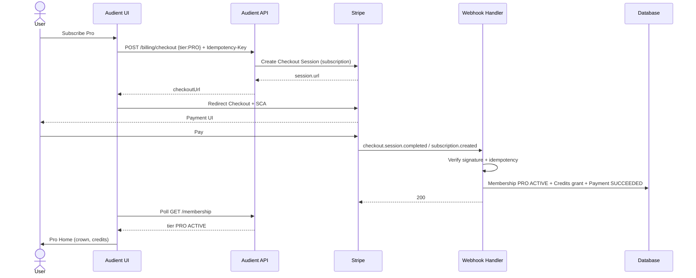
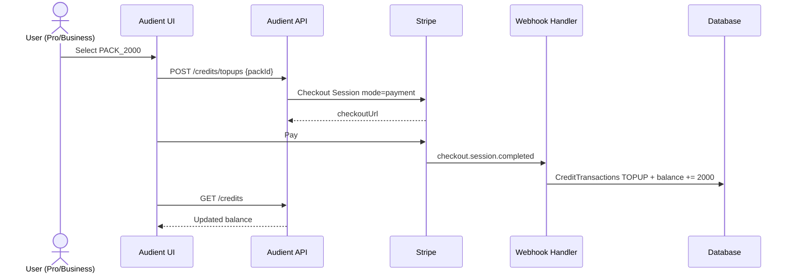
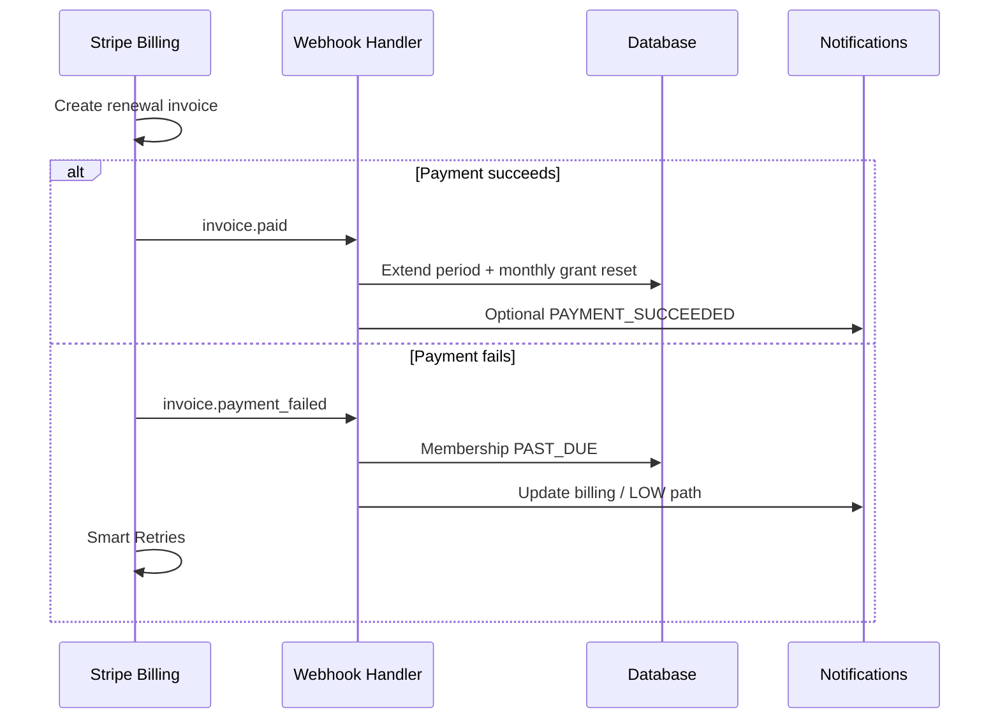
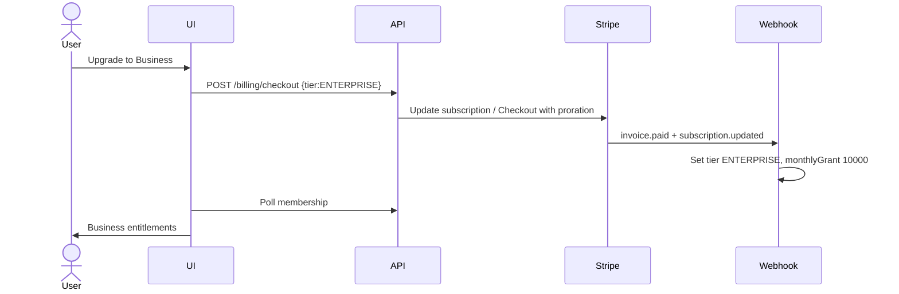
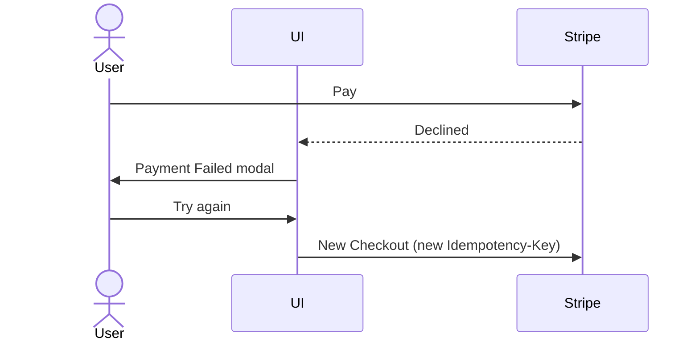
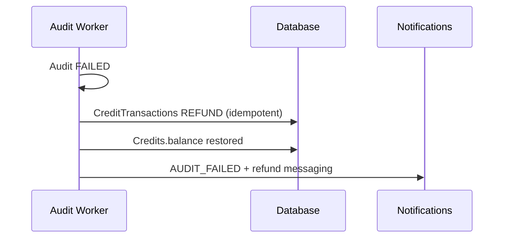

# Audient — Payment Flow

**Status:** Draft (implementation-ready)  
**Last updated:** 2026-07-30  
**Owner:** Raghunath Kamlekar  
**Audience:** Backend · Frontend · Finance · Support · QA  

**Format:** Markdown only — **no application code**.  
**Purpose:** End-to-end money and entitlement flows for subscriptions, credit top-ups, renewals, failures, and Stripe webhooks.

**Related:** `PRICING.md` · `BILLING_API.md` · `API_SPECIFICATION.md` · `BUSINESS_RULES.md` (BR-SUB-*, BR-BILL-*, BR-CRED-*) · `SECURITY.md` · `ERROR_HANDLING.md` · `ANALYTICS.md` · `DATABASE_MIGRATION.md` · `SCREEN_MAPPING.md` · `MISSING_SCREENS_PLAN.md` · `BACKEND_TASKS.md` (BM-06)

**Provider:** Stripe only (`BR-BILL-001`). **PCI:** Stripe Checkout / Payment Element / Customer Portal — **never** store or transmit raw PAN on Audient (`BR-BILL-002`). Designed OTP UI maps to **3DS / SCA** (`BR-BILL-003`).

**Authoritative catalog (`PRICING.md`):**

| Product | Amount | Credits / grant |
|---------|--------|-----------------|
| Free | $0 | 300 / month |
| Pro monthly | **$29** | **1,000** |
| Business (`ENTERPRISE`) monthly | **$99** | **10,000** |
| Top-up PACK_500 | $9 | 500 (rollover) |
| Top-up PACK_2000 | $29 | 2,000 (rollover) |
| Top-up PACK_5000 | $59 | 5,000 (rollover) |

**v1 billing interval:** monthly only (`BR-SUB-002`). Yearly = Phase 2.

**Golden rule:** Client checkout success **never** grants entitlements. Only **verified Stripe webhooks** mutate Memberships / Credits (`BR-SUB-005`, `BR-BILL-004`).

---

## 1. Actors & systems

| Actor | Role |
|-------|------|
| User | Subscribes, tops up, updates method, cancels via Portal |
| Audient API | Creates Checkout/Portal sessions; records pending Payments |
| Stripe Checkout / Elements | Collects payment + SCA |
| Stripe Billing | Subscriptions, invoices, retries, Customer Portal |
| Stripe Webhooks | Authoritative entitlement events |
| Audient DB | Memberships, Credits, CreditTransactions, Payments, ProcessedWebhookEvents |
| Workers / jobs | Monthly grant reset; optional invoice sync |

---

## 2. Subscription purchase

**Happy path:** Free → Pro or Free → Business (first paid subscription).

### 2.1 Preconditions

- Authenticated, email verified recommended for audits (billing may still proceed).  
- Current tier ≠ target (`409` if already on tier — Active Account is non-purchase, `BR-SUB-004`).  
- Amounts from server/`plans.ts` — never client-supplied prices.

### 2.2 Steps

1. User opens Manage Plan (SCREEN-005) → **Subscribe**.  
2. Client: `POST /api/v1/billing/checkout` `{ tier: "PRO"|"ENTERPRISE", billingInterval: "MONTHLY" }` + `Idempotency-Key`.  
3. API creates/ensures Stripe Customer, creates Checkout Session (`mode: subscription`) with Price IDs from env.  
4. Client redirects to `checkoutUrl` (or mounts Payment Element — same rule: tokenized only).  
5. User completes payment + SCA.  
6. Stripe sends webhooks (see §8).  
7. Audient sets Membership `PRO`/`ENTERPRISE`, `ACTIVE`, stores `stripeSubscriptionId`, grants monthly credits, writes Payment `SUCCEEDED`.  
8. UI: Payment Success (SCREEN-008) / Checkout Return (M07) polls `GET /membership` until ACTIVE → Pro/Business Home (`BR-BILL-005`).

### 2.3 Failure

- Decline / cancel → Payment Failed (SCREEN-007) or return `cancel` — **no** tier change (`BR-BILL-004`).  
- Webhook lag → “Activating your plan…” (`APP-STATE-013` / ERR-AUDIT-011 naming) — poll, do not client-grant.

---

## 3. Credit purchase (top-up)

**Who:** Pro / Business only (`BR-CRED-006`). Free → Upgrade Dialog / Manage Plan.

### 3.1 Steps

1. User selects pack on Buy Credits (M05).  
2. `POST /api/v1/credits/topups` `{ packId }` (alias `POST /billing/topup`) + Idempotency-Key.  
3. API creates Checkout Session (`mode: payment`) with pack Price + metadata `{ type: topup, credits: N, userId }`.  
4. Redirect to Stripe → pay.  
5. Webhook `checkout.session.completed` / `payment_intent.succeeded` → credit ledger `TOPUP`, increase balance (**rollover**, `BR-CRED-005`).  
6. Client polls `GET /credits` → success toast.

### 3.2 Packs

| packId | Credits | Price |
|--------|---------|-------|
| PACK_500 | 500 | $9 |
| PACK_2000 | 2,000 | $29 |
| PACK_5000 | 5,000 | $59 |

---

## 4. Refund

Two distinct meanings — do not conflate.

### 4.1 Credit refund (product — common)

| Trigger | Behaviour |
|---------|-----------|
| Audit `FAILED` (eligible) | Ledger `REFUND` = reserved cost; balance restored (`BR-ERR-001`) |
| Audit cancelled (if supported) | Refund if reserved |
| User deletes history row | **No** credit refund |
| PDF generation fails | **No** credit refund (`BR-PDF-004`) |

Idempotent: one refund per deduction. Failures → `credits_refund_failed` + ops (`ERR-CRED-003`).

### 4.2 Monetary refund (Stripe — rare)

| Trigger | Behaviour |
|---------|-----------|
| Chargeback / support goodwill / duplicate charge | Stripe Dashboard or API `Refund` |
| Webhook `charge.refunded` | Mark Payment `REFUNDED`; **claw back top-up credits** if unused policy allows; do not silently revoke subscription without support playbook |
| Partial refund | Record amount; adjust credits proportionally for top-ups only when policy defined |

User-facing “request refund” is **out of scope** as self-serve MVP (`ANALYTICS` OOS) — Support/ops.

---

## 5. Upgrade

| Path | Mechanism |
|------|-----------|
| Free → Pro / Business | New subscription Checkout (§2) |
| Pro → Business | Stripe Subscription update / Checkout with proration **or** Customer Portal upgrade |

### Rules

- Entitlements flip only after webhook (`customer.subscription.updated` / `checkout.session.completed`).  
- On upgrade: set tier `ENTERPRISE`, adjust `monthlyGrant` to **10,000**, grant difference or reset per product policy (recommend: set grant to new plan; **preserve unused top-up rollover bucket**).  
- UI: crown + credits refresh after poll.  
- Analytics: `subscribe_clicked{toTier}` · `subscription_upgraded` · `payment_succeeded`.

**Proration (recommended):** Stripe automatic proration on mid-cycle upgrade; invoice paid via webhook.

---

## 6. Downgrade

| Path | Mechanism |
|------|-----------|
| Business → Pro | Portal or API schedule change |
| Paid → Free | Cancel subscription (usually **at period end**) |

### Rules

- Prefer **Stripe Customer Portal** (`POST /billing/portal`) for cancel/downgrade (`BR-SUB-*`).  
- Until period end: keep paid entitlements (`ACTIVE` until `currentPeriodEnd`).  
- On `customer.subscription.deleted` / period end: tier → `FREE`, status `CANCELED` then Free seed grant **300** on next cycle; **top-up rollover credits remain** until spent (`BR-CRED-005`).  
- Immediate cancel (if ever offered): revoke URL/PDF immediately; document clearly.  
- Do not delete Payment history.

---

## 7. Renewal

Monthly Stripe Billing renews automatically.

### Steps

1. Stripe creates invoice for subscription period.  
2. Attempts charge on default payment method (+ SCA if required).  
3. **Success:** `invoice.paid` → extend `currentPeriodEnd`; run **monthly plan credit grant/reset** (plan credits reset; top-ups roll over).  
4. **Failure:** `invoice.payment_failed` → Membership `PAST_DUE`; soft-limit premium (`BR-SUB-006`); notify user; Stripe Smart Retries.

### Analytics

`subscription_renewed` · `renewal_failed` · `subscription_past_due`.

---

## 8. Stripe webhooks

**Endpoint:** `POST /api/webhooks/stripe`  
**Auth:** `Stripe-Signature` verification only (no user JWT).  
**Idempotency:** insert `ProcessedWebhookEvents.stripeEventId` unique before side effects (`BR-BILL-006`).

### 8.1 Events to handle (MVP)

| Event | Action |
|-------|--------|
| `checkout.session.completed` | Link customer; if subscription mode → ensure Membership; if payment/top-up → grant credits when payment complete |
| `customer.subscription.created` | Upsert Membership tier/status/ids/period |
| `customer.subscription.updated` | Tier/status/period changes (upgrade/downgrade/past_due) |
| `customer.subscription.deleted` | Downgrade to Free / CANCELED |
| `invoice.paid` | Renewal success; monthly grant job trigger |
| `invoice.payment_failed` | PAST_DUE + notification |
| `invoice.finalized` | Optional: store invoice URL on Payment |
| `payment_intent.succeeded` | Confirm Payment row SUCCEEDED (Elements flows) |
| `payment_intent.payment_failed` | Payment FAILED; no grant |
| `charge.refunded` | Payment REFUNDED + credit clawback policy |
| `customer.updated` | Optional sync email/default PM metadata |

### 8.2 Processing rules

1. Verify signature → reject invalid.  
2. If `stripeEventId` seen → `200` no-op.  
3. Apply side effects in a DB transaction.  
4. Mark event `PROCESSED` (or `FAILED` + alert for retry).  
5. Always return `2xx` quickly after durable accept; async heavy work if needed.

**Never** trust client “I paid” or success query params alone.

---

## 9. Invoices

| Need | Approach |
|------|----------|
| User views receipts | Stripe Customer Portal +/or `GET /payments` list |
| Hosted invoice PDF | Stripe-hosted `invoice.hosted_invoice_url` / PDF URL from webhook |
| Audient UI (M06) | List Payments: date, amount, status, type (SUBSCRIPTION / CREDIT_TOPUP / REFUND) |
| Generation failure | ERR-BILL-006 → open Portal |

Audient does not invent a custom invoicing engine in v1.

---

## 10. Failed payments

| Scenario | User experience | System |
|----------|-----------------|--------|
| Card declined at checkout | SCREEN-007 / retry | No Membership change |
| User cancels Checkout | Return cancel / Manage Plan | No charge |
| SCA abandoned | Failed / incomplete | No grant |
| Renewal decline | Banner: update payment method | `PAST_DUE`; premium limited |
| Duplicate submit | Toast processing | Idempotency-Key / Stripe idempotency |

Premium while `PAST_DUE`: block new URL audits / PDF as per `BR-SUB-006` (screenshot may remain if product allows — default: restrict paid features until `ACTIVE`).

---

## 11. Retry payments

| Case | Retry path |
|------|------------|
| Checkout declined | “Try again” → new Checkout / PaymentIntent (new Idempotency-Key) |
| Renewal | Stripe **Smart Retries**; user updates PM via Portal or SCREEN-011 |
| Webhook processing fail | Stripe retries webhook; handler must stay idempotent |
| Activation lag | Client poll membership ≤ ~30s then support |

Do not manually “force ACTIVE” from admin without Stripe confirmation.

---

## 12. Taxes

| Concern | Spec |
|---------|------|
| Provider | **Stripe Tax** (recommended) enabled on Checkout / Invoices |
| Display | Inclusive or exclusive per Stripe Tax settings; show tax line on Checkout |
| Nexus / collection | Configure in Stripe Dashboard (not hardcoded in app) |
| Receipts | Tax appears on Stripe invoices |
| VAT IDs | Collect via Checkout Tax ID if required for B2B later |
| Audient DB | Store `amount` + `currency` (+ optional `taxAmount` if denormalized from invoice) |

Do not invent tax rates in application code.

---

## 13. Analytics

Server is source of truth for revenue (`ANALYTICS.md`).

| Event | Emitter | Notes |
|-------|---------|-------|
| `manage_plan_viewed` | Client | SCREEN-005 |
| `subscribe_clicked` | Client | `{ toTier }` |
| `checkout_started` | Server/Client | Checkout session created |
| `payment_submitted` | Client | Confirm click (Elements) |
| `payment_succeeded` | **Server webhook** | Authoritative |
| `payment_failed` | Client/Server | Decline / cancel |
| `payment_retry_clicked` | Client | |
| `plan_activated` | Server/Client after poll | Membership ACTIVE |
| `subscription_upgraded` | Server | Tier increase |
| `subscription_renewed` | Server | `invoice.paid` |
| `subscription_cancelled` | Server | Portal/webhook |
| `renewal_failed` | Server | |
| `topup_started` / `buy_credits_clicked` | Client | |
| `credits_purchased` / `topup_completed` | Server webhook | |
| `billing_portal_opened` | Client | |
| `payment_method_updated` | Client/Server | |
| `webhook_delay_shown` | Client | Activating… |

Never send PAN, full card, or Stripe secret keys to analytics.

---

## 14. Error handling

| Code | Meaning | Recovery |
|------|---------|----------|
| ERR-BILL-001 | Checkout session create failed | Retry |
| ERR-BILL-002 | User cancelled | Resubscribe |
| ERR-BILL-003 | Payment declined | Retry / new method |
| ERR-BILL-004 | Card expired (Elements validation) | Fix expiry |
| ERR-BILL-005 | Duplicate payment in flight | Wait |
| ERR-BILL-006 | Invoice list failed | Portal |
| ERR-BILL-007 | Plan activation failed after pay | Support + webhook replay |
| ERR-BILL-008 | Renewal failed | Update billing |
| ERR-BILL-009 | Monetary refund failed | Ops |
| ERR-CRED-003 | Credit refund failed | Compensate |
| ERR-CRED-005 | PAST_DUE / expired premium | Update billing |
| `409` | Already on tier | Show Active Account |
| `403` | Free top-up blocked | Upgrade |
| `429` | Rate limited checkout | Backoff |

**Webhook delay:** not a payment failure — show activating state; grant only when Membership reflects webhook.

---

## 15. Sequence diagrams

### 15.1 Subscription purchase (Free → Pro)



### 15.2 Credit top-up



### 15.3 Renewal success vs failure



### 15.4 Upgrade Pro → Business (proration)



### 15.5 Downgrade / cancel at period end

```mermaid
sequenceDiagram
  actor U as User
  participant UI as UI
  participant API as API
  participant S as Stripe Portal
  participant WH as Webhook
  participant DB as DB

  U->>UI: Manage billing
  UI->>API: POST /billing/portal
  API-->>UI: portalUrl
  U->>S: Cancel at period end
  S->>WH: subscription.updated (cancel_at_period_end)
  Note over DB: Keep paid tier until period end
  S->>WH: subscription.deleted (period ended)
  WH->>DB: tier FREE, status CANCELED; keep top-up rollover
```

### 15.6 Failed checkout + retry



### 15.7 Audit credit refund (non-Stripe money)



---

## 16. State machine — Membership

```text
FREE ──checkout.succeeded──► ACTIVE (PRO|ENTERPRISE)
ACTIVE ──invoice.payment_failed──► PAST_DUE
PAST_DUE ──invoice.paid / PM fixed──► ACTIVE
ACTIVE ──cancel_at_period_end──► ACTIVE (until end)
ACTIVE|PAST_DUE ──subscription.deleted──► CANCELED → treat as FREE entitlements
```

---

## 17. Data writes (summary)

| Event | Memberships | Credits / Ledger | Payments | ProcessedWebhookEvents |
|-------|-------------|------------------|----------|------------------------|
| Sub checkout paid | tier, status ACTIVE, Stripe ids | MONTHLY_GRANT | SUCCEEDED SUBSCRIPTION | event id |
| Top-up paid | — | TOPUP + balance | SUCCEEDED CREDIT_TOPUP | event id |
| Renewal paid | period end | monthly reset grant | invoice row | event id |
| Renewal fail | PAST_DUE | — | FAILED optional | event id |
| Cancel end | FREE / CANCELED | keep rollover | — | event id |
| Audit fail | — | REFUND | — | — |
| Stripe refund | per policy | clawback top-up | REFUNDED | event id |

---

## 18. UI screen map

| Screen | Role |
|--------|------|
| SCREEN-005 Manage Plan | Choose tier / Active Account |
| SCREEN-006 Payment | Checkout/Elements + SCA |
| SCREEN-007 Failed | Retry |
| SCREEN-008 Success | Poll activating |
| SCREEN-011 Payment Details | Update method (tokenized) |
| SCREEN-M05 Buy Credits | Top-up packs |
| SCREEN-M06 Billing | Portal + invoices list |
| SCREEN-M07 Checkout Return | success/cancel + poll |
| SCREEN-M08 Upgrade | Gate → Manage Plan |

---

## 19. Security checklist

- [ ] No PAN/CVV in Audient logs, DB, or analytics  
- [ ] Webhook signature verified  
- [ ] Idempotent event processing  
- [ ] Prices only from Stripe Price IDs / server config  
- [ ] Test vs live keys never mixed  
- [ ] Portal/Checkout return URLs allow-listed  
- [ ] Rate limit checkout & top-up  

---

## 20. Related documents

| Doc | Use |
|-----|-----|
| PRICING.md | Amounts & packs |
| BILLING_API.md / API_SPECIFICATION.md | Endpoints |
| BUSINESS_RULES.md | BR-SUB / BR-BILL / BR-CRED |
| ERROR_HANDLING.md | ERR-BILL-* |
| ANALYTICS.md | Revenue events |
| SECURITY.md | PCI |

---

**End of PAYMENT_FLOW.md**
