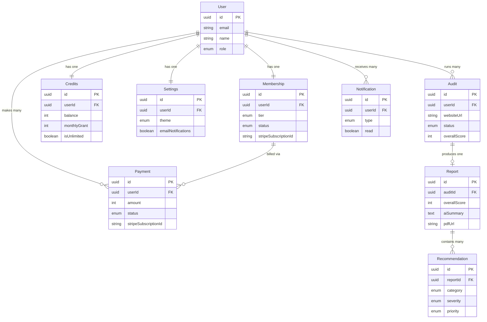

# Audient — Detailed Schema Specification

**Status:** Draft (in progress)
**Last updated:** 2026-07-27
**Owner:** Raghunath Kamlekar
**Related:** DATABASE.md, Technical Architecture Document

This document provides field-level specifications for each table in the Audient database. Tables are documented one at a time. No SQL — descriptive documentation only.

---

## Users

### Purpose
The **Users** table stores all registered users of Audient. It is the central identity record: every other user-owned entity (membership, credits, audits, payments, notifications, settings) references it. It holds the user's profile basics, the link to the authentication provider, their access role, and account lifecycle timestamps. It intentionally does **not** store passwords or OAuth secrets — those are managed by the authentication provider (Supabase Auth).

### Fields

| Field | Data Type | Required / Optional | Description | Example Value |
|-------|-----------|---------------------|-------------|---------------|
| `id` | UUID | Required | Primary key. Unique internal identifier for the user, used by all related records. | `9f1c2e5a-3b7d-4a2e-9c1f-8d6b0a2e4f11` |
| `authProviderId` | String | Required | Reference to the user's identity in Supabase Auth. Links the application user to the external authentication record. | `auth0|65f2c1a9b3` |
| `email` | String | Required | The user's email address. Used for login, communication, receipts, and notifications. Unique across all users. | `owner@brightcafe.com` |
| `name` | String | Optional | The user's display name. May be absent if not provided by the OAuth provider or during sign-up. | `Priya Sharma` |
| `avatarUrl` | String (URL) | Optional | Link to the user's profile image (often supplied by the OAuth provider). | `https://cdn.example.com/avatars/priya.png` |
| `role` | Enum (`USER`, `ADMIN`) | Required (default `USER`) | Access level. Distinguishes standard users from administrators for privileged actions. | `USER` |
| `emailVerified` | Boolean | Required (default `false`) | Whether the user's email has been verified. Gates certain actions (e.g., running audits) to reduce abuse. | `true` |
| `status` | Enum (`ACTIVE`, `SUSPENDED`, `DELETED`) | Required (default `ACTIVE`) | Account lifecycle state. Supports suspension and soft-deletion workflows. | `ACTIVE` |
| `lastLoginAt` | Timestamp (UTC) | Optional | The time of the user's most recent login. Useful for engagement metrics and security monitoring. | `2026-07-27T09:14:00Z` |
| `createdAt` | Timestamp (UTC) | Required | When the user account was created. Set once on creation. | `2026-06-01T12:00:00Z` |
| `updatedAt` | Timestamp (UTC) | Required | When the user record was last updated. Maintained automatically on change. | `2026-07-27T09:14:00Z` |

### Why Each Field Is Necessary

- **`id`** — A stable, unique internal identifier is required so every related table (audits, credits, payments, etc.) can reference the user reliably. A UUID is used (rather than a sequential number) to avoid exposing user counts and to make identifiers non-guessable.
- **`authProviderId`** — Because authentication is delegated to Supabase Auth, this field is the bridge between the external identity and Audient's own user record. Without it, the app couldn't match an authenticated session to the correct internal user.
- **`email`** — Essential for identifying the user, logging in, sending audit-completion notifications, receipts, and account communications. It must be unique so two accounts can't share the same identity.
- **`name`** — Personalizes the experience (greetings, report authorship) and is commonly available from OAuth providers. Optional because email-only sign-ups or providers may not supply it.
- **`avatarUrl`** — Improves the UI experience (profile display, navigation). Optional because not every user or provider supplies an image; the UI can fall back to initials.
- **`role`** — Needed to separate standard users from administrators, enabling admin-only capabilities (support tooling, moderation) while keeping regular accounts restricted. Defaulting to `USER` ensures least privilege.
- **`emailVerified`** — Verifying email reduces fraudulent/throwaway accounts farming free credits and ensures notifications reach a real inbox. Gating audits on verification protects the free-tier economics.
- **`status`** — Allows the platform to suspend abusive accounts or mark accounts as deleted without immediately purging data, supporting moderation and safe deletion workflows.
- **`lastLoginAt`** — Supports engagement analytics (active users), re-engagement campaigns, and security monitoring (detecting unusual access).
- **`createdAt`** — Required for account age, cohort analysis, and support/debugging. Recording creation time is fundamental to any auditable record.
- **`updatedAt`** — Tracks the most recent change for debugging, synchronization, and audit trails; maintained automatically whenever the record changes.

### Notes
- **Uniqueness:** `email` and `authProviderId` are unique across the table.
- **Relationships:** one-to-one with Memberships, Credits, and Settings; one-to-many with Audits, Payments, and Notifications (see DATABASE.md §4).
- **Deletion:** deleting a user cascades to all owned records, supporting the data-deletion (right-to-be-forgotten) requirement. The `status = DELETED` state can be used for soft-deletion before a hard delete.
- **Security:** no passwords, OAuth tokens, or payment card data are stored here (see DATABASE.md §5).

---

## Memberships

### Purpose
The **Memberships** table stores each user's current plan and subscription state. Audient offers three plans — **Free**, **Pro**, and **Enterprise** — and every user has exactly **one active membership** at a time. This table is the source of truth for **what a user is entitled to** (which features and input modes are unlocked) and for **subscription lifecycle** (active, past-due, canceled), while linking to the payment provider (Stripe) for billing. It is kept separate from the Users table so that billing and plan state can change independently of the user's core identity.

### Fields

| Field | Data Type | Required / Optional | Description | Example Value |
|-------|-----------|---------------------|-------------|---------------|
| `id` | UUID | Required | Primary key. Unique identifier for the membership record. | `4b8e1d22-6f3a-4c9e-b1a7-2e5c9d0f7a34` |
| `userId` | UUID (Foreign Key → Users.id) | Required | The user this membership belongs to. Unique, enforcing one membership per user. | `9f1c2e5a-3b7d-4a2e-9c1f-8d6b0a2e4f11` |
| `tier` | Enum (`FREE`, `PRO`, `ENTERPRISE`) | Required (default `FREE`) | The user's current plan. Determines feature access (e.g., URL audits, detailed PDF reports) and credit allotment. | `PRO` |
| `status` | Enum (`ACTIVE`, `TRIALING`, `PAST_DUE`, `CANCELED`) | Required (default `ACTIVE`) | The subscription's lifecycle state. Governs whether paid features remain available. | `ACTIVE` |
| `stripeCustomerId` | String | Optional | The customer identifier in Stripe. Absent for Free users who have never entered billing. Unique when present. | `cus_PbR3xY9tKmA12z` |
| `stripeSubscriptionId` | String | Optional | The active subscription identifier in Stripe. Present for paid plans; absent for Free. Unique when present. | `sub_1PqL2mBxN8dEfG` |
| `currentPeriodEnd` | Timestamp (UTC) | Optional | When the current billing period ends / renews. Used to trigger credit resets and to keep access until period end after cancellation. | `2026-08-27T00:00:00Z` |
| `canceledAt` | Timestamp (UTC) | Optional | When the subscription was canceled (if applicable). Null for active subscriptions. | `null` |
| `createdAt` | Timestamp (UTC) | Required | When the membership record was created. | `2026-06-01T12:00:00Z` |
| `updatedAt` | Timestamp (UTC) | Required | When the membership was last updated (tier change, status change, renewal). | `2026-07-27T09:14:00Z` |

### Field Descriptions & Rationale
- **`id`** — Stable unique identifier for the membership, referenced internally and in logs.
- **`userId`** — The foreign key linking the membership to its owner. Marked **unique** so a user can never have more than one membership (enforcing "one active subscription per user").
- **`tier`** — The core entitlement field. The application reads this to decide whether to enable URL audits, detailed PDF reports, credit top-ups, and the monthly credit grant. An enum guarantees only valid plans are stored.
- **`status`** — Separates *which plan* a user is on from *whether that plan is currently in good standing*. For example, a `PRO` user with `PAST_DUE` status may have paid features temporarily restricted. Enables dunning and downgrade flows.
- **`stripeCustomerId`** — Connects the user to their Stripe customer profile so future charges, top-ups, and the billing portal work. Optional because Free users may never have a Stripe record.
- **`stripeSubscriptionId`** — Identifies the specific recurring subscription in Stripe; used to reconcile renewals, cancellations, and webhook events. Absent for Free (no recurring charge).
- **`currentPeriodEnd`** — Drives two behaviors: the monthly **credit reset** at renewal, and continued access to paid features **until period end** when a user cancels.
- **`canceledAt`** — Records when cancellation occurred, supporting analytics (churn) and the "access until period end" behavior.
- **`createdAt` / `updatedAt`** — Provide an audit trail of when the membership began and last changed (upgrades, downgrades, renewals).

### How This Table Connects to the Users Table
- **Relationship:** one-to-one. Each **Users** record has exactly one **Memberships** record, linked by `Memberships.userId → Users.id`.
- **Uniqueness enforces the rule:** because `userId` is unique in this table, a user can only ever have a single membership — matching "each user has one active subscription."
- **Lifecycle:** a membership is created when the user account is created, defaulting to the **Free** tier with **active** status. Upgrades change the `tier` (and populate the Stripe fields); cancellations/failures change the `status`.
- **Cascade deletion:** if a user is deleted, their membership is deleted with them (see DATABASE.md §4.3).
- **Separation of concerns:** identity lives in **Users**; billing/plan state lives here. This lets subscription state evolve (via Stripe webhooks) without touching the identity record, and keeps sensitive billing references isolated.

### Notes
- **Entitlement source of truth:** the application should always check `tier` **and** `status` together before granting paid features (e.g., allow URL audits only when `tier` is `PRO`/`ENTERPRISE` **and** `status` is `ACTIVE` or `TRIALING`).
- **Credits are separate:** the actual credit balance and monthly grant live in the **Credits** table; Memberships defines the *plan*, Credits tracks the *usage allowance*.
- **Naming:** the top tier is **Enterprise** (this supersedes the earlier "Agency" naming used in some PRD/architecture sections).

---

## Credits

### Purpose
The **Credits** table tracks each user's credit account — the usage allowance that governs how many audits they can run. Every user has exactly **one** credit account. Credits are granted monthly based on the user's plan, deducted whenever a website audit runs, and refunded when an audit fails. This table holds the **current state** (balance, monthly grant, reset date, unlimited flag); the detailed, append-only history of every credit movement is recorded separately in the **Credit Transactions** ledger.

### Business Rules Modeled
- **Free users:** receive **200 credits every month** (reset at the start of each cycle).
- **Pro users:** receive a larger **monthly credit grant** (reset each cycle).
- **Enterprise users:** have **unlimited credits** — represented by an `isUnlimited` flag rather than a finite balance.
- **Every audit deducts credits** — except when `isUnlimited` is true, in which case usage is tracked but never blocked.

### Fields

| Field | Data Type | Required / Optional | Description | Example Value |
|-------|-----------|---------------------|-------------|---------------|
| `id` | UUID | Required | Primary key. Unique identifier for the credit account. | `c2a7f4e1-9b3d-4e6a-8f21-0d5c7b1a9e33` |
| `userId` | UUID (Foreign Key → Users.id) | Required | The user this credit account belongs to. Unique — one credit account per user. | `9f1c2e5a-3b7d-4a2e-9c1f-8d6b0a2e4f11` |
| `balance` | Integer | Required (default `200`) | Current number of available credits. Decremented on audits, incremented on grants/refunds/top-ups. Ignored when `isUnlimited` is true. | `150` |
| `monthlyGrant` | Integer | Required | The number of credits granted at each monthly reset, based on the user's plan (e.g., 200 for Free). | `200` |
| `isUnlimited` | Boolean | Required (default `false`) | Whether the account has unlimited credits (Enterprise). When true, audits are never blocked and `balance` is not enforced. | `false` |
| `lifetimeUsed` | Integer | Required (default `0`) | Total credits consumed over the account's lifetime. Enables usage analytics — especially for unlimited (Enterprise) accounts where `balance` isn't meaningful. | `450` |
| `lastResetAt` | Timestamp (UTC) | Required | When credits were last reset to the monthly grant. Used to determine when the next reset is due. | `2026-07-01T00:00:00Z` |
| `nextResetAt` | Timestamp (UTC) | Optional | When the next monthly reset is scheduled. Helps display "credits renew on…" and drive the reset job. | `2026-08-01T00:00:00Z` |
| `updatedAt` | Timestamp (UTC) | Required | When the credit account was last modified. | `2026-07-27T09:14:00Z` |

### Field Descriptions & Rationale
- **`id`** — Unique identifier for the credit account record.
- **`userId`** — Foreign key to the owning user; unique so each user has exactly one credit account.
- **`balance`** — The live, spendable credit count. This is the value checked before an audit and decremented on success. Defaulted to 200 to reflect the Free-tier grant on account creation.
- **`monthlyGrant`** — Stores how many credits to restore at each reset. Kept per-account (derived from the plan) so the monthly reset job doesn't need to re-look-up plan config, and so grandfathered/custom grants are possible.
- **`isUnlimited`** — Cleanly models the Enterprise "unlimited" rule without using a fake huge number. When true, the audit flow skips the balance check and deduction (but still records usage). This avoids brittle magic values and makes intent explicit.
- **`lifetimeUsed`** — Tracks total consumption for analytics and fair-use monitoring. Especially valuable for Enterprise accounts, where `balance` doesn't decline, so usage still needs to be measurable.
- **`lastResetAt`** — Anchors the monthly cycle so the reset job knows whether a reset is due and can display renewal timing.
- **`nextResetAt`** — Convenience field for UI ("credits renew on Aug 1") and scheduling; can be derived from `lastResetAt` but storing it simplifies queries.
- **`updatedAt`** — Audit trail for the last change to the account.

### Relationships
- **Credits → Users:** one-to-one. Each user has exactly one credit account (`Credits.userId → Users.id`, unique). Created alongside the user, defaulting to the Free grant of 200.
- **Credits → Credit Transactions:** one-to-many. Every change to `balance` (monthly grant, audit deduction, refund, top-up) is recorded as a row in the **Credit Transactions** ledger, which references this account. The `balance` here is the fast, current value; the ledger is the auditable history.
- **Credits ↔ Memberships (indirect):** the user's **plan** (in Memberships) determines the `monthlyGrant` and whether `isUnlimited` is set. When a user upgrades/downgrades, the reset logic updates these fields accordingly.
- **Credits ↔ Audits (indirect):** creating an **Audit** triggers a credit deduction (unless unlimited); a failed audit triggers a refund. Each such movement links back to the audit via the ledger.

### Example Records

**Free user (mid-cycle, some credits used):**
| Field | Value |
|-------|-------|
| `id` | `c2a7f4e1-9b3d-4e6a-8f21-0d5c7b1a9e33` |
| `userId` | `9f1c2e5a-3b7d-4a2e-9c1f-8d6b0a2e4f11` |
| `balance` | `50` |
| `monthlyGrant` | `200` |
| `isUnlimited` | `false` |
| `lifetimeUsed` | `450` |
| `lastResetAt` | `2026-07-01T00:00:00Z` |
| `nextResetAt` | `2026-08-01T00:00:00Z` |
| `updatedAt` | `2026-07-20T15:32:00Z` |

**Pro user (freshly reset this cycle):**
| Field | Value |
|-------|-------|
| `id` | `a1d9c3b2-7e4f-4a12-9c88-1b2d3e4f5a67` |
| `userId` | `2c4e6a8b-1f3d-4b5a-9e7c-0a1b2c3d4e5f` |
| `balance` | `2000` |
| `monthlyGrant` | `2000` |
| `isUnlimited` | `false` |
| `lifetimeUsed` | `5820` |
| `lastResetAt` | `2026-07-27T00:00:00Z` |
| `nextResetAt` | `2026-08-27T00:00:00Z` |
| `updatedAt` | `2026-07-27T00:00:00Z` |

**Enterprise user (unlimited):**
| Field | Value |
|-------|-------|
| `id` | `f7b1e2d3-4c5a-4e6f-8a9b-0c1d2e3f4a5b` |
| `userId` | `7a8b9c0d-1e2f-4a3b-9c4d-5e6f7a8b9c0d` |
| `balance` | `0` |
| `monthlyGrant` | `0` |
| `isUnlimited` | `true` |
| `lifetimeUsed` | `18240` |
| `lastResetAt` | `2026-07-01T00:00:00Z` |
| `nextResetAt` | `null` |
| `updatedAt` | `2026-07-27T09:00:00Z` |

### Notes
- **Unlimited handling:** when `isUnlimited` is true, the audit flow bypasses the balance check and deduction but still increments `lifetimeUsed` and records a ledger entry (amount `0` or informational) for a complete usage history.
- **Reset job:** a scheduled process (or the subscription-renewal webhook) resets `balance` to `monthlyGrant` and updates `lastResetAt`/`nextResetAt` at each cycle. Purchased top-up credits (if tracked) should be preserved across resets per the billing policy.
- **Concurrency:** balance changes are performed transactionally (with row locking) to prevent double-spend when audits run concurrently — see Technical Architecture §8.4.
- **Source of truth:** `balance` is the fast current value; the **Credit Transactions** ledger is the authoritative, auditable history.

---

## Audits

### Purpose
The **Audits** table stores every audit a user runs. Each time a user submits a website (pastes a URL — or uploads screenshots), a **new audit record is created**. The record tracks the request from the moment it's queued, through processing, to completion — holding the target website, the processing status, and the resulting scores. It is the central record of the core product output; the detailed findings live in the related **Audit Issues** table and the downloadable report in the **Reports** table.

### Fields

| Field | Data Type | Required / Optional | Description | Example Value |
|-------|-----------|---------------------|-------------|---------------|
| `id` (Audit ID) | UUID | Required | Primary key. Unique identifier for the audit, used in URLs, history, and by related tables. | `d3f5a1c9-2b6e-4a71-9c3d-7e8f0a1b2c34` |
| `userId` (User ID) | UUID (Foreign Key → Users.id) | Required | The user who ran the audit. Links every audit to its owner. | `9f1c2e5a-3b7d-4a2e-9c1f-8d6b0a2e4f11` |
| `websiteUrl` (Website URL) | String (URL) | Required | The website address that was audited. Records exactly what was analyzed. | `https://brightcafe.com` |
| `status` (Audit Status) | Enum (`QUEUED`, `PROCESSING`, `COMPLETED`, `FAILED`) | Required (default `QUEUED`) | The processing lifecycle state of the audit. | `COMPLETED` |
| `overallScore` (Overall UX Score) | Integer (0–100) | Optional | The overall UX quality score, computed from the findings. Null until the audit completes. | `72` |
| `accessibilityScore` (Accessibility Score) | Integer (0–100) | Optional | Sub-score for accessibility (WCAG-related findings). Null until completion. | `65` |
| `conversionScore` (Conversion Score) | Integer (0–100) | Optional | Sub-score for conversion effectiveness (CTAs, conversion flow). Null until completion. | `80` |
| `mobileScore` (Mobile UX Score) | Integer (0–100) | Optional | Sub-score for the mobile experience (responsiveness, mobile usability). Null until completion. | `70` |
| `createdAt` (Created Date) | Timestamp (UTC) | Required | When the audit was created (submitted). | `2026-07-27T09:10:00Z` |
| `updatedAt` (Updated Date) | Timestamp (UTC) | Required | When the audit was last updated (status change, scores written). | `2026-07-27T09:16:30Z` |

### Why Each Field Exists

- **`id` (Audit ID)** — A unique, stable identifier is required so the audit can be referenced everywhere: the results page URL, the history list, and the related Audit Issues and Report records. A UUID keeps identifiers non-guessable (users can't enumerate others' audits).
- **`userId` (User ID)** — Establishes ownership. Every audit must belong to a user so the app can show each user only their own audits, enforce credit deduction against the right account, and cascade deletion. It's the foreign key that ties the audit to the Users table.
- **`websiteUrl` (Website URL)** — Records exactly what was audited. Necessary to display the audit's subject, allow re-audits of the same site, and give context to the findings and report. It also anchors the crawl/analysis pipeline to the correct target.
- **`status` (Audit Status)** — Audits are asynchronous and can take up to several minutes. The status field lets the UI show progress (queued → processing → completed), lets workers pick up pending jobs, and distinguishes successful audits from failures (which trigger credit refunds). Without it, the system couldn't manage the long-running lifecycle.
- **`overallScore` (Overall UX Score)** — The headline result users see first — a single number summarizing UX quality. It's the primary value delivered and the basis for tracking improvement across re-audits. Optional/null until the audit finishes, since it doesn't exist while queued or processing.
- **`accessibilityScore` (Accessibility Score)** — A dedicated sub-score so users can see how their site performs specifically on accessibility (a distinct, high-importance UX dimension). Breaking it out makes the report actionable and lets users track this area independently.
- **`conversionScore` (Conversion Score)** — Isolates how well the site drives conversions (clear CTAs, smooth conversion flow) — the dimension most tied to business outcomes, which is Audient's core promise. Storing it separately supports focused recommendations and progress tracking.
- **`mobileScore` (Mobile UX Score)** — Captures the quality of the mobile experience specifically, since a large share of visitors are on mobile and mobile issues often differ from desktop. A separate score highlights this area distinctly.
- **`createdAt` (Created Date)** — Marks when the audit was submitted. Needed to order the history list (newest first), measure processing time, and support analytics on usage over time.
- **`updatedAt` (Updated Date)** — Tracks the most recent change (e.g., when processing finished and scores were written). Useful for debugging the pipeline, detecting stuck audits, and syncing the UI.

### Relationships
- **Audits → Users:** many-to-one. A user has many audits; each audit belongs to one user (`Audits.userId → Users.id`). Cascade-deleted with the user.
- **Audits → Audit Issues:** one-to-many. Each audit has many individual findings (the detailed problems behind the scores).
- **Audits → Reports:** one-to-one (optional). A completed audit on a paid plan produces one downloadable report record.
- **Audits ↔ Credits (indirect):** creating an audit deducts credits (unless the account is unlimited); a `FAILED` audit refunds them. Each movement is recorded in the Credit Transactions ledger, referencing the audit.

### Notes
- **Scores are populated on completion:** all four score fields are null while the audit is `QUEUED` or `PROCESSING`, and are written together when it reaches `COMPLETED`. A `FAILED` audit leaves them null and records an error.
- **Category scores map to UX dimensions:** accessibility, conversion, and mobile are surfaced as their own scores here; the full set of evaluated dimensions (navigation, CTAs, visual hierarchy, copy, trust signals, page speed, etc.) is captured per-finding in the Audit Issues table.
- **Input mode:** this specification focuses on URL audits (the primary flow). Screenshot-based audits reuse the same table; in that case `websiteUrl` may be absent and the uploaded image references are stored instead (see Technical Architecture §5.2).
- **Score range:** all scores use a 0–100 scale for consistency across the UI and reports.

---

## Reports

### Purpose
The **Reports** table stores the generated report produced by each **completed audit**. While the Audits table tracks the *request and headline scores*, the Reports table holds the **finished, presentable deliverable** — the AI-written summary, the structured recommendations and critical issues, the full report data, and a reference to the downloadable PDF. Every completed audit generates exactly **one** report.

### Fields

| Field | Data Type | Required / Optional | Description | Example Value |
|-------|-----------|---------------------|-------------|---------------|
| `id` | UUID | Required | Primary key. Unique identifier for the report. | `e5c7b2a1-8d4f-4e3a-9b6c-1a2d3f4e5b60` |
| `auditId` | UUID (Foreign Key → Audits.id) | Required | The audit this report was generated from. Unique — one report per audit. | `d3f5a1c9-2b6e-4a71-9c3d-7e8f0a1b2c34` |
| `overallScore` | Integer (0–100) | Required | The overall UX score, captured on the report for a self-contained, historical snapshot. | `72` |
| `categoryScores` | JSON | Required | The breakdown of scores by category (accessibility, conversion, mobile UX, and other evaluated dimensions). | `{ "accessibility": 65, "conversion": 80, "mobile": 70, "navigation": 74 }` |
| `recommendations` | JSON | Required | Structured list of recommended fixes, each with its guidance and priority. Drives the "what to do" section of the report. | `[ { "title": "Add a clear primary CTA", "priority": "high" } ]` |
| `criticalIssues` | JSON | Required | The subset of findings marked critical — the highest-impact problems, surfaced prominently. | `[ { "title": "No visible contact/checkout button", "severity": "CRITICAL" } ]` |
| `aiSummary` | Text | Required | The AI-generated plain-language summary of the audit — the narrative overview the user reads first. | `"Your homepage builds trust well, but visitors struggle to find how to order..."` |
| `pdfUrl` (PDF Location) | String (URL/Key) | Optional | Reference to the generated PDF in object storage. Optional because the PDF may be generated slightly after the report data, or gated by plan. | `reports/d3f5a1c9/audit-report.pdf` |
| `reportJson` (Report JSON) | JSON | Required | The complete structured report payload used to render the on-screen report and the PDF from a single source of truth. | `{ "summary": "...", "sections": [ ... ] }` |
| `createdAt` (Created Date) | Timestamp (UTC) | Required | When the report was generated. | `2026-07-27T09:16:30Z` |

### Field Descriptions & Rationale
- **`id`** — Unique identifier for the report record.
- **`auditId`** — Foreign key linking the report to its source audit; marked **unique** to enforce one report per audit.
- **`overallScore`** — Duplicated onto the report as a stable snapshot, so the report remains self-contained and historically accurate even if audit records change.
- **`categoryScores`** — Stored as JSON so the category breakdown can flex as evaluated dimensions evolve, without schema changes. Powers the score breakdown visualizations.
- **`recommendations`** — The actionable core of the report. Structured (JSON) so it can be rendered consistently on screen and in the PDF, sorted by priority.
- **`criticalIssues`** — Highlights the most severe problems separately so they can be featured at the top of the report — the fastest path to value for the user.
- **`aiSummary`** — The human-readable narrative generated by the AI; the first thing users read, translating technical findings into plain business language.
- **`pdfUrl`** — Points to the downloadable PDF in object storage (the file itself is never stored in the database). Optional to allow the report data to exist before/independently of PDF generation and to respect plan-based gating.
- **`reportJson`** — The complete structured payload. Storing the full report as JSON provides a **single source of truth** that renders both the web report and the PDF identically, and preserves the exact report even if rendering logic later changes.
- **`createdAt`** — Records when the report was produced, for history and ordering.

### Relationship with the Audits Table
- **One-to-one (optional from the audit's side):** each **Audit** produces **at most one Report**, and each **Report** belongs to exactly **one Audit** (`Reports.auditId → Audits.id`, unique).
- **Lifecycle dependency:** a report is created **only after** its audit reaches `COMPLETED`. A `QUEUED`, `PROCESSING`, or `FAILED` audit has no report.
- **Division of responsibility:** the **Audits** table holds the *request, status, and headline scores* (the lightweight, frequently-queried record); the **Reports** table holds the *heavy, detailed deliverable* (summary, recommendations, full JSON, PDF reference). Separating them keeps audit-history queries fast while storing the large report payload only when needed.
- **Snapshot integrity:** the report copies key results (e.g., `overallScore`, category scores) so it stands alone as a permanent record of that audit's outcome.
- **Cascade deletion:** deleting an audit deletes its report; deleting a user cascades through audits to reports, and the referenced PDF in object storage is removed per the data-deletion policy.

### Notes
- **No binary in the database:** only the PDF's location/key is stored here; the file lives in private object storage, accessed via time-limited signed URLs.
- **Plan gating:** the detailed report/PDF is a paid-tier deliverable; Free users see a brief on-screen summary. The report record may still be generated, with access controlled at the application layer.
- **JSON fields:** `categoryScores`, `recommendations`, `criticalIssues`, and `reportJson` use JSON to stay flexible as the audit rubric evolves, while `aiSummary` is stored as plain text for direct display.

---

## Recommendations

### Purpose
The **Recommendations** table stores the individual UX findings that make up a report. Each completed report contains **multiple recommendations** — one per issue the AI identified — and this table holds them as separate, structured rows. Breaking findings out into their own table (rather than only embedding them in the report JSON) makes them **queryable, filterable, and sortable** (e.g., "show all critical accessibility issues," or "count high-priority items"), and lets the UI render each finding as its own card.

> This table represents the detailed, per-issue findings referred to as "Audit Issues" in the Technical Architecture document. Here they are modeled as children of a **Report**.

### Fields

| Field | Data Type | Required / Optional | Description | Example Value |
|-------|-----------|---------------------|-------------|---------------|
| `id` | UUID | Required | Primary key. Unique identifier for the recommendation. | `b6d2f8a3-1c4e-4a90-9d2b-3f5a7c8e1d02` |
| `reportId` | UUID (Foreign Key → Reports.id) | Required | The report this recommendation belongs to. Links each finding to its parent report. | `e5c7b2a1-8d4f-4e3a-9b6c-1a2d3f4e5b60` |
| `category` | Enum (UX dimensions: `NAVIGATION`, `CTA`, `VISUAL_HIERARCHY`, `MOBILE_RESPONSIVENESS`, `COPY_MESSAGING`, `TRUST_SIGNALS`, `PAGE_SPEED`, `ACCESSIBILITY`, `CONVERSION_FLOW`) | Required | The UX dimension the finding relates to. Enables grouping and filtering by area. | `ACCESSIBILITY` |
| `severity` | Enum (`CRITICAL`, `MAJOR`, `MINOR`) | Required | How serious the issue is. Drives scoring, sorting, and how prominently it's shown. | `CRITICAL` |
| `title` | String | Required | A short, scannable name for the issue. | `Low color contrast on primary buttons` |
| `description` | Text | Required | Explains what the problem is and why it matters to users. | `Primary buttons use light gray text on a white background, failing WCAG contrast ratios and making them hard to read.` |
| `businessImpact` | Text | Optional | Frames the issue in business terms — how it affects conversions, trust, or revenue. | `Hard-to-read buttons reduce click-through and can lower checkout completion.` |
| `recommendation` | Text | Required | The concrete, actionable fix the user should apply. | `Increase button text contrast to at least 4.5:1, e.g., dark text or a darker button fill.` |
| `priority` | Enum (`HIGH`, `MEDIUM`, `LOW`) | Required | The suggested order of action, guiding users on what to fix first. | `HIGH` |
| `screenshotRef` (Screenshot Reference) | String (URL/Key) | Optional | Reference to the annotated screenshot in object storage showing the issue in context. | `audits/d3f5a1c9/annotations/contrast-1.png` |
| `createdAt` | Timestamp (UTC) | Required | When the recommendation was created (with the report). | `2026-07-27T09:16:30Z` |

### Why Each Field Is Needed
- **`id`** — A unique identifier so each recommendation can be referenced individually (e.g., marking one as resolved in future, linking, or analytics).
- **`reportId`** — The foreign key that ties the finding to its parent report. Without it, recommendations couldn't be grouped into the report they belong to, and cascade deletion couldn't work.
- **`category`** — Classifies the finding by UX dimension so the report can group issues by area, users can filter (e.g., only accessibility), and category scores can be computed. An enum keeps the vocabulary consistent.
- **`severity`** — Communicates how serious the issue is. It drives the overall/category scoring, controls sort order (critical first), and determines visual emphasis (e.g., a red badge). It also feeds the report's "critical issues" section.
- **`title`** — Gives each finding a short, scannable label so users can quickly grasp the list of issues without reading full descriptions.
- **`description`** — Provides the detail: what the problem is and why it hurts the user experience. Essential for the user (or their developer) to understand the issue.
- **`businessImpact`** — Connects the UX problem to business outcomes (conversions, revenue, trust) — central to Audient's value of reframing UX as a growth lever. Optional because not every minor issue has a distinct business framing.
- **`recommendation`** — The actionable fix — arguably the most valuable field, since it tells the user exactly what to do. This is what turns a diagnosis into an outcome.
- **`priority`** — Helps users act efficiently by ordering fixes (do high-priority items first). Distinct from severity: a major issue might be low effort/high priority, so priority guides sequencing while severity measures seriousness.
- **`screenshotRef`** — Points to an annotated screenshot showing the issue in context, making findings concrete and easy to locate on the actual site. Optional because some findings (e.g., page speed) may not need a visual. Only the reference is stored; the image lives in object storage.
- **`createdAt`** — Records when the finding was generated, for ordering and auditing.

### Relationship with the Reports Table
- **One-to-many:** each **Report** has many **Recommendations**; each recommendation belongs to exactly one report (`Recommendations.reportId → Reports.id`).
- **Lifecycle:** recommendations are created together with the report, once the audit completes and the AI findings are validated.
- **Composition:** the report is the container/summary (overall score, AI summary, category scores); the recommendations are its detailed contents. Together they form the complete audit deliverable.
- **Derived report sections:** the report's "critical issues" and "recommendations" views are built by querying this table (e.g., filtering by `severity = CRITICAL` or ordering by `priority`), which is why the findings are stored as rows rather than only as embedded JSON.
- **Cascade deletion:** deleting a report deletes its recommendations; deleting a user cascades through audits → reports → recommendations, and any referenced annotated screenshots are removed per the data-deletion policy.

### Notes
- **Severity vs. priority:** severity measures *how bad* an issue is; priority suggests *what to fix first* (factoring in impact and effort). Both are stored because they serve different user needs.
- **Category alignment:** the `category` values match the UX dimensions evaluated by the audit engine (Technical Architecture §5.1 / §9), keeping findings, scores, and the rubric consistent.
- **No binary in the database:** only the screenshot reference/key is stored; annotated images live in private object storage, served via signed URLs.

---

## Payments

### Purpose
The **Payments** table records every financial transaction processed through **Stripe** — subscription charges (Pro/Enterprise), credit top-up purchases, and refunds. It is Audient's **financial audit trail**: a durable, queryable history of what each user was charged, when, how much, and whether it succeeded. It stores only **Stripe reference identifiers** (never card data), keeping payment-card handling entirely within Stripe.

### Fields

| Field | Data Type | Required / Optional | Description | Example Value |
|-------|-----------|---------------------|-------------|---------------|
| `id` (Payment ID) | UUID | Required | Primary key. Audient's internal unique identifier for the payment record. | `a9f3c1d7-5b2e-4c8a-9d1f-6e3b0a7c2f45` |
| `userId` (User) | UUID (Foreign Key → Users.id) | Required | The user who made the payment. Links the transaction to its owner. | `9f1c2e5a-3b7d-4a2e-9c1f-8d6b0a2e4f11` |
| `amount` | Integer (minor units) | Required | The payment amount in the currency's smallest unit (e.g., cents) to avoid floating-point errors. | `2900` (= $29.00) |
| `currency` | String (ISO 4217) | Required | The three-letter currency code of the transaction. | `usd` |
| `status` (Payment Status) | Enum (`PENDING`, `SUCCEEDED`, `FAILED`, `REFUNDED`) | Required (default `PENDING`) | The outcome of the payment. | `SUCCEEDED` |
| `type` | Enum (`SUBSCRIPTION`, `CREDIT_TOPUP`, `REFUND`) | Required | What the payment was for — distinguishes recurring plan charges from one-time top-ups and refunds. | `SUBSCRIPTION` |
| `stripeInvoiceId` (Invoice ID) | String | Optional | The Stripe invoice identifier. Present for subscription charges; used to reconcile with Stripe. Unique when present. | `in_1PqL2mBxN8dEfG` |
| `stripeSubscriptionId` (Subscription ID) | String | Optional | The Stripe subscription identifier this payment relates to. Present for subscription charges; absent for one-time top-ups. | `sub_1PqL2mBxN8dEfG` |
| `stripePaymentIntentId` | String | Optional | The Stripe PaymentIntent identifier for the charge. Used to trace and reconcile the specific transaction. Unique when present. | `pi_3PqL2mBxN8dEfG` |
| `creditsGranted` | Integer | Optional | For credit top-ups, how many credits this payment added. Null for pure subscription charges. | `500` |
| `createdAt` (Payment Date) | Timestamp (UTC) | Required | When the payment record was created / the transaction occurred. | `2026-07-27T09:00:00Z` |

### Field Descriptions & Rationale
- **`id` (Payment ID)** — Audient's own stable identifier for the payment, used internally and in logs, independent of Stripe's IDs.
- **`userId` (User)** — Ties the payment to the paying user so each user's billing history can be shown and reconciled. Foreign key to Users.
- **`amount`** — Stored as an integer in minor units (cents) — the standard, safe way to represent money, matching how Stripe reports amounts and avoiding rounding errors.
- **`currency`** — Records the currency so amounts are unambiguous and the system can support multiple currencies over time.
- **`status` (Payment Status)** — Captures the transaction outcome, driving whether entitlements are granted (on `SUCCEEDED`), dunning is triggered (on `FAILED`), or credits/access are reversed (on `REFUNDED`).
- **`type`** — Differentiates the three kinds of transactions (subscription, top-up, refund) so reporting, credit-granting, and access logic can behave correctly for each.
- **`stripeInvoiceId` (Invoice ID)** — Links to the Stripe invoice for subscription charges, enabling reconciliation and receipts. Optional because one-time top-ups may not produce an invoice.
- **`stripeSubscriptionId` (Subscription ID)** — Identifies which subscription the payment belongs to, connecting the payment to the user's recurring plan (and to the Memberships record).
- **`stripePaymentIntentId`** — References the specific Stripe charge, the most precise handle for tracing, support, and refunds.
- **`creditsGranted`** — For top-ups, records how many credits were added, so the credit grant is traceable back to the payment that funded it.
- **`createdAt` (Payment Date)** — When the transaction happened; essential for billing history, ordering, and financial reporting.

### How This Table Connects with Membership
- **Shared Stripe identifiers:** the **Memberships** table stores the user's `stripeCustomerId` and active `stripeSubscriptionId`; the **Payments** table stores `stripeSubscriptionId` (and `stripeInvoiceId`) on each transaction. This lets every subscription payment be matched to the membership it paid for.
- **Payments fund membership state:** a successful `SUBSCRIPTION` payment is what keeps a membership `ACTIVE`. When Stripe reports a successful recurring charge (via webhook), Audient records a Payment **and** updates the Membership's `status` and `currentPeriodEnd` (and triggers the monthly credit reset).
- **Failed payments drive downgrades:** a `FAILED` payment moves the Membership toward `PAST_DUE`, and repeated failures ultimately lead to cancellation/downgrade to Free — so Payment outcomes directly influence Membership status.
- **Different cardinality:** a user has **one** Membership but **many** Payments over time (one per billing cycle, plus any top-ups/refunds). The Membership reflects the *current* plan state; Payments is the *historical* record of all charges that produced it.
- **Both link to the same user:** each Payment and the Membership both reference the same `userId`, so a user's plan and their full payment history are always connected through their account.

### Notes
- **No card data:** only Stripe reference IDs are stored; card details never touch Audient's database (PCI scope minimized).
- **Source of truth:** Stripe is authoritative for payment/subscription events; this table is Audient's synchronized, queryable financial record, updated via verified Stripe webhooks (Technical Architecture §8, §11.6).
- **Idempotency:** payment records are created/updated idempotently keyed on Stripe identifiers, since webhooks may be delivered more than once.
- **Refunds:** a refund is recorded as its own row (`type = REFUND`, `status = REFUNDED`) referencing the original charge, preserving a complete history.

---

## Notifications

### Purpose
The **Notifications** table stores the in-app (and optionally email) notifications shown to each user. It keeps users informed of important events in their account and audits — when an **audit completes**, when their **credits run low**, when their **subscription is expiring**, and when a **payment succeeds**. Each notification belongs to one user and tracks whether it has been read, powering the notification bell, unread counts, and the notifications list.

### Notification Triggers (Types)
- **`AUDIT_COMPLETE`** — a user's audit finished and the report is ready.
- **`LOW_CREDITS`** — the user's credit balance has dropped below a threshold.
- **`SUBSCRIPTION_EXPIRING`** — the user's subscription is about to expire/renew or has lapsed.
- **`PAYMENT_SUCCEEDED`** — a payment (subscription charge or top-up) was successful.
- *(extensible: `AUDIT_FAILED`, `SYSTEM`, etc.)*

### Fields

| Field | Data Type | Required / Optional | Description | Example Value |
|-------|-----------|---------------------|-------------|---------------|
| `id` | UUID | Required | Primary key. Unique identifier for the notification. | `f1a2b3c4-5d6e-4f70-8a9b-0c1d2e3f4a5b` |
| `userId` | UUID (Foreign Key → Users.id) | Required | The user this notification is for. | `9f1c2e5a-3b7d-4a2e-9c1f-8d6b0a2e4f11` |
| `type` (Notification Type) | Enum (`AUDIT_COMPLETE`, `LOW_CREDITS`, `SUBSCRIPTION_EXPIRING`, `PAYMENT_SUCCEEDED`, `AUDIT_FAILED`, `SYSTEM`) | Required | The category of event that produced the notification. | `AUDIT_COMPLETE` |
| `title` | String | Required | A short headline summarizing the notification. | `Your audit is ready` |
| `message` | Text | Required | The full notification text with details for the user. | `Your UX audit for brightcafe.com is complete — overall score 72. View your report.` |
| `read` (Read Status) | Boolean | Required (default `false`) | Whether the user has read/seen the notification. | `false` |
| `metadata` | JSON | Optional | Contextual data for deep-linking or display (e.g., the related audit ID). | `{ "auditId": "d3f5a1c9-2b6e-4a71-9c3d-7e8f0a1b2c34" }` |
| `createdAt` (Created Date) | Timestamp (UTC) | Required | When the notification was created. | `2026-07-27T09:16:30Z` |

### Explanation of Each Field
- **`id`** — A unique identifier so each notification can be referenced individually (e.g., to mark a specific one as read).
- **`userId`** — Links the notification to the recipient, ensuring users only see their own notifications. Foreign key to Users; cascade-deleted with the user.
- **`type` (Notification Type)** — Categorizes the event (audit complete, low credits, subscription expiring, payment succeeded). This lets the UI choose the right icon/styling, lets users filter, and lets the system group or suppress duplicates. An enum keeps the set of types controlled and consistent.
- **`title`** — A concise headline so the user grasps the notification at a glance in the notification list or bell dropdown.
- **`message`** — The full, human-readable detail explaining what happened and what the user can do next. Separating it from the title supports a scannable list with expandable detail.
- **`read` (Read Status)** — Tracks whether the user has seen the notification, which powers the unread badge/count and lets the list distinguish new from seen items. Defaults to `false` (unread) on creation.
- **`metadata`** — Optional structured context (like the related `auditId` or `paymentId`) so the notification can **deep-link** the user directly to the relevant page (e.g., the finished report). Stored as JSON to stay flexible across notification types.
- **`createdAt` (Created Date)** — When the notification was generated, used to sort newest-first and to expire/clean up old notifications.

### Relationships
- **Notifications → Users:** many-to-one. A user has many notifications; each notification belongs to one user (`Notifications.userId → Users.id`). Cascade-deleted with the user.
- **Indirect links via metadata:** notifications often reference other records (an audit, a payment) through the `metadata` field for deep-linking, without a hard foreign key — keeping the table flexible across event types.

### Notes
- **Generated by system events:** notifications are created by the relevant flows — the audit pipeline (on completion/failure), the credit system (on low balance), and Stripe webhook handlers (on payment success / subscription expiry).
- **Delivery channels:** this table backs **in-app** notifications; the same events may also send **email** based on the user's preferences in the Settings table (`emailNotifications`).
- **Efficient unread queries:** a composite index on `userId` + `read` supports fast unread-count and unread-list queries (see DATABASE.md §6).
- **Read actions:** marking one read, or all read, simply updates the `read` flag (see API in Technical Architecture §6.4).

---

## Settings

### Purpose
The **Settings** table stores each user's personal preferences that customize how they experience Audient — visual theme, notification choices, default report format, and localization (timezone and language). Every user has exactly **one** settings record, created with sensible defaults when the account is created and updated whenever the user changes a preference.

### Fields

| Field | Data Type | Required / Optional | Description | Example Value |
|-------|-----------|---------------------|-------------|---------------|
| `id` | UUID | Required | Primary key. Unique identifier for the settings record. | `d7e8f9a0-1b2c-4d3e-8f4a-5b6c7d8e9f01` |
| `userId` | UUID (Foreign Key → Users.id) | Required | The user these settings belong to. Unique — one settings record per user. | `9f1c2e5a-3b7d-4a2e-9c1f-8d6b0a2e4f11` |
| `theme` | Enum (`LIGHT`, `DARK`, `SYSTEM`) | Required (default `SYSTEM`) | The user's preferred visual theme for the app interface. | `DARK` |
| `emailNotifications` | Boolean | Required (default `true`) | Whether the user wants to receive email notifications (in addition to in-app ones). | `true` |
| `defaultPdfFormat` | Enum (`A4`, `LETTER`) | Required (default `A4`) | The default page format for generated PDF reports, matching the user's region/printing norms. | `A4` |
| `timezone` | String (IANA tz) | Required (default `UTC`) | The user's timezone, used to display dates/times and schedule notifications in their local time. | `Asia/Kolkata` |
| `language` | String (locale code) | Required (default `en`) | The user's preferred language/locale for the interface (and, over time, reports). | `en` |
| `updatedAt` | Timestamp (UTC) | Required | When the settings were last changed. | `2026-07-27T09:20:00Z` |

### Explanation of Each Field
- **`id`** — A unique identifier for the settings record.
- **`userId`** — Foreign key linking the settings to their owner; marked **unique** so each user has exactly one settings record. Cascade-deleted with the user.
- **`theme`** — Lets users choose Light, Dark, or System-matched appearance. Improves comfort and accessibility. `SYSTEM` (follow the device preference) is a sensible default so the app feels native on first use.
- **`emailNotifications`** — Gives users control over whether events (audit complete, low credits, payment, subscription expiring) also reach them by email. Respecting this preference is important for user trust and for compliance with communication/consent expectations. Defaults to on so users don't miss important audit/billing events.
- **`defaultPdfFormat`** — Sets the default page size for downloadable reports (A4 vs. US Letter), so the PDF matches the user's regional printing standard without adjusting it each time.
- **`timezone`** — Ensures dates and times (audit timestamps, renewal dates, "credits reset on…") display in the user's local time and that any scheduled communications land at sensible local hours. Stored in IANA format (e.g., `Asia/Kolkata`) for accuracy across daylight-saving changes.
- **`language`** — Captures the user's preferred locale so the interface (and eventually reports) can be localized. Defaults to English; enables future internationalization without a schema change.
- **`updatedAt`** — Records the last time preferences changed, useful for syncing and debugging.

### Relationships
- **Settings → Users:** one-to-one. Each user has exactly one settings record (`Settings.userId → Users.id`, unique). Created alongside the user with default values and cascade-deleted with the user.
- **Settings ↔ Notifications (behavioral link):** the `emailNotifications` preference governs whether events that create rows in the Notifications table also trigger an email; `timezone` influences when time-sensitive notifications are sent/displayed.

### Notes
- **Defaults on creation:** a settings row is created automatically when the user account is created, so preferences always exist and the app never has to handle a missing settings record.
- **Extensible:** additional preferences (e.g., accessibility options, marketing opt-in) can be added as new columns without disrupting existing data.
- **Separation of concerns:** preferences live here, distinct from identity (Users) and plan/billing (Memberships), keeping each record focused and easy to reason about.

---

## Complete Database Relationship Diagram

This diagram shows how all Audient tables relate. **Users** sits at the center; most tables hang off it, while the core product flows **Users → Audits → Reports → Recommendations**.

### Relationship Explanations (in Simple English)

- **User → Membership (one-to-one):** Each user has exactly one membership. It records which plan they're on (Free, Pro, or Enterprise) and whether it's active. One person, one subscription.

- **User → Credits (one-to-one):** Each user has exactly one credit account that tracks how many audit credits they have left, their monthly grant, and whether they're unlimited (Enterprise).

- **User → Settings (one-to-one):** Each user has exactly one set of preferences (theme, email notifications, PDF format, timezone, language).

- **User → Audits (one-to-many):** A user can run many audits over time, but each audit belongs to just one user. Every website check creates a new audit row.

- **Audit → Report (one-to-one, optional):** When an audit finishes successfully, it produces exactly one report. Audits that are still running or that failed have no report yet.

- **Report → Recommendations (one-to-many):** Each report contains many individual UX recommendations (the specific issues and fixes). Each recommendation belongs to one report.

- **User → Payments (one-to-many):** A user makes many payments over time (monthly subscription charges, credit top-ups, refunds). Each payment belongs to one user.

- **Membership → Payments (one-to-many, via Stripe IDs):** A membership is paid for by many payments across billing cycles. They're connected through the shared Stripe subscription ID — each successful payment keeps the membership active and renews credits.

- **User → Notifications (one-to-many):** A user receives many notifications (audit complete, low credits, subscription expiring, payment succeeded). Each notification belongs to one user.

### The Core Product Flow
Reading the main chain top to bottom:

**User** signs up → gets a **Membership** (plan) and **Credits** → runs an **Audit** on their website → the completed audit produces a **Report** → the report lists many **Recommendations**. Alongside this, **Payments** keep the membership and credits funded, and **Notifications** keep the user informed at each step.

### A Note on Cardinality Symbols
- `||--||` = one-to-one (exactly one on each side).
- `||--o{` = one-to-many (one on the left, zero-or-more on the right).
- `||--o|` = one-to-(zero-or-one) (optional one, e.g., an audit may not have a report yet).

---
