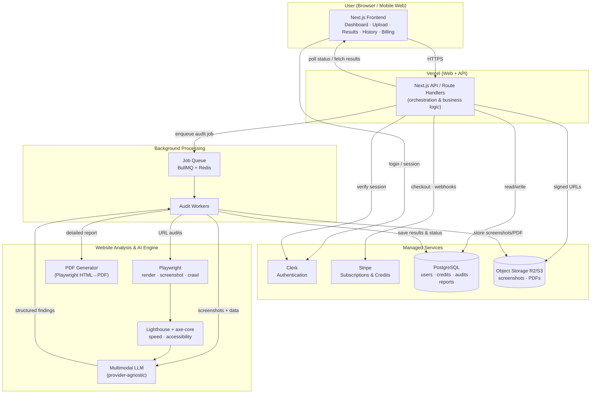
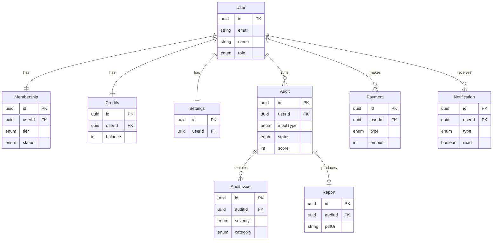
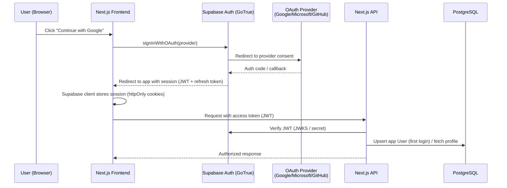
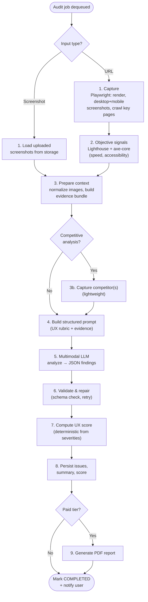
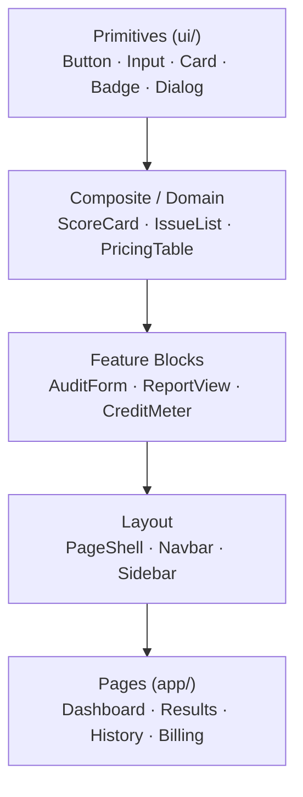
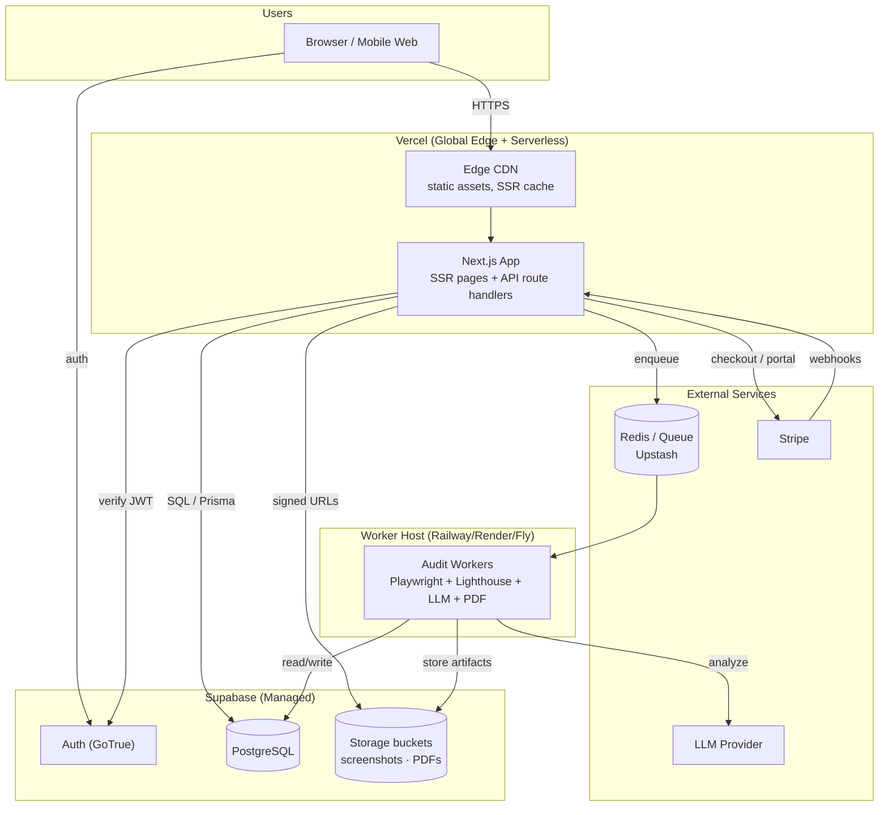
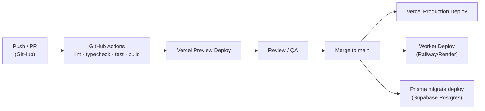

# Audient — Technical Architecture Document

**Status:** Draft (in progress)
**Last updated:** 2026-07-26
**Owner:** Raghunath Kamlekar
**Related:** Audient Product Requirements Document (PRD)

---

## 1. Product Overview

### 1.1 What Audient Is
Audient is an **AI-powered UX Audit SaaS** that helps small businesses understand and fix the user-experience problems hurting their websites' business goals (leads, sales, sign-ups). Users submit their site and receive an expert-level UX audit in minutes — no designer required.

### 1.2 What Users Can Do
- **Submit a website for audit** via two input modes:
  - **Screenshot / image upload** — available to all users (including Free).
  - **Live website URL** — available to paid (Pro/Agency) users; enables full user-flow analysis via headless rendering and crawling.
- **Receive an AI-generated UX audit** grounded in established UX principles, covering navigation clarity, CTA effectiveness, visual hierarchy, mobile responsiveness, copy/messaging, trust signals, page speed, accessibility, and conversion flow.
- **Get accessibility analysis** as part of the audit.
- **Get business recommendations** — prioritized, plain-language fixes with business impact and competitive context.
- **Download PDF reports** — detailed reports for paid tiers (Free users see a brief on-screen summary).
- **Access audit history** — view, revisit, and re-download past audits and reports.

### 1.3 Core Value from a Technical Standpoint
The product's technical "engine" is a **multimodal AI audit pipeline** that must:
1. **Capture** what a real visitor sees — screenshots (desktop + mobile), page structure, and performance data.
2. **Analyze** that evidence against a structured UX-principles rubric using a multimodal LLM.
3. **Produce** consistent, structured, evidence-grounded findings (issues, severity, fixes, business impact).
4. **Render** those findings into an intuitive on-screen report and a downloadable PDF.

### 1.4 Key Product Characteristics That Shape the Architecture
- **Asynchronous, long-running workloads** — screenshot audits up to ~90s; full URL audits up to ~8 min. Requires background job processing with progress feedback.
- **Credit-based usage** — every audit consumes credits per tier; the system must meter, enforce, and refund credits reliably.
- **Tiered access** — Free, Pro, and Agency tiers gate features (link audits, detailed PDFs, credit allotments) and are driven by subscription billing.
- **Multimodal AI dependency** — the audit quality and cost hinge on the LLM; the architecture must keep the model provider swappable and costs controllable.
- **Trust & privacy sensitivity** — users submit their own website data; no AI training on user data, deletion on request, and secure isolation of each user's audits.
- **Responsive web delivery** — desktop-first web app that is fully usable on mobile; no native apps in v1.

### 1.5 User Tiers (Technical Summary)

| Tier   | Input Modes            | Report Output          | Relative Credit Allotment |
|--------|------------------------|------------------------|---------------------------|
| Free   | Screenshot only        | Brief on-screen summary| Lowest                    |
| Pro    | Screenshot + URL       | Detailed PDF           | Medium                    |
| Agency | Screenshot + URL       | Detailed PDF           | Highest                   |

---

## 2. Technology Stack

A modern, mostly managed stack chosen to maximize development speed, keep infrastructure overhead low (important for a small team), and scale cleanly as audit volume grows. The guiding principle: **use managed services for undifferentiated heavy lifting, and own only what is core to Audient (the AI audit pipeline).**

### 2.1 Stack at a Glance

| Layer | Choice | Primary Reason |
|-------|--------|----------------|
| Frontend framework | **Next.js (React) + TypeScript** | SSR for SEO + fast app UX in one framework |
| Styling / UI | **Tailwind CSS + shadcn/ui** | Fast, consistent, accessible, responsive UI |
| Backend/API | **Node.js (TypeScript)** via Next.js Route Handlers → NestJS/Fastify as it grows | One language across stack; easy start |
| Background jobs | **BullMQ + Redis** (or managed queue) | Reliable async processing for long audits |
| AI / LLM | **Multimodal LLM behind a provider-agnostic layer** | Core capability; must stay swappable |
| Browser automation | **Playwright** | Render, screenshot, and crawl live sites |
| Performance/a11y data | **Lighthouse / PageSpeed Insights + axe-core** | Objective speed & accessibility metrics |
| Database | **PostgreSQL** (Supabase or Neon) | Relational integrity for users/credits/audits |
| ORM | **Prisma** | Type-safe DB access in TypeScript |
| Object storage | **Cloudflare R2 / AWS S3** | Store screenshots & generated PDFs cheaply |
| Auth | **Clerk** (or Auth.js / Supabase Auth) | Secure, fast-to-integrate authentication |
| Payments | **Stripe** | Industry standard for SaaS subscriptions |
| PDF generation | **Playwright (HTML → PDF)** | Reuses the web report design; pixel-accurate |
| Caching | **Redis** | Sessions, rate limits, result/model caching |
| Hosting | **Vercel** (web/app) + **Railway/Render/Fly** (workers) | Native Next.js hosting + flexible worker hosts |
| CI/CD | **GitHub Actions** | Automated build, test, deploy |
| Monitoring | **Sentry + Better Stack/Datadog** | Error tracking + uptime/logs/metrics |

### 2.2 Frontend

**Next.js (React) + TypeScript**
- **Why:** A single framework serves both the **SEO-critical marketing/landing pages** (server-side rendered) and the **interactive app dashboard**. This matters because your acquisition strategy leans on SEO/social.
- TypeScript gives end-to-end type safety, reducing bugs across a fast-moving codebase.

**Tailwind CSS + shadcn/ui**
- **Why:** Enables a clean, professional, responsive UI (a must, since Audient sells good UX) without hand-writing large CSS files. shadcn/ui provides accessible, customizable components that match the Lovable-style, card-driven aesthetic from the PRD.

### 2.3 Backend / API

**Node.js + TypeScript**
- **Why:** Sharing one language (TypeScript) across frontend and backend reduces context-switching and lets a small team move fast. Start with **Next.js Route Handlers** for MVP simplicity; extract a dedicated **NestJS or Fastify** service if/when the API surface and worker logic grow.

**BullMQ + Redis (background job queue)**
- **Why:** Audits are **long-running** (up to ~90s for screenshots, ~8 min for URL crawls). Running them inline would block requests and time out. A queue lets audits run in **background workers** with retries, progress tracking, and controlled concurrency (protecting AI/crawl cost budgets).

### 2.4 AI / Audit Layer

**Multimodal LLM behind a provider-agnostic abstraction**
- **Why:** The audit's quality *is* the product. A top-tier vision-capable LLM can "see" screenshots and reason about layout, hierarchy, copy, and flow. Wrapping it in an **abstraction layer** is critical so Audient can swap providers/models as **price and quality change** — protecting both margins and output quality.
- **Structured output (JSON):** the model returns issues, severity, fixes, and business impact in a fixed schema, enabling consistent scoring and clean report rendering.

**Playwright (browser automation)**
- **Why:** For live-URL audits, Playwright renders the real site (including JS-heavy pages), captures **desktop + mobile screenshots**, and crawls key pages to map the user flow — the raw evidence fed to the LLM. It's more modern and reliable than Puppeteer for multi-browser, multi-viewport capture.

**Lighthouse / PageSpeed Insights + axe-core**
- **Why:** The LLM shouldn't *guess* at performance or accessibility. These tools provide **objective, measurable** page-speed and accessibility (WCAG) data, grounding those parts of the audit in facts rather than model inference.

### 2.5 Data & Storage

**PostgreSQL (Supabase or Neon) + Prisma**
- **Why:** Audient's data is **relational and integrity-sensitive** — users, subscriptions, credit balances, audits, and reports with clear relationships. Postgres handles transactional credit deduction/refunds safely. Supabase/Neon provide a **managed, scalable** Postgres so there's no DB ops burden. Prisma adds type-safe queries in TypeScript.

**Cloudflare R2 / AWS S3 (object storage)**
- **Why:** Screenshots and generated PDFs are **large binary artifacts** that don't belong in a database. Object storage is cheap and scalable; **R2** is attractive for its zero egress fees (reports are downloaded frequently).

**Redis (caching)**
- **Why:** Powers rate limiting, session/queue state, and caching of expensive results — reducing repeat AI cost and improving responsiveness.

### 2.6 Auth, Payments, Hosting

**Clerk (or Auth.js / Supabase Auth)**
- **Why:** Authentication is security-critical and easy to get wrong. A managed provider gives secure sessions, social login, and user management out of the box, letting the team focus on the audit engine. (Auth.js or Supabase Auth are fine alternatives, especially if consolidating on Supabase.)

**Stripe**
- **Why:** The de-facto standard for SaaS subscriptions, handling Pro/Agency plans, credit top-ups (one-time payments), invoicing, and **PCI-compliant** payment handling — so Audient never touches raw card data. Stripe webhooks drive tier changes and renewals.

**Vercel (web/app) + Railway/Render/Fly (workers)**
- **Why:** Vercel is the native, zero-config home for Next.js with global CDN and preview deploys. Long-running audit **workers** run better on a container host (Railway/Render/Fly) that isn't bound by serverless execution time limits.

**Playwright for PDF generation**
- **Why:** Instead of maintaining a separate PDF layout, render the **same HTML report template to PDF** with Playwright. One design source → the web report and PDF always match, and it's pixel-accurate.

### 2.7 Tooling & Operations

- **GitHub Actions (CI/CD):** automated linting, tests, and deploys on every push/PR.
- **Sentry:** real-time error tracking across frontend, API, and workers.
- **Better Stack / Datadog:** uptime monitoring, log aggregation, and metrics to support the 99.9% uptime target.

### 2.8 Why This Stack Overall
- **Speed to market:** managed services (Vercel, Supabase, Clerk, Stripe) remove ops overhead so the team can hit the ~1-month MVP target.
- **Single language (TypeScript):** shared types and skills across the whole system.
- **Cost control:** provider-agnostic AI layer, queue-based concurrency limits, caching, and R2 storage keep per-audit costs — and margins — under control.
- **Scalability:** stateless web/API + horizontally scalable workers + managed Postgres scale with audit volume.
- **Right-sized:** avoids premature microservices/Kubernetes complexity; a modular monolith + workers is ideal for this stage.

---

## 3. High-Level System Architecture

### 3.1 Architecture Style
Audient uses a **modular monolith + asynchronous workers** pattern:
- A **Next.js web/API application** serves the UI and handles synchronous requests (auth, uploads, fetching results, billing).
- **Background workers** handle the long-running audit workloads (rendering, crawling, AI analysis, PDF generation) via a **job queue**, so the user-facing app stays fast and never blocks.
- **Managed services** (auth, database, storage, payments, LLM) are integrated as external dependencies.

This keeps the system simple to build and operate now, while the queue-based separation lets the heavy AI/crawl work scale independently later.

### 3.2 System Diagram



### 3.3 Component Responsibilities

- **Frontend (Next.js)** — Renders the dashboard, upload flow, results view, audit history, and billing screens. Handles auth via Clerk, submits audits to the API, and polls (or subscribes) for audit status/results.
- **Authentication (Clerk)** — Manages sign-up/login and issues sessions. The API verifies every request's session before performing actions or returning a user's data.
- **API / Orchestration (Next.js route handlers)** — The business-logic hub: validates requests, checks tier + credit balance, enqueues audit jobs, records audits in the DB, issues signed URLs for uploads/downloads, and handles Stripe checkout/webhooks.
- **Job Queue (BullMQ + Redis)** — Decouples the fast web layer from slow audit work; buffers jobs, enforces concurrency limits (cost control), and supports retries.
- **Audit Workers** — Execute the audit end to end: orchestrate crawling/analysis, call the AI engine, deduct/refund credits, generate the PDF, persist results, and update job status.
- **Website Analysis (Playwright + Lighthouse + axe-core)** — For URL audits, renders the site, captures desktop/mobile screenshots, crawls key pages, and collects objective performance & accessibility data.
- **AI Engine (multimodal LLM)** — Consumes screenshots + structural + performance/accessibility data and returns **structured findings** (issues, severity, fixes, business impact, competitive context) against the UX rubric.
- **PDF Generation (Playwright HTML→PDF)** — Converts the detailed HTML report into a downloadable PDF for paid tiers, reusing the on-screen report design.
- **Database (PostgreSQL)** — Source of truth for users, subscriptions, credit balances, audit records, and report metadata.
- **Object Storage (R2/S3)** — Stores large binary artifacts (screenshots, PDFs); served to users via time-limited signed URLs.
- **Payments (Stripe)** — Manages subscriptions, credit top-ups, and renewals; webhooks notify the API of tier/credit changes.

### 3.4 End-to-End Audit Flow (Happy Path)
1. **Authenticated user** submits an audit (screenshot upload, or URL for Pro/Agency) from the frontend.
2. **API** verifies the session, confirms the tier allows the input mode, and checks the **credit balance**.
3. API records a new **audit (status: queued)**, reserves credits, and **enqueues a job**.
4. The frontend shows a **progress state** and polls for status.
5. A **worker** picks up the job:
   - For URL audits: **Playwright** renders/screenshots/crawls; **Lighthouse + axe-core** gather perf/a11y data.
   - The **AI engine** analyzes the evidence and returns structured findings.
6. The worker **persists results**, stores artifacts (screenshots) in object storage, and — for paid tiers — generates and stores the **PDF**.
7. The worker **finalizes credits** (deduct on success, refund on failure) and sets audit **status: complete**.
8. The frontend fetches the finished audit and shows the **results/report**; the PDF is available via a signed download URL, and the audit appears in **history**.

### 3.5 Communication Patterns
- **Client ↔ API:** HTTPS (REST-style JSON). Auth via Clerk session tokens on every request.
- **API ↔ Workers:** asynchronous via the **job queue** (no direct synchronous coupling).
- **Status updates to UI:** short polling for MVP (simple, reliable); can upgrade to WebSockets/SSE later for real-time progress.
- **File access:** uploads and downloads use **signed URLs** directly to/from object storage, keeping large payloads off the API.
- **Stripe ↔ API:** outbound checkout/session creation + inbound **webhooks** for subscription and payment events.

---

## 4. Project Folder Structure

A **feature-oriented, layered** structure that keeps UI, business logic, and integrations cleanly separated — so the codebase stays navigable as Audient grows from MVP to a larger product.

### 4.1 Top-Level Layout

```text
audient/
├── src/
│   ├── app/                  # Next.js App Router (routes, layouts, API handlers)
│   ├── components/           # Reusable React UI components
│   ├── hooks/                # Custom React hooks (client-side logic)
│   ├── lib/                  # Third-party client setup & core integrations
│   ├── services/             # Business logic & domain services (server-side)
│   ├── types/                # Shared TypeScript types & interfaces
│   ├── utils/                # Pure, framework-agnostic helper functions
│   └── styles/               # Global styles & Tailwind config entry
├── public/                   # Static assets (images, fonts, favicons)
├── docs/                     # Documentation (PRD, this architecture doc)
├── prisma/                   # Prisma schema & migrations
├── workers/                  # Background job workers (audit pipeline)
├── tests/                    # Test suites (unit / integration / e2e)
├── .env.example              # Documented environment variables
├── package.json
├── tsconfig.json
└── next.config.js
```

### 4.2 `src/app/` — Routing & API (App Router)

```text
src/app/
├── (marketing)/              # Public, SEO-focused pages (route group)
│   ├── page.tsx              # Landing page
│   ├── pricing/
│   └── layout.tsx
├── (auth)/                   # Auth screens (sign-in / sign-up)
│   ├── sign-in/
│   └── sign-up/
├── (dashboard)/              # Authenticated app (route group)
│   ├── dashboard/            # Home / overview
│   ├── audit/
│   │   ├── new/              # Start a new audit (upload / URL)
│   │   └── [auditId]/        # Audit results / report view
│   ├── history/              # Past audits
│   ├── billing/             # Plan, credits, upgrade
│   └── layout.tsx            # Shared authenticated layout (nav, guards)
├── api/                      # Route handlers (backend endpoints)
│   ├── audits/               # Create/list/get audits
│   ├── webhooks/
│   │   └── stripe/           # Stripe webhook receiver
│   ├── billing/              # Checkout sessions, credit top-ups
│   └── uploads/              # Signed URL generation
├── layout.tsx                # Root layout
└── globals.css
```
- **Route groups** (`(marketing)`, `(auth)`, `(dashboard)`) separate concerns and layouts without affecting URLs.
- API **route handlers** stay thin — they validate input and delegate to `services/`.

### 4.3 `src/components/` — UI Components

```text
src/components/
├── ui/                       # Primitives (Button, Card, Input) — shadcn/ui
├── layout/                   # Navbar, Sidebar, Footer, PageShell
├── audit/                    # AuditForm, ScoreCard, IssueList, SeverityBadge
├── report/                   # ReportView, AnnotatedScreenshot, PdfDownload
├── billing/                  # PricingTable, CreditMeter, UpgradeDialog
└── common/                   # Shared widgets (EmptyState, Loader, Toast)
```
- Grouped **by feature/domain**, with generic primitives isolated in `ui/`.

### 4.4 `src/hooks/` — Custom Hooks
```text
src/hooks/
├── useAudit.ts               # Submit audit, poll status, fetch results
├── useCredits.ts             # Read/track credit balance
├── useSubscription.ts        # Current tier & billing state
└── useUser.ts                # Auth/user convenience wrapper
```
- Encapsulate client-side data fetching and stateful logic; keep components declarative.

### 4.5 `src/lib/` — Integrations & Client Setup
```text
src/lib/
├── db.ts                     # Prisma client singleton
├── redis.ts                  # Redis / queue connection
├── stripe.ts                 # Stripe SDK client
├── storage.ts                # R2/S3 client + signed URL helpers
├── auth.ts                   # Clerk/auth helpers & guards
├── ai/                       # LLM provider-agnostic client
│   ├── index.ts              # Public interface (analyze())
│   └── providers/            # Swappable model providers
└── queue.ts                  # BullMQ queue definitions
```
- `lib/` holds **configured clients and adapters** to external systems — the seam that keeps providers swappable (esp. the AI layer).

### 4.6 `src/services/` — Business Logic (Server-Side)
```text
src/services/
├── audit/
│   ├── audit.service.ts      # Orchestrates audit lifecycle
│   ├── crawler.service.ts    # Playwright render/crawl/screenshot
│   ├── performance.service.ts# Lighthouse + axe-core
│   └── analysis.service.ts   # Prompt building + LLM analysis
├── credits/
│   └── credits.service.ts    # Reserve/deduct/refund credits (transactional)
├── billing/
│   └── billing.service.ts    # Stripe subscriptions & webhooks
├── report/
│   └── report.service.ts     # Report assembly + PDF generation
└── user/
    └── user.service.ts       # User/account operations
```
- The **domain core**. Services are framework-agnostic and reusable by both API route handlers and background workers — critical since audits run in `workers/`.

### 4.7 Supporting Directories
```text
src/types/     # Shared types: Audit, Issue, Severity, Report, User, Tier, Credit
src/utils/     # Pure helpers: formatting, scoring math, validation, constants
src/styles/    # Tailwind entry, design tokens, global CSS
prisma/        # schema.prisma + migrations (single source of DB truth)
workers/       # Queue consumers that invoke src/services (audit pipeline)
tests/         # Unit (services/utils), integration (API), e2e (Playwright)
public/        # Logos, icons, static images, fonts
docs/          # PRD, Technical Architecture, ADRs
```

### 4.8 Structural Principles
- **Separation of concerns:** `app/` (routing/UI) → `services/` (business logic) → `lib/` (integrations). Route handlers stay thin.
- **Feature-first grouping:** components, services, and types cluster by domain (audit, billing, report) for easy navigation.
- **Shared logic, two entry points:** `services/` is consumed by *both* API handlers and background `workers/`, avoiding duplication.
- **Swap-friendly seams:** external providers (AI, storage, payments) live behind `lib/` adapters, so they can be replaced without touching business logic.
- **Type safety everywhere:** shared `types/` + Prisma-generated types keep the frontend, API, and workers in sync.
- **`@/` path alias:** import from `@/services/...`, `@/lib/...` instead of brittle relative paths.

---

## 5. Database Schema

PostgreSQL via Prisma. The schema is normalized around a central **User**, with **Membership** and **Credits** governing access/usage, **Audits → AuditIssues + Reports** capturing the core product output, and **Payments/Notifications/Settings** supporting billing and account management.

### 5.1 Entity-Relationship Overview



### 5.2 Prisma Schema

```prisma
// ---------- Enums ----------
enum Role {
  USER
  ADMIN
}

enum Tier {
  FREE
  PRO
  AGENCY
}

enum MembershipStatus {
  ACTIVE
  PAST_DUE
  CANCELED
  TRIALING
}

enum AuditInputType {
  SCREENSHOT
  URL
}

enum AuditStatus {
  QUEUED
  PROCESSING
  COMPLETED
  FAILED
}

enum Severity {
  CRITICAL
  MAJOR
  MINOR
}

enum IssueCategory {
  NAVIGATION
  CTA
  VISUAL_HIERARCHY
  MOBILE_RESPONSIVENESS
  COPY_MESSAGING
  TRUST_SIGNALS
  PAGE_SPEED
  ACCESSIBILITY
  CONVERSION_FLOW
}

enum PaymentType {
  SUBSCRIPTION
  CREDIT_TOPUP
  REFUND
}

enum PaymentStatus {
  PENDING
  SUCCEEDED
  FAILED
  REFUNDED
}

enum CreditTxnType {
  MONTHLY_GRANT
  TOPUP
  AUDIT_DEDUCTION
  REFUND
}

enum NotificationType {
  AUDIT_COMPLETE
  AUDIT_FAILED
  LOW_CREDITS
  PAYMENT
  SYSTEM
}

// ---------- Core ----------
model User {
  id            String        @id @default(uuid())
  email         String        @unique
  name          String?
  authProviderId String?      @unique   // Clerk/Auth provider id
  role          Role          @default(USER)
  membership    Membership?
  credits       Credits?
  settings      Settings?
  audits        Audit[]
  payments      Payment[]
  notifications Notification[]
  createdAt     DateTime      @default(now())
  updatedAt     DateTime      @updatedAt
}

model Membership {
  id                   String           @id @default(uuid())
  userId               String           @unique
  user                 User             @relation(fields: [userId], references: [id], onDelete: Cascade)
  tier                 Tier             @default(FREE)
  status               MembershipStatus @default(ACTIVE)
  stripeCustomerId     String?          @unique
  stripeSubscriptionId String?          @unique
  currentPeriodEnd     DateTime?
  createdAt            DateTime         @default(now())
  updatedAt            DateTime         @updatedAt
}

model Credits {
  id             String             @id @default(uuid())
  userId         String             @unique
  user           User               @relation(fields: [userId], references: [id], onDelete: Cascade)
  balance        Int                @default(0)   // total available credits
  monthlyGrant   Int                @default(300) // reset each cycle by tier
  lastResetAt    DateTime           @default(now())
  transactions   CreditTransaction[]
  updatedAt      DateTime           @updatedAt
}

// Ledger for auditable credit movements (grants, deductions, refunds, top-ups)
model CreditTransaction {
  id          String        @id @default(uuid())
  creditsId   String
  credits     Credits       @relation(fields: [creditsId], references: [id], onDelete: Cascade)
  type        CreditTxnType
  amount      Int           // positive = added, negative = spent
  balanceAfter Int
  auditId     String?       // link deductions/refunds to an audit
  note        String?
  createdAt   DateTime      @default(now())

  @@index([creditsId])
}

// ---------- Audits ----------
model Audit {
  id           String         @id @default(uuid())
  userId       String
  user         User           @relation(fields: [userId], references: [id], onDelete: Cascade)
  inputType    AuditInputType
  sourceUrl    String?        // for URL audits
  screenshotUrls String[]     // stored object-storage keys/URLs
  status       AuditStatus    @default(QUEUED)
  score        Int?           // overall UX score 0-100
  creditsCost  Int
  summary      String?        // brief summary (shown to Free tier)
  errorMessage String?        // populated on FAILED
  issues       AuditIssue[]
  report       Report?
  startedAt    DateTime?
  completedAt  DateTime?
  createdAt    DateTime       @default(now())
  updatedAt    DateTime       @updatedAt

  @@index([userId])
  @@index([status])
}

model AuditIssue {
  id             String        @id @default(uuid())
  auditId        String
  audit          Audit         @relation(fields: [auditId], references: [id], onDelete: Cascade)
  category       IssueCategory
  severity       Severity
  title          String
  description    String        // what & why it matters
  recommendation String        // concrete fix
  businessImpact String?       // conversion/revenue framing
  screenshotUrl  String?       // annotated evidence
  createdAt      DateTime      @default(now())

  @@index([auditId])
  @@index([severity])
}

model Report {
  id          String   @id @default(uuid())
  auditId     String   @unique
  audit       Audit    @relation(fields: [auditId], references: [id], onDelete: Cascade)
  pdfUrl      String?  // object-storage location of generated PDF
  competitiveAnalysis Json?  // structured competitor comparison
  generatedAt DateTime @default(now())
}

// ---------- Billing ----------
model Payment {
  id                    String        @id @default(uuid())
  userId                String
  user                  User          @relation(fields: [userId], references: [id], onDelete: Cascade)
  type                  PaymentType
  status                PaymentStatus @default(PENDING)
  amount                Int           // in smallest currency unit (e.g., cents)
  currency              String        @default("usd")
  creditsGranted        Int?          // for credit top-ups
  stripePaymentIntentId String?       @unique
  stripeInvoiceId       String?       @unique
  createdAt             DateTime      @default(now())

  @@index([userId])
}

// ---------- Account ----------
model Notification {
  id        String           @id @default(uuid())
  userId    String
  user      User             @relation(fields: [userId], references: [id], onDelete: Cascade)
  type      NotificationType
  title     String
  message   String
  read      Boolean          @default(false)
  metadata  Json?            // e.g., { auditId }
  createdAt DateTime         @default(now())

  @@index([userId, read])
}

model Settings {
  id                  String   @id @default(uuid())
  userId              String   @unique
  user                User     @relation(fields: [userId], references: [id], onDelete: Cascade)
  emailNotifications  Boolean  @default(true)
  productUpdates      Boolean  @default(true)
  locale              String   @default("en")
  timezone            String   @default("UTC")
  updatedAt           DateTime @updatedAt
}
```

### 5.3 Entity Notes & Rationale

- **User** — Central identity; links to the external auth provider (Clerk) via `authProviderId`. Owns everything else via cascade deletes (supports "delete my data" from the PRD).
- **Membership** — One-to-one with User; holds **tier**, subscription **status**, and Stripe identifiers. Separated from User so billing state evolves independently.
- **Credits** — One-to-one balance record, backed by a **CreditTransaction ledger** for auditable grants/deductions/refunds. The ledger makes credit disputes and the "refund on failed audit" rule (PRD §8.5) traceable.
- **Audit** — The core work item. Captures input type, source (URL/screenshots), lifecycle **status**, **score**, credit cost, and a Free-tier **summary**. Indexed on `userId` and `status` for history views and worker queries.
- **AuditIssue** — Individual findings, each with **category** (the UX dimensions), **severity**, description, recommendation, business impact, and annotated screenshot. One-to-many from Audit.
- **Report** — One-to-one with a completed Audit; stores the **PDF location** and structured **competitive analysis**. Kept separate so the heavy report artifact is decoupled from audit records.
- **Payment** — Every Stripe money movement (subscription, top-up, refund) with status and Stripe references — the financial audit trail.
- **Notification** — In-app/email notifications (audit complete/failed, low credits, payments). Indexed on `(userId, read)` for unread counts.
- **Settings** — Per-user preferences (notifications, locale, timezone).

### 5.4 Key Design Decisions
- **Ledger over mutable counter:** credits use both a fast `balance` *and* an append-only `CreditTransaction` history — accuracy + auditability.
- **Transactional credit handling:** reserve/deduct/refund happen in DB transactions (Postgres) to prevent double-spend under concurrency.
- **Binary artifacts stay in object storage:** the DB stores only **URLs/keys** to screenshots and PDFs, never the files themselves.
- **Cascade deletes** from User support GDPR "delete on request."
- **Enums for controlled vocab:** tiers, statuses, severities, and categories are enums for integrity and consistent reporting.
- **Indexes** on hot query paths (`Audit.userId`, `Audit.status`, `AuditIssue.severity`, `Notification.userId/read`).

---

## 6. REST API Design

RESTful, resource-oriented JSON API served by Next.js route handlers under `/api`. All endpoints (except public/webhook ones) require an authenticated Clerk session and operate on the **current user's** data.

### 6.1 Conventions
- **Base path:** `/api/v1`
- **Format:** JSON request/response; `Content-Type: application/json`.
- **Auth:** Clerk session token (cookie/Bearer). The server derives the user; clients never pass `userId`.
- **Versioning:** URI-based (`/v1`) for stable evolution.
- **IDs:** UUIDs.
- **Timestamps:** ISO 8601 (UTC).
- **Money:** integer smallest currency unit (cents).
- **Pagination:** cursor or page params — `?limit=20&cursor=<id>` — returning `{ data, nextCursor }`.
- **Filtering/sorting:** query params, e.g. `?status=COMPLETED&sort=-createdAt`.

### 6.2 Standard Response Envelope
```json
// Success
{ "data": { /* resource */ }, "meta": { /* optional */ } }

// Error
{ "error": { "code": "INSUFFICIENT_CREDITS", "message": "Not enough credits for this audit." } }
```

### 6.3 HTTP Status Codes
| Code | Meaning |
|------|---------|
| 200 | OK (read/update) |
| 201 | Created (new resource) |
| 202 | Accepted (async audit queued) |
| 400 | Validation error |
| 401 | Not authenticated |
| 403 | Authenticated but not allowed (e.g., tier lacks URL audits) |
| 404 | Not found / not owned by user |
| 409 | Conflict (e.g., duplicate) |
| 422 | Business rule failed (e.g., insufficient credits) |
| 429 | Rate limited |
| 500 | Server error |

### 6.4 Endpoints

#### Auth & Current User
| Method | Endpoint | Description |
|--------|----------|-------------|
| GET | `/api/v1/me` | Get current user profile, tier, and credit balance |
| PATCH | `/api/v1/me` | Update profile (name, etc.) |
| DELETE | `/api/v1/me` | Delete account & all data (GDPR) |

> Sign-up/sign-in/session are handled by Clerk on the client; the API only consumes the resulting session.

#### Audits (core)
| Method | Endpoint | Description |
|--------|----------|-------------|
| POST | `/api/v1/audits` | Create/start an audit (screenshot or URL) → **202**, returns audit in `QUEUED` |
| GET | `/api/v1/audits` | List current user's audits (history), paginated & filterable |
| GET | `/api/v1/audits/{auditId}` | Get one audit with status, score, summary |
| GET | `/api/v1/audits/{auditId}/status` | Lightweight status poll (`QUEUED`/`PROCESSING`/`COMPLETED`/`FAILED` + progress) |
| GET | `/api/v1/audits/{auditId}/issues` | List issues for an audit (filter by severity/category) |
| DELETE | `/api/v1/audits/{auditId}` | Delete an audit and its artifacts |

**POST `/api/v1/audits` — request (screenshot):**
```json
{
  "inputType": "SCREENSHOT",
  "screenshotKeys": ["uploads/ab12.png", "uploads/ab13.png"]
}
```
**POST `/api/v1/audits` — request (URL):**
```json
{
  "inputType": "URL",
  "sourceUrl": "https://example-business.com",
  "competitors": ["https://competitor-a.com"]
}
```
**Response (202):**
```json
{ "data": { "id": "…", "status": "QUEUED", "creditsCost": 400, "estimatedSeconds": 480 } }
```
- Server enforces: **tier gate** (URL → 403 for Free), **credit check** (→ 422 if insufficient), reserves credits, enqueues the job.

#### Reports
| Method | Endpoint | Description |
|--------|----------|-------------|
| GET | `/api/v1/audits/{auditId}/report` | Get report metadata (incl. competitive analysis) |
| GET | `/api/v1/audits/{auditId}/report/pdf` | Get a signed URL to download the PDF (Pro/Agency → 403 for Free) |
| POST | `/api/v1/audits/{auditId}/report/regenerate` | Re-generate the PDF (admin/edge cases) |

#### Uploads (screenshots)
| Method | Endpoint | Description |
|--------|----------|-------------|
| POST | `/api/v1/uploads/sign` | Get a signed URL to upload a screenshot directly to object storage |

**Request/Response:**
```json
// request
{ "fileName": "home.png", "contentType": "image/png" }
// response
{ "data": { "uploadUrl": "https://…", "key": "uploads/ab12.png", "expiresIn": 300 } }
```

#### Credits
| Method | Endpoint | Description |
|--------|----------|-------------|
| GET | `/api/v1/credits` | Current balance, monthly grant, next reset date |
| GET | `/api/v1/credits/transactions` | Paginated credit ledger (grants/deductions/refunds) |
| POST | `/api/v1/credits/topups` | Purchase a credit top-up → returns Stripe checkout URL |

#### Billing & Membership
| Method | Endpoint | Description |
|--------|----------|-------------|
| GET | `/api/v1/membership` | Current tier, status, renewal date |
| POST | `/api/v1/billing/checkout` | Create Stripe Checkout session to upgrade (Pro/Agency) |
| POST | `/api/v1/billing/portal` | Create Stripe Billing Portal session (manage/cancel) |
| GET | `/api/v1/payments` | List payment history |

#### Notifications
| Method | Endpoint | Description |
|--------|----------|-------------|
| GET | `/api/v1/notifications` | List notifications (filter `?read=false`) |
| PATCH | `/api/v1/notifications/{id}` | Mark a notification read |
| POST | `/api/v1/notifications/read-all` | Mark all as read |

#### Settings
| Method | Endpoint | Description |
|--------|----------|-------------|
| GET | `/api/v1/settings` | Get user preferences |
| PATCH | `/api/v1/settings` | Update preferences (notifications, locale, timezone) |

#### Webhooks (no session; verified by signature)
| Method | Endpoint | Description |
|--------|----------|-------------|
| POST | `/api/webhooks/stripe` | Stripe events: subscription created/updated/canceled, payment succeeded/failed → updates Membership, Credits, Payment |

#### System / Public
| Method | Endpoint | Description |
|--------|----------|-------------|
| GET | `/api/health` | Health check (uptime monitoring) |

### 6.5 Async Audit Interaction Pattern
1. `POST /uploads/sign` (screenshot mode) → upload file to storage via signed URL.
2. `POST /audits` → **202** with audit `id` (`QUEUED`).
3. Poll `GET /audits/{id}/status` (MVP) — or receive a `AUDIT_COMPLETE` notification / future WebSocket push.
4. On `COMPLETED`: `GET /audits/{id}` + `/issues`, and `GET /audits/{id}/report/pdf` for the download link.

### 6.6 Cross-Cutting Rules
- **Ownership enforcement:** every resource fetch is scoped to the authenticated user (else 404).
- **Tier enforcement:** URL audits and PDF downloads are gated to Pro/Agency (403 otherwise).
- **Credit enforcement:** audits check + reserve credits (422 if insufficient); failed audits auto-refund.
- **Rate limiting:** per-user limits (429) via Redis to protect cost and prevent abuse.
- **Idempotency:** `POST /audits` and checkout accept an `Idempotency-Key` header to avoid duplicate charges/jobs.

---

## 7. Authentication Architecture

> **Decision:** Audient uses **Supabase Auth** as the authentication provider. This **finalizes** the auth choice and supersedes the earlier "Clerk (recommended)" note in §2 and §3 — those references should be read as Supabase Auth. Consolidating auth with the Supabase-hosted Postgres reduces moving parts and keeps user identity close to application data.

### 7.1 Supported Login Methods
- **Google** (OAuth)
- **Microsoft** (Azure AD OAuth)
- **GitHub** (OAuth)
- **Email** — email + password and/or passwordless magic link

All methods resolve to a **single canonical user** keyed by email, so a user signing in with Google and later with email lands on the same account (identity linking).

### 7.2 How Supabase Auth Fits
- **Supabase Auth (GoTrue)** manages credentials, OAuth handshakes, email verification, password reset, and **JWT issuance**.
- Auth users live in Supabase's managed `auth.users` table; Audient's **application data** lives in its own `public` schema (the `User` model in §5) linked by the Supabase user `id`.
- Audient never stores passwords or OAuth secrets — Supabase handles all credential material.

### 7.3 Authentication Flow (OAuth — Google/Microsoft/GitHub)



### 7.4 Authentication Flow (Email)
- **Password:** `signUp`/`signInWithPassword`; Supabase sends a **verification email** on sign-up and handles **password reset** links.
- **Magic link (passwordless):** `signInWithOtp` emails a one-time link; clicking it establishes a session.

### 7.5 Sessions & Tokens
- On success, Supabase issues a short-lived **access token (JWT)** + a long-lived **refresh token**.
- The Supabase client (browser + server helpers) stores them in **httpOnly, secure cookies** and auto-refreshes access tokens.
- Every API request carries the JWT; the server **verifies the signature and expiry** before processing.
- JWT claims (`sub` = Supabase user id, `email`, `role`) identify the user — the API always derives identity from the verified token, never from client-supplied IDs.

### 7.6 User Provisioning (First Login)
1. User authenticates via any provider → Supabase creates/returns an `auth.users` record.
2. On the first authenticated API call, Audient **upserts an application `User`** row keyed to the Supabase `id` (see `authProviderId` in §5.1), and creates the associated **Membership (FREE)**, **Credits (initial grant)**, and **Settings** defaults.
3. Subsequent logins simply resolve to the existing `User`.

> This provisioning can run in the API on first request, or via a Supabase **database trigger / auth webhook** that fires on new-user creation. Recommended: an auth webhook → API endpoint that seeds Membership/Credits/Settings atomically.

### 7.7 Authorization (post-authentication)
- **Application-level checks** in `services/` enforce business rules: tier gating (URL audits, PDF downloads), credit checks, and resource ownership.
- **Role** (`USER`/`ADMIN`) on the `User` model gates admin-only endpoints.
- **Row-Level Security (RLS):** if the frontend ever queries Supabase/Postgres directly, enable **RLS policies** so users can only read/write rows where `userId = auth.uid()`. For the API-mediated design, the API enforces ownership; RLS is defense-in-depth.

### 7.8 Security Considerations
- Passwords and OAuth tokens are managed entirely by Supabase (never stored by Audient).
- **httpOnly + secure + SameSite cookies** mitigate XSS/CSRF token theft.
- **Email verification** required before running audits _(recommended)_ to reduce abuse of free credits.
- **OAuth redirect URLs** are allow-listed per environment in the Supabase dashboard.
- Provider **client IDs/secrets** are stored as environment secrets, not in code.
- Account deletion (GDPR) removes both the Supabase `auth.users` record and the cascaded application data (§5).

### 7.9 Configuration Summary
| Provider | Setup |
|----------|-------|
| Google | OAuth client in Google Cloud Console; add client ID/secret + redirect URL in Supabase |
| Microsoft | App registration in Azure AD; configure Azure provider in Supabase |
| GitHub | OAuth App in GitHub developer settings; add credentials in Supabase |
| Email | Enable email provider; configure SMTP + templates (verification, reset, magic link) |

---

## 8. Subscription Plans & Billing Logic

> **Naming note:** This section uses **Free / Pro / Enterprise**. The **Enterprise** tier corresponds to the tier previously called **Agency** in the PRD and earlier sections (highest credits, all features). Treat `AGENCY` in the `Tier` enum (§5.2) as the Enterprise tier, or rename the enum value to `ENTERPRISE` for consistency.

### 8.1 Plan Matrix

| Capability | Free | Pro | Enterprise |
|------------|------|-----|------------|
| Price (monthly) | $0 | ~$29 | ~$99 |
| Screenshot audit | ✅ | ✅ | ✅ |
| Live URL audit | ❌ | ✅ | ✅ |
| Report output | Brief on-screen summary | Detailed PDF | Detailed PDF |
| Monthly credit grant | Lowest | Medium | Highest |
| Credit top-ups | ❌ | ✅ | ✅ |
| Competitive analysis | ❌ | ✅ | ✅ |
| Priority processing | ❌ | Standard | Higher queue priority |

Plans are defined as **configuration** (a plan catalog in code/DB) mapping each `Tier` → `{ priceId, monthlyCredits, features }`. Stripe **Price IDs** link each paid tier to its subscription product.

### 8.2 Technical Model
- **Membership** (§5) holds the user's `tier`, `status`, `stripeCustomerId`, `stripeSubscriptionId`, and `currentPeriodEnd`.
- **Credits** holds `balance`, `monthlyGrant`, and `lastResetAt`, with a **CreditTransaction** ledger for every movement.
- **Stripe** is the source of truth for *subscription state*; Audient's DB is the source of truth for *credit balances and usage*.

### 8.3 Upgrade Flow (Free → Pro / Enterprise)
1. User clicks Upgrade → `POST /api/v1/billing/checkout` with the target tier.
2. API creates a **Stripe Checkout Session** (mode `subscription`) tied to the user's `stripeCustomerId` and the tier's Price ID.
3. User completes payment on Stripe.
4. Stripe fires **`checkout.session.completed`** + **`customer.subscription.created`** → `POST /api/webhooks/stripe`.
5. Webhook handler (idempotently):
   - Sets `Membership.tier` and `status = ACTIVE`, stores subscription IDs and `currentPeriodEnd`.
   - **Grants the new tier's monthly credits** via a `MONTHLY_GRANT` credit transaction.
6. The user immediately gains URL audits, PDF reports, and top-up ability.

> Proration on mid-cycle upgrades is handled by Stripe; the credit grant policy on upgrade is a business choice — **recommended:** grant the difference (new tier grant − already-granted this cycle) to avoid double-granting.

### 8.4 Credit Deduction Logic (per audit)
Executed transactionally in `credits.service` when an audit is created:

```text
1. Determine cost from plan config + input type:
     SCREENSHOT → screenshotCost(tier)
     URL        → urlCost(tier)   // only Pro/Enterprise
2. BEGIN TRANSACTION
3. Lock the user's Credits row (SELECT ... FOR UPDATE)
4. IF balance < cost  → ROLLBACK, return 422 INSUFFICIENT_CREDITS
5. balance -= cost
6. INSERT CreditTransaction { type: AUDIT_DEDUCTION, amount: -cost, balanceAfter, auditId }
7. Create Audit (status QUEUED, creditsCost = cost)
8. COMMIT
9. Enqueue audit job
```

- **Row locking (`FOR UPDATE`)** prevents double-spend from concurrent audits.
- Credits are **reserved at creation** (deducted up front), not after completion.

### 8.5 Refund Logic (failed audits)
When a worker marks an audit `FAILED` (site unreachable, timeout, internal error):
```text
1. BEGIN TRANSACTION
2. Lock Credits row
3. balance += audit.creditsCost
4. INSERT CreditTransaction { type: REFUND, amount: +creditsCost, balanceAfter, auditId }
5. Set Audit.status = FAILED, errorMessage
6. COMMIT
7. Create Notification (AUDIT_FAILED)
```
- Guarantees users are never charged for audits that didn't produce value (PRD §8.5).
- Refunds are **idempotent** (guard against double-refund on retries).

### 8.6 Subscription Renewal (monthly cycle)
1. At `currentPeriodEnd`, Stripe auto-charges and fires **`invoice.payment_succeeded`** + **`customer.subscription.updated`**.
2. Webhook handler:
   - Updates `currentPeriodEnd` to the new period.
   - **Resets credits to the tier's monthly grant** (`MONTHLY_GRANT` transaction) and updates `lastResetAt`.
   - Records a `Payment` (type `SUBSCRIPTION`, status `SUCCEEDED`).
3. **Credit reset policy** _(recommended):_
   - **Plan (granted) credits do NOT roll over** — reset to the monthly grant each cycle.
   - **Purchased top-up credits DO roll over** (tracked distinctly so they survive resets).

### 8.7 Failed Payment / Dunning
- **`invoice.payment_failed`** → set `Membership.status = PAST_DUE`; notify user; rely on Stripe **Smart Retries / dunning**.
- If retries ultimately fail → **`customer.subscription.deleted`** → set `status = CANCELED`, **downgrade tier to FREE**, disable URL audits/PDF, and cap credits at the Free grant.

### 8.8 Cancellation & Downgrade
- User cancels via **Stripe Billing Portal** (`POST /api/v1/billing/portal`).
- **Cancel at period end** (recommended): user keeps paid features until `currentPeriodEnd`; then `subscription.deleted` downgrades to Free.
- Downgrade effects: disable URL audits & PDF downloads, stop top-ups, reset monthly grant to Free level (retain any rolled-over top-up credits per policy).

### 8.9 Credit Top-Ups (Pro / Enterprise)
1. `POST /api/v1/credits/topups` → Stripe Checkout (mode `payment`, one-time).
2. On **`payment_intent.succeeded`** webhook: add credits via `TOPUP` transaction, record `Payment` (type `CREDIT_TOPUP`, `creditsGranted`).
3. Top-up credits are flagged as **non-expiring / rollover** so monthly resets don't wipe purchased credits.

### 8.10 Idempotency & Consistency
- All webhook handlers are **idempotent** (keyed on Stripe event ID) — Stripe may deliver events more than once.
- Credit mutations always go through the **ledger + row lock** to remain consistent under concurrency and retries.
- **Stripe is authoritative for subscription status; the DB is authoritative for credits** — reconciled via webhooks.

---

## 9. AI Audit Workflow

The AI workflow is Audient's core engine: it turns a URL or screenshots into **structured, evidence-grounded UX findings**. It runs entirely inside background workers (§3) and is designed for **consistency** (structured output), **groundedness** (real captured evidence, not guesses), and **cost control** (staged processing, caching, swappable models).

### 9.1 Pipeline Overview



### 9.2 Stage-by-Stage

**Stage 1 — Capture / Load Evidence**
- **URL audits:** Playwright renders the site (JS included), captures **full-page screenshots at desktop + mobile viewports**, and crawls a bounded set of key pages (home + linked primary pages, capped for cost/time). Captures DOM structure and key metadata (headings, buttons, forms, links).
- **Screenshot audits:** load user-uploaded images from object storage; no crawl.
- Artifacts (screenshots) are stored in object storage; only keys/URLs enter later stages.

**Stage 2 — Objective Signals (URL only)**
- **Lighthouse** → performance metrics (LCP, CLS, TBT, etc.) and page-speed scoring.
- **axe-core** → accessibility (WCAG) violations.
- These provide **measured facts** so the LLM doesn't infer speed/a11y — improving accuracy and reducing hallucination.

**Stage 3 — Prepare Context (Evidence Bundle)**
- Normalize/resize images to model-friendly dimensions (control token cost).
- Assemble an **evidence bundle**: screenshots + extracted structure + Lighthouse/axe results + business context (site type if known).
- Optionally capture **competitor** screenshots (lightweight, home page only) when competitive analysis is requested.

**Stage 4 — Prompt Construction**
- A **system prompt** encodes Audient's **UX rubric** — the 9 evaluation dimensions (navigation, CTA, visual hierarchy, mobile, copy, trust, speed, accessibility, conversion flow), severity definitions (Critical/Major/Minor), and the **required JSON output schema**.
- A **user prompt** supplies the evidence bundle (images + structured data).
- Prompts are **versioned** (prompt templates in code) so output quality changes are trackable.

**Stage 5 — Multimodal LLM Analysis**
- The provider-agnostic AI client (`lib/ai`) sends images + context to the model with **structured-output / JSON mode** enforced.
- The model returns findings: for each issue → `category, severity, title, description, recommendation, businessImpact, evidence(screenshot ref)`, plus an overall `summary` and (if requested) `competitiveAnalysis`.

**Stage 6 — Validation & Repair**
- The JSON is validated against a **schema (e.g., Zod)**.
- On invalid/partial output: a **repair retry** (ask the model to fix to schema) up to N attempts; persistent failure → audit `FAILED` (credits refunded per §8.5).
- Guardrails: strip issues not tied to a valid category/severity; de-duplicate.

**Stage 7 — Scoring (Deterministic)**
- The **overall UX score (0–100)** is computed **in code**, not by the LLM, for consistency and repeatability — e.g., start at 100 and subtract weighted penalties per issue by severity (Critical > Major > Minor), optionally weighted by category importance.
- Deterministic scoring means the same findings always yield the same score.

**Stage 8 — Persist Results**
- Write `AuditIssue` rows, the `summary`, and `score` to the DB (§5).
- Free tier: the **summary + score** are shown on-screen (issues may be partially gated to drive upgrade).
- Update `Audit.status`, `completedAt`.

**Stage 9 — Report Generation (Paid tiers)**
- Assemble the detailed HTML report (score, prioritized issues, annotated screenshots, recommendations, business impact, competitive analysis) and render to **PDF via Playwright**; store in object storage; link on the `Report` record.

**Completion**
- Mark audit `COMPLETED`, finalize credits (already reserved), and create an `AUDIT_COMPLETE` notification.

### 9.3 Structured Output Schema (LLM contract)
```json
{
  "summary": "string",
  "issues": [
    {
      "category": "NAVIGATION | CTA | VISUAL_HIERARCHY | MOBILE_RESPONSIVENESS | COPY_MESSAGING | TRUST_SIGNALS | PAGE_SPEED | ACCESSIBILITY | CONVERSION_FLOW",
      "severity": "CRITICAL | MAJOR | MINOR",
      "title": "string",
      "description": "why it's a problem",
      "recommendation": "concrete fix",
      "businessImpact": "conversion/revenue framing",
      "evidenceRef": "screenshot key + optional region"
    }
  ],
  "competitiveAnalysis": {
    "competitors": [ { "url": "string", "strengths": ["…"], "gaps": ["…"] } ],
    "positioning": "how the user's UX compares"
  }
}
```
- Enforcing this contract makes rendering (web + PDF) and scoring fully deterministic downstream.

### 9.4 Design Principles
- **Grounded, not guessed:** every finding is tied to captured evidence (screenshot region, Lighthouse/axe result).
- **Deterministic where it matters:** scoring and rendering are code-driven; the LLM only produces qualitative findings.
- **Provider-agnostic:** `lib/ai` abstracts the model so it can be swapped as price/quality shifts (PRD cost-control goal).
- **Fail safe:** schema validation + repair + graceful `FAILED` with credit refund.
- **Cost-aware:** bounded crawl depth, image normalization, staged processing, and caching of repeat/idempotent work.

### 9.5 Reliability, Cost & Performance Controls
- **Timeouts** per stage to honor the ≤90s (screenshot) / ≤8min (URL) budgets (PRD §8.1); exceeding → `FAILED` + refund.
- **Concurrency limits** in the queue to cap simultaneous LLM/crawl spend.
- **Retries with backoff** for transient provider/crawl errors; hard cap before failing.
- **Caching:** identical screenshot inputs (hash-based) can reuse recent analysis to avoid duplicate LLM cost.
- **Observability:** per-stage timing, token usage, and model/provider recorded for cost monitoring and prompt-quality iteration.

---

## 10. UI Component Architecture

Audient's UI is built from **layered, composable components** so the interface stays consistent, accessible, and fast to extend — fitting for a product that *sells* good UX. Components are organized by a clear hierarchy of responsibility, from generic primitives up to page-level compositions.

### 10.1 Component Layers



1. **Primitives (`components/ui/`)** — Design-system building blocks (from shadcn/ui): `Button`, `Input`, `Card`, `Badge`, `Dialog`, `Tabs`, `Tooltip`, `Skeleton`. Style-only, no business logic. The single place where visual tokens (color, radius, spacing) are applied.
2. **Composite / Domain components (`components/<domain>/`)** — Combine primitives into meaningful, reusable units tied to Audient concepts: `ScoreCard`, `SeverityBadge`, `IssueList`, `AnnotatedScreenshot`, `PricingTable`, `CreditMeter`. Reused across multiple screens.
3. **Feature blocks** — Larger, self-contained pieces that orchestrate domain components + hooks/data: `AuditForm`, `ReportView`, `UpgradeDialog`, `AuditHistoryTable`.
4. **Layout components (`components/layout/`)** — App structure: `PageShell`, `Navbar`, `Sidebar`, `Footer`, `AuthGuard`.
5. **Pages (`app/`)** — Route-level compositions that assemble the above; contain minimal logic, mostly wiring.

### 10.2 Organization (recap from §4.3)
```text
src/components/
├── ui/          # primitives (design system)
├── layout/      # app shell & navigation
├── audit/       # AuditForm, ScoreCard, IssueList, SeverityBadge
├── report/      # ReportView, AnnotatedScreenshot, PdfDownload
├── billing/     # PricingTable, CreditMeter, UpgradeDialog
└── common/      # EmptyState, Loader, Toast, ConfirmDialog
```
- **Grouped by domain**, so related components are discoverable together.
- Anything used by 2+ domains lives in `ui/` or `common/`.

### 10.3 Design Principles

**Single Responsibility & Composition**
- Small components that do one thing, composed into bigger ones (e.g., `IssueList` = many `IssueCard` = `Card` + `SeverityBadge` + text). Favor composition over large monolithic components.

**Presentational vs. Container split**
- **Presentational** components take props and render UI (no data fetching) — highly reusable and easy to test.
- **Container** components (or pages) use **hooks** (`useAudit`, `useCredits`) to fetch data and pass it down. This keeps business/data logic out of reusable UI.

**Server vs. Client Components (Next.js)**
- Default to **Server Components** for static/data-display UI (faster, less JS shipped).
- Mark **Client Components** (`"use client"`) only where interactivity/state is needed (forms, dialogs, polling views like the live audit status).

**Typed props & variants**
- Every component has a **typed props interface** (`types/`).
- Style variants are handled declaratively (e.g., `cva`/variant props) — e.g., `SeverityBadge` maps `CRITICAL/MAJOR/MINOR` → color variants in one place, reused everywhere severity appears.

**Consistency through tokens**
- Colors, spacing, typography, and radii come from **Tailwind theme tokens** — components never hardcode hex values, so rebranding/theme changes are centralized.

**Accessibility by default**
- Primitives (shadcn/Radix) are accessible out of the box (focus, ARIA, keyboard). Domain components must preserve this — a UX product must be exemplary here.

### 10.4 Reuse Patterns
- **Shared domain widgets:** `ScoreCard` and `SeverityBadge` appear on the results page, history rows, and the PDF report — defined once, reused everywhere (and in the report template so web + PDF stay visually identical).
- **Slots/children & composition props:** layout components (`PageShell`, `Card`) accept `children` and named slots (header/actions) instead of hardcoding content.
- **Headless logic in hooks:** data/stateful logic lives in `hooks/`, so the same UI component can be reused with different data sources.
- **Variant-driven, not duplicated:** one `Button`/`Badge` with variants rather than many near-duplicate components.
- **Loading/empty/error states standardized:** `Skeleton`, `EmptyState`, and error components used consistently across all async views.

### 10.5 Example Composition
```tsx
// Results page composes reusable domain components
<PageShell title="Audit Results">
  <ScoreCard score={audit.score} />
  <IssueList>
    {audit.issues.map((i) => (
      <IssueCard key={i.id} issue={i}>
        <SeverityBadge severity={i.severity} />
      </IssueCard>
    ))}
  </IssueList>
  {isPaid ? <PdfDownload auditId={audit.id} /> : <UpgradeDialog />}
</PageShell>
```
- The **same** `ScoreCard`, `IssueCard`, and `SeverityBadge` are reused in the history view and the PDF report template — one source of truth for how a UX finding looks.

### 10.6 Conventions
- **Naming:** PascalCase files matching the component (`ScoreCard.tsx`); co-locate small subcomponents.
- **One component per file** (except tightly-coupled subcomponents).
- **Props over globals:** components receive data via props; only truly global state (user/session, theme) uses context.
- **Storybook (optional, recommended):** catalog primitives and domain components for visual QA and reuse discovery.

---

## 11. Security Architecture

Security follows **defense-in-depth**: multiple independent layers so no single failure exposes user data. Because users submit their own website data and pay for the service, the priorities are **strong identity, strict data isolation, safe handling of untrusted input, and PCI-safe payments**.

### 11.1 Authentication (Identity)
- **Supabase Auth** (§7) is the sole identity provider — Google, Microsoft, GitHub OAuth + email/password/magic link. Audient never stores passwords or OAuth secrets.
- **JWT verification** on every protected request (signature + expiry); identity is derived from the verified token's `sub`, never from client input.
- **Sessions** in **httpOnly, Secure, SameSite** cookies with short-lived access tokens + rotating refresh tokens.
- **Email verification** required before running audits (reduces free-credit abuse).
- **MFA** available via Supabase for accounts that opt in (recommended for Enterprise/admin).

### 11.2 Authorization (Access Control)
- **Ownership enforcement:** every resource query is scoped to the authenticated user; requests for others' resources return **404** (not 403, to avoid leaking existence).
- **Role-based access:** `USER` vs `ADMIN` (`User.role`) gates admin-only endpoints/dashboards.
- **Tier-based gating:** URL audits, PDF downloads, and top-ups are restricted to Pro/Enterprise — enforced server-side in `services/` (never trust the client to hide a button).
- **Row-Level Security (RLS)** in Postgres as defense-in-depth: policies restrict rows to `userId = auth.uid()` for any direct DB access.
- **Principle of least privilege:** service credentials (DB, storage, Stripe) are scoped to the minimum needed and separated per environment.

### 11.3 API Protection
- **HTTPS/TLS everywhere** — no plaintext transport; HSTS enabled.
- **Input validation:** all request bodies/params validated with a schema (Zod) at the boundary → reject malformed input (400) before it reaches logic.
- **Output encoding & ORM:** Prisma parameterizes queries (prevents SQL injection); React escapes output (prevents XSS).
- **Security headers:** `Content-Security-Policy`, `X-Content-Type-Options`, `X-Frame-Options`/frame-ancestors, `Referrer-Policy`, HSTS.
- **CORS:** locked to Audient's own origins; no wildcard for authenticated endpoints.
- **CSRF:** SameSite cookies + CSRF protection on state-changing form posts.
- **SSRF protection (critical for URL audits):** user-supplied URLs are a direct SSRF vector. Mitigations:
  - Validate scheme (`http/https` only) and reject internal/private IP ranges (RFC1918, `localhost`, link-local, metadata IP `169.254.169.254`).
  - Resolve DNS and re-check the resolved IP before fetching (prevent DNS rebinding).
  - Run crawlers in an **isolated, network-restricted worker environment** with no access to internal services/cloud metadata.
- **Idempotency keys** on audit creation and checkout to prevent duplicate side effects.
- **Secrets management:** all keys in environment secrets / a secrets manager — never in code or the repo; rotated periodically.

### 11.4 File Security
- **Direct-to-storage uploads via short-lived signed URLs** — files never transit the API server.
- **Upload constraints:** enforce allowed MIME types (`image/png`, `image/jpeg`, `image/webp`), max file size, and a per-request file count; validate actual content type, not just the extension.
- **Private buckets:** object storage is **private by default**; all access is via **time-limited signed URLs** scoped to the owning user. No public listing.
- **Path/key namespacing:** artifacts stored under user-scoped keys (`users/{userId}/audits/{auditId}/…`) to prevent cross-user access and enumeration.
- **Malware/abuse safeguards** _(recommended):_ validate image dimensions/decoding; optionally scan uploads.
- **Isolation of rendered content:** screenshots/HTML captured from audited sites are treated as untrusted; never executed in Audient's context; the PDF renderer runs sandboxed.

### 11.5 Rate Limiting & Abuse Prevention
- **Per-user + per-IP rate limits** via Redis (sliding window) on sensitive endpoints (audit creation, uploads, auth, checkout) → **429** on exceed.
- **Credit system as economic throttle:** audits cost credits, naturally bounding abuse; free tier is capped.
- **Concurrency caps** in the job queue limit simultaneous crawls/LLM calls (protects cost + upstream providers).
- **Bot/abuse controls:** email verification, optional CAPTCHA on sign-up, and monitoring for anomalous audit spikes.
- **Account-level guards:** detect and throttle rapid multi-account free-credit farming (device/IP heuristics).

### 11.6 Payment Security
- **Stripe-hosted payment flows** (Checkout + Billing Portal): card data is entered on **Stripe**, never touches Audient's servers → **PCI-DSS SAQ-A** scope (minimal burden).
- **No card storage:** Audient stores only Stripe references (`customerId`, `subscriptionId`, `paymentIntentId`) — never PANs.
- **Webhook signature verification:** every Stripe webhook is verified with the signing secret; unverified events are rejected. Handlers are **idempotent** (keyed on event ID).
- **Server-authoritative entitlements:** tier/credit changes are applied **only** from verified Stripe webhooks, not from client "success" redirects (which can be spoofed).
- **Amounts validated server-side:** prices/credit packs come from server config, never from client-provided amounts.

### 11.7 Data Protection & Privacy
- **Encryption in transit (TLS)** and **at rest** (managed DB + object storage encryption).
- **No AI training on user data** (PRD §8.2); user site data/screenshots used only to produce that user's audit.
- **Right to deletion (GDPR):** account deletion cascades removal of audits, issues, reports, and stored artifacts, plus the Supabase auth record.
- **Data minimization:** collect only what's needed; avoid retaining audited-site content longer than necessary (retention policy for screenshots/PDFs).
- **Tenant isolation:** every layer (API ownership checks, RLS, storage key namespacing) enforces that users only ever access their own data.

### 11.8 Operational Security
- **Environment isolation:** separate dev/staging/prod with distinct secrets, databases, and Stripe keys (test vs live).
- **Least-privilege service accounts** and scoped API keys per integration.
- **Audit logging:** security-relevant events (logins, payments, deletions, admin actions) logged for traceability.
- **Dependency hygiene:** automated dependency scanning (e.g., Dependabot) and prompt patching.
- **Monitoring & alerting:** Sentry + uptime/log monitoring flag anomalies (error spikes, auth failures, unusual spend).

### 11.9 Security Layer Summary

| Layer | Primary Controls |
|-------|------------------|
| Authentication | Supabase Auth, JWT verification, httpOnly cookies, email verification, optional MFA |
| Authorization | Ownership scoping, RBAC, tier gating, Postgres RLS |
| API | TLS, schema validation, security headers, CORS, CSRF, **SSRF protection**, secrets management |
| Files | Signed URLs, private buckets, MIME/size limits, user-scoped keys, sandboxed rendering |
| Rate limiting | Redis per-user/IP limits, credit throttle, queue concurrency caps, bot controls |
| Payments | Stripe-hosted, no card storage, webhook signature verification, server-authoritative entitlements |

---

## 12. Deployment Architecture (Vercel + Supabase)

Audient deploys as a **Vercel-hosted Next.js app** backed by **Supabase** (Postgres, Auth, Storage), with **background workers on a container host** for long-running audits. This keeps the web tier serverless and globally fast while giving the audit pipeline the execution time it needs.

### 12.1 Deployment Topology



### 12.2 Why This Split
- **Vercel serverless functions have execution time limits** unsuitable for ≤8-minute URL audits → the heavy pipeline runs on a **dedicated worker host** (Railway/Render/Fly) with long-running processes and the memory/CPU headroom Playwright + Chromium need.
- **Vercel** handles what it's best at: global SSR/edge delivery of the marketing site and app, plus lightweight API route handlers (enqueue jobs, fetch results, webhooks).
- **Supabase** provides managed Auth + Postgres + Storage in one platform, minimizing ops.

### 12.3 Component Hosting

| Component | Host | Notes |
|-----------|------|-------|
| Marketing + app (Next.js) | **Vercel** | SSR/ISR, global CDN, preview deploys |
| API route handlers | **Vercel** | Thin orchestration; short-lived |
| Stripe webhook receiver | **Vercel** | Serverless function, signature-verified |
| Background audit workers | **Railway / Render / Fly.io** | Long-running, Playwright/Chromium installed |
| PostgreSQL | **Supabase** | Managed, with PITR backups |
| Auth | **Supabase Auth** | OAuth + email |
| Object storage | **Supabase Storage** | Private buckets + signed URLs (R2/S3 alt.) |
| Queue / cache | **Upstash Redis** (or managed Redis) | Serverless-friendly for BullMQ |
| LLM | **AI provider API** | Behind `lib/ai` abstraction |

### 12.4 Environments

| Environment | Purpose | Vercel | Supabase | Stripe |
|-------------|---------|--------|----------|--------|
| **Development** | Local dev | `vercel dev` / local | Local Supabase or dev project | Test keys |
| **Preview** | Per-PR review | Auto preview deploy | Dev/staging project | Test keys |
| **Staging** | Pre-prod validation | Staging deployment | Staging project | Test keys |
| **Production** | Live | Production domain | Prod project | **Live keys** |

- **Isolation:** each environment has its **own Supabase project, database, secrets, and Stripe keys** — no shared state (aligns with §11.8).
- **Preview deployments:** every PR gets a Vercel preview URL wired to the staging/dev backend for review.

### 12.5 CI/CD Pipeline



- **GitHub Actions** runs lint, type-check, unit/integration tests, and build on every push/PR.
- **Vercel Git integration** auto-deploys previews (PRs) and production (main).
- **Workers** deploy from the same repo to the container host on merge.
- **Database migrations:** `prisma migrate deploy` runs as a gated CI step against the target Supabase project (never auto-applied to prod without passing checks).

### 12.6 Configuration & Secrets
- Secrets stored in **Vercel Environment Variables** (web/API) and the **worker host's secret store** — separated by environment.
- Key groups: Supabase URL + anon/service keys, database URL, Redis URL, Stripe keys + webhook secret, LLM API keys, storage credentials.
- `.env.example` documents required variables; **service-role keys** (Supabase, Stripe secret) are server-only, never exposed to the client bundle.

### 12.7 Networking, Domains & Edge
- **Custom domain** on Vercel with automatic TLS; `www`/apex + marketing and app routes.
- **CDN caching:** static assets and ISR-cached marketing pages served from Vercel's edge; authenticated app routes are dynamic.
- **Worker egress isolation:** audit workers run in a restricted network context (SSRF mitigation, §11.3) and reach only required externals (target sites, LLM, DB, storage).

### 12.8 Backups, Reliability & Rollback
- **Database:** Supabase automated backups + **point-in-time recovery**.
- **Object storage:** durable managed storage; lifecycle/retention policies for screenshots/PDFs.
- **Rollback:** Vercel keeps immutable deployments → **instant rollback** to a previous build; worker host supports redeploy of prior image.
- **Migrations:** forward-only, reviewed; use expand/contract pattern for zero-downtime schema changes.
- **Uptime:** targets 99.9% (PRD §8.5); health checks (`/api/health`) + uptime monitoring; queue retries absorb transient worker failures.

### 12.9 Scaling Strategy
- **Web/API:** Vercel serverless scales automatically with traffic (stateless).
- **Workers:** scale **horizontally** (more worker instances/replicas) as audit volume grows; queue concurrency tuned to balance throughput vs. LLM/crawl cost.
- **Database:** Supabase vertical scaling + connection pooling (PgBouncer) for serverless connection spikes.
- **Redis:** Upstash scales with usage; used for queue + rate limiting + cache.

---
